<p align="center">
    
</p>

<h1 align="center">
    Universidad Peruana de Ciencias Aplicadas
</h1>

<h3 align="center">
    Carrera: Ingeniería de Software
    <br> <br>
    Curso: SI0732 - Diseño de Experimentos de Ingeniería de Software
    <br> <br>
    Sección: 12289
    <br> <br>
    Profesor: Juan Antonio Flores Moroco
    <br> <br>
    Ciclo: 2026-01 
    <br> <br>
    Informe de Trabajo Parcial
    <br> <br>
    Startup: Pandora
    <br> <br>
    Producto: TravelMatch  
</h3>

<div align="center">

| <div style="width:500px">Alumno</div> | <div style="width:200px">Código</div> |
|:-------------------------------------:|:-------------------------------------:|
|    Tenorio Medina, Piero Francesco    |              u202318731               |
|    Geronimo Quispe, Pablo Antonio     |              u202314304               |
|       Alejos Jesus, Anyelo Bill       |              u20231d149               |
|     Morales Venegas, David Joel       |              u20231b504               |
|Jorge Enrique Guevara Tejada | U202316057|
</div>

<div align="center"> Junio 2026 </div>

<hr>

## Registro de Versiones del Informe

| Versión | Fecha | <div style="width:250px">Autor(es) </div> | <div align="center" style="width:400px">Descripción de la modificación</div> |
|:-------:|:-----:|:-----------------------------------------:|-------------------------------------------------------------|
TP | 14/05/2026 |      Tenorio Medina Piero Francesco       | Se cambió y modificó uno de los .feature del bc de Experiences.
TP | 14/05/2026 |        Morales Venegas David Joel         | Documentación y pruebas BDD para IAM y Geolocation.
TP | 14/05/2026 |         Alejos Jesu, Anyelo Bill          | Documentación y pruebas BDD para experiences, chekstyle para experiences, sonarqube test.
TP | 14/05/2026 |       Jorge Enrique Guevara Tejada        | Documentación, pruebas bounded context profiles, checkstyle general, sonarqube test.
TP | 14/05/2026 |       GeronimoQuispe Pablo Antonio       | Documentación, pruebas bounded context agencies,bookings, checkstyle general, sonarqube test.
TB2 | 14/06/2026 |  Piero Francesco Tenorio Medina | Reducción de la documentacion. Desarrollo de la primera parte del capitulo 8.1.
<hr>

## Tabla de Contenidos


[Tabla de Contenidos](#tabla-de-contenidos)

[Student Outcome](#tabla-de-contenidos)

[Capítulo I: Introducción](#capítulo-i-introducción)
  - [1.1. Startup Profile](#11-startup-profile)
    - [1.1.1. Descripción de la Startup](#111-descripción-de-la-startup)
    - [1.1.2. Perfiles de Integrantes del Equipo](#112-perfiles-de-integrantes-del-equipo)
  - [1.2. Solution Profile](#12-solution-profile)
    - [1.2.1. Antecedentes y Problemática](#121-antecedentes-y-problemática)
    - [1.2.2. Lean UX Process](#122-lean-ux-process)
      - [1.2.2.1. Lean UX Problem Statements](#1221-lean-ux-problem-statements)
      - [1.2.2.2. Lean UX Assumptions](#1222-lean-ux-assumptions)
      - [1.2.2.3. Lean UX Hypothesis Statements](#1223-lean-ux-hypothesis-statements)
      - [1.2.2.4. Lean UX Canvas](#1224-lean-ux-canvas)
  - [1.3. Segmentos Objetivos](#13-segmentos-objetivos)

[Capítulo II: Requirements Elicitation & Analysis](#capítulo-ii-requirements-elicitation--analysis)
  - [2.1. Competidores](#21-competidores)
    - [2.1.1. Análisis competitivo](#211-análisis-competitivo)
    - [2.1.2. Estrategias y tácticas frente a competidores](#212-estrategias-y-tácticas-frente-a-competidores)
  - [2.2. Entrevistas](#22-entrevistas)
    - [2.2.1. Diseño de entrevistas](#221-diseño-de-entrevistas)
    - [2.2.2. Registro de entrevistas](#222-registro-de-entrevistas)
    - [2.2.3. Análisis de entrevistas](#223-análisis-de-entrevistas)
  - [2.3. Needfinding](#23-needfinding)
    - [2.3.1. User Personas](#231-user-personas)
    - [2.3.2. User Task Matrix](#232-user-task-matrix)
    - [2.3.3. User Journey Mapping](#233-user-journey-mapping)
    - [2.3.4. Empathy Mapping](#234-empathy-mapping)
    - [2.3.5. As-is Scenario Mapping](#235-as-is-scenario-mapping)
  - [2.4. Ubiquitous Language](#24-ubiquitous-language)

[Capítulo III: Requirements Specification](#capítulo-iii-requirements-specification)
  - [3.1. To-Be Scenario Mapping](#31-to-be-scenario-mapping)
  - [3.2. User Stories](#32-user-stories)
  - [3.3. Product Backlog](#33-product-backlog)
  - [3.4. Impact Mapping](#34-impact-mapping)  

[Capítulo IV: Product Design](#capítulo-iv-product-design)
- [4.1. Style Guidelines](#41-style-guidelines)
    - [4.1.1. General Style Guidelines](#411-general-style-guidelines)
    - [4.1.2. Web Style Guidelines](#412-web-style-guidelines)
    - [4.1.3. Mobile Style Guidelines](#413-mobile-style-guidelines)
- [4.2. Information Architecture](#42-information-architecture)
    - [4.2.1. Organization Systems](#421-organization-systems)
    - [4.2.2. Labeling Systems](#422-labeling-systems)
    - [4.2.3. SEO Tags and Meta Tags](#423-seo-tags-and-meta-tags)
    - [4.2.4. Searching Systems](#424-searching-systems)
    - [4.2.5. Navigation Systems](#425-navigation-systems)
- [4.3. Landing Page UI Design](#43-landing-page-ui-design)
    - [4.3.1. Landing Page Wireframe](#431-landing-page-wireframe)
    - [4.3.2. Landing Page Mock-up](#432-landing-page-mock-up)
- [4.4. Mobile Applications UX/UI Design](#44-mobile-applications-uxui-design)
    - [4.4.1. Mobile Applications Wireframes.](#441-mobile-applications-wireframes)
    - [4.4.2. Mobile Applications Wireflow Diagrams](#442-mobile-applications-wireflow-diagrams)
    - [4.4.3. Mobile Applications Mock-ups](#443-mobile-applications-mock-ups)
    - [4.4.4. Mobile Applications User Flow Diagrams](#444-mobile-applications-user-flow-diagrams)
- [4.5. Mobile Applications Prototyping](#45-mobile-applications-prototyping)
    - [4.5.1. Android Mobile Applications Prototyping](#451-mobile-applications-prototyping)
    - [4.5.2. IOS Mobile Mobile Applications Prototyping](#452-mobile-applications-prototyping)
- [4.6. Web Applications UX/UI Design](#46-web-applications-uxui-design)
    - [4.6.1. Web Applications Wireframes.](#461-web-applications-wireframes)
    - [4.6.2. Web Applications Wireflow Diagrams](#462-web-applications-wireflow-diagrams)
    - [4.6.3. Web Applications Mock-ups](#463-web-applications-mock-ups)
    - [4.6.4. Web Applications User Flow Diagrams](#464-web-applications-user-flow-diagrams)
- [4.7. Web Applications Prototyping](#47-web-applications-prototyping)
- [4.8. Domain-Driven Software Architecture](#48-domain-driven-software-architecture)
    - [4.8.1. Software Architecture Context Diagrams](#481-software-architecture-context-diagrams)
    - [4.8.2. Software Architecture Container Diagrams](#482-software-architecture-container-diagrams)
    - [4.8.3. Software Architecture Components Diagrams](#483-software-architecture-components-diagrams)
- [4.9. Software Object-Oriented Design](#49-software-object-oriented-design)
    - [4.9.1. Class Diagrams](#491-class-diagrams)
    - [4.9.2. Class Dictionary](#492-class-dictionary)
- [4.10. Database Design](#410-database-design)
    - [4.10.1. Database Diagram](#4101-database-diagram)

[Capítulo V: Product Implementation](#capítulo-v-product-implementation)
  - [5.1. Software Configuration Management](#51-software-configuration-management)
    - [5.1.1. Software Development Environment Configuration](#511-software-development-environment-configuration)
    - [5.1.2. Source Code Management](#512-source-code-management)
    - [5.1.3. Source Code Style Guide & Conventions](#513-source-code-style-guide--conventions)
    - [5.1.4. Software Deployment Configuration](#514-software-deployment-configuration)
  - [5.2. Product Implementation & Development](#52-software-implementation-development)
    - [5.2.1. Sprint Backlogs](#521-sprint-backlog)
    - [5.2.2. Implemented Landing Page Evidence](#522-implemented-landing-page-evidence)
    - [5.2.3. Implemented Frontend Web Application Evidence](#523-implemented-frontend-web-application-evidence)
    - [5.2.4. Acuerdo de Servicio - SaaS](#524-acuerdo-de-servicio-saas)
    - [5.2.5. Implemented Native-Mobile Application Evidence](#525-implemented-native-mobile-application-evidence)
    - [5.2.6. Implemented RESTful API and/or Serveless Backend Evidence](#526-implemented-restful-api-serveless-backend-evidence)
    - [5.2.7. RESTful API documentation](#527-restful-api-documentation)
    - [5.2.8. Team Collaboration Insights](#528-team-collaboration-insights)
- [5.3. Video About-the-Product](#53-video-about-the-product)

[Capitulo VI: Product Verification & Validation ](#capitulo-vi-product-verification--validation)
- [6.1. Testing Suites & Validation](#61-testing-suites--validation)
    - [6.1.1. Core Entities Unit Test](#611-core-entities-unit-test)
    - [6.1.2. Core Integration Test](#612-core-integration-test)
    - [6.1.3. Core Behavior-Driven Development](#613-core-behavior-driven-development)
    - [6.1.4. Core System Test](#614-core-system-test)

[Capitulo VII: DevOps Practices](#capitulo-vii-devops-practices)
- [7.1. Continuous Integration](#71-continuous-integration)
    - [7.1.1. Tools and Practices](#711-tools-and-practices)
    - [7.1.2. Build & Test Suite Pipeline Components](#712-build--test-suite-pipeline-components)
- [7.2. Continuous Integration](#72-continuous-integration)
    - [7.2.1. Tools and Practices](#721-tools-and-practices)
    - [7.2.2. Stages Deployment Pipeline Components](#722-stages-deployment-pipeline-components)
- [7.3. Continuous deployment](#73-continuous-deployment)
    - [7.3.1. Tools and Practices](#731-tools-and-practices)
    - [7.3.2. Production Deployment Pipeline Components](#732-production-deployemnte-pipeline-component)

[Capitulo VIII: Experiment-Driven Development](#capitulo-viii-experiment-driven-development)

- [8.1. Experiment Planning](#81-experiment-planning)
    - [8.1.1. As-Is Summary](#811-as-is-summary)
    - [8.1.2. Raw Material: Assumptions, Knowledge Gaps, Ideas, Claims](#812-build--test-suite-pipeline-components)
    - [8.1.3. Experiment-Ready Questions](#813-experiment-ready-questions)
    - [8.1.4. Question Backlog](#814-question-backlog)
    - [8.1.5. Experiment Cards](#815-experiment-cards)

- [8.2. Experiment Design](#82-experiment-design)
    - [8.2.1. Hypotheses](#821-hypotheses)
    - [8.2.2. Domain Business Metrics](#822-domain-business-metrics)
    - [8.2.3. Measures](#823-measures)
    - [8.2.4. Conditions](#824-conditions)
    - [8.2.5. Scale Calculations and Decisions](#825-scale-calculations-and-decisions)
    - [8.2.6. Method Selection](#826-method-selection)

[Conclusiones](#conclusiones)
  - [Conclusiones y Recomendaciones](#conclusiones-y-recomendaciones)

[Bibliografía](#bibliografía)

[Anexos](#anexos)


<hr>

## Student Outcome

El curso contribuye al cumplimiento del Student Outcome ABET:

**ABET – EAC - Student Outcome 4**

Criterio:  La capacidad de reconocer responsabilidades éticas y profesionales en 
situaciones de ingeniería y hacer juicios informados, que deben considerar el 
impacto de las soluciones de ingeniería en contextos globales, económicos, 
ambientales y sociales. 

| <div style="width:100px">Criterio específico</div> | <div align="center" style="width:250px">Acciones Realizadas</div> | <div align="center" style="width:250px">Conclusiones</div> |
|:-------------------:|-------------------|------------|
| Reconoce responsabilidad ética y profesional en situaciones de ingeniería de software | **TP:**<br>**Quispe Pablo Antonio, Geronimo**<br><br>Implementé pruebas unitarias utilizando JUnit 5 y Mockito para validar las reglas de negocio críticas de los bounded contexts **Bookings & Payments** y **Agencies**, asegurando el correcto manejo de estados, validaciones y restricciones del dominio. Además, desarrollé pruebas de integración con Karate DSL para verificar el comportamiento real de los endpoints REST y la correcta interacción entre los componentes del sistema. Finalmente, configuré herramientas de calidad como **Checkstyle** y **SonarQube** para mantener estándares de codificación, detectar vulnerabilidades y garantizar buenas prácticas de desarrollo.<br><br>**TP:**<br>**Morales Venegas, David Joel**<br><br>Implementé la suite completa de pruebas de integración con **Karate DSL** para los bounded contexts de **IAM** y **Geolocation**, asegurando que los flujos de autenticación, gestión de destinos y la seguridad de los endpoints se mantengan íntegros. Además, sincronicé la documentación técnica del README con el código real de los features para garantizar transparencia y fidelidad en los reportes de calidad del software.<br><br>**TP:**<br>**Guevarra Tejada, Jorge Enrique**<br><br>Implementé herramientas de análisis de calidad para el bounded context **Profiles and Preferences**, utilizando **Checkstyle** para verificar el cumplimiento de convenciones de codificación y **SonarQube** para analizar mantenibilidad, code smells y posibles vulnerabilidades del proyecto. Estas configuraciones ayudaron a asegurar que el código desarrollado siga buenas prácticas de ingeniería de software y mantenga estándares adecuados de calidad.<br><br>**TP:**<br>**Alejos Jesus Anyelo Bill**<br><br>Me enfoqué en salvaguardar la integridad del sistema y la privacidad de los datos trabajando sobre los dominios de **IAM (Identity and Access Management)** y **Experiences**. Para lograrlo, construí mecanismos de validación automatizada orientados a comprobar la correcta autorización de los usuarios y flujos de negocio. Adicionalmente, apliqué pautas estrictas de revisión estática y formato de código para erradicar deuda técnica, garantizando así que nuestro entregable cumpla en todo momento con normativas de desarrollo limpio y ético. <br><br>**TP:**<br> **Piero Francesco Tenorio Medina** <br> Para esta entrega se desarrolló e integró uno de los trabajos usados por uno de los integrantes del actual equipo. Para ello se revisó detenidamente los elementos usados y la información implementada para su trsalado al nuevo documento. Asi mismo se uso herramientas como Jenkins para la ejecución de los test. Esta sección debe ser presentada a los integrantes del equipo de manera constante para su revisión. Para ello se trata de ser lo más responsable y directo con los resultados obtenidos. <br><br>**TB2:**<br> **Piero Francesco Tenorio Medina** <br>  Para esta entrega se evalua la privacidad que tiene el usuario, repetando sus gustos y preferencias. Esto se aplica a la hora de establecer las preguntas para los experimentos. También, se considera esto para establecer los assumptions para los segmentos a trabajar. | La aplicación de pruebas automatizadas, integración continua y herramientas de análisis de calidad permitió desarrollar un software más confiable, seguro y mantenible. Las decisiones tomadas durante el desarrollo ayudaron a prevenir errores críticos en procesos relacionados con reservas, pagos, perfiles, accesos y gestión de agencias, fortaleciendo la estabilidad del sistema y la confianza de los usuarios finales. |
| Emite juicios informados considerando el impacto de las soluciones de ingeniería de software en contextos globales, económicos, ambientales y sociales | **TP:**<br>**Quispe Pablo Antonio, Geronimo**<br><br>Analicé la importancia de la calidad y seguridad en un sistema de reservas y pagos turísticos, implementando SonarQube para identificar vulnerabilidades y problemas de mantenibilidad en el código. Asimismo, desarrollé pruebas de integración y unitarias para asegurar la estabilidad del sistema frente a distintos escenarios reales, incluyendo errores de pago, cancelaciones y reembolsos. También utilicé Checkstyle para mantener consistencia y legibilidad en el código fuente del proyecto.<br><br>**TP:**<br>**Morales Venegas, David Joel**<br><br>Analicé críticamente el impacto de la automatización de pruebas en el ciclo de vida del desarrollo, priorizando la cobertura de escenarios críticos de integración en **IAM** y **Geolocation** que afectan directamente la seguridad de la información y la precisión de los datos geográficos. Al integrar estas pruebas en el pipeline de CI/CD, aseguré que las decisiones técnicas consideren la escalabilidad y confiabilidad del sistema ante un despliegue global.<br><br>**TP:**<br>**Guevarra Tejada, Jorge Enrique**<br><br>Analicé el impacto que tiene la calidad del software en la experiencia de usuario dentro del bounded context **Profiles and Preferences**, utilizando SonarQube para identificar riesgos de seguridad y problemas de mantenibilidad que podrían afectar la estabilidad del sistema. Además, apliqué Checkstyle para mantener un código uniforme y legible, contribuyendo a facilitar el trabajo colaborativo y la mantenibilidad a largo plazo del proyecto.<br><br>**TP:**<br>**Alejos Jesus Anyelo Bill**<br><br>Reflexioné sobre las fuertes repercusiones socioeconómicas que un fallo de seguridad o una mala gestión de identidades podría ocasionar tanto a los viajeros como a las empresas turísticas. Por este motivo, prioricé la mitigación de riesgos lógicos en la arquitectura e inspeccioné constantemente el código en busca de posibles brechas o ineficiencias. Estas acciones fomentan un entorno digital transparente, demostrando el compromiso de entregar un producto capaz de operar de manera íntegra y segura en un ecosistema internacional. <br><br>**TP:**<br> **Piero Francesco Tenorio Medina** <br> Para el desarrollo del trabajo , se consideró el impacto que tendría el funcionamiento de una aplicación de este calibre. Como afectaria a los puestos turisticos y cómo impactaría en la economía de un país. Esto se toma a consideración dependiendo del contexto del país y como una solución de este tipo podria impulsar un sector muy importante dentro de nuestra economía.<br><br>**TB2:**<br> **Piero Francesco Tenorio Medina** <br>  Para esta entrega se evalua las distintas opciones que se pudo implementar para poder mejorar la experiencia que tiene el usuario usando la aplicación. Con esto, se establece las metas del experimento a implementar. | La aplicación de pruebas automatizadas, integración continua y herramientas de análisis de calidad permitió desarrollar un software más confiable, seguro y mantenible. Las decisiones tomadas durante el desarrollo ayudaron a prevenir errores críticos en procesos relacionados con reservas, pagos, perfiles, accesos y gestión de agencias, fortaleciendo la estabilidad del sistema y la confianza de los usuarios finales. |
<hr>

## Capítulo I: Introducción 

### 1.1. Startup Profile
#### 1.1.1. Descripción de la Startup
Nuestra startup, TravelMatch, surge a partir de una problemática latente en el sector turístico: la fragmentación de la oferta de actividades y experiencias locales, lo que dificulta a los turistas planificar sus viajes de forma personalizada, segura y eficiente. Hoy en día, quienes viajan deben navegar por múltiples sitios, redes sociales y foros para encontrar excursiones o experiencias, muchas veces enfrentándose a información incompleta, desactualizada o poco confiable.

Por otro lado, las agencias de turismo locales carecen de canales digitales eficientes para visibilizar sus servicios, competir con grandes operadores y gestionar sus reservas en tiempo real.

Ante este contexto, proponemos una plataforma web de turismo y actividades personalizadas, que actúe como puente entre turistas y agencias locales. Nuestra solución permite a los viajeros explorar y reservar experiencias según destino, tipo de actividad y presupuesto, mientras que ofrece a las agencias una interfaz intuitiva para gestionar su catálogo y atender reservas con agilidad.

La propuesta de valor se centra en:

- Para los turistas: una experiencia de búsqueda fluida, segura y adaptada a sus preferencias.
- Para las agencias: visibilidad digital, herramientas de gestión y potencial de crecimiento.

El modelo de negocio se sustentará en:

- Comisiones por cada reserva gestionada a través de la plataforma.

- Planes premium para agencias que deseen destacar sus servicios y acceder a beneficios adicionales.

| Misión | Visión |
|:-------:|:-------:|
|Ofrecer una plataforma digital intuitiva y confiable que conecte a turistas con experiencias auténticas, promoviendo el turismo local y facilitando la digitalización de pequeñas y medianas agencias.|Convertirnos en la plataforma líder en experiencias turísticas personalizadas en Peru, siendo reconocidos por nuestra innovación, impacto social y compromiso con el desarrollo del turismo sostenible.|

#### 1.1.2. Perfiles de integrantes del equipo

### 1.2. Solution Profile
#### 1.2.1. Antecedentes y problemática
En los últimos años, el sector turístico ha experimentado una transformación significativa, impulsada principalmente por la digitalización y los cambios en las preferencias de los viajeros. De acuerdo con un estudio realizado por Google, el interés por el término 'viajar' en Perú registró un incremento superior al 33% durante el año 2022. Adicionalmente, según un informe del Ministerio de Comercio Exterior y Turismo (Mincetur), la llegada de turistas internacionales al país experimentó un aumento del 39,2% entre los meses de enero y agosto de 2024.

A pesar de este creciente interés, los turistas enfrentan desafíos al planificar sus itinerarios, especialmente en lo que respecta a la reserva de actividades y experiencias locales. La información dispersa, la falta de plataformas centralizadas y la escasa presencia digital de muchas agencias locales dificultan la personalización y seguridad en la planificación de viajes.

Paralelamente, el sector de agencias de viajes en Perú enfrenta problemas de informalidad. En 2022, el Ministerio de Comercio Exterior y Turismo (Mincetur) clausuró varias agencias en Lima por operar sin licencia y sin personal calificado . Esta situación no solo afecta la confianza de los turistas, sino que también limita el desarrollo sostenible del turismo local.

Por consiguiente, con el propósito de obtener una comprensión más precisa de las necesidades de nuestros usuarios, hemos llevado a cabo un estudio de sus antecedentes históricos y la problemática en cuestión utilizando la metodología de las 5W y 2H. 

**Análisis 5W2H**

| **Pregunta** | **Respuesta** |
|:-----:|:-----:|
|**What (¿Qué?)** <br> ¿Cuál es el problema?|Existe una desconexión significativa entre los turistas y las agencias de turismo locales, dificultando la planificación y reserva de actividades auténticas y seguras.|
|**When (¿Cuándo?)** <br> ¿Cuándo sucede el problema?|Este problema se ha intensificado en los últimos años, especialmente tras la pandemia de COVID-19, que obligó a muchas agencias a cerrar o reducir sus operaciones, y con el aumento del interés en viajes nacionales e internacionales.|
|**Where (¿Dónde?)** <br> ¿Dónde se presenta el problema de negocio?|Principalmente en Perú, donde destinos turísticos populares como Cusco, Lima y Arequipa presentan una alta demanda, pero también una oferta fragmentada y, en ocasiones, informal.|
|**Who (¿Quién?)** <br> ¿Quiénes están involucrados?|Turistas nacionales e internacionales que buscan experiencias locales auténticas, y agencias de turismo locales que carecen de herramientas digitales para promocionar y gestionar sus servicios.|
|**Why (¿Por qué?)** <br> ¿Por qué se origina el problema?|La falta de plataformas digitales centralizadas, la escasa presencia en línea de muchas agencias locales y la informalidad en el sector impiden a los viajeros acceder fácilmente a experiencias personalizadas y confiables.|
|**How (¿Cómo?)** <br> ¿Cómo afecta este problema a las personas involucradas?|Los turistas enfrentan dificultades para encontrar opciones seguras, personalizadas y verificadas, lo que puede afectar negativamente su experiencia de viaje. Por otro lado, las agencias locales pierden oportunidades de negocio, visibilidad y competitividad en un mercado cada vez más digitalizado.|
|**How much (¿Cuánto?)** <br> ¿Cuánto impacto genera el problema en la sociedad?|El impacto es significativo, ya que limita el desarrollo del sector turístico formal, fomenta la informalidad y la desconfianza, y reduce el potencial económico de comunidades locales que dependen del turismo para su sustento. También frena la innovación y la digitalización del ecosistema turístico nacional.|

#### 1.2.2. Lean UX Process
#### 1.2.2.1. Lean UX Problem Statements
Actualmente, los turistas enfrentan dificultades para encontrar opciones de actividades turísticas que se alineen con sus intereses y necesidades específicas. Esta falta de acceso a información clara, organizada y relevante limita su capacidad de tomar decisiones informadas.

Por otro lado, muchas agencias de viaje locales, a pesar de ser formales, tienen problemas para obtener visibilidad en un mercado donde predomina la oferta informal difundida principalmente a través de redes sociales y plataformas no reguladas. Esta situación reduce su competitividad, afecta su sostenibilidad y contribuye a la desconfianza general en los servicios turísticos disponibles.

Esta desconexión entre turistas y agencias está afectando negativamente la confianza de los usuarios y el desarrollo del sector turístico formal en Perú.

#### 1.2.2.2. Lean UX Assumptions

**Business Assumptions**

1. Creemos que nuestros clientes necesitan encontrar y reservar experiencias turísticas personalizadas de forma confiable y eficiente.
2. Estas necesidades se resuelven con una plataforma web que centralice ofertas de actividades de agencias verificadas, con filtros por interés, ubicación y presupuesto.
3.	Nuestros clientes iniciales serán turistas nacionales y extranjeros que visitan Perú, así como agencias de turismo formalmente constituidas que buscan digitalizar sus servicios.
4.  El valor más importante de lo que el cliente requiere de nuestro servicio es una experiencia de viaje personalizada, segura y sin complicaciones.
5.	El cliente puede tener los siguientes beneficios adicionales: acceso a reseñas de otros usuarios, itinerarios organizados, descuentos exclusivos, y soporte digital durante el viaje.
6.	Vamos a adquirir clientes mediante estrategias de marketing digital (SEO, redes sociales, influencers de viajes), alianzas con agencias y posicionamiento en buscadores de experiencias.
7.	Haremos dinero a través de comisiones por reservas realizadas a través de la plataforma y planes premium para agencias.
8.	Nuestra competencia principal serán plataformas internacionales como Booking, Airbnb Experiences y la oferta informal en redes sociales.
9.	Los venceremos ya que nuestra plataforma tiene un enfoque local, curaduría de experiencias auténticas, alianza con agencias formales, y una interfaz intuitiva con filtros relevantes.
10.	Nuestro mayor riesgo es la baja adopción por parte de agencias o la falta de confianza de los usuarios en nuevas plataformas.
11.	Resolveremos esto mediante estrategias de onboarding amigables, incentivos iniciales, verificación pública de agencias y testimonios visibles de clientes satisfechos.
12. Qué otras suposiciones tenemos que, si resultan falsas, harán que nuestro negocio/proyecto fracase?
    - Que los turistas están dispuestos a reservar experiencias turísticas por adelantado desde una plataforma digital.
    - Que las agencias formales ven valor en integrarse a un sistema centralizado y están dispuestas a adaptarse a su uso.

**User Assumptions**

1.	¿Quién será nuestro usuario? 
    - Turistas nacionales y extranjeros con acceso a internet, con intención de explorar nuevas experiencias en sus destinos.
    - Representantes de agencias de turismo interesadas en aumentar su visibilidad y reservas.
2.	¿Dónde encaja nuestro producto en su vida?
    - En la etapa de planificación de viaje, al buscar actividades que enriquezcan su experiencia.
    - En el caso de agencias, como parte de su canal de ventas y atención al cliente.
3.	¿Qué problemas resuelve nuestro producto?
    - Dificultad para encontrar experiencias confiables, personalizadas y seguras.
    - Desorganización de itinerarios.
    - Limitada presencia digital de agencias locales confiables.
4.	¿Cómo y Cuándo es usado nuestro producto?
    - Antes del viaje (exploración y reservas) y durante el viaje (gestión de itinerarios y asistencia).
    - En dispositivos móviles y de escritorio, principalmente mediante el navegador web.
5.	¿Qué características son importantes?
	- Filtros de búsqueda por intereses, ubicación, precio, reseñas.
    - Perfil y catálogo de agencias.
    - Organización del itinerario.
    - Pago seguro y notificaciones.
6.  ¿Cómo luce y se comporta nuestro producto?
    - Con una interfaz limpia, intuitiva y confiable, accesible para distintos niveles de experiencia tecnológica.
    - Rápida carga, navegación fluida, diseño adaptado a dispositivos móviles.

#### 1.2.2.3. Lean UX Hypothesis Statements

- **Creemos que**, si ofrecemos a los turistas una plataforma donde puedan explorar actividades segmentadas por tipo de experiencia, destino, presupuesto y duración, entonces podrán tomar decisiones más informadas, mejorando su experiencia de viaje. **Sabremos que** hemos logrado este resultado **cuando** observemos un incremento sostenido en la cantidad de reservas exitosas y una tasa alta de satisfacción del usuario (medida por reseñas y feedback post-actividad).

- **Creemos que**, al proporcionar a las agencias una interfaz administrativa sencilla para gestionar su catálogo, recibir notificaciones de reservas y analizar métricas básicas, aumentará su participación activa y la disponibilidad de oferta formal. **Sabremos que** esta hipótesis es válida **cuando** se registre un incremento progresivo en el número de agencias registradas y publicaciones activas.

- **Creemos que**, si promovemos exclusivamente agencias registradas y verificadas (según regulaciones del MINCETUR), entonces generaremos mayor confianza en el usuario final y fomentaremos la formalización del sector. **Sabremos que** esta hipótesis se confirma **cuando** veamos un crecimiento sostenido en la base de usuarios activos y una reducción en las quejas relacionadas a malas experiencias con proveedores.

- **Creemos que**, si integramos herramientas de personalización (como recomendaciones según el historial o intereses declarados), entonces los usuarios encontrarán actividades más alineadas a sus expectativas. **Sabremos que** esto es cierto **cuando** aumente el tiempo de navegación en la plataforma y la tasa de conversión de visitas en reservas.

#### 1.2.2.4. Lean UX Canvas
<p align="center">
    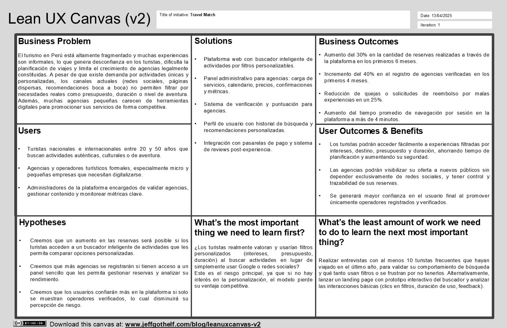
</p>

### 1.3. Segmentos objetivo
Los siguientes segmentos clave permiten establecer una base sólida para el lanzamiento de la aplicación.
Su elección busca facilitar la conexión entre turistas y agencias, y sentar las bases para el crecimiento
del turismo personalizado en la plataforma.

- **Segmento objetivo 1: Agencias de turismo locales**

| _Aspectos demográficos_ | _Aspectos geográficos_ | _Aspectos psicográficos_ |
|-------------------------|------------------------|--------------------------|
| Sexo: masculino y femenino <br> Edades: entre 25-60 años <br> Nivel socioeconómico: clases B y C (media-alta y media) | Nacionalidad: Peruana <br> Zona geográfica: Urbana y zonas turísticas <br> Departamento: Diversas regiones del Perú, especialmente Lima, Cusco, Arequipa, Ica, Puno y Madre de Dios | Necesidad de expandir su presencia digital y aumentar su cartera de clientes <br> Interesadas en herramientas que automaticen reservas y muestren su oferta de forma atractiva. <br> Valoran plataformas que reduzcan su carga operativa, sean fáciles de usar y mejoren su competitividad frente a grandes operadores turísticos. |


- **Segmento objetivo 2: Turistas nacionales e internacionales**

| _Aspectos demográficos_ | _Aspectos geográficos_ | _Aspectos psicográficos_ |
|-------------------------|------------------------|--------------------------|
| - Sexo: masculino y femenino <br> - Edades: entre 18-65 años <br> - Nivel socioeconómico: clases A, B y C (alta, media-alta y media) | - Nacionalidad: Peruana y extranjera <br> - Zona geográfica: Urbana (para salidas) y destinos turísticos del Perú <br> - Departamento: Origen en Lima, Cusco, Arequipa u otros, con desplazamiento hacia zonas de interés turístico | - Buscan experiencias personalizadas, prácticas y seguras durante sus viajes <br> - Valoran la facilidad de comparar, filtrar y reservar actividades desde una sola plataforma <br> - Dispuestos a pagar por experiencias únicas y auténticas, adaptadas a sus intereses y presupuesto |

- **Segmento objetivo 3: Viajeros por trabajo (Turismo corporativo)**

| _Aspectos demográficos_ | _Aspectos geográficos_ | _Aspectos psicográficos_ |
|-------------------------|------------------------|--------------------------|
| - Sexo: masculino y femenino <br> - Edades: entre 25-55 años <br> - Nivel socioeconómico: clases A y B (alta y media-alta) | - Nacionalidad: Peruana y extranjera <br> - Zona geográfica: Urbana (ciudades principales con movimiento empresarial) <br> - Departamento: Principalmente Lima Metropolitana, Arequipa, Trujillo, Cusco | - Buscan aprovechar su tiempo libre durante viajes laborales para conocer la ciudad o relajarse <br> - Valoran la eficiencia, rapidez y calidad del servicio al reservar actividades de corta duración <br> - Interesados en experiencias bien organizadas, con horarios compatibles con su agenda de trabajo y disponibles cerca de su ubicación |

<hr>


## Capítulo II: Requirements Elicitation & Analysis
### 2.1. Competidores
#### 2.1.1. Análisis competitivo
<table><tr><th colspan="6" valign="top"><a name="_dns5lxqlpwhz"></a>Competitive Analysis Landscape </th></tr>
<tr><td colspan="2" rowspan="2" valign="top"><p></p><p>¿Por qué llevar a cabo este análisis?</p></td><td colspan="4" rowspan="2" valign="top"><p>El objetivo principal de realizar este análisis de la competencia es poder identificar las fortalezas, debilidades, oportunidades y amenazas de la propia empresa en comparación con los principales competidores del mercado.</p><p>Esto nos permitirá tomar decisiones informadas sobre la mejor manera de posicionarnos, diferenciarnos y aprovechar las oportunidades que el mercado nos ofrece.</p></td></tr>
<tr></tr>
</table>

<table><tr>
    <th colspan="2" valign="top"></th>
    <th valign="top">
      <p>TravelMatch</p>
      
    </th>
    <th valign="top">
      <p>GetYourGuide</p>
      
    </th>
    <th valign="top">
      <p>Viator</p>
      
    </th>
    <th valign="top">
      <p>Klook</p>
      
    </th>
  </tr>
<tr><td rowspan="2" valign="top"><p></p><p>Perfil</p></td><td valign="top">Overview</td><td valign="top">Es una plataforma web que conecta a turistas con agencias para reservar actividades personalizadas según destino, experiencia y presupuesto. Las agencias gestionan su catálogo y reservas en tiempo real. El modelo de negocio incluye comisiones y suscripciones premium.</td><td valign="top">Es una plataforma que permite a los viajeros reservar tours y actividades en todo el mundo. Ofrece experiencias filtradas por destino, precio y tipo, y conecta a turistas con proveedores locales. Utiliza un modelo de comisión por reserva y servicios premium para agencias.. </td><td valign="top">Es una plataforma respaldada por TripAdvisor que ofrece reservas de actividades turísticas personalizadas. Permite a los usuarios buscar experiencias por ubicación y tipo, y a los proveedores gestionar su catálogo en tiempo real. Su modelo se basa en comisiones y promoción destacada.</td><td valign="top"><p>Es una app de origen asiático que facilita la reserva de experiencias locales, entradas y transporte en más de 100 países. Brinda confirmación inmediata y herramientas para que los proveedores gestionen su oferta. Monetiza mediante comisiones y servicios de visibilidad.</p><p></p></td></tr>
<tr><td valign="top">Ventaja competitiva ¿Qué valor ofrece a los clientes?</td><td valign="top">Conecta a turistas con agencias para crear experiencias completamente personalizadas según sus preferencias y presupuesto, ofreciendo una alternativa flexible y enfocada en la personalización.</td><td valign="top">Ofrece una amplia selección de actividades verificadas en todo el mundo con una plataforma fácil de usar, lo que brinda confianza, variedad y flexibilidad a los viajeros al momento de reservar.</td><td valign="top">Permite acceder a miles de experiencias turísticas respaldadas por TripAdvisor, integrando reseñas y comparaciones que facilitan la toma de decisiones informadas al reservar.</td><td valign="top">Facilita la reserva rápida de experiencias auténticas con confirmación inmediata y precios competitivos, ideal para viajeros que buscan comodidad y eficiencia.</td></tr>
<tr><td rowspan="2" valign="top"><p></p><p>Perfil de Marketing </p></td><td valign="top">Mercado objetivo</td><td valign="top">Agencias de turismo que desean digitalizar su oferta, turistas nacionales e internacionales que buscan actividades personalizadas, y viajeros por trabajo que desean optimizar su tiempo libre con experiencias locales.</td><td valign="top">Turistas internacionales y locales que buscan experiencias organizadas, excursiones y actividades en destinos populares, principalmente de ocio y cultura.</td><td valign="top"><p>Viajeros globales interesados en tours guiados, actividades culturales y excursiones, especialmente aquellos que valoran las reseñas y la confiabilidad de una marca reconocida como TripAdvisor.</p><p></p></td><td valign="top">Turistas jóvenes, viajeros independientes y tecnológicos, especialmente en Asia y grandes ciudades, que buscan experiencias rápidas, auténticas y accesibles desde el mó</td></tr>
<tr><td valign="top">Estrategias de marketing</td><td valign="top"><p>Implementa campañas en redes sociales dirigidas a turistas y agencias, estrategias de posicionamiento SEO local e internacional, alianzas con agencias regionales y marketing de contenidos enfocado en experiencias personalizadas. Además, utiliza promociones cruzadas y testimonios para generar confianza y atraer nuevos usuarios.</p><p></p></td><td valign="top">Utiliza marketing digital intensivo, incluyendo SEO, publicidad en Google Ads, redes sociales y colaboraciones con influencers de viajes. También invierte en contenido optimizado y campañas en plataformas de video para generar confianza y visibilidad global.</td><td valign="top">Aprovecha la integración con TripAdvisor para captar tráfico orgánico, destacando actividades dentro de sus páginas. Además, emplea campañas de email marketing, publicidad digital y alianzas con operadores turísticos para ampliar su alcance.</td><td valign="top"><p>Se enfoca en marketing de contenidos, redes sociales y colaboraciones con influencers y youtubers de viajes, especialmente en el mercado asiático. También lanza promociones exclusivas, descuentos en fechas especiales y campañas móviles con notificaciones push.</p><p></p></td></tr>
<tr><td rowspan="3" valign="top"><p></p><p>Perfil de producto</p></td><td valign="top">Productos & Servicios</td><td valign="top"><p>Ofrece paquetes turísticos personalizados, excursiones, actividades locales según intereses y presupuesto, sistema de reservas en tiempo real, catálogo digital para agencias, y opciones de visibilidad premium dentro de la plataforma.</p><p></p></td><td valign="top"><p>Ofrece tours guiados, entradas a atracciones turísticas, excursiones de un día, experiencias gastronómicas, actividades de aventura, traslados y servicios personalizados en múltiples destinos.</p><p></p></td><td valign="top">Brinda acceso a tours y excursiones, entradas sin colas, actividades culturales y de entretenimiento, experiencias únicas (como clases de cocina o catas), y paquetes combinados con cancelación flexible.</td><td valign="top">Proporciona entradas a atracciones, experiencias locales, transporte (trenes, buses, tarjetas SIM), actividades temáticas, eventos especiales, paquetes turísticos y servicios adicionales como seguros de viaje.</td></tr>
<tr><td valign="top">Precios & Costos</td><td valign="top">Variados</td><td valign="top">Variados</td><td valign="top">Variados</td><td valign="top">Variados</td></tr>
<tr><td valign="top">Canales de distribución (Web y/o Móvil)</td><td valign="top">Web/Móvil</td><td valign="top">Web/Móvil</td><td valign="top">Web/Móvil</td><td valign="top">Web/Móvil</td></tr>
<tr><td rowspan="5" valign="top"><p></p><p>Análisis SWOT</p></td><td colspan="5" valign="top">Realice esto para su startup y sus competidores. Sus fortalezas deberían apoyar sus oportunidades y contribuir a lo que ustedes definen como su posible ventaja competitiva</td></tr>
<tr><td valign="top">Fortalezas</td><td valign="top"><p>Ofrece experiencias personalizadas para turistas y agencias.</p><p>Conecta directamente a agencias de turismo con clientes, eliminando intermediarios.</p><p>Sistema de reservas en tiempo real, lo que optimiza la experiencia del cliente.</p><p>Modelo de negocio flexible basado en comisiones y suscripciones.</p><p></p></td><td valign="top"><p>Gran variedad de actividades en múltiples destinos.</p><p>Reputación confiable gracias a las reseñas de usuarios.</p><p>Plataforma fácil de usar con opciones de pago flexibles.</p><p>Presencia global en más de 150 países.</p><p></p></td><td valign="top"><p>Respaldo y confianza de TripAdvisor, lo que genera credibilidad.</p><p>Amplia gama de tours y actividades a nivel mundial.</p><p>Fuerte presencia en mercados desarrollados.</p><p></p></td><td valign="top"><p>Enfoque en experiencias auténticas y locales.</p><p>Fuerte presencia en Asia y popularidad creciente en mercados occidentales.</p><p>Amplia oferta de productos (transporte, entradas, actividades).</p><p>Plataforma móvil optimizada.</p><p></p></td></tr>
<tr><td valign="top">Debilidades</td><td valign="top"><p>Necesidad de atraer a un volumen significativo de agencias para ser competitiva.</p><p>Competencia con plataformas establecidas como Viator y GetYourGuide.</p><p>Dependencia de la calidad de las agencias asociadas.</p><p></p></td><td valign="top"><p>Alta competencia con otras plataformas de reservas de actividades.</p><p>Dependencia de las comisiones de los proveedores, lo que puede afectar los márgenes.</p><p>Limitada personalización de las experiencias en algunos casos.</p><p></p></td><td valign="top"><p>Fuerte dependencia de TripAdvisor para la generación de tráfico.</p><p>Poca flexibilidad en la personalización de experiencias para turistas.</p><p>La competencia directa de plataformas como GetYourGuide y Klook.</p><p></p></td><td valign="top"><p>Dependencia de un mercado asiático que puede volverse saturado.</p><p>Limitada presencia en algunos mercados turísticos importantes como Europa y América Latina.</p><p>Escasa personalización en algunos servicios.</p><p></p></td></tr>
<tr><td valign="top">Oportunidades</td><td valign="top"><p>Expansión a mercados globales con un enfoque local.</p><p>Crecimiento de la demanda de experiencias personalizadas post-pandemia.</p><p>Colaboraciones con agencias de turismo locales y servicios complementarios.</p><p></p></td><td valign="top"><p>Expansión en mercados emergentes y destinos menos explotados.</p><p>Crecimiento en el turismo post-pandemia con nuevas experiencias.</p><p>Colaboraciones con agencias de turismo locales para diversificar la oferta.</p><p></p></td><td valign="top"><p>Expansión en mercados emergentes, especialmente en Asia y América Latina.</p><p>Innovación en la experiencia del usuario con tecnologías emergentes (realidad aumentada, inteligencia artificial).</p><p>Creación de alianzas estratégicas con agencias turísticas locales.</p><p></p></td><td valign="top"><p>Expansión en mercados globales fuera de Asia.</p><p>Alianzas con grandes empresas de turismo para ofrecer paquetes exclusivos.</p><p>Expansión de la oferta de servicios más allá de las actividades turísticas.</p><p></p></td></tr>
<tr><td valign="top">Amenazas</td><td valign="top"><p>Alta competencia en el mercado de reservas de actividades turísticas.</p><p>Cambios en las regulaciones locales o internacionales de turismo.</p><p>Riesgo de no diferenciarse suficientemente en un mercado con muchas opciones similares.</p><p></p></td><td valign="top"><p>Inestabilidad en la industria del turismo debido a factores globales (crisis económicas, pandemias).</p><p>Cambios en las regulaciones de viajes y turismo en distintos países.</p><p>Competencia creciente de plataformas como Viator, Klook y nuevas startups.</p><p></p></td><td valign="top"><p>Cambios en las regulaciones turísticas o políticas de reembolsos.</p><p>La creciente demanda de experiencias personalizadas que pueden no ser completamente cubiertas por Viator.</p><p>Aumento de la competencia con plataformas más flexibles.</p><p></p></td><td valign="top"><p>Competencia fuerte con otras plataformas globales como GetYourGuide y Viator.</p><p>Cambios en las preferencias de los viajeros hacia experiencias más personalizadas y sostenibles.</p><p>Riesgo de saturación de mercado en Asia.</p><p></p></td></tr>
</table>

#### 2.1.2. Estrategias y tácticas frente a competidores

**1. Estrategias de Crecimiento y Expansión:**

- **#1 Expansión de alianzas con agencias de turismo locales e internacionales:**

    TravelMatch forjará colaboraciones estratégicas con agencias de turismo locales y globales, permitiendo que estas se integren de manera fluida en la plataforma para ofrecer una variedad más amplia de paquetes turísticos y experiencias personalizadas. Esto impulsará el crecimiento de la plataforma al aumentar la base de agencias asociadas y diversificar la oferta para los usuarios.

- **#2 Creación de un programa de fidelización para turistas frecuentes:**

    TravelMatch lanzará un programa de recompensas y membresía premium para turistas frecuentes. Este programa incentivará a los viajeros a realizar más reservas dentro de la plataforma, con beneficios como descuentos exclusivos, acceso anticipado a ofertas especiales y experiencias VIP, fomentando la lealtad de los usuarios a largo plazo.

- **#3 Expansión a mercados internacionales con enfoque local:**

    TravelMatch se expandirá a nuevos mercados internacionales, comenzando con destinos turísticos populares, pero ofreciendo un enfoque altamente localizado, adaptado a las preferencias culturales y necesidades de los viajeros en esas regiones. Esto permitirá captar una base de usuarios diversa y brindar experiencias altamente relevantes.

**2. Estrategias de Innovación y Diferenciación:**

- **#1 Personalización mediante análisis de preferencias del usuario:**

    TravelMatch implementará un sistema que permita personalizar las recomendaciones de paquetes turísticos y actividades en función de las preferencias y comportamientos de los usuarios. Aunque no se utilicen IA avanzadas, se podrán crear filtros que permitan a los usuarios explorar opciones adaptadas a su destino, tipo de experiencia y presupuesto.

- **#2 Mejora de la experiencia de usuario a través de un diseño optimizado y funcional:**
    La plataforma se diseñará de forma sencilla, intuitiva y fácil de navegar, permitiendo a los usuarios encontrar rápidamente las actividades que desean. Esto incluirá filtros detallados, clasificación de destinos y actividades, y un proceso de reserva claro y rápido, mejorando la experiencia del usuario y facilitando la toma de decisiones.

- **#3 Ofrecimiento de paquetes de viaje personalizados por agentes locales:**
    En lugar de depender de algoritmos complejos, TravelMatch ofrecerá la posibilidad de crear itinerarios de viaje personalizados con la ayuda de agentes de viajes locales que conozcan los destinos de manera profunda. Esto agregará un valor adicional, ya que los usuarios podrán recibir recomendaciones de expertos que comprendan el destino y sus necesidades.

**3. Tácticas:**

- **Desarrollo de Producto:**
    - **Ciclos de desarrollo ágil:** Implementar procesos ágiles para realizar iteraciones rápidas en la plataforma, mejorando constantemente la experiencia del usuario basándose en los comentarios y el feedback directo de los turistas y agencias.
    - **Pruebas A/B continuas:** Realizar pruebas A/B para optimizar la experiencia de usuario, desde la interfaz de usuario hasta las funcionalidades del sistema de reservas, asegurando que las mejoras se basen en datos reales de uso y preferencias de los usuarios.

- **Fidelización del Usuario:**
    - **Programa de lealtad y membresías premium:** Crear un sistema de recompensas para los viajeros recurrentes y agencias destacadas. Las membresías premium otorgarán beneficios exclusivos, como descuentos, acceso prioritario y visibilidad aumentada en la plataforma para las agencias de turismo.
    - **Feedback y mejora continua:** Establecer canales de comunicación directa con los usuarios (tanto turistas como agencias) para recibir sugerencias y mejorar la plataforma. Utilizar análisis de datos de interacciones pasadas para ofrecer una experiencia más satisfactoria en futuras reservas.

- **Expansión Tecnológica:**
    - **Optimización multiplataforma:** Asegurar que TravelMatch funcione de manera óptima tanto en dispositivos móviles como en plataformas web, garantizando un acceso constante y sin interrupciones a la plataforma desde cualquier dispositivo, en cualquier lugar y momento.


### 2.2. Entrevistas
#### 2.2.1. Diseño de entrevistas

En esta sección de preguntas, nuestro objetivo es comprender mejor las necesidades, motivaciones y preferencias de nuestros segmentos objetivos dentro del ecosistema turístico. A continuación, se muestran las preguntas:

- **Segmento #1: Agencias de turismo locales**

    **Preguntas principales:**
    -  ¿Qué canales usas actualmente para promocionar tus paquetes turísticos? ¿Qué tan efectivos los consideras?
    -  ¿Con qué frecuencia recibes reservas online? ¿Qué retos enfrentas en su gestión?
    -  ¿Qué importancia le das a tener una presencia digital sólida frente a la competencia?
    -  ¿Estás satisfecho con las herramientas tecnológicas actuales que usas para tu agencia? ¿Por qué?
    -  ¿Qué funcionalidades consideras más útiles en una plataforma que conecte agencias con turistas?
    -  ¿Has tenido dificultades para destacar frente a agencias más grandes o con más recursos?
    -  ¿Qué valoras más al elegir una herramienta digital: facilidad de uso, alcance de clientes, personalización o soporte técnico?

    **Preguntas complementarias:**
    -  ¿Qué tipo de turistas suelen contratar tus servicios (edad, nacionalidad, intereses)?
    -  ¿Qué porcentaje de tus reservas proviene de canales digitales?
    -  ¿Te interesa acceder a planes premium o suscripciones que te den mayor visibilidad?
    -  ¿Cuáles son las temporadas donde más te gustaría tener apoyo digital para la gestión de tu oferta?
    -  ¿Qué tan dispuesto estarías a pagar una comisión por cada reserva concretada a través de una plataforma?

- **Segmento #2: Turistas nacionales e internacionales**

    **Preguntas principales:**
    -  ¿Cómo sueles planificar tus viajes dentro del Perú? ¿Qué herramientas usas para ello?
    -  ¿Qué tan importante es para ti personalizar tus experiencias de viaje según tus intereses?
    -  ¿Has tenido dificultades encontrando actividades o excursiones que se adapten a tu presupuesto o estilo de viaje?
    -  ¿Qué tipo de actividades valoras más al viajar (culturales, aventura, gastronomía, relax, etc.)?
    -  ¿Prefieres reservar todo por separado o en paquetes que combinen varias experiencias?
    -  ¿Qué tan relevante es para ti poder comparar precios, duración y valoraciones desde una sola plataforma?
    -  ¿Qué factores te dan más confianza al reservar actividades en línea (opiniones, reputación de la agencia, medios de pago, seguridad)?

    **Preguntas complementarias:**
    -  ¿Estás dispuesto a pagar un poco más por una experiencia auténtica y personalizada?
    -  ¿Te interesaría recibir recomendaciones de actividades según tu ubicación y tus intereses?
    -  ¿Qué tan cómodo te resulta hacer reservas desde tu celular cuando estás viajando?
    -  ¿Te gustaría tener la opción de contactar directamente con la agencia antes de reservar?
    -  ¿Te ha pasado que llegaste a un destino sin saber qué actividades hacer y dónde contratarlas?

- **Segmento #3: Viajeros por trabajo (Turismo corporativo)**

    **Preguntas principales:**
    - ¿Con qué frecuencia viajas por motivos laborales dentro del país?
    -  ¿Sueles tener tiempo libre entre reuniones o compromisos laborales cuando viajas?
    -  ¿Qué tipo de actividades te gustaría realizar durante tu tiempo libre? (Tours cortos, experiencias gastronómicas, relajación, etc.)
    -  ¿Qué valoras más al reservar actividades durante viajes de trabajo: rapidez, ubicación cercana, disponibilidad inmediata, etc.?
    -  ¿Utilizas apps o plataformas para organizar tu tiempo libre cuando estás fuera por trabajo? ¿Cuáles?
    -  ¿Te resulta complicado encontrar actividades con horarios flexibles o compatibles con tus jornadas laborales?
    -  ¿Estás interesado en experiencias personalizadas que se adapten a tu perfil profesional y tus gustos personales?

    **Preguntas complementarias:**
    -  ¿Prefieres reservar actividades antes de viajar o una vez ya estás en la ciudad?
    - ¿Te gustaría recibir recomendaciones automáticas según tu horario, ubicación y tipo de viaje?
    -  ¿Qué tan cómodo te sentirías usando una app que combine actividades turísticas y servicios prácticos para viajeros de negocio?
    -  ¿Qué nivel de confianza necesitas para reservar con una agencia nueva o desconocida?
    -  ¿Consideras útil una opción para generar comprobantes o facturas automáticamente al reservar?

#### 2.2.2. Registro de entrevistas
<!-- Segmento objetivo 1: AGENCIAS -->

- **Entrevista 1:**

<p align="center">
    
</p>

<div align="center">

| Entrevistado | Maria Rodriguez Benites |
|----|-----|
|Edad|44|
|Residencia|Lima|
|Segmento|Agencia|
|Enlace de la entrevista| [https://youtu.be/hdzxGndELyA](https://youtu.be/hdzxGndELyA)|

</div>

_Resumen:_ La entrevistada menciona que en su agencia utilizan principalmente redes sociales (Facebook, Instagram, TikTok) y plataformas como Google Ads y TripAdvisor para promocionar paquetes turísticos, lo cual ha sido efectivo para atraer turistas. Ademas, menciona que la mayoría de sus reservas proviene de canales digitales, pero enfrentan retos como la sincronización en tiempo real de la disponibilidad de los paquetes, especialmente en temporadas altas como verano y feriados. Considera que si bien las herramientas tecnológicas actuales cumplen con lo básico, desea soluciones más integradas para gestionar reservas, pagos y marketing. Valora funcionalidades como disponibilidad en tiempo real, opciones de pago flexibles y un buen soporte técnico. Por ultimo, se encuentra dispuesta a pagar una comisión razonable por cada reserva si la plataforma ofrece un buen retorno en visibilidad y eficiencia.

---

- **Entrevista 2:**

<p align="center">
    
</p>

<div align="center">

| Entrevistado | Tony Blades Sarmiento |
|----|-----|
|Edad|28|
|Residencia|Lima|
|Segmento|Agencia|
|Enlace de la entrevista| [https://youtu.be/zkip_T6onFg](https://youtu.be/zkip_T6onFg)|

</div>

_Resumen:_ El entrevistado comenta que utilizan redes sociales como Facebook, Instagram y WhatsApp. También disponen de una página web con optimizaciones limitadas para sus necesidades. Si bien considera útiles estas herramientas, no las percibe como eficientes. Además, señala que uno de los principales desafíos que enfrenta es la confirmación de pagos y la falta de coordinación cuando los clientes dudan en concretar una compra. Asimismo, menciona que le gustaría contar con una plataforma intuitiva que integre funcionalidades de pago, mensajería y análisis de datos, facilitando así la conexión con sus clientes. Finalmente, expresa su disposición a pagar una suscripción para obtener beneficios durante las temporadas de mayor demanda.

---

**Entrevista 3:**

<p align="center">
    
</p>

<div align="center">

| Entrevistado | David Perez Garcia |
|----|-----|
|Edad|22|
|Residencia|Lima|
|Enlace de la entrevista| [https://youtu.be/5S-RLPOGsRA](https://youtu.be/5S-RLPOGsRA)|

</div>

_Resumen:_ El entrevistado trabaja para una agencia de turismo peruana, utiliza redes sociales y WhatsApp para promocionar sus servicios, lo cual es efectivo para clientes jóvenes y locales, pero limitado para turistas extranjeros. Aunque las reservas online son comunes en temporada alta, la gestión de múltiples canales genera problemas. Pérez reconoce la necesidad de una sólida presencia digital y herramientas integradas con calendarios en tiempo real, chat directo, gestión de pagos, estadísticas y un perfil completo para competir y generar confianza. Su agencia se enfoca en jóvenes de 20 a 35 años interesados en experiencias auténticas, con un 70% de reservas online. Está dispuesto a invertir en soluciones digitales transparentes y fáciles de usar que mejoren la visibilidad, especialmente en temporadas altas.

---

<!-- Segmento objetivo 2: TURISTAS NACIONALES E INTERNACIONALES -->

**Entrevista 4:**

<p align="center">
    
</p>

<div align="center">

| Entrevistado | Adrian Yañez Mendez |
|----|-----|
|Edad|20|
|Residencia|Lima|
|Segmento|Turista Nacional|
|Enlace de la entrevista| [https://youtu.be/EetEBccMXDg](https://youtu.be/EetEBccMXDg)|

</div>

_Resumen:_ El entrevistado, un turista limeño de 20 años, organiza sus viajes inspirándose en redes sociales como Instagram y TikTok, y complementa su planificación con Google Maps, TripAdvisor y blogs de viaje. Le da gran importancia a la personalización de sus experiencias, priorizando actividades culturales, de aventura y fotografía. Aunque prefiere paquetes turísticos bien estructurados, a menudo encuentra opciones costosas o genéricas, por lo que valora plataformas que permitan comparar precios, duración y opiniones en un solo lugar. Está dispuesto a pagar más por experiencias auténticas y personalizadas, y le resulta cómodo hacer reservas desde su celular, siempre que la app sea intuitiva. También considera esencial poder comunicarse con la agencia antes de reservar y recibir recomendaciones según su ubicación e intereses.

---

**Entrevista 5:**

<p align="center">
    
</p>

<div align="center">

| Entrevistado | Sebastian Arevalo Torres |
|----|-----|
|Edad|23|
|Residencia|Chile|
|Segmento|Turista Internacional|
|Enlace de la entrevista| [https://youtu.be/3z10bH6wOBY](https://youtu.be/3z10bH6wOBY)|

</div>

_Resumen:_ El entrevistado, turista chileno de 23 años, organiza sus viajes por Perú con anticipación usando Google Travel, Booking.com y YouTube, priorizando experiencias auténticas alejadas del turismo convencional. Valora especialmente las actividades culturales y gastronómicas, como visitar mercados y museos, y suele reservar por separado para tener mayor control, aunque considera paquetes si están bien estructurados. Le resulta esencial comparar precios, duración y opiniones desde una sola plataforma, y confía principalmente en las reseñas de otros viajeros. Está dispuesto a pagar más por experiencias únicas que beneficien a comunidades locales, y aprecia recibir recomendaciones personalizadas según su ubicación e intereses. Además, considera muy cómodo hacer reservas desde su celular y le parece crucial poder contactar a la agencia antes de reservar, especialmente para resolver dudas sobre idioma, disponibilidad o detalles del tour.

---

**Entrevista 6:**

<p align="center">
    
</p>

<div align="center">

| Entrevistado | Diego Santiago Lima |
|----|-----|
|Edad|21|
|Residencia|Arequipa|
|Segmento|Turista Nacional|
|Enlace de la entrevista| [https://youtu.be/CLrBogoQrVM](https://youtu.be/CLrBogoQrVM)|

</div>

_Resumen:_ El entrevistado, mochilero arequipeño de 21 años, organiza sus viajes de forma espontánea utilizando grupos de Facebook, Telegram y TikTok para encontrar recomendaciones de última hora. Valora la personalización de sus experiencias y prefiere improvisar sobre la marcha, adaptando sus actividades según su estado de ánimo, el clima o la gente que conoce. Sus intereses se centran en la gastronomía y actividades culturales accesibles o gratuitas. Prefiere reservar servicios por separado para mantener flexibilidad y controlar su presupuesto. Considera crucial poder comparar precios y valoraciones en una sola plataforma, y confía en las opiniones de otros jóvenes mochileros. Aunque busca opciones económicas, está dispuesto a pagar más por experiencias únicas. Para él, es fundamental recibir recomendaciones personalizadas según su ubicación y contar con opciones de pago como Yape o Plin. Además, valora poder contactar con la agencia antes de reservar y suele llegar a destinos sin itinerario fijo, confiando en su celular como herramienta principal para planificar y reservar en el camino.

---

<!-- Segmento objetivo 3: TURISTAS CORPORATIVOS -->

**Entrevista 7:**

<p align="center">
    
</p>

<div align="center">

| Entrevistado | Cesar Vasquez Lopez |
|----|-----|
|Edad|55|
|Residencia|Lima|
|Enlace de la entrevista| [https://youtu.be/AeP60c6hXrs](https://youtu.be/AeP60c6hXrs)|

</div>

_Resumen:_ El entrevistado, quien por su trabajo viaja con frecuencia a Paracas, Nazca, Chincha e Ica, tiene interés en visitar atractivos turísticos como las Líneas de Nazca, las Islas Ballestas y la Huacachina en su tiempo libre. Para él, la puntualidad del servicio es primordial en una plataforma de gestión de paquetes turísticos. Actualmente, utiliza WhatsApp y Google Maps para organizar sus itinerarios laborales, pero le resulta difícil encontrar tiempo libre. Por ello, valoraría una aplicación que se adapte a sus horarios personales y laborales, brindándole la oportunidad de realizar visitas turísticas. Finalmente, considera crucial la recomendación de otros clientes al elegir una agencia de viajes.

---

**Entrevista 8:**

<p align="center">
    
</p>

<div align="center">

| Entrevistado | Eduardo Montalvo |
|----|-----|
|Edad| 25 |
|Residencia|Lima|
|Enlace de la entrevista| [https://youtu.be/_GoZZZpl_5c](https://youtu.be/_GoZZZpl_5c)|

</div>

_Resumen:_ El entrevistado es un viajero corporativo en Perú que viaja laboralmente dos veces al mes (Lima, Trujillo, Arequipa, ocasionalmente Cusco/Chiclayo) y a veces tiene tiempo libre. Prefiere tours cortos o gastronomía local cerca de su alojamiento, valorando la rapidez y disponibilidad inmediata. Usa Google Maps y TripAdvisor, pero desearía una app para viajeros de negocios con horarios flexibles y recomendaciones personalizadas según su ubicación y agenda, idealmente con reserva en destino. Le atraería una app que combine actividades, servicios y facturación automática, confiando en agencias con buenas reseñas y contacto claro.

---

**Entrevista 9:**

<p align="center">
    
</p>

<div align="center">

| Entrevistado | Abigail Goñe |
|----|-----|
|Edad|21|
|Residencia|Lima|
|Enlace de la entrevista| [https://www.youtube.com/watch?v=XB2zMZLNVMY](https://www.youtube.com/watch?v=XB2zMZLNVMY)|

</div>

_Resumen:_  La entrevistada viaja laboralmente tres veces al mes (Arequipa, Trujillo, Piura) y a veces tiene 1-2 horas libres. Prefiere visitas cortas a sitios arqueológicos o gastronomía local, valorando rapidez y cercanía. Usa Google Maps, Yelp y TikTok, pero desearía una app con opciones turísticas, tiempos y reservas integradas. Le cuesta encontrar actividades con horarios flexibles. Le interesan sugerencias personalizadas y prefiere reservar en destino por cambios de agenda. Idealmente, busca una app con recomendaciones automáticas según su ubicación y horario, que combine actividades y servicios prácticos, incluyendo facturación automática. Confía en agencias nuevas con buenas opiniones, web actualizada y atención rápida.

---

#### 2.2.3. Análisis de entrevistas


- **Segmento objetivo 1 - Dueños de agencia de viajes**

    Las entrevistas con María Rodríguez, Tony Blades y David Pérez revelan puntos en común significativos que validan la propuesta de valor de TravelMatch para las agencias de turismo locales.

    - _Dependencia de Canales Digitales y Limitaciones:_ Las tres fuentes coinciden en la importancia de los canales digitales para la captación de clientes. El 100% de las agencias entrevistadas utilizan activamente redes sociales (Facebook e Instagram son recurrentes), y al menos una de ellas (33%) menciona el uso de plataformas de publicidad online como Google Ads y TripAdvisor. Sin embargo, a pesar de su efectividad para ciertos segmentos, reconocen limitaciones para alcanzar audiencias más amplias (turistas extranjeros) o para una gestión integral de sus operaciones.

    - _Prevalencia de Reservas Online y Desafíos de Gestión:_ Tanto María como David señalan que una parte significativa de sus reservas proviene de canales digitales (María indica "la mayoría" y David un 70%). No obstante, esto conlleva desafíos importantes. El 67% de las agencias (María y David) experimentan problemas con la sincronización en tiempo real de la disponibilidad, especialmente en temporadas altas. Además, la gestión de múltiples canales (redes sociales, WhatsApp, web propia, plataformas de publicidad) genera ineficiencias y dificulta la coordinación, como lo destaca Tony con los problemas en la confirmación de pagos y el seguimiento de clientes indecisos.

    - _Necesidad de Soluciones Integradas:_ Existe un consenso unánime (100% de las agencias) en la necesidad de herramientas tecnológicas más integradas. Expresan el deseo de funcionalidades que vayan más allá de las soluciones básicas que utilizan actualmente (mencionado por María).

    - _Disposición a Invertir por Valor:_ Las tres fuentes muestran una disposición a invertir en una plataforma como TravelMatch si esta ofrece un valor claro. María está dispuesta a pagar una comisión "razonable" por un buen retorno en visibilidad y eficiencia. Tony considera pagar una suscripción por beneficios en temporadas altas. David también está dispuesto a invertir en soluciones "transparentes y fáciles de usar" que mejoren la visibilidad y los resultados, especialmente en temporadas de alta demanda. Esto sugiere una sensibilidad al modelo de negocio propuesto (comisiones y planes premium), siempre y cuando se demuestre un retorno tangible.

    - **Conclusiones**

        - Existe una clara validación de la problemática identificada: la fragmentación de la gestión y la necesidad de canales digitales más eficientes e integrados para las agencias locales.
        - La propuesta de valor de TravelMatch resuena con las necesidades expresadas, especialmente en cuanto a la integración de funcionalidades clave como la gestión de disponibilidad, pagos y comunicación con los clientes.
        - El modelo de negocio basado en comisiones y planes premium parece viable, dado la disposición de las agencias a invertir a cambio de mayor visibilidad y eficiencia, especialmente en temporadas altas.
        - La facilidad de uso y un buen soporte técnico serán cruciales para la adopción y el éxito de la plataforma entre las agencias.

- **Segmento objetivo 2 - Turistas nacionales e internacionales**
    
    Las entrevistas con Adrián Yáñez, Sebastián Arévalo y Diego Santiago, a pesar de sus diferencias en estilo de viaje, revelan necesidades y comportamientos comunes que TravelMatch puede abordar.

    - _Influencia de Plataformas Digitales en la Planificación:_ Los tres entrevistados utilizan activamente plataformas digitales para inspirarse y planificar sus viajes. El 100% menciona redes sociales (Instagram y TikTok son populares), y herramientas como Google Maps, TripAdvisor, Google Travel, YouTube, blogs de viaje y grupos de Facebook/Telegram también son relevantes. Esto subraya la importancia de una sólida presencia online y la capacidad de TravelMatch para integrarse o ser descubierto a través de estos canales.

    - _Valoración de la Personalización y la Autenticidad:_ Los tres turistas demuestran un fuerte interés en la personalización de sus experiencias. Adrián prioriza actividades culturales, de aventura y fotografía; Sebastián busca experiencias auténticas alejadas del turismo convencional, con foco en lo cultural y gastronómico; y Diego valora la improvisación y actividades gastronómicas y culturales accesibles. El 100% busca experiencias que se adapten a sus intereses específicos y valoran la autenticidad.

    - _Necesidad de Comparación y Transparencia:_ Los tres entrevistados resaltan la importancia de poder comparar precios, duración y opiniones en un solo lugar. Adrián y Sebastián lo mencionan explícitamente, mientras que Diego considera crucial comparar precios y valoraciones. Esto indica una necesidad de TravelMatch de ofrecer una interfaz clara y completa para la comparación de opciones.

    - _Disposición a Pagar por Experiencias de Valor:_ Si bien Diego busca opciones económicas, los tres están dispuestos a pagar más por experiencias auténticas, personalizadas o únicas. Adrián menciona estar dispuesto a pagar más por experiencias auténticas y personalizadas, Sebastián por experiencias únicas que beneficien a comunidades locales, y Diego por experiencias únicas. Esto sugiere que el precio no es el único factor determinante, y que TravelMatch puede ofrecer experiencias premium si el valor percibido es alto.

    - _Importancia de la Reserva Móvil y la Comunicación:_ Los tres consideran cómodo o esencial poder hacer reservas desde su celular y valoran la posibilidad de comunicarse con la agencia antes de reservar. Adrián y Sebastián lo mencionan directamente, y Diego confía en su celular para planificar y reservar en el camino. Esto enfatiza la necesidad de una app móvil intuitiva y funcionalidades de comunicación directa dentro de la plataforma.

    - _Preferencias de Pago:_ Diego menciona la importancia de opciones de pago locales como Yape o Plin, lo cual es un factor a considerar para la adopción local.

    - **Conclusiones**

        - Preferencias de Pago: Diego menciona la importancia de opciones de pago locales como Yape o Plin, lo cual es un factor a considerar para la adopción local.
        - La propuesta de valor de TravelMatch de ofrecer una experiencia de búsqueda fluida, segura y adaptada a las preferencias del turista es altamente relevante para este segmento.
        - La funcionalidad de comparación de precios, duración y opiniones será crucial para atraer y retener a los usuarios.        
        - TravelMatch debe ser lo suficientemente flexible para atender tanto a viajeros que planifican con anticipación como a aquellos más espontáneos.

    
- **Segmento objetivo 3 - Turistas corporativos**
    
    Las entrevistas con César Vásquez, Eduardo Montalvo y Abigail Goñe ofrecen una perspectiva sobre las necesidades de los viajeros corporativos que buscan aprovechar su tiempo libre durante sus desplazamientos laborales.

    - _Oportunidades de Turismo en Tiempo Libre Limitado:_ César Vásquez, quien viaja con frecuencia por trabajo en la región de Ica, expresa un claro interés en visitar atractivos turísticos locales en su tiempo libre, aunque actualmente le resulta difícil encontrarlo. Esto sugiere una oportunidad para TravelMatch de ofrecer actividades que se ajusten a las ventanas de tiempo libre de los viajeros corporativos. Eduardo y Abigail también mencionan tener tiempo libre limitado entre sus compromisos laborales.

    - _Valoración de la Puntualidad y la Adaptabilidad Horaria:_ Para César, la puntualidad del servicio es primordial. Además, valora una aplicación que se adapte a sus horarios personales y laborales. Esta necesidad de flexibilidad horaria y confiabilidad en los tiempos es un factor clave para este segmento. Eduardo y Abigail también resaltan la dificultad de encontrar actividades con horarios compatibles con sus jornadas laborales.

    - _Uso de Herramientas Digitales Básicas y Deseo de Integración:_ César utiliza WhatsApp y Google Maps para su logística laboral, pero no para actividades turísticas. Eduardo y Abigail utilizan Google Maps y otras plataformas generales (TripAdvisor, Yelp, TikTok) pero expresan el deseo de una app específica para viajeros de negocios que integre opciones turísticas, tiempos estimados y reservas. Esto refuerza la necesidad de una plataforma integrada como TravelMatch que simplifique la búsqueda y reserva de actividades.

    - _Interés en Experiencias Específicas:_ Eduardo prefiere tours cortos o gastronomía local, mientras que Abigail se inclina por visitas cortas a sitios arqueológicos o gastronomía local. Esto sugiere que, si bien el tiempo es limitado, existe un interés en experiencias culturales y gastronómicas concisas.

    - _Relevancia de la Personalización y las Recomendaciones Automáticas:_ Eduardo y Abigail desean recomendaciones personalizadas según su ubicación, horario e intereses. Abigail también busca recomendaciones automáticas. Esto valida la importancia de un motor de recomendaciones inteligente dentro de TravelMatch que considere el contexto del viaje de negocios.

    - **Conclusiones**

        - Existe una oportunidad para TravelMatch de atender las necesidades de los viajeros corporativos que desean aprovechar sus limitados periodos de tiempo libre para realizar actividades turísticas.
        - La plataforma debe priorizar la puntualidad, la flexibilidad horaria y la conveniencia de ubicación de las actividades ofrecidas.
        - Un sistema de recomendaciones basado en la ubicación, el horario disponible y los intereses del viajero corporativo es crucial.       
        - Generar confianza a través de reseñas y perfiles de agencia detallados es fundamental para la adopción.


### 2.3. Needfinding
#### 2.3.1. User Personas
Basados en los resultados de las entrevistas y el análisis de datos, hemos definido las características clave de cada segmento objetivo estudiado. Esta información nos permitió desarrollar User Personas detallados para cada grupo, con el fin de comprender a profundidad su contexto, metas, motivaciones, dolores y perfil general. Para la creación de estos User Personas, empleamos la plataforma colaborativa UXPressia como herramienta principal de diseño.


<p align="center">
    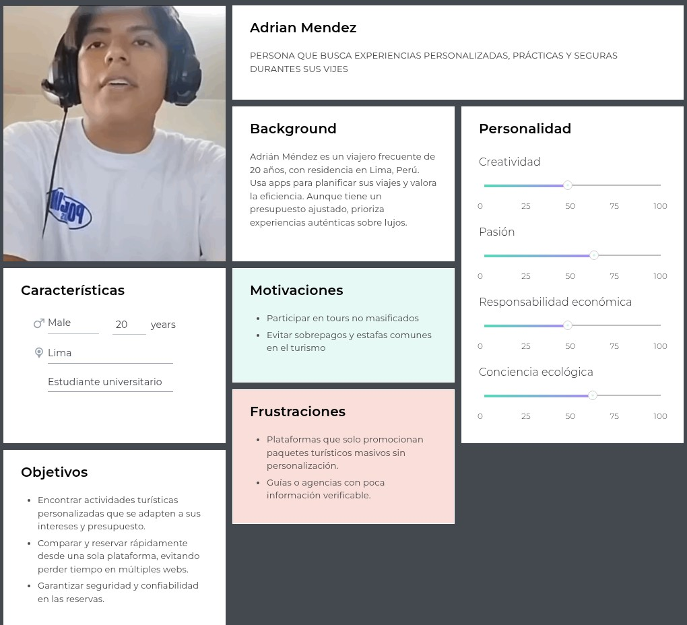
</p>

<p align="center">
    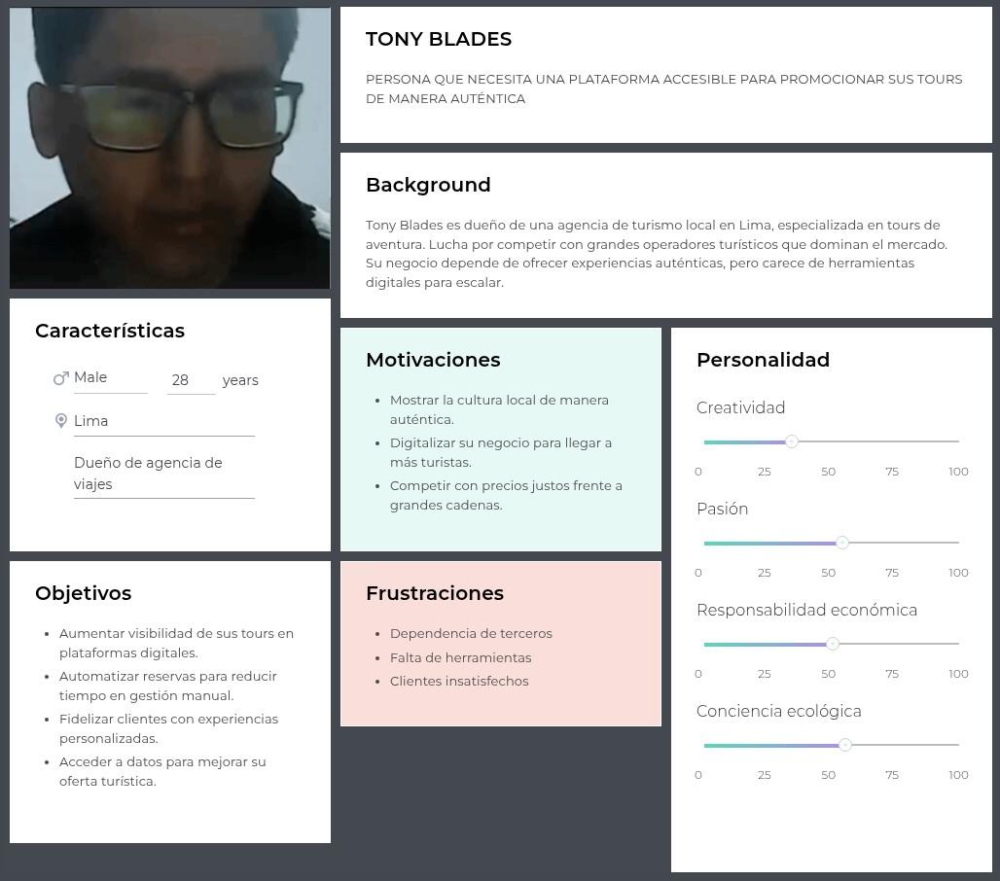
</p>

<p align="center">
    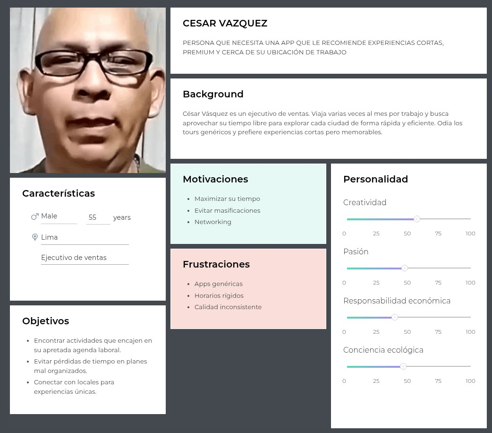
</p>

#### 2.3.2. User Task Matrix

***Segmento 1: Dueños de agencia de viajes***

|**Tony Blades**|||
| :-: | :- | :- |
|**Actividades**|**Frecuencia**|**Importancia**|
|Publicar en 3-5 redes sociales|Alta|Alta|
|Crear anuncios en Google Ads de forma manual|Alta|Alta|
|Recibir consultas por WhatsApp/email|Alta|Alta|
|Actualizar disponibilidad en hojas de cálculo|Media|Alta|
|Coordinar con proveedores por teléfono|Media|Media|
|Imprimir vouchers manualmente|Media|Alta|

***Segmento 2: Turistas nacionales e internacionales***

|**Adrián Méndez**|||
| :-: | :- | :- |
|**Actividades**|**Frecuencia**|**Importancia**|
|Buscar en Google, blogs y TikTok|Alta|Alta|
|Guardar opciones en favoritos|Alta|Alta|
|Abrir 5 pestañas para comparar precios|Alta|Alta|
|Preguntar a amigos por WhatsApp|Media|Alta|
|Reservar en 3 plataformas distintas|Media|Alta|
|Descargar vouchers en PDF|Media|Media|
|Coordinar transporte y horarios por separado|Media|Alta|

***Segmento 3: Turistas corporativos***

|**César Vásquez**|||
| :-: | :- | :- |
|**Actividades**|**Frecuencia**|**Importancia**|
|Usar Google Maps para encontrar atracciones cercanas|Alta|Alta|
|Revisar TripAdvisor en el celular|Alta|Alta|
|LLamar a agencias para confirmar disponibilidad|Alta|Alta|
|Enviar emails con detalles de horarios|Alta|Alta|
|Usar Uber para llegar al tour|Media|Alta|
|Revisar itinerario en notas del móvil|Alta|Alta|
|Buscar WiFi para subir fotos a LinkedIn|Media|Media|
|Intentar reclamar por servicio deficiente|Media|Media|

#### 2.3.3. User Journey Mapping
Introducción al End-to-End Journey:
El viaje del usuario ilustrado abarca un ciclo completo desde la exploración inicial hasta la retroalimentación post-experiencia, enfocándose en facilitar actividades adaptadas a necesidades específicas, como agendas laborales ajustadas o preferencias personales.

Descubrimiento: Los usuarios buscan actividades alineadas con sus intereses y disponibilidad, enfrentando desafíos como catálogos desorganizados, horarios inflexibles y descripciones poco claras.

Selección: Comparan opciones basándose en opiniones, ubicación y duración, pero tropiezan con información contradictoria o métodos de pago no locales que ralentizan la decisión.

Reserva: Priorizan rapidez y seguridad, especialmente en contextos corporativos, aunque procesos largos de verificación y falta de integración con plataformas de pago ágiles generan fricción.

Experiencia y Feedback: Buscan disfrutar sin complicaciones logísticas, pero la falta de incentivos o mecanismos simplificados para compartir opiniones resulta en baja participación.


***Segmento 1: Dueños de agencia de viajes***

<p align="center">
    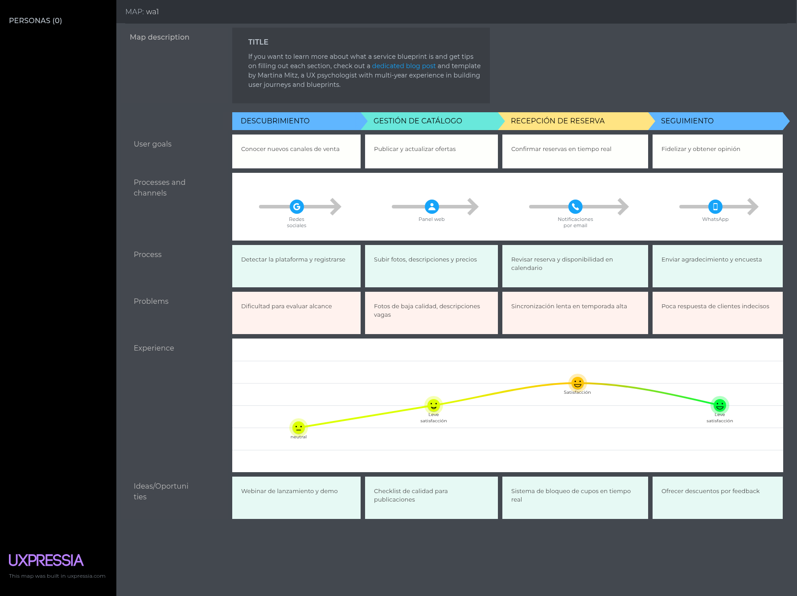
</p>

***Segmento 2: Turistas nacionales e internacionales***

<p align="center">
    
</p>

***Segmento 3: Turistas corporativos***

<p align="center">
    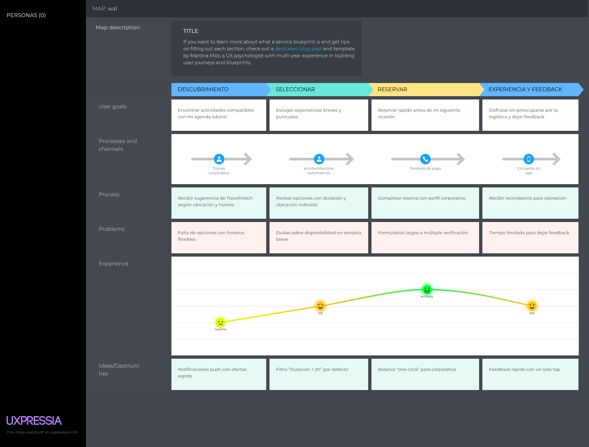
</p>

#### 2.3.4. Empathy Mapping

#### 2.3.4.1. Empathy Mapping Turistas nacionales e internacionales

<p align="center">
    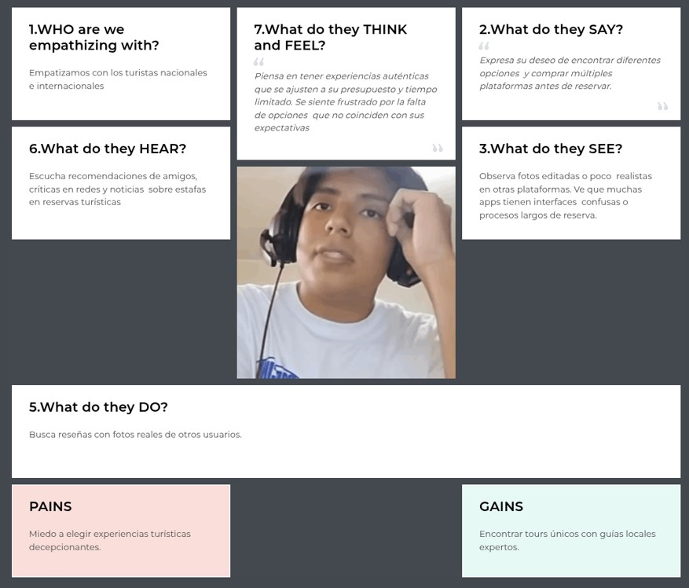
</p>

#### 2.3.4.2. Empathy Mapping Agencias de turismo locales

<p align="center">
    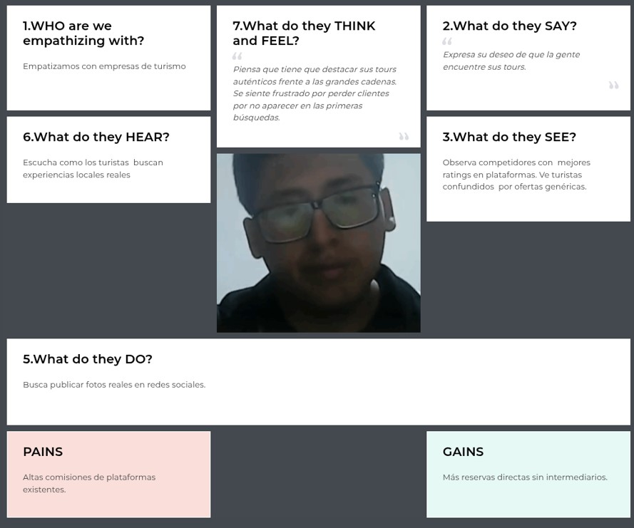
</p>

#### 2.3.4.3. Empathy Mapping Viajeros por trabajo

<p align="center">
    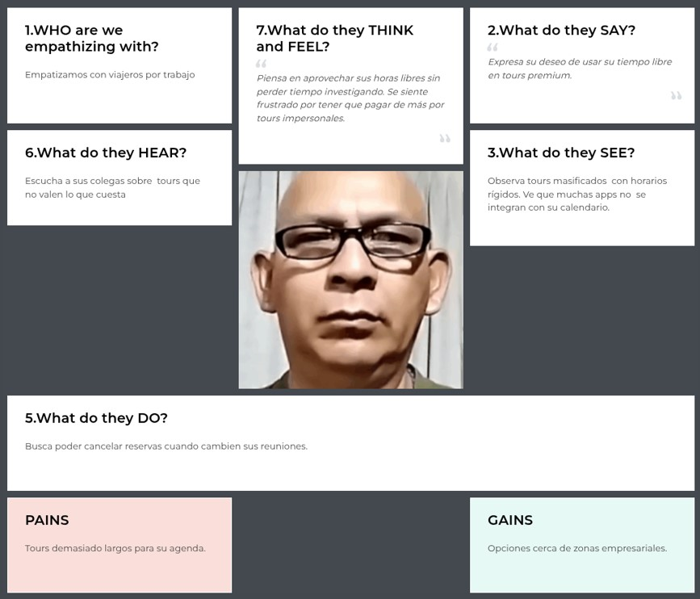
</p>

#### 2.3.5. As-is Scenario Mapping


#### 2.3.5.1. As-is Scenario Mapping Turistas nacionales e internacionales

<p align="center">
    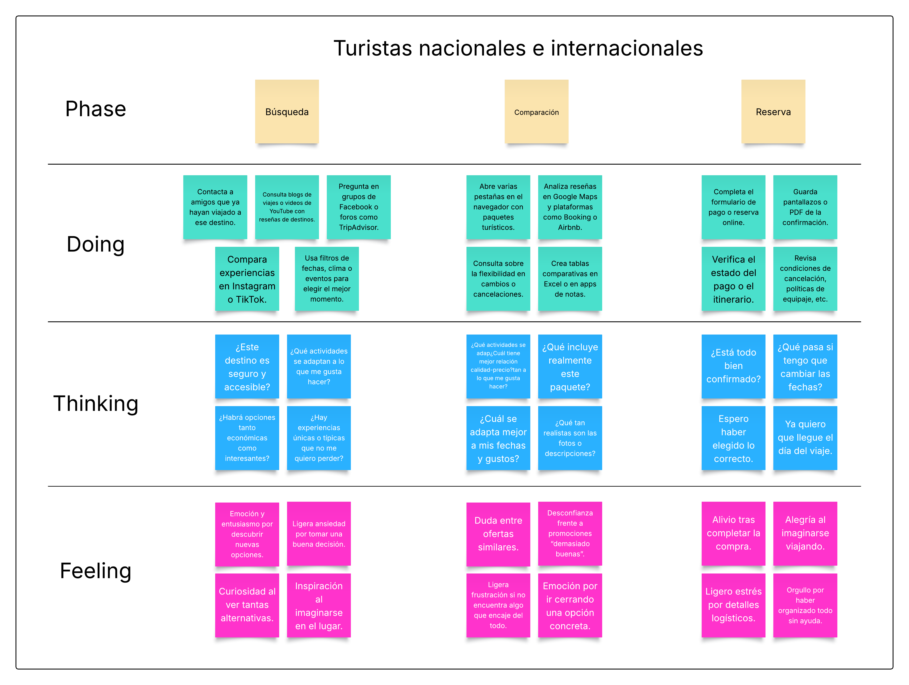
</p>

#### 2.3.5.2. As-is Scenario Mapping Agencias de turismo locales

<p align="center">
    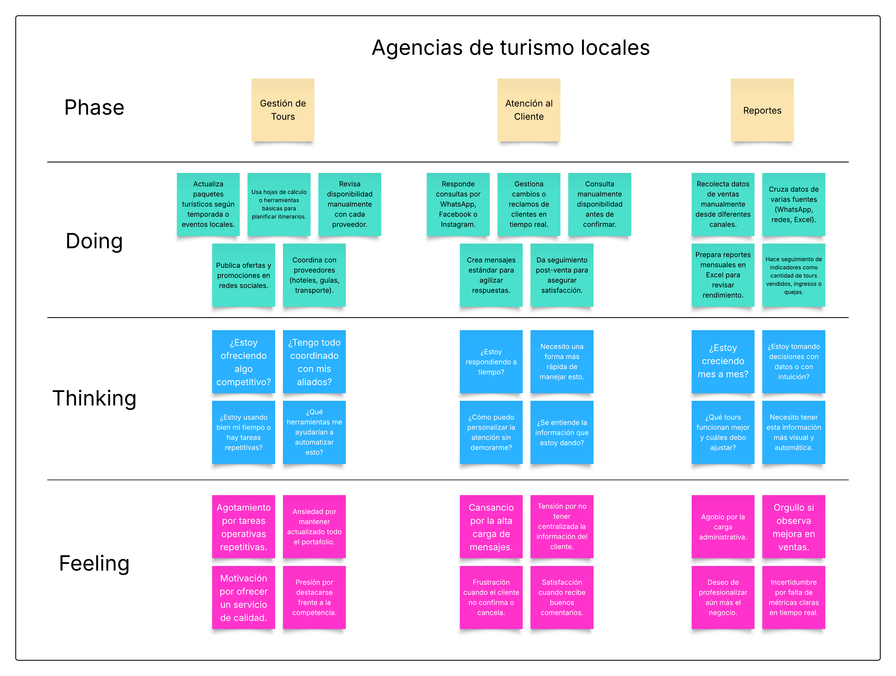
</p>

#### 2.3.5.3. As-is Scenario Mapping Viajeros por trabajo

<p align="center">
    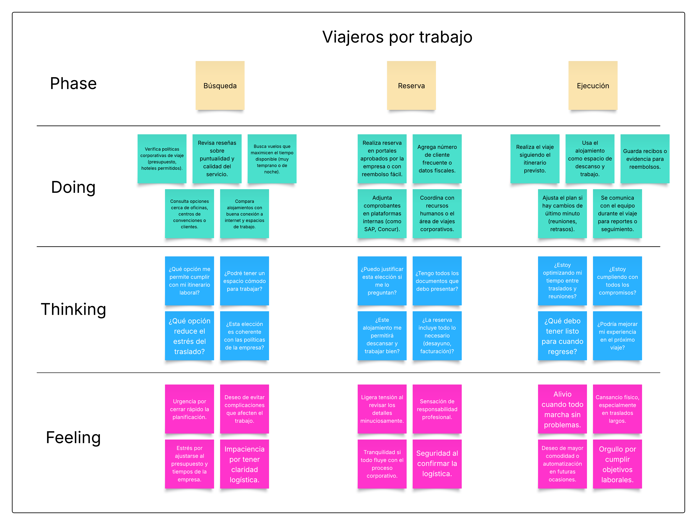
</p>

### 2.4. Ubiquitous Language

| **Término (Inglés)**       | **Término (Español)**       | **Descripción** |
|----------------------------|----------------------------|----------------|
| **Traveler**               | Viajero                    | Usuario de la plataforma que busca descubrir, reservar o personalizar experiencias turísticas, ya sea de forma individual o en grupo. |
| **Travel Agency**          | Agencia de viajes          | Entidad registrada en la plataforma que ofrece paquetes turísticos, experiencias personalizadas o servicios relacionados con viajes. |
| **Experience**             | Experiencia                | Actividad o conjunto de actividades que conforman un paquete turístico (cultural, gastronómico, deportivo, etc.). |
| **Recommended Plan**       | Plan recomendado           | Propuesta de actividades generadas automáticamente según los intereses, preferencias y perfil del viajero. |
| **Match**                  | Coincidencia / Compatibilidad | Grado de afinidad entre un viajero y una agencia o experiencia, basado en intereses, presupuesto y ubicación. |
| **Booking Request**        | Solicitud de reserva       | Acción mediante la cual un viajero inicia el proceso de reservar una experiencia o paquete. |
| **Availability**           | Disponibilidad             | Periodo de tiempo y capacidad en los que una agencia puede ofrecer una experiencia. |
| **Profile**                | Perfil                     | Datos personales y preferencias de viaje asociados a un usuario (viajero o agencia). |
| **Feedback**               | Retroalimentación          | Opiniones, comentarios o calificaciones de los viajeros después de realizar una experiencia. |
| **Tour Package**           | Paquete turístico          | Conjunto de servicios y actividades agrupadas (transporte, alojamiento, alimentación, etc.). |
| **Local Partner**          | Aliado local               | Proveedor asociado a una agencia que ofrece servicios específicos (guías, restaurantes, transportistas). |
| **Seasonality**            | Estacionalidad             | Variación en la demanda o disponibilidad según la época del año, festividades o clima. |
| **Target Audience**        | Audiencia objetivo         | Grupo de personas con características específicas (edad, intereses) al que va dirigida una experiencia. |

<hr>


## Capítulo III:  Requirements Specification 
### 3.1. To-Be Scenario Mapping

El equipo realizó un análisis detallado para definir los futuros escenarios de uso de la plataforma, considerando los diferentes perfiles de usuarios y sus necesidades específicas. Para esto, se identificaron tres segmentos clave que representan los principales grupos de usuarios:

#### 3.1.1. To-Be Scenario Mapping Turistas nacionales e internacionales

<p align="center">
    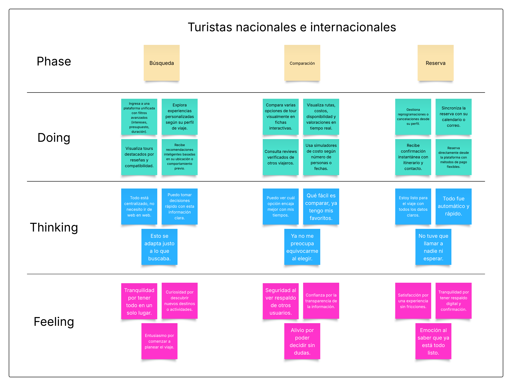
</p>

#### 3.1.2. To-Be Scenario Mapping Agencias de turismo locales

<p align="center">
    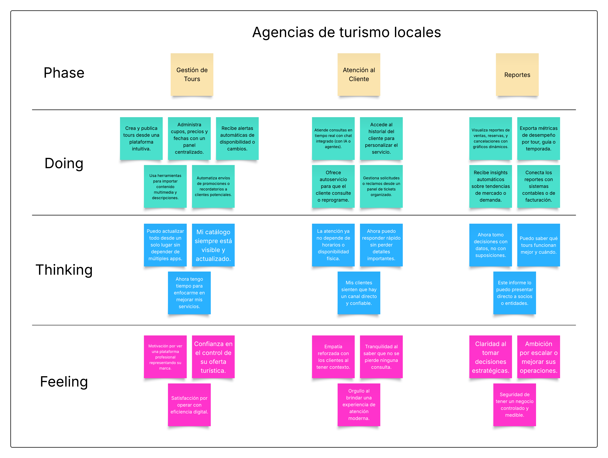
</p>

#### 3.1.3. To-Be Scenario Mapping Viajeros por trabajo

<p align="center">
    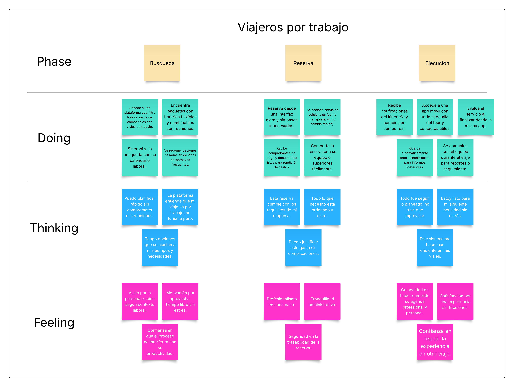
</p>

### 3.2. User Stories

En esta sección se presentan las historias de usuario que describen las necesidades y expectativas de los diferentes perfiles que interactúan con la plataforma, incluyendo usuarios generales, turistas y agencias. Cada historia detalla los objetivos, acciones esperadas y criterios de aceptación para asegurar que se cumplan los requisitos funcionales del sistema, promoviendo una experiencia óptima y personalizada para cada tipo de usuario.

| Epic / Story ID | Título | Descripción | Criterios de Aceptación | Relacionado con (Epic ID) |
| :-: | :-: | :- | :- | :- |
|EP01|Gestión de usuarios|Como usuario, quiero gestionar mi perfil y preferencias para personalizar mi experiencia.|-|-|
|EP02|Búsqueda y reserva|Como turista, quiero explorar y reservar actividades fácilmente para planificar mi viaje sin estrés.|-|-|
|EP03|Herramientas para agencias|Como agencia, quiero administrar mis tours y clientes para optimizar mis operaciones.|-|-|
|EP04|Seguridad y Pagos|Como usuario, quiero realizar transacciones seguras y como administrador, quiero garantizar la integridad financiera y la seguridad de la plataforma.|-|-|
|EP05|Visibilidad y Contenido Estático (Landing Page)|Como visitante, quiero encontrar información relevante sobre TravelMatch y sus servicios para comprender el valor de la plataforma.|-|-|
|EP06|Integración y Mantenimiento de API|Como desarrollador, quiero asegurar la correcta comunicación de datos y la escalabilidad del sistema para soportar las funcionalidades de la plataforma.|-|-|
| US01 | Registro básico | Como nuevo usuario, quiero registrarme con un email para acceder a la plataforma. | - Scenario 1: Registro exitoso:<br> Dado que estoy en la pantalla de registro, cuando ingreso mi email y una contraseña válida, entonces recibo un email de confirmación.<br><br>- Scenario 2: Email inválido:<br> Dado que estoy en la pantalla de registro, cuando ingreso un email sin "@", entonces el sistema muestra "Ingrese un email válido". | EP01 |
| US02 | Inicio de sesión | Como usuario registrado, quiero iniciar sesión para gestionar mis reservas. | - Scenario 1: Credenciales correctas:<br> Dado que tengo credenciales válidas, cuando las ingreso, entonces accedo a mi perfil.<br><br>- Scenario 2: Contraseña incorrecta:<br> Dado que ingreso un email válido, cuando ingreso una contraseña errónea, entonces el sistema muestra "Credenciales inválidas". | EP01 |
| US03 | Perfil corporativo | Como viajero corporativo, quiero vincularme con mi empresa para obtener beneficios exclusivos. | - Scenario 1: Verificación exitosa:<br> Dado que soy usuario corporativo, cuando subo mi credencial laboral válida, entonces mi perfil muestra un sello verificador.<br><br>- Scenario 2: Documento rechazado:<br> Dado que subo un documento ilegible, cuando el sistema lo revisa, entonces muestra "Documento no válido". | EP01 |
| US04 | Preferencias de viaje | Como turista, quiero seleccionar mis intereses para recibir recomendaciones personalizadas. | - Scenario 1: Actualización exitosa:<br> Dado que actualizo mis preferencias, cuando busco actividades, entonces veo opciones relevantes.<br><br>- Scenario 2: Sin preferencias:<br> Dado que no selecciono intereses, cuando busco actividades, entonces veo recomendaciones generales. | EP01 |
| US05 | Recuperar contraseña | Como usuario, quiero restablecer mi contraseña si la olvido para recuperar el acceso. | - Scenario 1: Solicitud exitosa:<br> Dado que solicito restablecer la contraseña, cuando ingreso mi email registrado, entonces recibo un enlace temporal.<br><br>- Scenario 2: Email no registrado:<br> Dado que ingreso un email no existente, cuando solicito el restablecimiento, entonces el sistema muestra "Email no encontrado". | EP01 |
| US06 | Verificación de identidad | Como usuario premium, quiero verificar mi identidad para desbloquear reservas exclusivas. | - Scenario 1: Verificación aprobada:<br> Dado que subo mi documento de identidad válido, cuando es aprobado, entonces puedo reservar tours premium.<br><br>- Scenario 2: Documento vencido:<br> Dado que subo un DNI vencido, cuando el sistema lo revisa, entonces muestra "Documento no válido". | EP01 |
| US07 | Notificaciones push | Como usuario, quiero recibir alertas sobre ofertas para no perderme promociones. | - Scenario 1: Notificación recibida:<br> Dado que activo las notificaciones, cuando hay una oferta en mis favoritos, entonces recibo una alerta.<br><br>- Scenario 2: Notificación desactivada:<br> Dado que desactivo las notificaciones, cuando hay una oferta, entonces no recibo alertas. | EP01 |
| US08 | Idiomas | Como usuario internacional, quiero cambiar el idioma de la app para entender mejor. | - Scenario 1: Cambio a inglés:<br> Dado que selecciono "Inglés", cuando guardo los cambios, entonces toda la interfaz se traduce.<br><br>- Scenario 2: Idioma no disponible:<br> Dado que selecciono un idioma no soportado, cuando intento guardar, entonces el sistema muestra "Idioma no disponible". | EP01 |
| US09 | Publicar reseñas | Como viajero, quiero compartir mis reseñas para ayudar a otros turistas a elegir sus experiencias. | - Scenario 1: Reseña publicada:<br> Dado que completo una actividad, cuando escribo una reseña, entonces aparece en mi perfil público.<br><br>- Scenario 2: Reseña vacía:<br> Dado que no ingreso texto, cuando intento publicar, entonces el sistema muestra "Escribe tu opinión". | EP01 |
| US10 | Editar/Eliminar reseñas | Como viajero, quiero modificar o eliminar mis reseñas para asegurar que reflejen mi experiencia con precisión. | - Scenario 1: Edición de reseña:<br> Dado que he publicado una reseña, cuando accedo a mi perfil, entonces puedo editar el texto y la calificación de mi reseña.<br><br>- Scenario 2: Eliminación de reseña:<br> Dado que he publicado una reseña, cuando selecciono "Eliminar", entonces mi reseña desaparece del perfil público. | EP01 |
| US11 | Eliminar cuenta | Como viajero, quiero borrar mi cuenta para proteger mi privacidad. | - Scenario 1: Eliminación confirmada:<br> Dado que solicito eliminar mi cuenta, cuando confirmo, entonces todos mis datos se borran en 72 horas.<br><br>- Scenario 2: Cancelación de eliminación:<br> Dado que inicio el proceso, cuando cancelo, entonces mi cuenta permanece activa. | EP01 |
| US12 | Acceso a boletos digitales | Como usuario, quiero acceder a mis boletos/vouchers con código QR para facilitar el check-in en las actividades. | - Scenario 1: Visualización de boleto:<br> Dado que tengo una reserva confirmada, cuando accedo a mis reservas, entonces veo un boleto digital con un código QR válido.<br><br>- Scenario 2: Boleto en la app (offline):<br> Dado que no tengo conexión a internet, cuando accedo a mis boletos desde la app, entonces puedo visualizar mis vouchers previamente descargados. | EP01 |
| US13 | Contactar al equipo de soporte (versión usuario) | Como usuario con dudas, quiero enviar un mensaje al soporte para resolver mis inquietudes. | - Scenario 1: Envío exitoso:<br> Dado que completo el formulario, cuando hago clic en "Enviar", entonces recibo un email de confirmación.<br><br>- Scenario 2: Campos obligatorios:<br> Dado que dejo el email vacío, cuando intento enviar, entonces el sistema muestra "Campo requerido". | EP01 |
| US14 | Filtros avanzados | Como turista, quiero filtrar actividades por precio y tipo para encontrar opciones relevantes. | <p>- Scenario 1: Filtrado por precio exitoso<br>Dado que uso los filtros, cuando aplico "precio < $50", entonces veo solo tours económicos.</p><p>- Scenario 2: Sin resultados coincidentes<br>Dado que filtro por "precio < S/.20", cuando no hay tours disponibles, entonces el sistema muestra "No encontramos coincidencias".</p> | EP02 |
| US15 | Comparar tours | Como usuario, quiero comparar múltiples tours en una vista para tomar la mejor decisión. | <p>- Scenario 1: Comparación exitosa<br>Dado que selecciono 3 tours, cuando hago clic en "Comparar", entonces veo diferencias claras en una tabla.</p><p>- Scenario 2: Selección insuficiente<br>Dado que selecciono solo 1 tour, cuando intento comparar, entonces el sistema muestra "Seleccione al menos 2 tours".</p> | EP02 |
| US16 | Gestión de Cancelación de Reservas | Como turista, quiero cancelar una reserva con anticipación para ajustar mis planes de viaje. | <p>- Scenario 1: Cancelación dentro del plazo<br>Dado que reservo un tour, cuando cancelo 24h antes, entonces recibo reembolso automático.</p><p>- Scenario 2: Cancelación tardía<br>Dado que cancelo 12h antes, cuando intento reembolsar, entonces el sistema muestra "Fuera del plazo de cancelación".</p> | EP02 |
| US17 | Reservas grupales | Como viajero corporativo, quiero reservar para mi equipo para simplificar la logística. | <p>- Scenario 1: Reserva grupal exitosa<br>Dado que añado 5 participantes, cuando completo el pago, entonces todos reciben confirmación por email.</p><p>- Scenario 2: Límite excedido<br>Dado que intento añadir 15 personas, cuando el tour tiene límite de 10, entonces el sistema muestra "Cupo máximo alcanzado".</p> | EP02 |
| US18 | Favoritos | Como usuario, quiero guardar actividades interesantes para revisarlas después. | <p>- Scenario 1: Guardar en favoritos<br>Dado que hago clic en "Guardar", cuando voy a "Mis Favoritos", entonces veo la actividad listada.</p><p>- Scenario 2: Eliminar de favoritos<br>Dado que elimino un tour de favoritos, cuando actualizo la página, entonces desaparece de la lista.</p> | EP02 |
| US19 | Chat con guías | Como usuario, quiero preguntar detalles a los guías antes de reservar para aclarar dudas. | <p>- Scenario 1: Respuesta en horario de atención<br>Dado que envío una pregunta durante el horario de atención, cuando el guía responde, entonces recibo la respuesta en el tiempo establecido.</p><p>- Scenario 2: Fuera de horario<br>Dado que pregunto a las 3 a.m., cuando el guía no está disponible, entonces el sistema muestra "Respuesta en 8-12h".</p> | EP02 |
| US20 | Mapas interactivos | Como turista, quiero ver la ubicación exacta de los tours para planificar mi ruta. | <p>- Scenario 1: Visualización de ruta<br>Dado que abro un tour, cuando hago clic en "Ver mapa", entonces se muestra la ruta exacta con puntos de interés.</p><p>- Scenario 2: Sin conexión a internet<br>Dado que no tengo internet, cuando intento cargar el mapa, entonces el sistema muestra "Active su conexión".</p> | EP02 |
| US21 | Vista previa de tours | Como turista, quiero ver fotos y videos detallados de los tours para evaluar la experiencia antes de reservar. | <p>- Scenario 1: Visualización de multimedia exitosa<br>Dado que selecciono un tour, cuando hago clic en "Galería", entonces veo al menos 5 fotos HD y 1 video promocional.</p><p>- Scenario 2: Contenido insuficiente<br>Dado que un tour solo tiene 2 fotos, cuando reviso la galería, entonces el sistema muestra "Contenido en actualización".</p> | EP02 |
| US22 | Itinerarios automáticos | Como viajero, quiero generar un itinerario diario automático para optimizar mi tiempo. | <p>- Scenario 1: Itinerario generado<br>Dado que selecciono actividades, cuando hago clic en "Planificar", entonces recibo una agenda ordenada por horarios.</p><p>- Scenario 2: Actividades incompatibles<br>Dado que selecciono tours con horarios superpuestos, cuando intento planificar, entonces el sistema muestra "Conflicto de horarios".</p> | EP02 |
| US23 | Contactar para consultas comerciales | Como visitante del segmento de agencias, quiero usar el formulario de contacto para hacer consultas o proponer colaboraciones. | <p>- Scenario: Envío de mensaje<br>Dado que el visitante llega a la sección "Contáctanos", cuando completa los campos obligatorios y hace clic en "Enviar", entonces recibe una confirmación de que su mensaje ha sido enviado.</p> | EP05 |
| US24 | Subir nuevos tours | Como agencia, quiero subir nuevos tours con fotos y descripciones para atraer clientes. | <p>- Scenario 1: Publicación exitosa<br>Dado que completo el formulario, cuando lo envío, entonces el tour aparece tras aprobación en 24h.</p><p>- Scenario 2: Fotos faltantes<br>Dado que no subo imágenes, cuando intento publicar, entonces el sistema muestra "Agregue al menos 3 fotos".</p> | EP03 |
| US25 | Editar Detalles de Tour | Como agencia, quiero editar los detalles de un tour publicado (descripción, puntos de encuentro, inclusiones) para mantener la información actualizada. | <p>- Scenario 1: Actualización de detalles<br>Dado que selecciono un tour, cuando modifico su descripción y guardo, entonces los cambios se reflejan en la página del tour.</p> | EP03 |
| US26 | Calendario en tiempo real | Como agencia, quiero actualizar la disponibilidad para evitar sobre-reservas. | <p>- Scenario 1: Actualización exitosa<br>Dado que modifico fechas, cuando guardo cambios, entonces los usuarios ven slots actualizados al instante.</p><p>- Scenario 2: Fechas inválidas<br>Dado que ingreso una fecha pasada, cuando intento guardar, entonces el sistema muestra "Seleccione una fecha futura".</p> | EP03 |
| US27 | Analytics | Como agencia, quiero ver métricas de reservas para mejorar mis estrategias. | <p>- Scenario 1: Visualización de datos<br>Dado que accedo al dashboard, cuando filtro por mes, entonces veo gráficos de rendimiento con porcentajes.</p><p>- Scenario 2: Sin datos disponibles<br>Dado que no tengo reservas en el mes, cuando reviso analytics, entonces el sistema muestra "No hay datos para mostrar".</p> | EP03 |
| US28 | Alertas de reservas | Como agencia, quiero recibir notificaciones de nuevas reservas para prepararme. | <p>- Scenario 1: Notificación inmediata<br>Dado que hay una reserva nueva, cuando se confirma, entonces recibo un email/app notification con detalles.</p><p>- Scenario 2: Notificaciones silenciadas<br>Dado que desactivo alertas, cuando hay una reserva, entonces no recibo notificaciones.</p> | EP03 |
| US29 | Crear promociones | Como agencia, quiero ofrecer descuentos en temporada baja para atraer más clientes. | <p>- Scenario 1: Promoción activada<br>Dado que creo una promoción, cuando la publico, entonces aparece un sello "Oferta" en el tour.</p><p>- Scenario 2: Descuento inválido<br>Dado que intento aplicar un 200% de descuento, cuando guardo, entonces el sistema muestra "Máximo 50% de descuento".</p> | EP03 |
| US30 | Gestión de Precios por Categoría | Como agencia, quiero definir precios diferentes para adultos y niños en mis tours para ajustarme a la demanda. | <p>- Scenario 1: Precios por categoría definidos<br>Dado que edito un tour, cuando especifico el precio para adultos y niños, entonces los usuarios ven ambas opciones al reservar.</p> | EP03 |
| US31 | Gestión de guías | Como agencia, quiero asignar guías a tours específicos para organizar mi equipo. | <p>- Scenario 1: Asignación exitosa<br>Dado que asigno un guía, cuando guardo los cambios, entonces el guía recibe una notificación con detalles.</p><p>- Scenario 2: Guía no disponible<br>Dado que selecciono un guía en otra actividad, cuando intento asignar, entonces el sistema muestra "Guía ocupado en esas fechas".</p> | EP03 |
| US32 | Encuestas a clientes | Como agencia, quiero enviar encuestas post-viaje para medir la satisfacción. | <p>- Scenario 1: Encuesta enviada<br>Dado que un tour finaliza, cuando envío la encuesta, entonces recibo respuestas en mi dashboard en 48h.</p><p>- Scenario 2: Cliente no responde<br>Dado que pasan 7 días, cuando el cliente no contesta, entonces el sistema marca "No respondida".</p> | EP03 |
| US33 | Soporte prioritario | Como agencia, quiero acceder a soporte rápido para resolver problemas urgentes. | <p>- Scenario 1: Notificación de consulta recibida<br>Dado que contacto a soporte, cuando envío mi consulta, entonces recibo una confirmación de recepción.</p><p>- Scenario 2: Información sobre el plazo de respuesta<br>Dado que el sistema confirma la recepción de mi consulta, cuando reviso la confirmación, entonces veo el plazo de respuesta esperado de 24 horas.</p> | EP03 |
| US34 | Integración con redes | Como agencia, quiero compartir mis tours en redes sociales para aumentar mi visibilidad. | <p>- Scenario 1: Publicación automática<br>Dado que hago clic en "Compartir", cuando elijo Instagram, entonces se publica con fotos y descripción.</p><p>- Scenario 2: Red no conectada<br>Dado que no vinculé mi Facebook, cuando intento compartir, entonces el sistema muestra "Conecte su cuenta primero".</p> | EP03 |
| US35 | Contactar al equipo de soporte (Versión agencia) | Como agencia asociada, quiero contactar al soporte técnico especializado para resolver problemas operativos urgentes. | <p>- Scenario 1: Solicitud prioritaria<br>Dado que selecciono 'Problema operativo', cuando envío mi consulta marcando 'Urgente', entonces la consulta es marcada como prioritaria en el sistema de soporte.</p><p>- Scenario 2: Consulta sobre API<br>Dado que tengo dudas sobre integración, cuando adjunto capturas de error, entonces el soporte me envía documentación técnica complementaria.</p> | EP03 |
| US36 | Verificación de Agencia | Como agencia, quiero verificar mi negocio para ganar la confianza de los clientes. | <p>- Scenario 1: Inicio de verificación<br>Dado que subo todos los documentos requeridos, cuando se inicia el proceso de verificación, entonces recibo una notificación indicando que mi solicitud está en revisión.</p><p>- Scenario 2: Documentación incompleta<br>Dado que no subo mi RUC, cuando intento verificar mi negocio, entonces el sistema muestra el mensaje: "Falta documentación legal".</p> | EP04 |
| US37 | Pago en Cuotas | Como usuario, quiero dividir el pago en cuotas para gestionar mejor mi presupuesto. | <p>- Scenario 1: Pago fraccionado<br>Dado que selecciono la opción "Pagar en cuotas", cuando elijo 3 meses, entonces el monto total se divide en tres partes iguales.</p><p>- Scenario 2: Límite de cuotas excedido<br>Dado que intento dividir el pago en 12 cuotas, cuando el límite es 6, entonces el sistema muestra el mensaje: "Máximo 6 cuotas permitidas".</p> | EP04 |
| US38 | Reportar Problemas o Fraude | Como usuario, quiero reportar tours inapropiados o actividades sospechosas para mantener la seguridad y calidad de la plataforma. | <p>- Scenario 1: Reporte exitoso<br>Dado que detecto un tour sospechoso, cuando lo reporto, entonces recibo una confirmación de que mi reporte ha sido recibido correctamente.</p> | EP04 |
| US39 | Navegación por el landing page | Como visitante, quiero navegar fácilmente por el landing page para acceder a todas las secciones principales. | <p>- Scenario 1: Navegación exitosa<br>Dado que estoy en la página principal, cuando hago clic en cualquier item del menú, entonces soy redirigido a la sección correspondiente.</p><p>- Scenario 2: Menú desplegable en móvil<br>Dado que accedo desde un celular, cuando toco el ícono de hamburguesa, entonces el menú se despliega correctamente.</p> | EP05 |
| US40 | Ver información del startup | Como visitante, quiero conocer al equipo para entender quiénes están detrás del proyecto. | <p>- Scenario 1: Visualización de perfiles<br>Dado que voy a "Nuestro equipo", cuando hago scroll, entonces veo los nombres de cada miembro.</p><p>- Scenario 2: Información incompleta<br>Dado que un miembro no tiene foto, cuando veo su perfil, entonces muestra un avatar por defecto.</p> | EP05 |
| US41 | Conocer la misión de la startup | Como visitante, quiero entender la misión y valores para evaluar su alineación con mis necesidades. | <p>- Scenario 1: Lectura de valores<br>Dado que accedo a "Sobre nosotros", cuando leo la sección de misión, entonces encuentro al menos 3 valores clave.</p><p>- Scenario 2: Versión resumida<br>Dado que estoy en móvil, cuando veo esta sección, entonces el contenido se adapta visualmente a la pantalla móvil.</p> | EP05 |
| US42 | Visualización responsive | Como visitante, quiero ver la página correctamente adaptada a mi pantalla para una experiencia óptima. | <p>- Scenario 1: Ajuste automático<br>Dado que accedo desde un dispositivo móvil, cuando giro la pantalla, entonces el contenido se reordena correctamente.</p><p>- Scenario 2: Menú adaptado<br>Dado que uso una tablet, cuando navego, entonces los botones tienen tamaño táctil adecuado.</p> | EP05 |
| US43 | Modelo de Monetización | Como agencia turística, quiero entender claramente cómo generaré ingresos mediante la plataforma para planificar mi estrategia. | <p>- Scenario 1: Visualización de comisiones<br>Dado que accedo a "Para Agencias", cuando reviso la sección monetización, entonces veo una calculadora interactiva de comisiones por reserva.</p><p>- Scenario 2: Beneficios premium<br>Dado que soy agencia verificada, cuando consulto planes de suscripción, entonces el sistema muestra comparativas de features y costos.</p> | EP05 |
| US44 | Explorar servicios disponibles | Como visitante del segmento de viajeros, quiero explorar los servicios disponibles para encontrar opciones que se adapten a mis intereses de viaje. | <p>- Scenario 1: Exploración de servicios<br>Dado que el visitante accede a la sección 'Nuestros Servicios', cuando revisa esta sección, entonces ve una lista de los tipos de actividades o categorías principales ofrecidas.</p> | EP05 |
| US45 | Revisar testimonios de otros viajeros | Como visitante del segmento de viajeros, quiero leer testimonios de otros usuarios para tener confianza en las experiencias ofrecidas. | <p>- Scenario 1: Revisión de testimonios<br>Dado que el visitante accede a la sección 'Testimonios', cuando revisa los comentarios, entonces ve al menos 5 testimonios con nombre y puntaje.</p> | EP05 |
| US46 | Contactar para más información | Como visitante del segmento de viajeros, quiero poder enviar un mensaje para resolver dudas sobre los servicios ofrecidos. | <p>- Scenario 1: Notificación de envío de mensaje<br>Dado que el visitante accede a la sección 'Contáctanos', cuando completa el formulario de contacto y hace clic en 'Enviar', entonces recibe una confirmación de que su mensaje ha sido enviado.</p> | EP05 |
| US47 | Registro para viajeros | Como visitante del segmento de viajeros, quiero registrarme fácilmente desde la landing para comenzar a explorar experiencias de viaje. | <p>- Scenario 1: Registro desde botón<br>Dado que la opción "Registrarse" está visible, cuando el visitante hace clic en ella, entonces es redirigido al formulario de registro para viajeros.</p> | EP05 |
| US48 | Conocer cómo funciona la plataforma | Como visitante del segmento de agencias, quiero entender cómo funciona la plataforma para saber si es compatible con mis servicios. | <p>- Scenario 1: Lectura de “Cómo Funciona”<br>Dado que el visitante accede a la sección 'Cómo Funciona', cuando lee los pasos indicados, entonces ve una descripción clara y concisa del proceso para agencias.</p> | EP05 |
| US49 | Revisar testimonios de otras agencias | Como visitante del segmento de agencias, quiero leer testimonios de otros usuarios para validar la efectividad de la plataforma. | <p>- Scenario 1: Revisión de testimonios<br>Dado que el visitante accede a la sección 'Testimonios', cuando revisa los comentarios, entonces ve testimonios de otras agencias con sus valoraciones y comentarios.</p> | EP05 |
| US50 | Cambiar vista a viajeros | Como visitante del segmento de agencias, quiero cambiar a la vista de viajeros para conocer el contenido y servicios disponibles para ese público. | <p>- Scenario 1: Cambio de vista<br>Dado que la opción "Para Viajeros" está visible, cuando hace clic en esa opción, entonces la vista cambia para mostrar contenido para viajeros.</p> | EP05 |
| US51 | Registro para agencias | Como visitante del segmento de agencias, quiero registrarme desde la landing para empezar a formar parte de la plataforma. | <p>- Scenario 1: Registro desde botón<br>Dado que la opción "Registrarse" está visible, cuando el visitante hace clic en ella, entonces es redirigido al formulario de registro para agencias.</p> | EP05 |
| US-52 | Subida de archivos multimedia | Como agencia, quiero subir imágenes y videos a mis experiencias para que los viajeros puedan conocerlas mejor. | - Scenario 1: Carga exitosa. Al subir un archivo válido, se adjunta correctamente a la experiencia. <br> - Scenario 2: Validación de formato. Si el archivo es inválido (peso o extensión), el sistema muestra error. | EP06 |
| US-53 | Eliminación de medios asociados | Como agencia, quiero eliminar imágenes o videos antiguos de mis experiencias para mantener contenido actualizado. | - Scenario 1: Eliminación manual. El usuario selecciona un archivo y confirma la eliminación. <br> - Scenario 2: Actualización automática. Tras eliminar, la galería se actualiza sin recargar. | EP06 |
| US-54 | Gestión de documentos de agencias | Como agencia, quiero subir y administrar documentos legales para verificar mi identidad y cumplir con las políticas de la plataforma. | - Scenario 1: Subida de documentos. La agencia puede cargar documentos PDF válidos. <br> - Scenario 2: Visualización y estado. El documento se muestra con estado (pendiente, aprobado, rechazado). | EP05 |
| US-55 | Visualizar staff de la agencia | Como agencia, quiero ver el listado del personal registrado para gestionarlo adecuadamente. | - Scenario 1: Lista actualizada. Se muestra la información del personal asociado. <br> - Scenario 2: Acceso restringido. Solo la agencia propietaria puede ver esta información. | EP05 |
| US-56 | Edición de disponibilidad de tours | Como agencia, quiero modificar la disponibilidad de mis tours para gestionar el número de visitantes. | - Scenario 1: Edición exitosa. Se puede cambiar fecha, cupos y tipo de ticket. <br> - Scenario 2: Validación. No se permite disponibilidad con fecha pasada. | EP06 |
| US-57 | Gestión del carrito de compras | Como viajero, quiero agregar y eliminar experiencias del carrito antes de confirmar la reserva. | - Scenario 1: Agregar experiencia. El usuario puede añadir tours al carrito desde la vista de detalle. <br> - Scenario 2: Eliminar del carrito. El usuario puede eliminar tours antes de reservar. | EP07 |
| US-58 | Contador de ítems en carrito | Como viajero, quiero ver cuántos ítems tengo en mi carrito para estar al tanto de mis próximas reservas. | - Scenario 1: Visualización dinámica. El contador se actualiza cada vez que agrego o elimino ítems. <br> - Scenario 2: Límite visual. Se indica si se alcanza el límite máximo de ítems (si aplica). | EP07 |
| US-59 | Visualización de medios de experiencias | Como viajero, quiero ver las imágenes y videos relacionados a una experiencia para decidir si se ajusta a mis preferencias. | - Scenario 1: Galería visible. Al entrar a la experiencia, se cargan automáticamente los archivos multimedia. <br> - Scenario 2: Fallback. Si no hay archivos disponibles, se muestra una imagen por defecto. | EP03 ||TS01|API: Registro de usuarios|Como Developer, quiero una API para registrar nuevos usuarios para soportar la funcionalidad de registro de la plataforma.|- Scenario 1: Registro exitoso<br> Dado que recibo una solicitud POST a /api/v1/users/register con email y contraseña válidos,<br> Cuando proceso la solicitud,<br> Entonces la base de datos registra al usuario y la API responde con un 201 Created y los datos del usuario (sin contraseña).<br><br>- Scenario 2: Email duplicado<br> Dado que recibo una solicitud POST a /api/v1/users/register con un email ya registrado,<br> Cuando intento registrar el usuario,<br> Entonces la API responde con un 409 Conflict y un mensaje de error.|EP06|
|TS02|API: Inicio de sesión de usuarios|Como Developer, quiero una API para autenticar usuarios para permitirles acceder a sus perfiles.|- Scenario 1: Inicio de sesión exitoso<br> Dado que recibo una solicitud POST a /api/v1/users/login con credenciales válidas,<br> Cuando verifico las credenciales,<br> Entonces la API responde con un 200 OK y un token de autenticación.<br><br>- Scenario 2: Credenciales inválidas<br> Dado que recibo una solicitud POST a /api/v1/users/login con credenciales incorrectas,<br> Cuando intento autenticar,<br> Entonces la API responde con un 401 Unauthorized y un mensaje de error.|EP06|
|TS03|API: Gestión de Perfil de Usuario|Como Developer, quiero una API para que los usuarios gestionen sus datos de perfil para permitir la actualización de información personal.|- Scenario 1: Actualización de perfil exitosa<br> Dado que recibo una solicitud PUT a /api/v1/users/{id} con datos válidos de perfil y un token de autenticación,<br> Cuando actualizo el perfil del usuario,<br> Entonces la base de datos se actualiza y la API responde con un 200 OK y el perfil actualizado.<br><br>- Scenario 2: Datos inválidos<br> Dado que recibo una solicitud PUT a /api/v1/users/{id} con datos de perfil inválidos,<br> Cuando intento actualizar el perfil,<br> Entonces la API responde con un 400 Bad Request y un mensaje de error de validación.|EP06|
|TS04|API: Carga de Tours por Agencia|Como Developer, quiero una API para que las agencias suban información de tours para mostrar su oferta en la plataforma.|- Scenario 1: Carga de tour exitosa<br> Dado que recibo una solicitud POST a /api/v1/agencies/{agency_id}/tours con datos válidos del tour (incluyendo imágenes) y un token de agencia,<br> Cuando creo el registro del tour y proceso las imágenes,<br> Entonces la base de datos registra el tour y la API responde con un 201 Created y los detalles del tour creado.<br><br>- Scenario 2: Datos de tour incompletos<br> Dado que recibo una solicitud POST a /api/v1/agencies/{agency_id}/tours con datos de tour faltantes (ej. sin precio o descripción),<br> Cuando intento crear el tour,<br> Entonces la API responde con un 400 Bad Request y un mensaje indicando los campos requeridos.|EP06|
|TS05|API: Consulta de Tours|Como Developer, quiero una API para consultar tours con filtros para soportar la búsqueda de actividades por parte de los usuarios.|- Scenario 1: Consulta con filtros exitosa<br> Dado que recibo una solicitud GET a /api/v1/tours con parámetros de filtro (ej. ?priceMax=50&type=aventura),<br> Cuando realizo la consulta en la base de datos aplicando los filtros,<br> Entonces la API responde con un 200 OK y una lista de tours que cumplen los criterios.<br><br>- Scenario 2: Sin resultados para filtros<br> Dado que recibo una solicitud GET a /api/v1/tours con filtros que no coinciden con ningún tour,<br> Cuando realizo la consulta,<br> Entonces la API responde con un 200 OK y una lista vacía.|EP06|
|TS06|API: Creación de Reservas|Como Developer, quiero una API para crear reservas de tours para registrar las transacciones de los usuarios.|- Scenario 1: Reserva exitosa<br> Dado que recibo una solicitud POST a /api/v1/bookings con el ID del tour, la fecha, el número de participantes y el ID de usuario/agencia (si es grupal),<br> Cuando valido la disponibilidad y creo la reserva,<br> Entonces la base de datos registra la reserva y la API responde con un 201 Created y los detalles de la reserva.<br><br>- Scenario 2: Tour no disponible<br> Dado que recibo una solicitud POST a /api/v1/bookings para un tour no disponible en la fecha/cantidad solicitada,<br> Cuando intento crear la reserva,<br> Entonces la API responde con un 409 Conflict y un mensaje de error.|EP06|
|TS07|API: Procesamiento de Pagos|Como Developer, quiero una API para procesar pagos de reservas de manera segura para manejar las transacciones financieras.|- Scenario 1: Pago exitoso<br> Dado que recibo una solicitud POST a /api/v1/payments con el ID de la reserva y los datos de pago (ej. token de tarjeta),<br> Cuando proceso el pago a través del gateway de pago,<br> Entonces el pago se confirma, la reserva se marca como pagada y la API responde con un 200 OK y un ID de transacción.<br><br>- Scenario 2: Pago rechazado<br> Dado que recibo una solicitud POST a /api/v1/payments con datos de pago inválidos o insuficientes fondos,<br> Cuando el gateway de pago rechaza la transacción,<br> Entonces la API responde con un 400 Bad Request (o 402 Payment Required) y un mensaje de error del pago.|EP06|
|TS08|API: Gestión de Disponibilidad de Tours|Como Developer, quiero una API para que las agencias actualicen la disponibilidad de sus tours para evitar sobre-reservas.|- Scenario 1: Actualización de disponibilidad exitosa<br> Dado que recibo una solicitud PUT a /api/v1/agencies/{agency_id}/tours/{tour_id}/availability con las nuevas fechas/cupos disponibles,<br> Cuando actualizo la disponibilidad en la base de datos,<br> Entonces la base de datos se actualiza y la API responde con un 200 OK y los datos de disponibilidad actualizados.<br><br>- Scenario 2: Fechas inválidas<br> Dado que recibo una solicitud PUT con fechas pasadas o formato incorrecto,<br> Cuando intento actualizar la disponibilidad,<br> Entonces la API responde con un 400 Bad Request y un mensaje de error de validación.|EP06|
|TS09|API: Moderación de Contenido (Reseñas/Tours)|Como Developer, quiero una API para que los administradores moderen reseñas y tours para asegurar la calidad y formalidad de la plataforma.|- Scenario 1: Aprobación de tour/reseña<br> Dado que recibo una solicitud PUT a /api/v1/moderation/tours/{id}/approve (o reseña) con un token de administrador,<br> Cuando cambio el estado del tour/reseña a "aprobado",<br> Entonces el tour/reseña se hace visible para los usuarios y la API responde con un 200 OK.<br><br>- Scenario 2: Rechazo de tour/reseña<br> Dado que recibo una solicitud PUT a /api/v1/moderation/tours/{id}/reject con un token de administrador y un motivo,<br> Cuando cambio el estado del tour/reseña a "rechazado",<br> Entonces el tour/reseña no es visible y la API responde con un 200 OK.|EP06|
|TS10|API: Gestión de Usuarios Corporativos|Como Developer, quiero una API para gestionar la vinculación de usuarios corporativos para aplicar beneficios exclusivos.|- Scenario 1: Verificación de credencial corporativa<br> Dado que recibo una solicitud POST a /api/v1/users/{id}/corporate-verify con la credencial laboral adjunta,<br> Cuando el sistema procesa la credencial,<br> Entonces el estado de verificación corporativa del usuario se actualiza y la API responde con un 200 OK.<br><br>- Scenario 2: Acceso a beneficios corporativos<br> Dado que un usuario corporativo verificado intenta acceder a un beneficio exclusivo mediante una solicitud,<br> Cuando el sistema valida su estado corporativo,<br> Entonces la API le permite el acceso y responde con un 200 OK (o un 403 Forbidden si no está verificado).|EP06|
|TS11|API: Sincronización de Inventario|. Como Developer, quiero una API que permita a los sistemas de agencias sincronizar automáticamente su inventario y precios con TravelMatch para reducir la carga manual de gestión.|- Scenario 1: Sincronización de disponibilidad<br> Dado que el sistema de la agencia envía una actualización de disponibilidad a /api/v1/sync/tours/{id}/availability, cuando la API procesa la solicitud, entonces la disponibilidad del tour en TravelMatch se actualiza al instante.<br><br>- Scenario 2: Sincronización de precios<br> Dado que el sistema de la agencia envía una actualización de precios a /api/v1/sync/tours/{id}/prices, cuando la API procesa la solicitud, entonces los precios del tour en TravelMatch se actualizan.|EP06|

### 3.3. Product Backlog

| Orden | User Story Id | Título                                | Descripción                                                                                                                                         | Story Points |
| ----- | ------------- | ------------------------------------- | --------------------------------------------------------------------------------------------------------------------------------------------------- | ------------ |
| 1     | US39          | Navegación por el landing page        | Como visitante, quiero navegar fácilmente por el landing page para acceder a todas las secciones principales. | 2            |
| 2     | US40          | Ver información del startup        | Como visitante, quiero conocer al equipo para entender quiénes están detrás del proyecto. | 3            |
| 3     | US41          | Conocer la misión de la startup        | Como visitante, quiero entender la misión y valores para evaluar su alineación con mis necesidades. | 3            |
| 4     | US42          | Visualización responsive        | Como visitante, quiero ver la página correctamente adaptada a mi pantalla para una experiencia óptima. | 5            |
| 5     | US43          | Modelo de Monetización        | Como agencia turística, quiero entender claramente cómo generaré ingresos mediante la plataforma para planificar mi estrategia. | 5            |
| 6     | US44          | Explorar servicios disponibles        | Como visitante del segmento de viajeros, quiero explorar los servicios disponibles para encontrar opciones que se adapten a mis intereses de viaje. | 3            |
| 7     | US45          | Revisar testimonios de otros viajeros        | Como visitante del segmento de viajeros, quiero leer testimonios de otros usuarios para tener confianza en las experiencias ofrecidas. | 3            |
| 8     | US46          | Contactar para más información        | Como visitante del segmento de viajeros, quiero poder enviar un mensaje para resolver dudas sobre los servicios ofrecidos. | 5            |
| 9     | US47          | Registro para viajeros        | Como visitante del segmento de viajeros, quiero registrarme fácilmente desde la landing para comenzar a explorar experiencias de viaje. | 3            |
| 10     | US48          | Conocer cómo funciona la plataforma        | Como visitante del segmento de agencias, quiero entender cómo funciona la plataforma para saber si es compatible con mis servicios. | 3            |
| 11     | US49          | Revisar testimonios de otras agencias        | Como visitante del segmento de agencias, quiero leer testimonios de otros usuarios para validar la efectividad de la plataforma. | 3            |
| 12     | US50          | Cambiar vista a viajeros        | Como visitante del segmento de agencias, quiero cambiar a la vista de viajeros para conocer el contenido y servicios disponibles para ese público. | 2            |
| 13     | US51          | Registro para agencias        | Como visitante del segmento de agencias, quiero registrarme desde la landing para empezar a formar parte de la plataforma. | 3            |
| 14     | US24          | Subir nuevos tours        | Como agencia, quiero subir nuevos tours con fotos y descripciones para atraer clientes. | 8            |
| 15     | US25          | Editar Detalles de Tour        | Como agencia, quiero editar los detalles de un tour publicado (descripción, puntos de encuentro, inclusiones) para mantener la información actualizada. | 5            |
| 16     | US09          | Publicar reseñas        | Como viajero, quiero compartir mis reseñas para ayudar a otros turistas a elegir sus experiencias. | 5            |
| 17     | US10          | Editar/Eliminar reseñas        | Como viajero, quiero modificar o eliminar mis reseñas para asegurar que reflejen mi experiencia con precisión. | 5            |
| 18     | US11          | Eliminar cuenta        | Como viajero, quiero borrar mi cuenta para proteger mi privacidad. | 8            |
| 19     | US14          | Filtros avanzados        | Como turista, quiero filtrar actividades por precio y tipo para encontrar opciones relevantes. | 8            |
| 20     | US15          | Comparar tours        | Como usuario, quiero comparar múltiples tours en una vista para tomar la mejor decisión. | 8            |
| 21     | US16          | Gestión de Cancelación de Reservas        | Como turista, quiero cancelar una reserva con anticipación para ajustar mis planes de viaje. | 8            |
| 22     | US17          | Reservas grupales        | Como viajero corporativo, quiero reservar para mi equipo para simplificar la logística. | 8            |
| 23     | US18          | Favoritos        | Como usuario, quiero guardar actividades interesantes para revisarlas después. | 5            |
| 24     | US19          | Chat con guías        | Como usuario, quiero preguntar detalles a los guías antes de reservar para aclarar dudas. | 8            |
| 25     | US20          | Mapas interactivos        | Como turista, quiero ver la ubicación exacta de los tours para planificar mi ruta. | 8            |
| 26     | US21          | Vista previa de tours        | Como turista, quiero ver fotos y videos detallados de los tours para evaluar la experiencia antes de reservar. | 5            |
| 27     | US22          | Itinerarios automáticos        | Como viajero, quiero generar un itinerario diario automático para optimizar mi tiempo. | 8            |
| 28     | US26          | Calendario en tiempo real        | Como agencia, quiero actualizar la disponibilidad para evitar sobre-reservas. | 8            |
| 29     | US27          | Analytics        | Como agencia, quiero ver métricas de reservas para mejorar mis estrategias. | 8            |
| 30     | US28          | Alertas de reservas        | Como agencia, quiero recibir notificaciones de nuevas reservas para prepararme. | 5            |
| 31     | US29          | Crear promociones        | Como agencia, quiero ofrecer descuentos en temporada baja para atraer más clientes. | 8            |
| 32     | US30          | Gestión de Precios por Categoría        | Como agencia, quiero definir precios diferentes para adultos y niños en mis tours para ajustarme a la demanda. | 8            |
| 33     | US31          | Gestión de guías        | Como agencia, quiero asignar guías a tours específicos para organizar mi equipo. | 8            |
| 34     | US32          | Encuestas a clientes        | Como agencia, quiero enviar encuestas post-viaje para medir la satisfacción. | 8            |
| 35     | US34          | Integración con redes        | Como agencia, quiero compartir mis tours en redes sociales para aumentar mi visibilidad. | 8            |
| 36     | US36          | Verificación de Agencia        | Como agencia, quiero verificar mi negocio para ganar la confianza de los clientes. | 8            |
| 37     | US37          | Pago en Cuotas        | Como usuario, quiero dividir el pago en cuotas para gestionar mejor mi presupuesto. | 8            |
| 38     | US38          | Reportar Problemas o Fraude        | Como usuario, quiero reportar tours inapropiados o actividades sospechosas para mantener la seguridad y calidad de la plataforma. | 5            |
| 39     | TS01          | API: Registro de usuarios        | Como Developer, quiero una API para registrar nuevos usuarios para soportar la funcionalidad de registro de la plataforma. | 5            |
| 40     | TS02          | API: Inicio de sesión de usuarios        | Como Developer, quiero una API para autenticar usuarios para permitirles acceder a sus perfiles. | 5            |
| 41     | TS03          | API: Gestión de Perfil de Usuario        | Como Developer, quiero una API para que los usuarios gestionen sus datos de perfil para permitir la actualización de información personal. | 8            |
| 42     | TS04          | API: Carga de Tours por Agencia        | Como Developer, quiero una API para que las agencias suban información de tours para mostrar su oferta en la plataforma. | 8            |
| 43     | TS05          | API: Consulta de Tours        | Como Developer, quiero una API para consultar tours con filtros para soportar la búsqueda de actividades por parte de los usuarios. | 8            |
| 44     | TS06          | API: Creación de Reservas        | Como Developer, quiero una API para crear reservas de tours para registrar las transacciones de los usuarios. | 8            |
| 45     | TS07          | API: Procesamiento de Pagos        | Como Developer, quiero una API para procesar pagos de reservas de manera segura para manejar las transacciones financieras. | 8            |
| 46     | TS08          | API: Gestión de Disponibilidad de Tours        | Como Developer, quiero una API para que las agencias actualicen la disponibilidad de sus tours para evitar sobre-reservas. | 8            |
| 47     | TS09          | API: Moderación de Contenido (Reseñas/Tours)        | Como Developer, quiero una API para que los administradores moderen reseñas y tours para asegurar la calidad y formalidad de la plataforma. | 8            |
| 48     | TS10         | API: Gestión de Usuarios Corporativos        | Como Developer, quiero una API para gestionar la vinculación de usuarios corporativos para aplicar beneficios exclusivos. | 8            |
| 49     | TS11          | API: Sincronización de Inventario        | Como Developer, quiero una API que permita a los sistemas de agencias sincronizar automáticamente su inventario y precios con TravelMatch para reducir la carga manual de gestión. | 8            |
| 50     | US01          | Registro básico        | Como nuevo usuario, quiero registrarme con un email para acceder a la plataforma. | 5            |
| 51     | US02          | Inicio de sesión        | Como usuario registrado, quiero iniciar sesión para gestionar mis reservas. | 5            |
| 52     | US03          | Perfil corporativo        | Como viajero corporativo, quiero vincularme con mi empresa para obtener beneficios exclusivos. | 8            |
| 53     | US04          | Preferencias de viaje        | Como turista, quiero seleccionar mis intereses para recibir recomendaciones personalizadas. | 5            |
| 54     | US05          | Recuperar contraseña        | Como usuario, quiero restablecer mi contraseña si la olvido para recuperar el acceso. | 5            |
| 55     | US06          | Verificación de identidad        | Como usuario premium, quiero verificar mi identidad para desbloquear reservas exclusivas. | 8            |
| 56     | US07          | Notificaciones push        | Como usuario, quiero recibir alertas sobre ofertas para no perderme promociones. | 5            |
| 57     | US08          | Idiomas        | Como usuario internacional, quiero cambiar el idioma de la app para entender mejor. | 5            |
| 58     | US12          | Acceso a boletos digitales        | Como usuario, quiero acceder a mis boletos/vouchers con código QR para facilitar el check-in en las actividades. | 8            |
| 59     | US13          | Contactar al equipo de soporte (versión usuario)        | Como usuario con dudas, quiero enviar un mensaje al soporte para resolver mis inquietudes. | 5            |
| 60     | US23          | Contactar para consultas comerciales        | Como visitante del segmento de agencias, quiero usar el formulario de contacto para hacer consultas o proponer colaboraciones. | 5            |
| 61     | US33          | Soporte prioritario        | Como agencia, quiero acceder a soporte rápido para resolver problemas urgentes. | 5            |
| 62     | US35          | Contactar al equipo de soporte (Versión agencia)        | Como agencia asociada, quiero contactar al soporte técnico especializado para resolver problemas operativos urgentes. | 5            |


<hr>

### 3.4. Impact Mapping

<p align="center">
    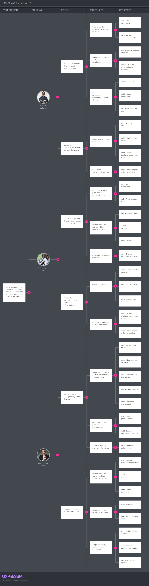
</p>

<hr>

## Capítulo IV: Product Design  
### 4.1. Style Guidelines
Esta sección establece un conjunto de directrices visuales y de interacción coherentes que funcionarán como fuente central de referencia para el equipo de diseño, desarrollo y comunicación de TravelMatch.
El objetivo es garantizar una presentación unificada, profesional y alineada con la esencia de la marca: conectar a turistas con experiencias auténticas, de manera simple y confiable.

#### 4.1.1. General Style Guidelines 


- _Branding:_    
    - La identidad visual de TravelMatch es moderna, cercana y confiable. El logotipo incorpora dos figuras humanas estilizadas unidas en un gesto de conexión, lo que simboliza el espíritu colaborativo y humano de la plataforma.
    - Uso del logotipo: El logotipo debe usarse preferentemente sobre fondos claros (beige, blanco o pastel neutro). En fondos oscuros, se permite una versión monocromática blanca o en azul marino (#1C1F2B).
    - No se permite:
        - Rotar el logotipo.
        - Aplicar sombras, contornos o degradados.
        - Cambiar la tipografía original de la palabra TravelMatch.

<p align="center">
    
</p>

- _Typography:_
    - La tipografía utilizada en el logotipo es una fuente sans-serif geométrica, amigable y legible. Para mantener coherencia, se adoptará un sistema tipográfico similar en toda la aplicación.

    - Fuente primaria: Nunito Sans
        - Uso: Títulos, botones, navegación.
        - Estilos permitidos: Regular, SemiBold, Bold.

    - Fuente secundaria: Inter
        - Uso: Cuerpos de texto largos, formularios.

    - Tamaños recomendados:
        - Título principal (H1): 32px / 700
        - Subtítulo (H2): 24px / 600
        - Texto normal: 16px / 400
        - Nota o ayuda: 12px / 400

<div align="center">    

| Nombre de fuente | Tipografia |
|:----------------:|:----------:|
| Nunito Sans | 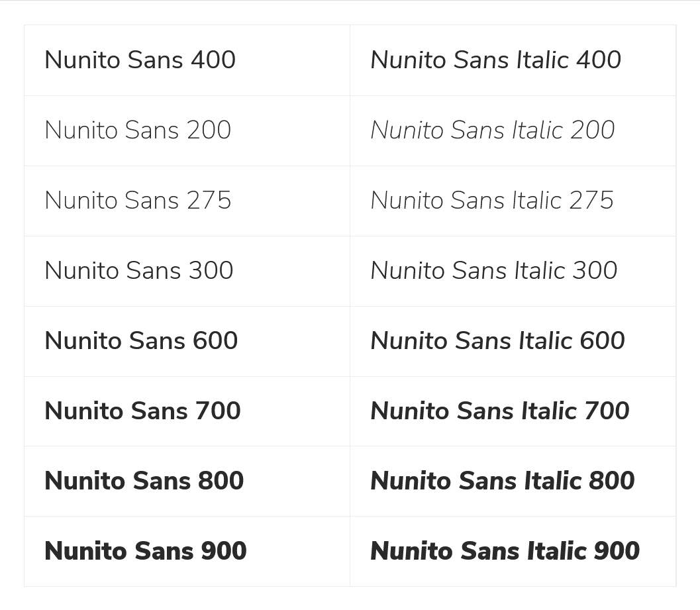 |
| Inter | 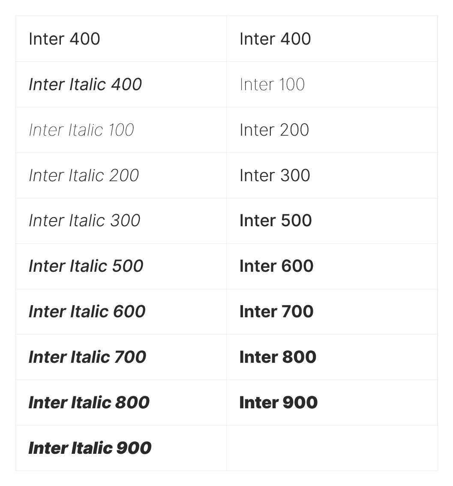 |  
    
</div>      
              
- _Colors:_
    - La paleta de TravelMatch se basa en contrastes suaves y un color protagonista: azul marino profundo, que transmite confianza y estabilidad. Se acompaña de colores neutros y un acento cálido para llamados a la acción

<div align="center">    

| Color | Hex | Uso Principal | 
|:-----:|:---:|:-------------:|
|Azul Marino| #1C1F2B | Texto principal, logotipo, botones|
|Beige Claro| #F5F0E6 | Fondo base|
|Gris Suave| #B3B3B3 | Bordes, textos secundarios|
|Azul Claro| #3A71C1 | Enlaces, botones secundarios|
|Amarillo Arena| #FFD479| Llamado a la acción / iconos |
|Blanco| #FFFFFF|Fondos, tarjetas, formularios|

</div>

<p align="center">
    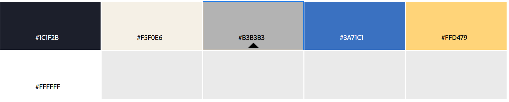
</p>

- _Spacing:_
    - La coherencia en el espaciado es clave para una interfaz limpia y clara.
        - Espaciado entre secciones principales: 32px
        - Margen interno de botones y campos: 12px vertical / 20px horizontal
        - Separación entre elementos repetitivos (cards, ítems): 16px
        - Padding general de contenedores: 24px

- _Tono de comunicación y lenguaje:_
    - El tono de TravelMatch es cercano, entusiasta y profesional.

<div align="center">    

| Estilo de redacción | Tono predominante |
|---------------------|-------------------|
| 1. Amigable y claro <br> 2. Sin tecnicismos innecesarios <br> 3. Verbos en voz activa <br> 4. Enfocado en beneficios (“Descubre experiencias únicas”, “Reserva en segundos”)| 1. Formal-casual: Respetuoso, pero no rígido. <br> 2. Entusiasta: Inspirador, motivador, acogedor. <br> 3. Directo: Frases cortas y llamadas a la acción claras. |

</div>

#### 4.1.2. Web Style Guidelines

- _Responsive Design Standards:_  
    TravelMatch está diseñado como una aplicación web mobile-first, adaptándose fluidamente a diferentes dispositivos:

    - **Mobile (360px - 768px):**  
        - Navegación tipo hamburguesa.  
        - Cards apiladas en columna.  
        - Botones grandes y legibles.  

    - **Tablet (769px - 1024px):**  
        - Layout en 2 columnas.  
        - Menú lateral colapsable.  

    - **Desktop (1025px en adelante):**  
        - Menú principal visible.  
        - Layout de 3 columnas donde sea posible.  

    Todos los componentes deben utilizar **flexbox/grid** con puntos de quiebre en 768px y 1024px.

- _Interactivity:_  
    - **Botones:**  
        - Bordes redondeados (border-radius: 12px).  
        - Hover: cambio de fondo o sombra suave (box-shadow: 0px 2px 8px rgba(0, 0, 0, 0.1)).  
        - Feedback claro al clic (cambio de color, animación sutil).  

    - **Transiciones y animaciones:**  
        - Duración: 200–300ms.  
        - Usar ease-in-out.  
        - Aplicables en sliders, modales, tooltips y feedback de formularios.

- _Accessibility:_  
    - Contrastes de texto cumplen con **WCAG AA** como mínimo.  
    - Todo ícono debe tener alternativa textual (aria-label o alt).  
    - Navegación compatible con teclado (Tab, Enter, Esc).  
    - Uso de role, aria-expanded, aria-hidden en componentes dinámicos.  
    - Fuente mínima: 16px.

- _UI Consistency:_  
    - Uso de un sistema de componentes reutilizables: botones, tarjetas, inputs, modales.  
    - Evitar cambios de estilo arbitrarios entre páginas.  
    - Todos los formularios deben compartir un estilo común:  
        - Etiqueta arriba, campo debajo, mensaje de error abajo.  
        - Validaciones claras y mensajes amigables.


### 4.2. Information Architecture
La arquitectura de la información de TravelMatch está diseñada para asegurar que tanto visitantes nuevos como usuarios recurrentes puedan encontrar, descubrir e interactuar con el contenido de manera natural e intuitiva. Esta estructura se adapta a las necesidades específicas de cada entorno (Landing Page, Aplicación Web y Aplicación Móvil) manteniendo consistencia visual, semántica y funcional.

Los sistemas de organización, etiquetado, navegación y búsqueda han sido definidos considerando la diversidad de usuarios, el volumen de información creciente y la importancia de una experiencia centrada en el usuario.

#### 4.2.1. Organization Systems
La estructura de organización de contenido en TravelMatch combina distintas estrategias según el tipo de información presentada y la etapa del recorrido del usuario:

- _Visual Hierarchy (Jerarquía Visual)_

    Se utilizará ampliamente en todas las interfaces (Landing Page, Home de la App, Detalles de experiencia) para facilitar la comprensión inmediata del contenido. La disposición jerárquica prioriza los elementos según su importancia relativa, estableciendo tamaños, colores y posiciones diferenciadas para:    

    - Títulos y encabezados principales.
    - Imágenes destacadas (experiencias recomendadas, destinos top).
    - Llamados a la acción (botones de "Reservar", "Explorar", "Ver más").

    Esto permitirá que el usuario escanee el contenido rápidamente y entienda qué acciones tomar en cada momento.

- _Sequential Organization (Organización Secuencial)_

    Se aplicará principalmente en los flujos de interacción del usuario, especialmente en procesos donde se requiere una acción paso a paso, como:

    - Registro de usuario y onboarding personalizado.
    - Filtros para construir recomendaciones de experiencia.
    - Proceso de reserva y confirmación.
    - Creación de perfil o preferencias de viaje.

    Cada uno de estos pasos se presentará de forma clara y continua, indicando el progreso del usuario y minimizando fricciones en la interacción.

- _Matricial (Matrix Organization)_

    Este sistema será utilizado en secciones donde el usuario debe explorar múltiples opciones simultáneamente, sin un orden específico, como:

    - Búsqueda de experiencias por filtros combinables.
    - Exploración de destinos por tipo de actividad (gastronomía, aventura, cultura, etc.).
    - Vista de resultados personalizados o tendencias.

    Los usuarios podrán elegir entre distintos atributos (ubicación, duración, tipo de experiencia, nivel de actividad, etc.) y la interfaz responderá dinámicamente.

- _Categorización de Contenido_

    Para optimizar la navegación y la personalización de la experiencia del usuario, TravelMatch adopta una categorización estratégica que responde tanto a las expectativas de los turistas como a las necesidades operativas de la plataforma. Los esquemas de categorización se aplicarán según el contexto de uso y el tipo de información, permitiendo al usuario filtrar, explorar y decidir con facilidad.

    - **Por tópicos:** Las experiencias se agruparán por categorías temáticas (Ej. “Aventura al aire libre”, “Gastronomía local”, “Arte y cultura”).
    - **Por audiencia:** Algunas secciones estarán personalizadas para distintos perfiles de usuario (parejas, viajeros solitarios, familias, etc.).
    - **Cronológico:** Se utilizará en listas de reservas pasadas y próximas, así como en contenido destacado por temporada o eventos locales.
    - **Alfabético:** Aplicable para listados largos como ciudades, destinos o idiomas disponibles en preferencias.

#### 4.2.2. Labeling Systems
En TravelMatch, el sistema de etiquetado ha sido diseñado para maximizar la claridad y minimizar la carga cognitiva del usuario. Todas las etiquetas empleadas en la plataforma —tanto en la navegación como en el contenido— están orientadas a la simplicidad, consistencia semántica y a un lenguaje cercano, inclusivo y fácil de comprender, sin sacrificar la precisión funcional.

- _Principios clave del sistema de etiquetado:_  
    - **Claridad ante todo:**  
        Las etiquetas evitarán tecnicismos o ambigüedades. Se utilizarán palabras comunes para que cualquier usuario —sin importar su nivel de experiencia digital o cultural— pueda entenderlas.  
    - **Consistencia terminológica:**  
        Un mismo concepto se nombrará de la misma forma en todos los entornos (web, móvil, comunicaciones, emails transaccionales).  
    - **Longitud mínima:**  
        Se privilegiará el uso de etiquetas cortas (1 a 3 palabras), pero descriptivas.  
    - **Prioridad visual:**  
        Se jerarquizará tipográficamente cada tipo de etiqueta, destacando acciones o categorías principales con estilos tipográficos definidos en la guía de estilo.

- _Etiquetas principales por área:_  
    - **Navegación global:**  
        - Explorar  
        - Mi Perfil  
        - Favoritos  
        - Recomendaciones  
        - Mis Reservas  
        - Ayuda  

    - **Landing Page:**  
        - Encuentra tu próxima aventura  
        - ¿Cómo funciona TravelMatch?  
        - Experiencias destacadas  
        - Únete como agencia  
        - Testimonios  

    - **Filtrado y búsqueda:**  
        - Tipo de experiencia (Ej. “Cultural”, “Aventura”, “Relax”)  
        - Duración (Ej. “Medio día”, “1 día completo”, “Fin de semana”)  
        - Nivel de actividad (Ej. “Baja”, “Moderada”, “Alta”)  
        - Destino  
        - Precio  

    - **Acciones del usuario:**  
        - Reservar ahora  
        - Guardar experiencia  
        - Compartir  
        - Ver más detalles  
        - Editar perfil  
        - Cerrar sesión  

    - **Agencias (vista especial):**  
        - Publicar nueva experiencia  
        - Gestionar reservas  
        - Estadísticas  
        - Planes y visibilidad  
        - Mensajes recibidos  

- _Asociaciones entre etiquetas:_  
    - Se utilizarán etiquetas compuestas en ciertos casos para clarificar relaciones entre conceptos, como:  
        - “Experiencia recomendada”  
        - “Destino popular”  
        - “Nuevo mensaje”  
        - “Agencia verificada”  

    - Las etiquetas de acciones estarán siempre acompañadas de íconos representativos para reforzar la asociación visual y acelerar la comprensión.  
    - En formularios y filtros, los campos estarán precedidos por etiquetas que indiquen claramente qué se espera del usuario (Ej. “Selecciona una fecha”, “Elige un destino”).

#### 4.2.3. SEO Tags and Meta Tags
Para TravelMatch, contar con una estructura sólida de SEO y metadatos es esencial para maximizar la visibilidad orgánica en motores de búsqueda y mejorar la experiencia al compartir enlaces en redes sociales y otras plataformas. A continuación, se definen los valores clave que serán implementados tanto en la Landing Page como en la Web Application, alineados con nuestra propuesta de valor y el tono de la marca.

- _Landing Page:_  
    - **Title:**  
        TravelMatch | Conecta con tu próxima experiencia de viaje personalizada  
    - **Meta Description:**  
        Descubre viajes únicos con agencias locales verificadas. En TravelMatch conectamos turistas con experiencias a medida, sin complicaciones.  
    - **Meta Keywords:**  
        viajes personalizados, agencias locales, experiencias de viaje, turismo inteligente, tours recomendados, actividades, destinos  
    - **Meta Author:**  
        TravelMatch Team  
    - **Open Graph Tags (para redes sociales):**  
        ```html
        <meta property="og:title" content="TravelMatch | Conecta con tu próxima experiencia de viaje personalizada" />
        <meta property="og:description" content="Descubre viajes únicos con agencias locales verificadas. En TravelMatch conectamos turistas con experiencias a medida, sin complicaciones." />
        <meta property="og:image" content="https://travelmatch.app/assets/social-preview.jpg" />
        <meta property="og:url" content="https://travelmatch.app" />
        <meta property="og:type" content="website" />
        ```
    - **Twitter Cards (formato enriquecido):**  
        ```html
        <meta name="twitter:card" content="summary_large_image" />
        <meta name="twitter:title" content="TravelMatch | Conecta con tu próxima experiencia de viaje personalizada" />
        <meta name="twitter:description" content="Descubre viajes únicos con agencias locales verificadas. En TravelMatch conectamos turistas con experiencias a medida, sin complicaciones." />
        <meta name="twitter:image" content="https://travelmatch.app/assets/social-preview.jpg" />
        ```

- _Web Application (post-login):_  
    - **Title:**  
        TravelMatch | Tu espacio de viajes personalizados  
    - **Meta Description:**  
        Gestiona tus experiencias, descubre nuevas aventuras y mantente en contacto con agencias confiables. Todo en un solo lugar.  
    - **Meta Keywords:**  
        perfil viajero, gestionar reservas, recomendaciones de viaje, experiencias favoritas, viajes a medida  
    - **Meta Author:**  
        TravelMatch Platform  
    - **Canonical URL:**  
        Las páginas clave de la app tendrán URLs canónicas bien definidas para evitar problemas de contenido duplicado, especialmente en vistas filtradas.

- _Consideraciones adicionales:_  
    - Se implementarán etiquetas dinámicas en la web app para experiencias individuales y perfiles de agencia, lo cual permitirá SEO personalizado por contenido.  
    - Se aplicarán **alt attributes** descriptivos y útiles en todas las imágenes, especialmente aquellas que se vinculen con experiencias o destinos.  
    - Se cuidará el rendimiento de carga (**Core Web Vitals**) como parte del SEO técnico, priorizando tiempos rápidos de respuesta en dispositivos móviles. 

#### 4.2.4. Searching Systems
El sistema de búsqueda de TravelMatch está diseñado para facilitar a los usuarios la localización rápida y eficiente de experiencias turísticas relevantes. El objetivo es minimizar la frustración del usuario y maximizar la descubribilidad del contenido, aún ante grandes volúmenes de información y diversidad de ofertas.

- _Turistas: Búsqueda de experiencias:_  
    Los turistas acceden a un motor de búsqueda central ubicado en la vista principal de la plataforma. Este sistema incluirá:  
    - **Barra de búsqueda por palabra clave:**  
        - Autocompletado inteligente para sugerir términos relevantes.  
    - **Filtros dinámicos combinables:**  
        - Tipo de actividad (aventura, cultural, gastronómica, relajación, etc.).  
        - Ubicación geográfica (país, ciudad, región).  
        - Precio (rango mínimo y máximo).  
        - Duración estimada de la experiencia.  
        - Idioma del guía.  
        - Fecha de disponibilidad.  
        - Valoración promedio.  
    - **Sistema de etiquetado (tags):**  
        Los resultados podrán filtrarse también por etiquetas asignadas por agencias o derivadas del comportamiento de otros usuarios (ej. “para familias”, “eco-friendly”, “pet-friendly”).  

    Los resultados serán presentados en formato de tarjetas visuales, que incluirán:  
    - Imagen destacada.  
    - Nombre de la experiencia.  
    - Ubicación.  
    - Duración.  
    - Precio base.  
    - Valoración promedio.  

    Además, se ofrecerán opciones para:  
    - Ordenar los resultados por relevancia, precio, popularidad o evaluación.  
    - Guardar filtros personalizados para futuras búsquedas.  

- _Agencias: Búsqueda en publicaciones y reservas:_  
    Las agencias contarán con una funcionalidad de búsqueda interna dentro del panel de administración:  
    - **Búsqueda por nombre de experiencia publicada.**  
    - **Filtros por estado:**  
        - Activa, inactiva, pendiente de revisión.  
    - **Filtro por número de reservas recibidas.**  
    - **Búsqueda en histórico de reservas:**  
        - Por fecha, turista, experiencia o estado de pago.  

    Este sistema permitirá una gestión ágil de contenido y facilitará la toma de decisiones basada en información organizada y accesible.

- _Resultados adaptables y responsivos:_  
    Todos los resultados de búsqueda están diseñados para ser responsive y adaptables a dispositivos móviles, manteniendo legibilidad, interactividad y consistencia visual. El sistema incluye:  
    - Vista en cuadrícula o lista, según preferencia del usuario.  
    - Indicadores visuales para destacar promociones o nuevos lanzamientos.  

- _Mejoras futuras:_  
    Está prevista la integración de un sistema de búsqueda semántica e inteligencia artificial, que permitirá sugerencias personalizadas basadas en:  
    - Historial de navegación.  
    - Comportamiento previo.  
    - Perfiles similares.  

    Esto enriquecerá la experiencia del usuario y aumentará la conversión de búsquedas en reservas concretadas.  

#### 4.2.5.  Navigation Systems
La navegación en TravelMatch está diseñada para ser intuitiva, fluida y centrada en la experiencia del usuario, tanto en la Landing Page como en la Web Application. El objetivo es que cada tipo de usuario —turista o agencia— pueda alcanzar sus metas con el menor número de clics y sin fricción.

- _Landing Page:_  
    La navegación principal está orientada a captar y guiar nuevos visitantes. Se estructura mediante una barra superior fija con los siguientes elementos:  
    - **Logo**  
    - **Cómo Funciona**  
    - **Explorar**
    - **Para Agencias**  
    - **Nosotros**
    - **Iniciar sesión / Registrarse** (con botón destacado)  

    Se emplea una navegación jerárquica horizontal con anclas que guían a secciones específicas del mismo sitio (scroll suave), y una estructura de **one-page design** para mantener la continuidad narrativa.  

    Además, en la sección inferior se encuentra un footer informativo, con accesos a:  
    - **Política de privacidad**  
    - **Términos y condiciones**  
    - **Contacto**  
    - **Redes sociales**  

- _Web Application (Post-login):_  
    Una vez autenticado, el usuario accede a un entorno altamente funcional, que prioriza la usabilidad y eficiencia en la navegación.  

    - **Para Turistas:**  
        Barra lateral con:  
        - 🏠 Inicio  
        - 🔍 Buscar experiencias  
        - ❤️ Mis favoritos  
        - 🧾 Mis reservas  
        - 👤 Perfil  
        - 🚪 Cerrar sesión  

    - **Para Agencias:**  
        Barra lateral con:  
        - 🏠 Panel de control  
        - ✍️ Publicar experiencia  
        - 📈 Mis publicaciones  
        - 📥 Reservas recibidas  
        - 👤 Perfil de agencia  
        - 🚪 Cerrar sesión  

    Se utilizará una navegación persistente y contextual:  
    - **Breadcrumbs:** Se mostrarán en vistas con múltiples niveles para reforzar el contexto.  
    - **Accesos rápidos:** Las acciones importantes estarán disponibles a través de FAB (Floating Action Button) o menús flotantes en dispositivos móviles.  
    - **Diseño responsive:** La navegación lateral se adaptará a un menú hamburguesa en dispositivos móviles, sin perder funcionalidad.  

- _Comportamientos adicionales:_  
    - **Estado activo:** El ítem de navegación actual se resaltará para reforzar el contexto del usuario.  
    - **Transiciones suaves:** Se aplicarán animaciones ligeras en los cambios de vista, favoreciendo la comprensión del flujo.  
    - **Redirección inteligente:** Después del login, el usuario será redirigido al dashboard o sección de interés dependiendo de su rol (turista o agencia).  


### 4.3. Landing Page UI Design
El Landing Page de TravelMatch representa la materialización visual de las decisiones tomadas en torno a la arquitectura de información, la identidad de marca y las guías de estilo establecidas previamente.

El diseño del Landing Page ha sido pensado para captar la atención de los visitantes desde el primer momento, comunicar de forma clara el valor diferencial de la plataforma, y facilitar una navegación intuitiva y responsiva hacia los distintos componentes clave del sitio.

Este diseño refleja:

- La jerarquía visual establecida en los Organization Systems, priorizando elementos como el mensaje principal, el buscador de experiencias, y los llamados a la acción (CTAs).

- La coherencia con el Design System de TravelMatch, respetando la paleta cromática corporativa inspirada en su logotipo, el uso tipográfico moderno y legible, y los principios de accesibilidad e inclusión.

- Una arquitectura de información que orienta al usuario de manera fluida, reduciendo la carga cognitiva y facilitando la conversión desde la primera interacción.

- La incorporación de patrones reconocibles en UI/UX para generar confianza, claridad y familiaridad con la experiencia.

#### 4.3.1. Landing Page Wireframe
Los wireframes del Landing Page de TravelMatch definen la estructura base de la interfaz, enfocándose en la distribución de contenido y elementos interactivos antes de aplicar el diseño visual definitivo. Se han diseñado versiones específicas para navegadores de escritorio y navegadores móviles, con el objetivo de garantizar una experiencia consistente, accesible y optimizada para cada tipo de dispositivo.
Principios Aplicados

- Jerarquía visual clara: Se priorizan los elementos esenciales como el hero section, buscador de experiencias, CTA de registro, y testimonios. Esto facilita la exploración progresiva del contenido por parte del usuario.

- Diseño inclusivo: Las estructuras propuestas contemplan contrastes adecuados, fuentes legibles y navegación intuitiva tanto por clic como por scroll.

- Consistencia estructural: Se respeta la arquitectura de información definida, agrupando secciones por tópicos (e.g., ¿cómo funciona?, beneficios para agencias, beneficios para turistas, etc.).

- Adaptabilidad: Los wireframes aseguran una transición fluida entre vistas de escritorio y móviles mediante una disposición responsiva, donde los elementos se reorganizan verticalmente sin perder prioridad visual.

**Desktop:**

<p align="center">
    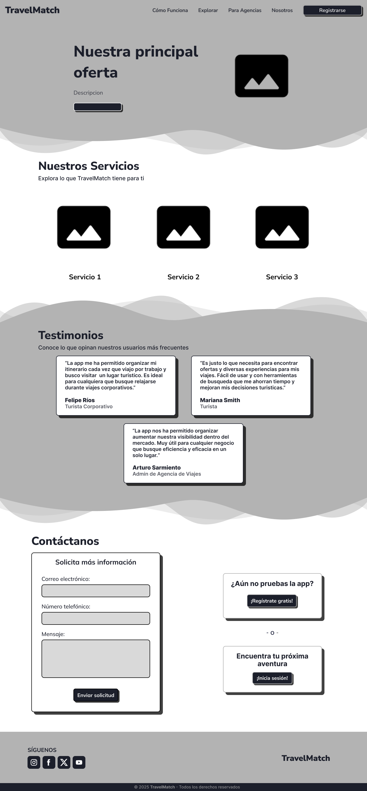
</p>

**Mobile:**

<p align="center">
    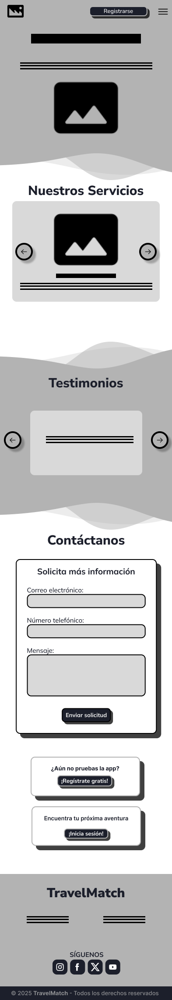
</p>

#### 4.3.2. Landing Page Mock-up

Los mock-ups de la Landing Page de TravelMatch representan la traducción visual completa del wireframe, incorporando la identidad visual, la paleta cromática, la tipografía, iconografía y todos los elementos del Design System previamente definido. Estos mock-ups ofrecen una vista precisa de cómo lucirá el producto final en navegadores web de escritorio y dispositivos móviles.

**Desktop:**

<p align="center">
    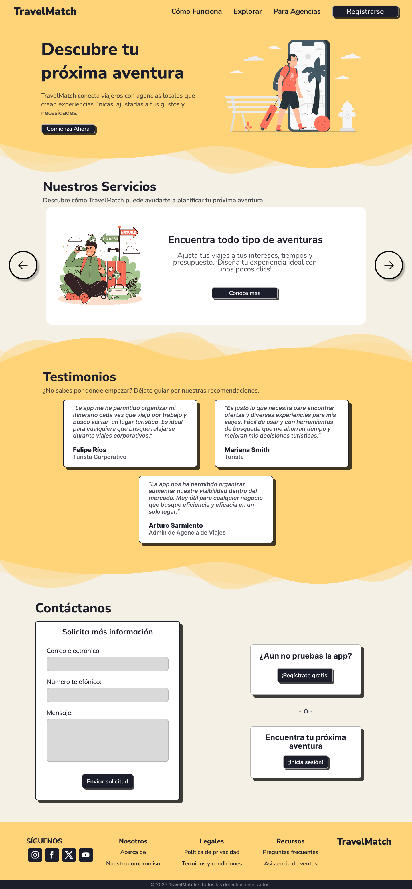
</p>

**Mobile:**

<p align="center">
    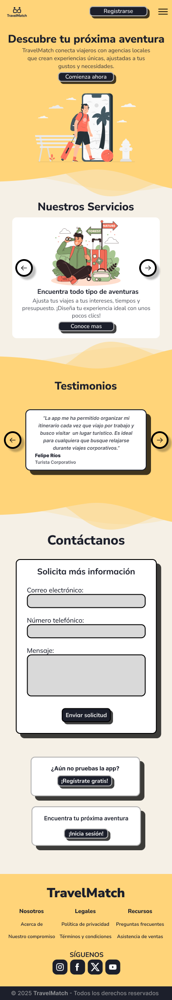
</p>

### 4.6. Web Applications UX/UI Design
#### 4.6.1. Web Applications Wireframes

<p align="center">
    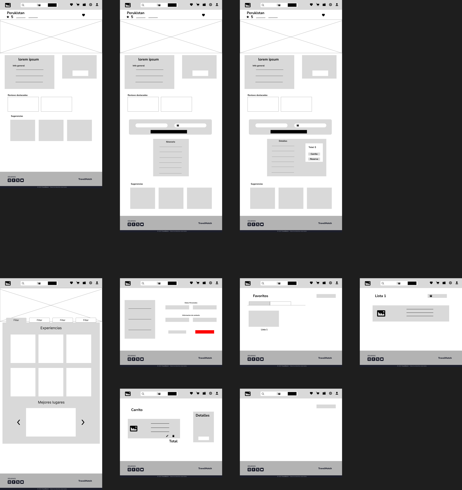
</p>

#### 4.6.2. Web Applications Wireflow Diagrams

<p align="center">
    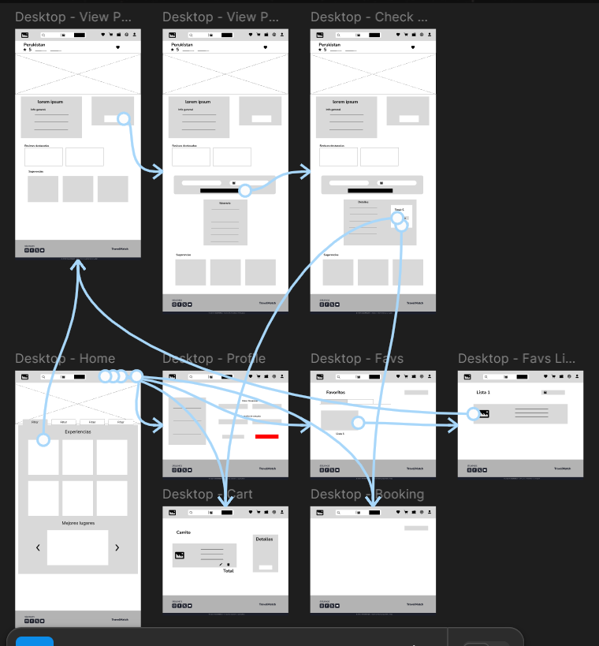
</p>

#### 4.6.3. Web Applications Mock-ups

<p align="center">
    
</p>

#### 4.6.4. Web Applications User Flow Diagrams

#### User Goal 1: Registro, inicio de sesión y acceso al aplicativo
En esta meta, ambos tipos de usuarios (turista o agencia) deberán registrarse seleccionando su rol correspondiente, completando el formulario con su información personal o corporativa y, en el caso de las agencias, verificando su perfil para obtener acceso a las herramientas de gestión y visibilidad.


#### User Goal 2: Exploración, filtrado y personalización de experiencias
En esta meta, el turista podrá realizar búsquedas inteligentes utilizando filtros avanzados (ubicación, presupuesto, tipo de actividad, fecha) para encontrar experiencias que se adapten a sus intereses específicos, logrando visualizar fotos, videos y descripciones detalladas antes de decidir.


#### User Goal 3: Gestión del proceso de reserva y confirmación de pago
En esta meta, el turista podrá gestionar su carrito de compras, comparar múltiples tours y realizar el proceso de reserva mediante pagos seguros.


#### User Goal 4: Gestión de catálogo y disponibilidad para agencias
En esta meta, el administrador de la agencia podrá publicar nuevas experiencias, editar los detalles de las mismas y actualizar su calendario de disponibilidad en tiempo real para evitar sobre-reservas y mantener su oferta competitiva.


#### User Goal 5:Seguimiento, analítica y feedback post-experiencia
En esta meta, los usuarios podrán interactuar tras la actividad: los turistas publicando reseñas y calificaciones para generar confianza, mientras que las agencias podrán acceder a paneles de analítica para medir su rendimiento y enviar encuestas de satisfacción para mejorar su servicio.


Enlace al Figma de desarrollo de Web Application: https://www.figma.com/design/GYNFGzIxOsYoaH4UDZpRne/TravelMatch---Frontend?node-id=2039-83&t=MJXW7lJoEYDmKuW2-1

### 4.7. Web Applications Prototyping

- Usuario encuentra un paquete turistico y accede a la operacion de compra

    - El usuario inicia en la vista home de la pagina principal:
        <p align="center">
            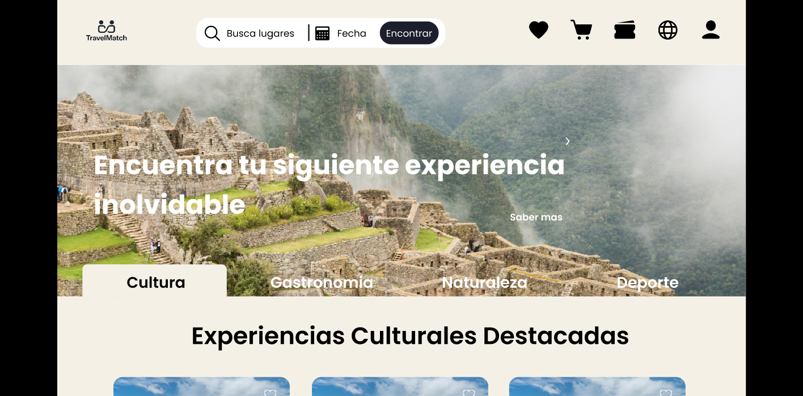
        </p>
    
    - El usuario desciende hasta la zona de experiencias filtradas por categoria. Cuando se interesa en una experiencia, hace clic sobre una de ellas para revisar mas detalles:
        <p align="center">
            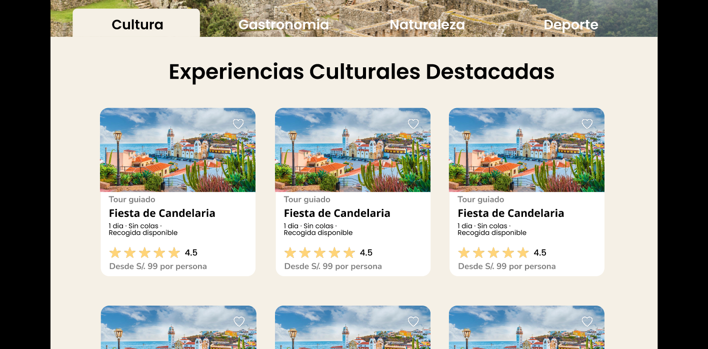
        </p>

    - El usuario accede a la vista detalla en donde se muestra informacion detallada sobre la experiencia:
        <p align="center">
            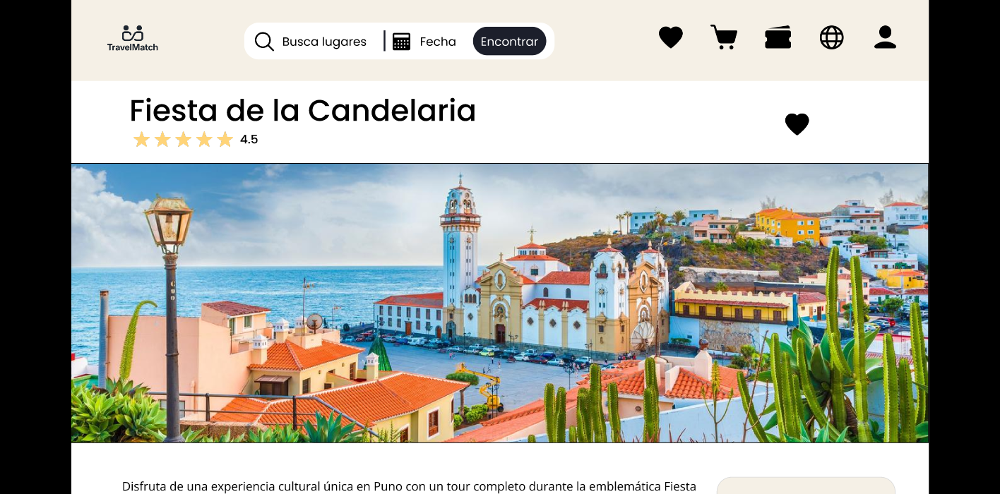
        </p>

    - El usuario visualiza una seccion con el precio y el boton "Revisar disponibilidad" que redirige a una seccion para que filtre resultados de paquetes turisticos:
        <p align="center">
            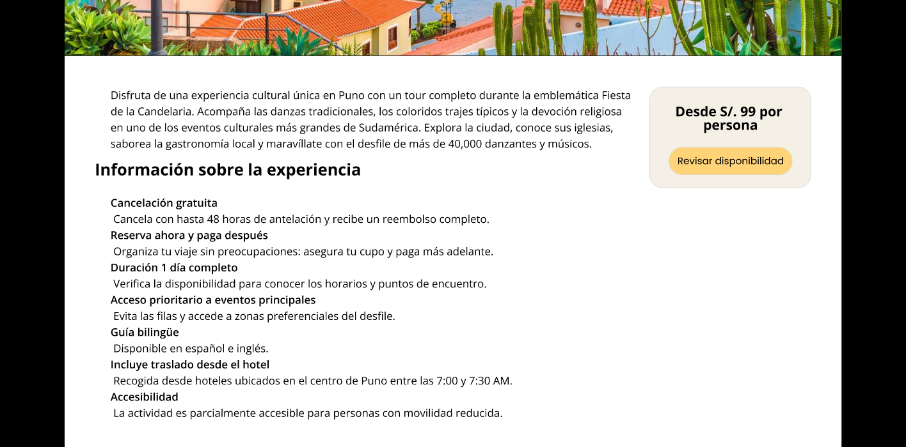
        </p>

    - El usuario ingresa valores para ambos campos y presiona el boton revisar disponibilidad:
        <p align="center">
            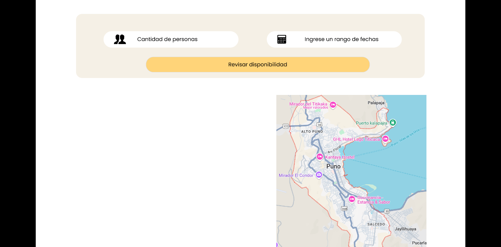
        </p>

    - Se muestran los resultados obtenidos y se brinda la opcion de agregar el paquete a un carrito de compras:
        <p align="center">
            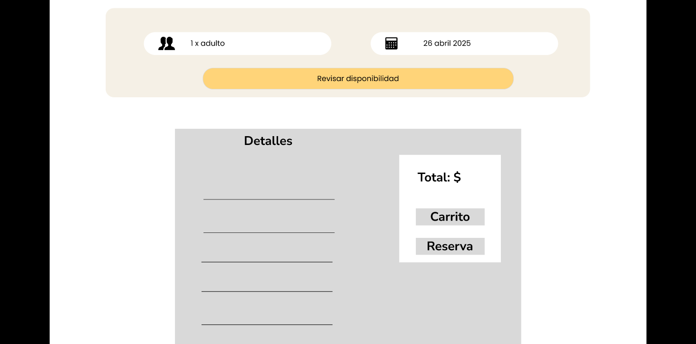
        </p>

    - El usuario accede a la vista del carrito de compras donde decide que hara con el paquete elegido:
        <p align="center">
            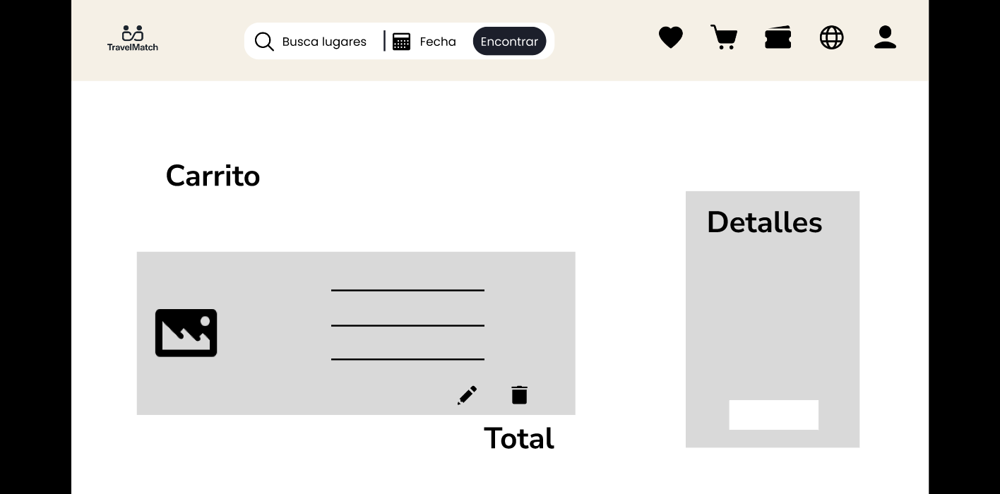
        </p>


    Enlace a la prueba de prototipo: [upc-pre-202510-1asi0729-4328-Pandora-prototype-navigation-sprint-1](https://youtu.be/a66X-oEHVRI)

### 4.8. Domain-Driven Software Architecture
#### 4.8.1. Software Architecture Context Diagram
<p align="center">
    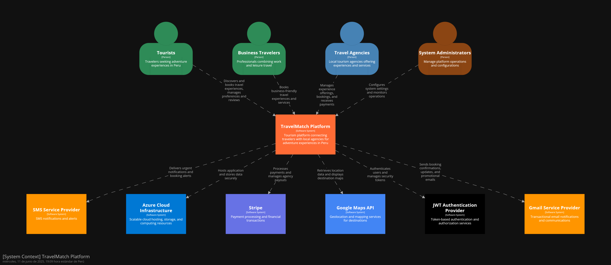
</p>

#### 4.8.2. Software Architecture Container Diagrams

<p align="center">
 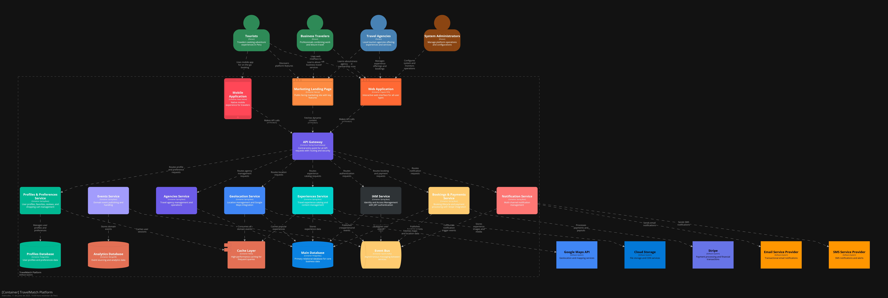
</p>

#### 4.8.3. Software Architecture Components Diagrams

- Bounded Context IAM

<p align="center">
    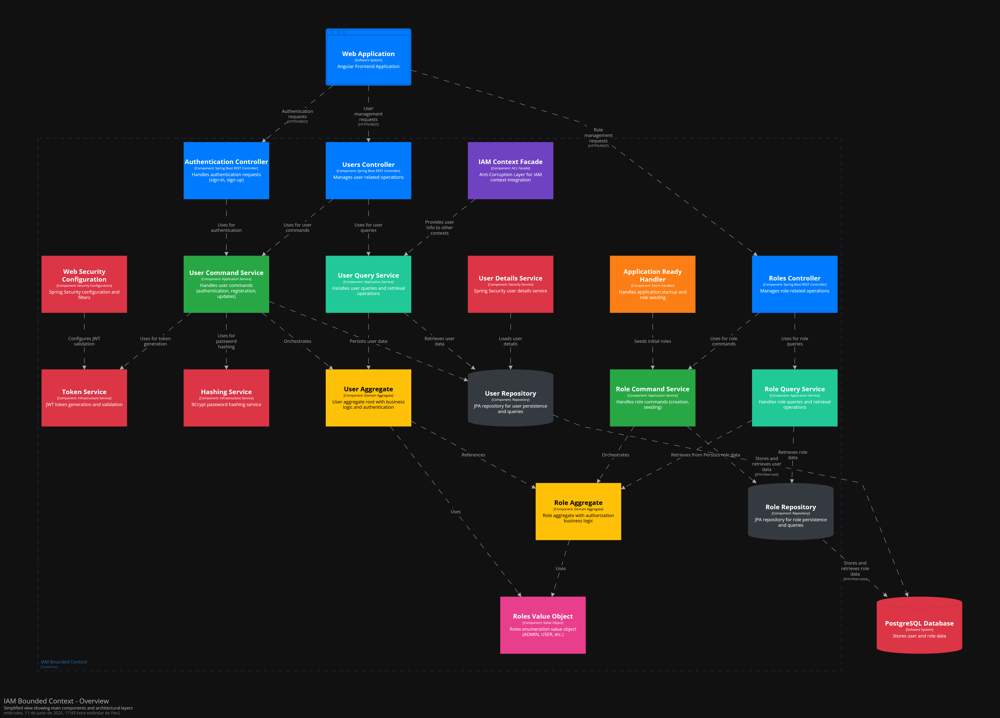
</p>

- Bounded Context Profiles
<p align="center">
    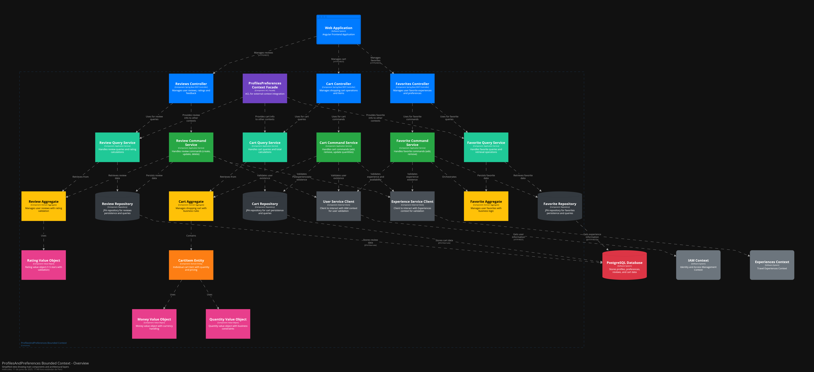
</p>

- Bounded Context Agencies
<p align="center">
    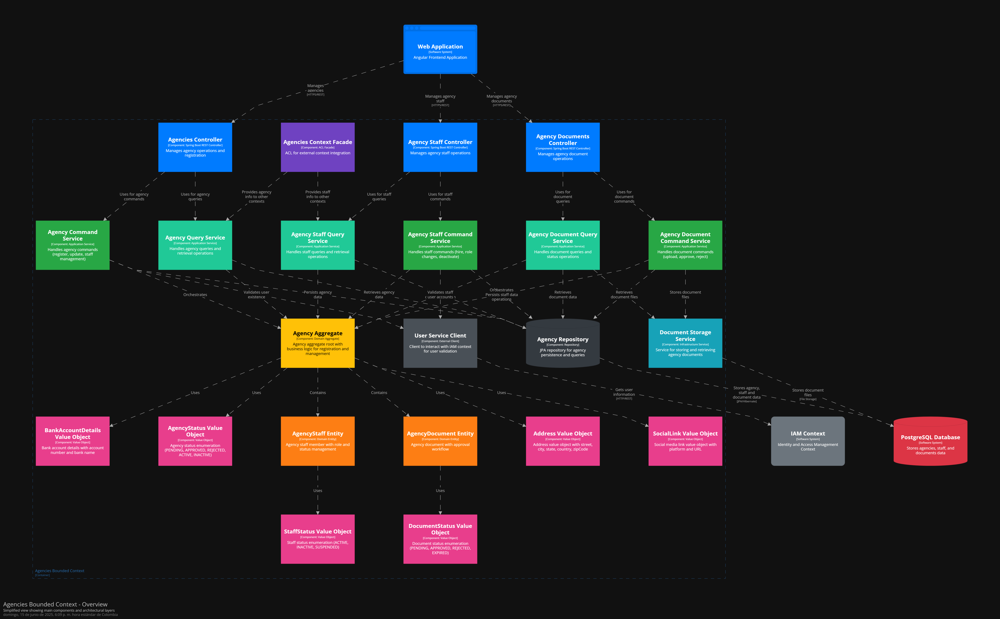
</p>

- Bounded Context Experiences
<p align="center">
    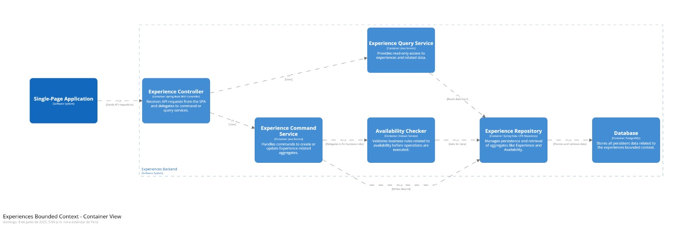
</p>

- Bounded Context Bookings
<p align="center">
    
</p>

- Bounded Context Events
<p align="center">
    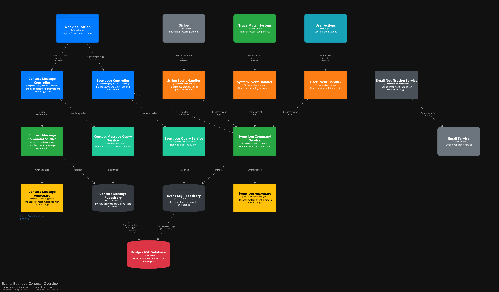
</p>

- Bounded Context Geolocalization
<p align="center">
    
</p>

### 4.9. Software Object-Oriented Design
La orientación a objetos será fundamental en nuestro proyecto. Organizamos el software siguiendo nuestras reglas de negocio, lo que nos permite desarrollar componentes claros para su implementación en un sistema real, además de facilitar su adaptación y mantenimiento.

#### 4.9.1. Class Diagrams
<p align="center">
    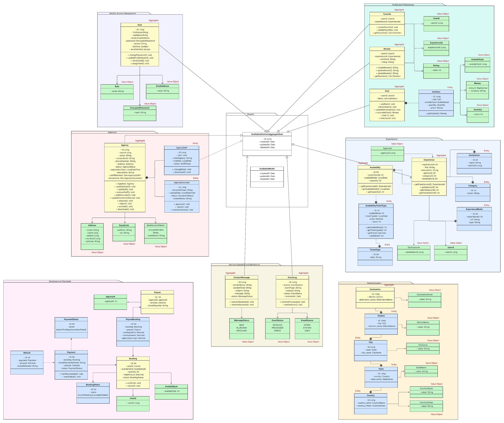
</p>

Enlace del diagrama de clases elaborado en Lucidchart: https://lucid.app/lucidchart/5c82ad83-e062-47f4-8289-d3979877fb1e/edit?invitationId=inv_38e8006a-95da-4b3f-86b2-2d30cfb7cd0b


#### 4.9.2. Class Dictionary


| **Clase** | **Nombre de atributo** | **Descripción** | **Tipo de dato**
|:---------:|:----------------------:|:---------------:|:----------------:|
| Usuario | id | Identificador único | String |
| Usuario | nombre | Nombre de usuario | String |
| Usuario | email | Correo electrónicio del usuario | String |
| Usuario | contrasenia | Contraseña encriptada | String |
| Usuario | telefono | Contacto opcional | String |
| Turista | nacionalidad | País de origen | String |
| Turista | pasaporte | Número de documento | String |
| ViajeroCorporativo | empresa | Nombre de la compañía | String |
| ViajeroCorporativo | ruc | Identificador fiscal | String |
| AgenciaTurismo | ruc | Identificador fiscal | String |
| AgenciaTurismo | direccionLegal | Domicilio registrado | String |
| AgenciaTurismo | licenciaTuristica | Número de autorización | String |
| Reserva | fechaCreacion | Fecha de registro | Date |
| Reserva | fechaServicio | Fecha agendada | Date |
| Reserva | estado | El estado de la reserva (Pendiente/Confirmada/Cancelada) | ENUM |
| Reserva | montoTotal | Precio final | Float |
| Pago | metodo | El método de pago usado en la reserva (Tarjeta/Transferencia/Efectivo) | ENUM |
| Pago | monto | Valor pagado | Float |
| Pago | fecha | Fecha de realización del pago | Date |
| Pago | estado | Estado del pago (Pendiente/Confirmado/Denegado) | ENUM |
| Disponibilidad | fechaInicio | Fecha del inicio del rango disponible | Date |
| Disponibilidad | fechaFin | Fecha del fin del rango disponible | Date |
| Disponibilidad | cuposDisponibles | Cantidad restante de cupos | Int |
| ServicioTuristico | nombre | Título del servicio | String |
| ServicioTuristico | descripcion | Descripción concisa del servicio | String |
| ServicioTuristico | precioBase | Precio del servicio | Float |
| Ubicacion | direccion | Ubicación exacta | String |
| Ubicacion | coordenadas | Latitud/Longitud | String |
| Notificacion | fecha | Fecha de generación de la notificación | Date |
| Notificacion | contenido | Texto personalizado | String |
| Notificacion | canal | Medio en el que se envían las notificaciones (Email/SMS) | ENUM |
| Notificacion | estado | Estado de la notificación (Enviada, Pendiente, Fallida) | ENUM |
| PlantillaNotificacion | asunto | Línea de asunto | String |
| PlantillaNotificacion | cuerpo | Texto base con placeholders | String |
| PlantillaNotificacion | tipo | Tipo de notificación enviada (Mantenimiento, Noticias) | ENUM |


### 4.10. Database Design

El diseño de base de datos es fundamental para estructurar y almacenar todos los datos a utilizar en el proyecto. Su propósito principal es el de organizar los datos de forma lógica y cohesiva, permitiendo el recuperar, modificar o borrar según las acciones de los usuarios.


#### 4.10.1. Relational/Non-Relational Database Diagram

<p align="center">
    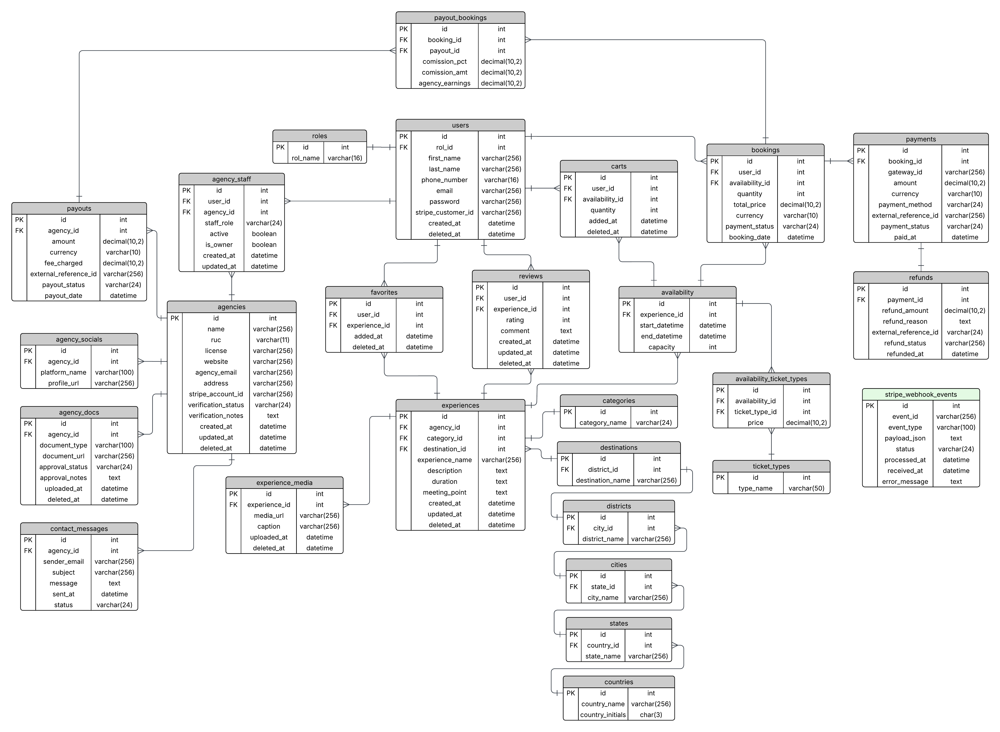
</p>

Enlace del diagrama elaborado en Lucidchart: 
https://lucid.app/lucidchart/6497903f-9318-4fee-af17-767b96f4ed6d/edit?viewport_loc=-1038%2C173%2C4955%2C1796%2C0_0&invitationId=inv_65a78cce-432f-486d-aaa1-6ab80aae3a48

<hr>

## Capítulo V: Product Implementation 
### 5.1. Software Configuration Management
Para asegurar la consistencia, trazabilidad y calidad del producto digital TravelMatch durante todo su ciclo de vida, el equipo ha definido una estrategia de gestión de configuración de software. Esta estrategia cubre la configuración del entorno de desarrollo, la gestión del código fuente, las convenciones de codificación y la configuración del despliegue de los productos. El enfoque está alineado con buenas prácticas de ingeniería de software y metodologías ágiles.

#### 5.1.1. Software Development Environment Configuration

| Categoría | Herramienta | Propósito | Tipo de acceso/enlace |
|:----:|:----:|:----:|:----:|
| Project Management | Trello | Gestión del backlog y tareas del equipo mediante tableros Scrum. | https://trello.com |
| Requirements Management | UXPressia | Creación y documentación de User Personas y customer journeys. | https://uxpressia.com |
| Product UX/UI Design | Figma | Creación de wireframes y mockups de la interfaz de usuario. | https://figma.com |
| Modelado de Software | Visual Paradigm | Modelado de arquitectura de software: diagramas de contexto, Bounded Contexts, etc. | https://visual-paradigm.com |
| Frontend Development | Visual Studio Code | Editor de código para el desarrollo del Landing Page y Frontend (Angular). | https://code.visualstudio.com |
| Backend Development | IntelliJ IDEA | Entorno de desarrollo para el backend en Java con Spring Boot. | https://www.jetbrains.com/idea/ |
| Version Control | GitHub | Repositorio de control de versiones para todos los productos digitales. | https://github.com |
| Software Documentation | Markdown | Redacción de documentación técnica del proyecto. | Compatible con GitHub / editores de texto |

#### 5.1.2. Source Code Management

El equipo de TravelMatch utiliza Git como sistema de control de versiones y GitHub como plataforma de alojamiento y colaboración en el desarrollo de los distintos productos digitales que conforman la solución. Esta estrategia garantiza un seguimiento efectivo de los cambios realizados en el código fuente, la colaboración entre miembros del equipo, y la trazabilidad de las decisiones tomadas durante el ciclo de desarrollo.


Los repositorios utilizados para el desarrollo de código fuente son los siguientes:

<div align="center">

| Producto Digital | URL del Repositorio | 
|:----------------:|:-------------------:|
| Landing Page | [https://github.com/G2-Aplicaciones-Open-Source/landing-page-v2](https://github.com/G2-Aplicaciones-Open-Source/landing-page-v2) | 
| Web Services (Backend API) | [https://github.com/G2-Aplicaciones-Open-Source/backend-java](https://github.com/G2-Aplicaciones-Open-Source/backend-java)|
| Frontend Web Application | [https://github.com/G2-Aplicaciones-Open-Source/frontend-angular](https://github.com/G2-Aplicaciones-Open-Source/frontend-angular) |

</div>

**Modelos de Ramificación**

El equipo ha optado por utilizar distintos modelos de ramificación según el tipo de repositorio, con el fin de adecuarse a las necesidades específicas de colaboración y control de versiones:

- **Repositorio de Documentación General del Proyecto (docs):**

    Para el repositorio de documentación (README.md y secciones del informe final), se ha adoptado GitHub Flow. Este modelo de trabajo, orientado a la integración continua y simplicidad, ha permitido:

    - Crear ramas individuales por capítulo y responsable.
    - Realizar pull requests para revisión antes de integrar contenido a la rama principal.
    - Discutir mejoras u observaciones mediante comentarios en los commits y PRs.
    - Mantener una integración progresiva, ordenada y sin conflictos.
    - **Convención de nombres de ramas:**  `cap[numero]` (por ejemplo, `cap4`), lo que facilita la identificación de la sección correspondiente.  
    - **Mensajes de commits:**  Se sigue la especificación de **Conventional Commits**, lo que asegura claridad en el historial y facilita la generación automática de changelogs.

- **Repositorios con Código Fuente (Landing Page, Frontend, Backend):**

    Para estos repositorios se implementará GitFlow, un modelo de ramificación más estructurado, el cual permite separar de manera clara las etapas de desarrollo, pruebas, liberación y mantenimiento. La elección de GitFlow responde a que GitHub Flow depende en gran medida de pruebas automatizadas para validar los cambios antes de integrarlos a la rama principal, y como en este curso no se contempla la integración continua ni un pipeline de testing automatizado, GitFlow resulta más adecuado para mantener la estabilidad del código sin depender de estas herramientas externas.

    **La estructura de ramas en GitFlow será:**

    - _Main_: Contiene el código en estado estable y listo para producción.
    - _Develop_: Rama de integración para desarrollo activo.
    - _Feature branches_: Para nuevas funcionalidades.
        - Convención: `feature/nombre-descriptivo`  
        - Ejemplo: `feature/US007-business-profiles`
    - _Release branches_: Para preparar versiones antes de pasar a producción.
        - Convención: `release/X.Y.Z`  
        - Ejemplo: `release/1.0.0`
    - _Hotfix branches_: Para correcciones urgentes.
        - Convención: `hotfix/X.Y.Z`  
        - Ejemplo: `hotfix/1.0.1`        

    **Versionado Semántico (Semantic Versioning)**

    - Se utiliza Semantic Versioning 2.0.0, con el esquema MAJOR.MINOR.PATCH:

        - **MAJOR:** Cambios incompatibles.
        - **MINOR:** Funcionalidades nuevas retrocompatibles.
        - **PATCH:** Correcciones retrocompatibles.

        **Ejemplos de versiones:**  
        `v1.0.0`, `v1.1.0`, `v1.1.1`.
    
    **Convenciones para Commits**

    El equipo sigue el estándar de Conventional Commits para los mensajes de commits, lo que permite claridad en el historial y facilita la generación automática de changelogs:

    `<type>[optional scope]: <description>`

    Tipos comunes:

    - `feat`: Nueva funcionalidad.
    - `fix`: Corrección de errores.
    - `docs`: Cambios en documentación.
    - `style`: Cambios de formato sin impacto funcional.
    - `refactor`: Reestructuración del código.
    - `test`: Relacionados con pruebas.
    - `chore`: Tareas de mantenimiento.

    Ejemplo:
    ```plaintext
    feat(auth): implement login via OAuth
    fix(api): handle null user tokens

#### 5.1.3. Source Code Style Guide & Conventions
El equipo ha adoptado guías de estilo y convenciones de codificación para cada uno de los lenguajes utilizados. Estas convenciones permiten que todos los miembros del equipo desarrollen bajo un estándar común y que el código sea comprensible tanto para desarrolladores actuales como futuros.

**Nomenclatura general:**

- Todos los identificadores, comentarios y documentación del código se escribirán en inglés.
- Se utilizará el sistema de control de calidad en revisiones por pull request para verificar que las convenciones se cumplan antes de fusionar el código a la rama `develop`.

---

**Backend: Java con Spring Boot**

Para el desarrollo de los servicios web de TravelMatch, se utilizará **Java 17** junto con el framework **Spring Boot**. Se adoptan las siguientes convenciones:

- **Guía de estilo base:**  
  [Google Java Style Guide](https://google.github.io/styleguide/javaguide.html)

- **Estructura de paquetes basada en Domain-Driven Design (DDD):**  
  - `com.travelmatch.domain`  
  - `com.travelmatch.application`  
  - `com.travelmatch.infrastructure`  
  - `com.travelmatch.api`  

- **Nomenclatura:**  
  - Clases nombradas en **CamelCase**:  
    Ejemplo: `TravelExperienceService`, `UserProfileRepository`  
  - Métodos y variables en **lowerCamelCase**:  
    Ejemplo: `findAllExperiences()`, `userEmail`  

- **Documentación:**  
  - Uso obligatorio de **Javadoc** para describir métodos y clases públicas.

- **Separación lógica del código:**  
  - Cada capa debe tener responsabilidades claras:  
    - Controladores (`@RestController`)  
    - Servicios (`@Service`)  
    - Repositorios (`@Repository`)  
    - Modelos  

- **Anotaciones de Spring:**  
  - Uso de anotaciones como `@RestController`, `@Service`, `@Repository` para reforzar la estructura y mantener la claridad del código.

---

**Frontend: Angular Framework (TypeScript, HTML, CSS)**

Para el desarrollo del frontend, el equipo utilizará **Angular 19**, basado en **TypeScript**, junto con **HTML** y **CSS**. Las convenciones son:

- **Guías de estilo base:**  
  - [Angular Style Guide (Oficial)](https://angular.io/guide/styleguide)  
  - [Google TypeScript Style Guide](https://google.github.io/styleguide/tsguide.html)

- **Estructura modular y escalable:**  
  - Cada componente, servicio o módulo tendrá su propio directorio.

- **Nomenclatura de archivos:**  
  - Archivos nombrados con **kebab-case**:  
    - Componentes: `featured-experience.component.ts`  
    - Servicios: `auth.service.ts`  
    - HTML y CSS asociados seguirán el mismo nombre base.

- **Nomenclatura de clases y componentes:**  
  - Componentes y clases en **UpperCamelCase**:  
    Ejemplo: `FeaturedExperienceComponent`, `AuthService`, `UserModel`  
  - Variables, métodos y propiedades en **lowerCamelCase**.

- **Modelos de datos:**  
  - Uso de **interfaces** para definir modelos de datos (e.g., `User`, `Experience`, `Agency`) y asegurar tipado fuerte.

- **HTML:**  
  - Buenas prácticas semánticas y accesibles:  
    Uso de etiquetas apropiadas (`<main>`, `<section>`, `<button>`, etc.).

- **CSS:**  
  - Convenciones basadas en el [Google HTML/CSS Style Guide](https://google.github.io/styleguide/htmlcssguide.html):  
    - Nombres de clase descriptivos en inglés:  
      Ejemplo: `.experience-card`, `.agency-header`  
    - Agrupación por tipo de selector.  
    - Estilos reutilizables mediante clases utilitarias.

#### 5.1.4. Software Deployment Configuration
La configuración de despliegue para TravelMatch contempla mecanismos organizados para publicar correctamente cada uno de los productos digitales del sistema: **Landing Page**, **Web Services (Backend)** y **Frontend Web Application**. Esta configuración garantiza que el equipo pueda replicar y mantener el proceso de despliegue con consistencia y trazabilidad.

---

**Despliegue del Landing Page**

- **Tecnología:**  
  HTML5, CSS3, JavaScript (Vanilla), diseño responsivo.

- **Repositorio GitHub:**  
  [https://github.com/G2-Aplicaciones-Open-Source/landing-page](https://github.com/G2-Aplicaciones-Open-Source/landing-page)

- **Plataforma de despliegue:**  
  GitHub Pages

- **Método de despliegue:**  
  - La rama `main` contiene la versión estable y publicada del sitio.  
  - El contenido del directorio raíz se mantiene como fuente para GitHub Pages.  
  - Los cambios aprobados en `develop` son fusionados a `main` mediante pull request.  
  - GitHub Pages actualiza automáticamente la publicación al detectar cambios en `main`.

---

**Despliegue del Backend (Web Services)**

- **Tecnología:**  
  Java 17 + Spring Boot.

- **Repositorio GitHub:**  
  [https://github.com/G2-Aplicaciones-Open-Source/backend-java](https://github.com/G2-Aplicaciones-Open-Source/backend-java)

- **Plataforma de despliegue:**  
  Render o Railway (por definir).

- **Método de despliegue:**  
  - El backend se empaqueta como un archivo `.jar` con Gradle o Maven.  
  - Se configura un pipeline de despliegue automático o manual desde el repositorio hacia el servicio en la nube.  
  - Las variables de entorno (como credenciales de base de datos) se almacenan de forma segura en la plataforma de hosting.  
  - El servicio se expone mediante una URL pública que el frontend puede consumir vía HTTP/REST.

---

**Despliegue del Frontend Web Application**

- **Tecnología:**  
  Angular 19 (TypeScript, HTML, SCSS/CSS).

- **Repositorio GitHub:**  
  [https://github.com/G2-Aplicaciones-Open-Source/frontend-angular](https://github.com/G2-Aplicaciones-Open-Source/frontend-angular) 

- **Plataforma de despliegue:**  
  Vercel o Netlify (por definir).

- **Método de despliegue:**  
  - Angular se compila con `ng build --prod` para generar los archivos estáticos de producción.  
  - La rama `main` sirve como fuente para el despliegue.  
  - La plataforma detecta cambios en `main` y publica automáticamente la nueva versión del frontend.  
  - El archivo `environment.ts` de producción incluirá la URL pública del backend para permitir integración total.

---

**Testing del Proyecto**

- **Tecnología:**
  Java 21, Maven 3.9.15, Jenkins, SonarQube, JaCoCo, Karate Framework, Mockito.

- **Repositorio:**
  [https://github.com/Grupo-Diseno-de-Experimentos-12289/backend](https://github.com/Grupo-Diseno-de-Experimentos-12289/backend)

- **Plataforma de despliegue:**
Jenkins (Orquestación de Pipelines).

- **Método de despliegue:**

  - Integración Continua: Cada push a las ramas develop o main dispara un pipeline automático en Jenkins.

  - Validación de Código: El pipeline ejecuta mvn checkstyle:check para verificar el cumplimiento de los estándares de estilo configurados (google_checks.xml).

  - Análisis de Calidad: Se utiliza mvn sonar:sonar para inspeccionar la calidad, seguridad y deuda técnica en el servidor de SonarQube.

- **Ciclo de Pruebas:**

  - Unitarias: Ejecución de pruebas con JUnit 5 y Mockito para validar lógica aislada.

  - API Testing: Ejecución de escenarios de pruebas automatizadas con Karate Framework para validar contratos e integraciones.

  - Quality Gate: JaCoCo audita la cobertura de código, requiriendo un mínimo del 80% para permitir que el proceso continúe.

---


**Consideraciones Finales**

- Se documentará el procedimiento de despliegue paso a paso en la wiki del repositorio principal.  
- Los entornos de desarrollo y producción estarán claramente separados mediante archivos de configuración.  
- Se establecerán pruebas manuales básicas post-despliegue para verificar la disponibilidad y funcionalidad de los servicios.  
- Si el tiempo lo permite, se evaluará la incorporación de **GitHub Actions** para automatizar los flujos de despliegue continuo (CI/CD).

### 5.2 Product Implementation & Deployment
#### 5.2.1 Sprint Backlogs

 **Sprint Planning 2**

En este segundo sprint, el equipo se reunió para planificar la implementación del backend del sistema TravelMatch. El objetivo principal fue desarrollar los Web Services RESTful que soportan los bounded contexts de IAM, Geolocation, Experiences, Agencies, Profiles y Bookings & Payments, estableciendo así la lógica de negocio central de la plataforma y exponiéndola a través de endpoints documentados con OpenAPI/Swagger.

| Sprint # | Sprint 2 |
|---|---|
| Date | 2025-05-15 |
| Time | 7:00 PM |
| Location | Virtual - Meet |
| Prepared By | Jhon Galvez |
| Attendees (to planning meeting) | Jhon Galvez, Mathias Aspajo, Farid Briceño, Jorge Guevara, Cesar Linares |

Sprint n - 1 Review Summary

En el Sprint 1 se completó la implementación del Landing Page con sus secciones principales, formularios de contacto, navegación responsive y despliegue en GitHub Pages. Se dejaron pendientes las secciones de equipo y misión para este sprint.

 Sprint n - 1 Retrospective Summary

El equipo identificó la necesidad de establecer convenciones más claras para la estructura de los bounded contexts antes de iniciar la implementación del backend, con el fin de mantener consistencia entre los módulos.

 Sprint 2 Goal

Nuestro enfoque es ofrecer una API RESTful funcional y documentada que soporte los procesos core del negocio: autenticación, gestión de destinos, experiencias, agencias y reservas con pagos. Creemos que esto permite a los desarrolladores frontend integrar todas las funcionalidades del sistema. Esto se confirmará cuando los endpoints estén desplegados, documentados en Swagger y cubiertos con pruebas unitarias que pasen el umbral de cobertura del 80%.

| Sprint 2 Velocity | 50 story points |
|---|---|
| Sum of Story Points | 48 story points |


<p align="center">
    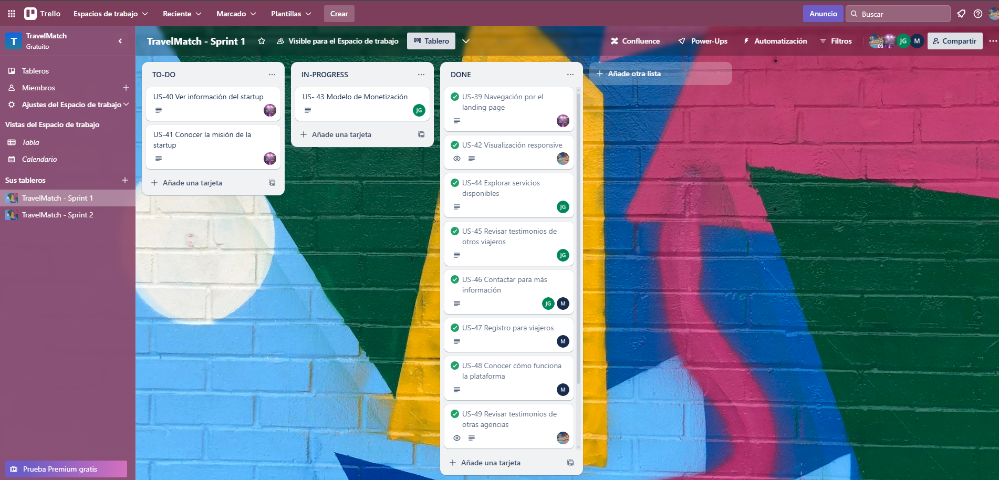
</p>

---

 Aspect Leaders and Collaborators

En el Sprint 2 se definieron los siguientes aspectos clave para la implementación del backend:

- IAM & Authentication
- Agencies Bounded Context
- Bookings & Payments Bounded Context
- Experiences Bounded Context
- Profiles Bounded Context
- Geolocation Bounded Context
- Testing & CI Pipeline

| Team Member | GitHub Username | IAM & Auth | Agencies BC | Bookings & Payments BC | Experiences BC | Profiles BC | Geolocation BC | Testing & CI |
|---|---|---|---|---|---|---|---|---|
| Aspajo Alvarez, Mathias | AdeXzz | C | C | C | L | C | C | C |
| Galvez Chambi, Jhon | Chaomeum | L | C | C | C | C | C | C |
| Briceño, Farid | — | C | C | C | C | L | C | C |
| Guevara Tejada, Jorge | Jorgito170 | C | C | C | C | C | L | C |
| Linares Bernable, Cesar | Cesar-Linares | C | L | L | C | C | C | L |

> **L** = Leader  
> **C** = Collaborator

---

Sprint Backlog 2

El Sprint Backlog 2 contiene las tareas priorizadas para la implementación del backend RESTful de TravelMatch. El foco principal está en los bounded contexts de Agencies y Bookings & Payments, que constituyen el core del modelo de negocio de la plataforma.

| User Story | Work-Item / Task ID | Title | Description | Estimation (Hrs) | Assigned To | Status |
|---|---|---|---|---|---|---|
| TS-01 Autenticación de usuarios | T01-1 | Implementar Sign Up | Crear endpoint POST `/api/v1/authentication/sign-up` con validaciones | 3 | Galvez Chambi, Jhon | Done |
| TS-01 Autenticación de usuarios | T01-2 | Implementar Sign In con JWT | Crear endpoint POST `/api/v1/authentication/sign-in` retornando token JWT | 3 | Galvez Chambi, Jhon | Done |
| TS-02 Gestión de agencias | T02-1 | CRUD de Agency | Implementar endpoints POST, GET, PUT, DELETE para `/api/v1/agencies` | 4 | Linares Bernable, Cesar | Done |
| TS-02 Gestión de agencias | T02-2 | CRUD de AgencyDocument | Implementar endpoints para `/api/v1/agencies/{id}/documents` | 3 | Linares Bernable, Cesar | Done |
| TS-02 Gestión de agencias | T02-3 | CRUD de AgencyStaff | Implementar endpoints para `/api/v1/agencies/{id}/staff` | 3 | Linares Bernable, Cesar | Done |
| TS-03 Gestión de destinos | T03-1 | CRUD de Destination | Implementar endpoints para `/api/v1/destinations` con validaciones | 3 | Guevara Tejada, Jorge | Done |
| TS-04 Gestión de experiencias | T04-1 | CRUD de Experience | Implementar endpoints para `/api/v1/experiences` | 4 | Aspajo Alvarez, Mathias | Done |
| TS-04 Gestión de experiencias | T04-2 | Gestión de Availability | Implementar endpoints para availabilities y ticket types | 3 | Aspajo Alvarez, Mathias | Done |
| TS-04 Gestión de experiencias | T04-3 | Gestión de ExperienceMedia | Implementar endpoints para experience-media | 2 | Aspajo Alvarez, Mathias | Done |
| TS-05 Gestión de reservas | T05-1 | Crear Booking | Implementar POST `/api/v1/bookings` con validación de stock | 4 | Linares Bernable, Cesar | Done |
| TS-05 Gestión de reservas | T05-2 | Cancelar Booking | Implementar POST `/api/v1/bookings/{id}/cancel` | 2 | Linares Bernable, Cesar | Done |
| TS-05 Gestión de reservas | T05-3 | Integración con Stripe | Implementar POST `/api/v1/bookings/{id}/payments/initiate` con PaymentIntent | 4 | Linares Bernable, Cesar | Done |
| TS-05 Gestión de reservas | T05-4 | Webhook de Stripe | Implementar POST `/api/v1/stripe/webhook` para confirmar pagos | 3 | Linares Bernable, Cesar | Done |
| TS-05 Gestión de reservas | T05-5 | Iniciar Refund | Implementar POST `/api/v1/bookings/{id}/refunds` | 2 | Linares Bernable, Cesar | Done |
| TS-06 Gestión de perfiles | T06-1 | CRUD de Favorites | Implementar endpoints para `/api/v1/favorites` | 2 | Briceño, Farid | Done |
| TS-06 Gestión de perfiles | T06-2 | Gestión de Cart | Implementar endpoints para `/api/v1/carts` con items | 3 | Briceño, Farid | Done |
| TS-06 Gestión de perfiles | T06-3 | Gestión de Reviews | Implementar endpoints para `/api/v1/reviews` | 2 | Briceño, Farid | Done |
| TS-07 Pipeline CI/CD | T07-1 | Configurar Jenkinsfile | Crear pipeline con stages: compile, checkstyle, test, jacoco, package | 3 | Linares Bernable, Cesar | Done |
| TS-07 Pipeline CI/CD | T07-2 | Configurar SonarQube | Integrar análisis estático de calidad con SonarQube | 2 | Linares Bernable, Cesar | Done |

---

 #### 5.2.2. Implemented Landing Page Evidence

La landing page de TravelMatch fue desarrollada e implementada en el Sprint 1. Se trata de un sitio web estático construido con HTML5, CSS3 y JavaScript, desplegado mediante GitHub Pages. Incluye secciones diferenciadas para viajeros y agencias, formularios de contacto, testimonios y una presentación del modelo de monetización.

**URL del Landing Page desplegado:**  
https://g2-aplicaciones-open-source.github.io/landing-page-v2/

 Commits del repositorio Landing Page

| Repository | Branch | Commit ID | Commit Message | Committed on (Date) |
|---|---|---|---|---|
| G2-Aplicaciones-Open-Source/Landing-Page | develop | a859949 | feat: Implementación de contenido en las secciones de la landing page | 23/04/2025 |
| G2-Aplicaciones-Open-Source/Landing-Page | develop | 645844c | feat: Implementación de navegación y redireccionamientos | 23/04/2025 |
| G2-Aplicaciones-Open-Source/Landing-Page | develop | 5265378 | feat: Mejora de responsividad y funcionalidades interactivas | 23/04/2025 |
| G2-Aplicaciones-Open-Source/Landing-Page | develop | 7ab1366 | feat: Implementación de las vistas para el registro e inicio de sesión | 23/04/2025 |

Para el detalle completo de la implementación, capturas y evidencias de despliegue, referirse a la sección 5.2.1.7 del Sprint 1.

---

#### 5.2.3. Implemented Frontend-Web Application Evidence

La aplicación web frontend de TravelMatch fue desarrollada utilizando Vue.js con el framework PrimeVue como biblioteca de componentes de UI, siguiendo las guías de estilo definidas en el Capítulo IV. Consume los endpoints del RESTful API implementado en este sprint.

 Principales vistas implementadas

- Vista de autenticación: Login y registro de usuarios con roles (turista / agencia staff).
- Vista de exploración de experiencias: Listado, filtros por categoría y detalle de experiencia.
- Vista de gestión de agencia: Dashboard para crear y administrar experiencias, disponibilidades y documentos.
- Vista de reserva: Flujo completo de selección de disponibilidad, ticket type, confirmación y pago.
- Vista de perfil de usuario: Favoritos, carrito, historial de reservas y reseñas.

 Commits del repositorio Frontend

| Repository | Branch | Commit ID | Commit Message | Committed on (Date) |
|---|---|---|---|---|
| G2-Aplicaciones-Open-Source/frontend | develop | — | feat: implementación de vistas de autenticación | 2025-05-20 |
| G2-Aplicaciones-Open-Source/frontend | develop | — | feat: implementación de exploración de experiencias | 2025-05-22 |
| G2-Aplicaciones-Open-Source/frontend | develop | — | feat: implementación de flujo de reserva y pago | 2025-05-25 |


---
#### 5.2.4. Acuerdo de Servicio - SaaS
Esta sección establece los derechos, obligaciones y restricciones aplicables a los usuarios de la plataforma **TravelMatch**, garantizando transparencia en el uso del servicio bajo el modelo Software as a Service (SaaS). Este acuerdo cumple con los criterios de claridad, accesibilidad y cumplimiento normativo exigidos por la legislación peruana.

---

**TÉRMINOS Y CONDICIONES DE USO: TRAVELMATCH**

**1. INFORMACIÓN GENERAL**
* **1.1. Identificación del Prestador:** El servicio es propiedad de la startup **Pandora**, conformada por estudiantes de la Universidad Peruana de Ciencias Aplicadas (UPC).
* **1.2. Objeto del Servicio:** TravelMatch es una plataforma tecnológica SaaS que facilita la conexión entre turistas (nacionales, internacionales y corporativos) y agencias de turismo locales certificadas, permitiendo la reserva, personalización y gestión de experiencias turísticas auténticas.

**2. MARCO NORMATIVO APLICABLE**
El presente servicio se rige bajo las siguientes normas peruanas:
* **Protección de Datos Personales:** Ley N° 29733 y su Reglamento (D.S. N° 003-2013-JUS).
* **Sector Turismo:** Ley N° 29408 (Ley General de Turismo) y el Reglamento de Agencias de Viajes y Turismo.
* **Marco Digital y Consumidor:** Ley N° 30096 (Ley de Delitos Informáticos) y el Código de Protección y Defensa del Consumidor (Ley N° 29571).

**3. CONDICIONES DE USO Y REGISTRO**
* **3.1. Para Agencias de Turismo:** Deben contar con RUC activo y estar inscritas en el Directorio Nacional de Prestadores de Servicios Turísticos Calificados de MINCETUR. Son responsables de la veracidad de los itinerarios y la disponibilidad publicada.
* **3.2. Para Turistas:** Deben proporcionar información real para la gestión de reservas. Los usuarios corporativos deberán validar su perfil para acceder a tarifas preferenciales.
* **3.3. Verificación:** Pandora se reserva el derecho de validar la documentación de las agencias antes de permitir la publicación de experiencias.

**4. PROTECCIÓN DE DATOS Y PRIVACIDAD**
* **4.1. Tratamiento de Datos:** TravelMatch recopila datos de identificación, geolocalización y preferencias de viaje con la finalidad de personalizar la oferta turística y gestionar las reservas.
* **4.2. Seguridad Técnica:** La plataforma implementa medidas de seguridad avanzadas, incluyendo autenticación mediante JWT (JSON Web Tokens) y cifrado de datos en infraestructura de nube (Azure).
* **4.3. Derechos ARCO:** Los usuarios pueden ejercer sus derechos de Acceso, Rectificación, Cancelación y Oposición escribiendo a los canales oficiales de soporte.

**5. RESPONSABILIDADES Y LIMITACIONES**
* **5.1. Responsabilidades de la Plataforma:** Mantener la disponibilidad del sistema, asegurar la integración de las APIs (Google Maps, Stripe, Weather API) y proporcionar soporte técnico a las agencias.
* **5.2. Limitaciones del Servicio:** TravelMatch es una plataforma de **intermediación tecnológica**. No es el organizador directo de las excursiones ni responsable por incidentes operativos durante la ejecución del tour (transporte, clima o accidentes), los cuales recaen sobre la agencia proveedora.
* **5.3. Exclusiones:** Pandora no se responsabiliza por la calidad del servicio final prestado por la agencia local, aunque mantiene un sistema de reseñas para auditar la satisfacción del usuario.

**6. MODELO DE NEGOCIO Y PAGOS**
* **6.1. Facturación:** Las transacciones se procesan mediante pasarelas seguras. La plataforma cobra una comisión por reserva confirmada y ofrece planes de suscripción para agencias.
* **6.2. Política de Cancelación:** El sistema gestiona reembolsos automáticos si la cancelación se realiza con más de 24 horas de anticipación, sujeto a las políticas específicas de cada experiencia.

**7. PROPIEDAD INTELECTUAL**
* **7.1. Derechos Reservados:** El código fuente, diseño de interfaz y arquitectura de software son propiedad exclusiva de Pandora.
* **7.2. Contenido de Usuarios:** Las agencias otorgan una licencia de uso a Pandora para mostrar las imágenes y descripciones de sus tours con fines promocionales.

**8. RESOLUCIÓN DE CONTROVERSIAS**
* **8.1. Jurisdicción:** Cualquier discrepancia se someterá a la jurisdicción de los tribunales de Lima, Perú.
* **8.2. Atención al Cliente:** Se pone a disposición el Libro de Reclamaciones Virtual y el correo soporte@travelmatch.app para la atención de incidencias.

#### 5.2.6. Implemented RESTful API and/or Serverless Backend Evidence

El backend de TravelMatch fue implementado como un RESTful API utilizando Spring Boot 3.5.0 con Java 21, siguiendo la arquitectura de Domain-Driven Design (DDD) con bounded contexts bien delimitados. La API corre en `http://localhost:8091` y está documentada con Swagger/OpenAPI.

 Bounded contexts implementados y sus endpoints principales

 IAM (Identity & Access Management)

| Endpoint | Método | Descripción |
|---|---|---|
| `/api/v1/authentication/sign-up` | POST | Registro de nuevo usuario |
| `/api/v1/authentication/sign-in` | POST | Inicio de sesión, retorna JWT |
| `/api/v1/users` | GET | Listar todos los usuarios |
| `/api/v1/users/{userId}` | GET | Obtener usuario por ID |
| `/api/v1/roles` | GET | Listar roles disponibles |

Agencies

| Endpoint | Método | Descripción |
|---|---|---|
| `/api/v1/agencies` | POST | Crear agencia |
| `/api/v1/agencies` | GET | Listar todas las agencias |
| `/api/v1/agencies/{agencyId}` | GET | Obtener agencia por ID |
| `/api/v1/agencies/{agencyId}` | PUT | Actualizar agencia |
| `/api/v1/agencies/{agencyId}` | DELETE | Eliminar agencia |
| `/api/v1/agencies/{agencyId}/documents` | POST | Crear documento de agencia |
| `/api/v1/agencies/{agencyId}/documents` | GET | Listar documentos por agencia |
| `/api/v1/agencies/{agencyId}/documents/{documentId}` | PUT | Actualizar documento |
| `/api/v1/agencies/{agencyId}/documents/{documentId}` | DELETE | Eliminar documento |
| `/api/v1/agencies/{agencyId}/staff` | POST | Crear staff de agencia |
| `/api/v1/agencies/{agencyId}/staff` | GET | Listar staff por agencia |
| `/api/v1/agencies/{agencyId}/staff/{staffId}` | PUT | Actualizar staff |
| `/api/v1/agencies/{agencyId}/staff/{staffId}` | DELETE | Eliminar staff |

 Bookings & Payments

| Endpoint | Método | Descripción |
|---|---|---|
| `/api/v1/bookings` | POST | Crear booking (valida stock disponible) |
| `/api/v1/bookings/{bookingId}/cancel` | POST | Cancelar booking en estado PENDING |
| `/api/v1/bookings/{bookingId}/payments/initiate` | POST | Iniciar pago con Stripe (retorna clientSecret) |
| `/api/v1/bookings/fail-payment` | POST | Marcar pago como fallido |
| `/api/v1/bookings/{bookingId}/refunds` | POST | Iniciar reembolso |
| `/api/v1/stripe/webhook` | POST | Webhook de Stripe para confirmar pagos |

Experiences

| Endpoint | Método | Descripción |
|---|---|---|
| `/api/v1/experiences/{agencyId}/experiences` | POST | Crear experiencia |
| `/api/v1/experiences` | GET | Listar todas las experiencias |
| `/api/v1/experiences/{experienceId}` | GET / PUT / DELETE | CRUD de experiencia |
| `/api/v1/experiences/{experienceId}/availabilities` | POST | Crear disponibilidad |
| `/api/v1/availabilities` | GET | Listar disponibilidades |
| `/api/v1/availabilities/{availabilityId}` | PUT / DELETE | Actualizar / eliminar disponibilidad |
| `/api/v1/availabilities/{availabilityId}/ticket-types` | POST | Asociar ticket type |
| `/api/v1/experience-media/experiences/{experienceId}/media` | POST | Agregar media |
| `/api/v1/categories` | GET | Listar categorías |
| `/api/v1/ticket-types` | GET | Listar tipos de tickets |

 Profiles

| Endpoint | Método | Descripción |
|---|---|---|
| `/api/v1/favorites` | POST | Crear favorito |
| `/api/v1/favorites/by-user/{userId}` | GET | Listar favoritos por usuario |
| `/api/v1/favorites/users/{userId}/experience/{experienceId}` | DELETE | Eliminar favorito |
| `/api/v1/carts` | POST | Crear carrito |
| `/api/v1/carts/{userId}/items` | POST / PUT / DELETE | Gestión de items del carrito |
| `/api/v1/carts/{userId}` | GET / DELETE | Ver / vaciar carrito |
| `/api/v1/reviews` | POST | Crear reseña |
| `/api/v1/reviews/{reviewId}` | PUT | Actualizar reseña |
| `/api/v1/reviews/by-user/{userId}` | GET | Reseñas por usuario |

Commits del repositorio Backend

| Repository | Branch | Commit ID | Commit Message | Committed on (Date) |
|---|---|---|---|---|
| G2-Aplicaciones-Open-Source/backend | feat/iam | — | feat: implement sign-up and sign-in endpoints with JWT | 2025-05-15 |
| G2-Aplicaciones-Open-Source/backend | feat/agencies | — | feat: implement agency CRUD with RUC and email validation | 2025-05-17 |
| G2-Aplicaciones-Open-Source/backend | feat/agencies | — | feat: implement agency documents and staff management | 2025-05-18 |
| G2-Aplicaciones-Open-Source/backend | feat/bookings | — | feat: implement booking creation with stock validation | 2025-05-20 |
| G2-Aplicaciones-Open-Source/backend | feat/bookings | — | feat: integrate Stripe payment intent and webhook | 2025-05-22 |
| G2-Aplicaciones-Open-Source/backend | feat/bookings | — | feat: implement refund and cancel booking flows | 2025-05-23 |
| G2-Aplicaciones-Open-Source/backend | develop | — | ci: add Jenkinsfile with compile, test, coverage and package stages | 2025-05-25 |


---

### 5.2.7. RESTful API Documentation

La documentación de la API fue generada automáticamente utilizando OpenAPI Specification (OAS 3.0) a través de Springdoc OpenAPI y visualizada con Swagger UI.

**URL de la documentación:**  
`http://localhost:8091/swagger-ui/index.html`

La documentación incluye todos los endpoints agrupados por Tag (bounded context), con descripción de cada operación, parámetros requeridos, cuerpos de request con ejemplos y los posibles códigos de respuesta HTTP.

 Tags documentados

| Tag | Descripción |
|---|---|
| Authentication | Endpoints de registro e inicio de sesión |
| Users | Gestión de usuarios |
| Roles | Consulta de roles disponibles |
| Agencies | CRUD completo de agencias |
| Agency Documents | Gestión de documentos de agencia |
| Agency Staff | Gestión del personal de agencia |
| Destinations | Gestión de destinos geográficos |
| Experiences | Gestión de experiencias turísticas |
| Availabilities | Gestión de disponibilidades y ticket types |
| Experience Media | Gestión de archivos multimedia |
| Categories | Consulta de categorías |
| Ticket Types | Consulta de tipos de ticket |
| Bookings | Gestión de reservas y pagos |
| Favorites | Gestión de experiencias favoritas |
| Carts | Gestión del carrito de compras |
| Reviews | Gestión de reseñas |

 
 Seguridad

Todos los endpoints (excepto `/api/v1/authentication/**`) requieren autenticación mediante Bearer Token JWT, configurado en el esquema de seguridad de Swagger con el botón **Authorize**.


### 5.2.8. Team Collaboration Insights

Durante este Sprint, el equipo colaboró en la implementación del backend de TravelMatch siguiendo las prácticas de GitFlow, Conventional Commits y revisión de código mediante Pull Requests en GitHub.

Estrategia de colaboración empleada

- Cada bounded context se desarrolló en su propia rama `feat/<bounded-context>`, creada a partir de `develop`.
- Se aplicó Conventional Commits: `feat:`, `fix:`, `test:`, `ci:`, `refactor:` para mantener trazabilidad en el historial.
- Pull Requests obligatorias revisadas por al menos un miembro antes de fusionar a `develop`.
- Al finalizar el sprint, un merge de `develop` a `main` precedido de una revisión general del equipo.
- El pipeline de Jenkins valida automáticamente cada push: compilación, checkstyle, tests y cobertura.

  Distribución de commits por miembro

| Miembro | Bounded Context principal | Contribución |
|---|---|---|
| Galvez Chambi, Jhon | IAM, Configuración general | Sign-up, Sign-in, JWT, Seed de roles |
| Linares Bernable, Cesar | Agencies, Bookings & Payments, CI | CRUD Agencies/Documents/Staff, Booking lifecycle, Stripe, Jenkins, SonarQube |
| Aspajo Alvarez, Mathias | Experiences | Experiences, Availabilities, Ticket Types, ExperienceMedia |
| Guevara Tejada, Jorge | Geolocation | Destinations CRUD |
| Briceño, Farid | Profiles | Favorites, Cart, Reviews |


<p align="center">
    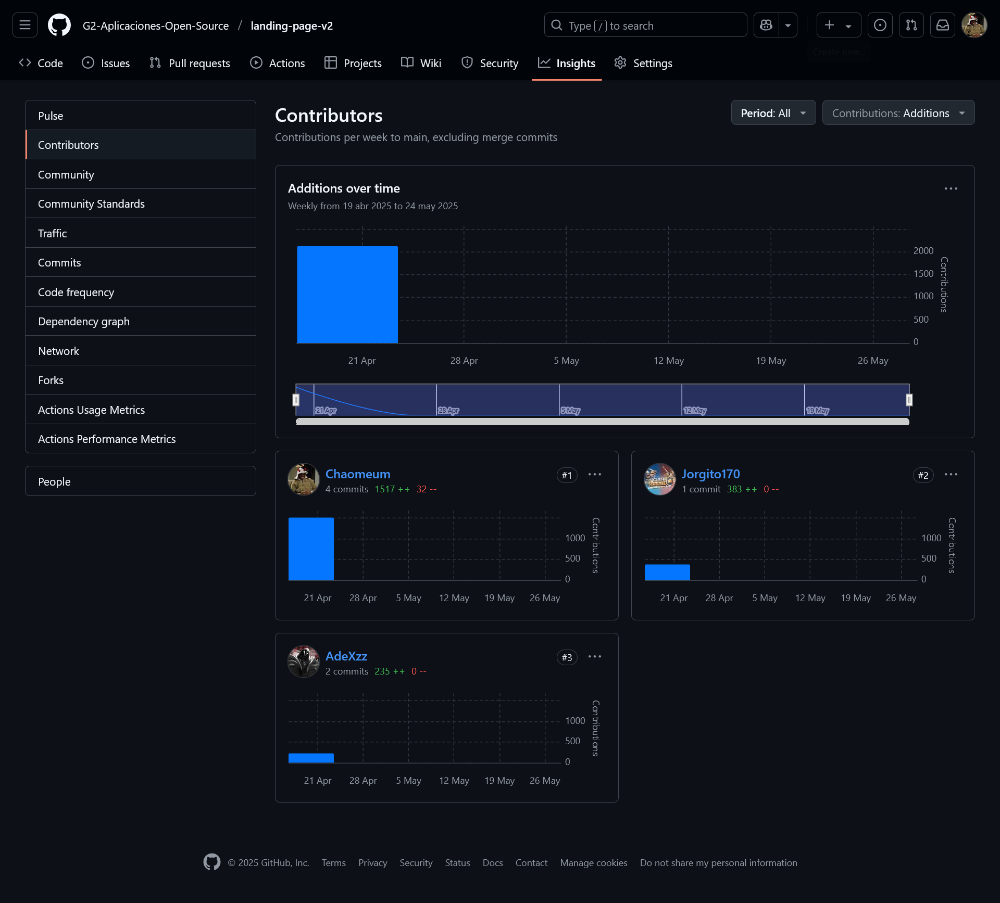
</p>


<p align="center">
    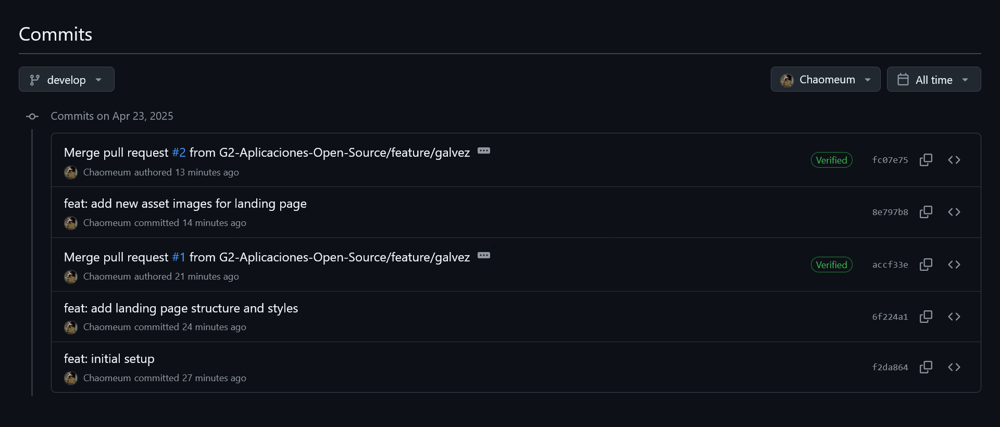
</p>


<p align="center">
    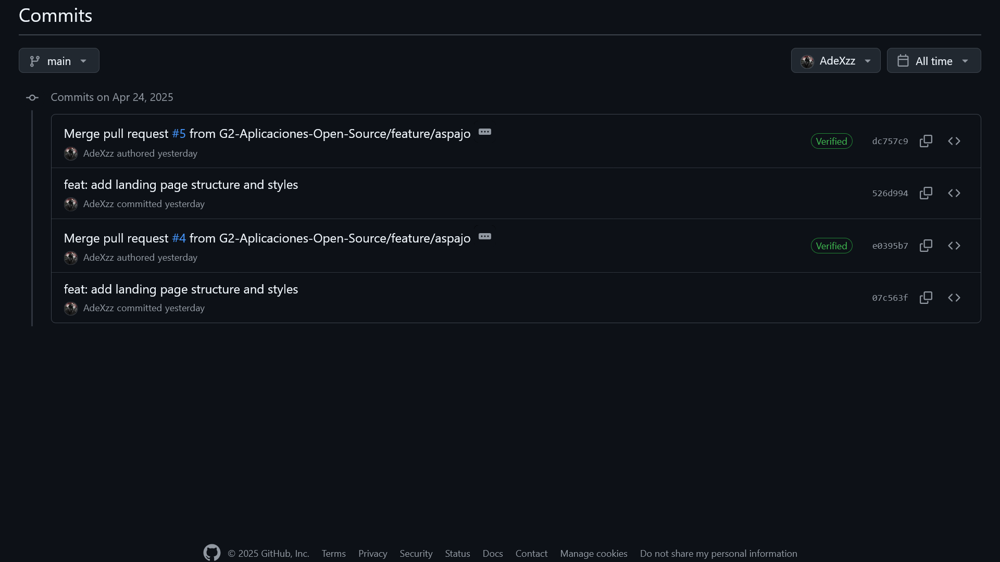
</p>


### 5.3. Video About-the-Product
n esta sección, el equipo introduce y describe el contenido del Video About-the-Product. Este video está diseñado para los visitantes de la Landing Page que buscan comprender el modelo de negocio y las características principales de nuestra solución de software, así como para los usuarios de las aplicaciones que desean familiarizarse con los procesos soportados. El tono de la comunicación es consistente con la identidad de nuestro producto, ofreciendo una visión clara y directa de sus funcionalidades.

El video incluye una descripción general de Travel Match, enfocándose en cómo nuestra plataforma conecta a turistas con agencias locales, facilitando la búsqueda, comparación y reserva de experiencias turísticas. Se presenta el proceso de uso de la aplicación, destacando la facilidad de navegación y la eficiencia en la gestión de viajes. Además, hemos incluido un testimonio positivo de un usuario que participó en nuestras entrevistas de validación, resaltando su experiencia favorable con la plataforma.

<p align="center">
    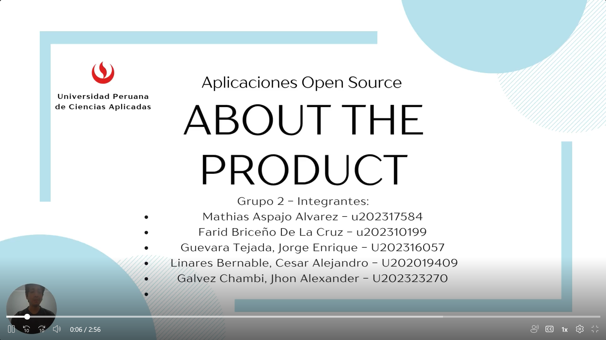
</p>

- URL en Microsoft Stream: https://upcedupe-my.sharepoint.com/:v:/g/personal/u202323270_upc_edu_pe/EdUp0DAimbJJqBXb20Iorl0B-SvwXoGJ4HidDpyC_jcd_g?nav=eyJyZWZlcnJhbEluZm8iOnsicmVmZXJyYWxBcHAiOiJTdHJlYW1XZWJBcHAiLCJyZWZlcnJhbFZpZXciOiJTaGFyZURpYWxvZy1MaW5rIiwicmVmZXJyYWxBcHBQbGF0Zm9ybSI6IldlYiIsInJlZmVycmFsTW9kZSI6InZpZXcifX0%3D&e=wDMOaB

- URL en YouTube (para incrustar en Landing Page): https://youtu.be/zy340YfRT58

- Duración del Video: [00:02:57]


## Capítulo VI:  Product Verification & Validation 
### 6.1. Testing Suites & Validation
#### 6.1.1. Core Entities Unit Tests
n esta sección se presentan capturas de pantalla de la implementación de pruebas unitarias realizadas sobre los servicios principales de las entidades del sistema.
Se implementaron pruebas unitarias para los componentes principales de los bounded contexts Agencies, Bookings, Experiences, Iam, Geolocation y Profiles, siguiendo el patrón AAA (Arrange, Act, Assert) con JUnit 5 y Mockito.
Se incluyen ejemplos visuales tanto del código de las pruebas como de su ejecución exitosa, con el objetivo de validar el correcto funcionamiento lógico de cada unidad de código.

#### Agencies Bounded Context

##### Domain Layer: Aggregates & Entities
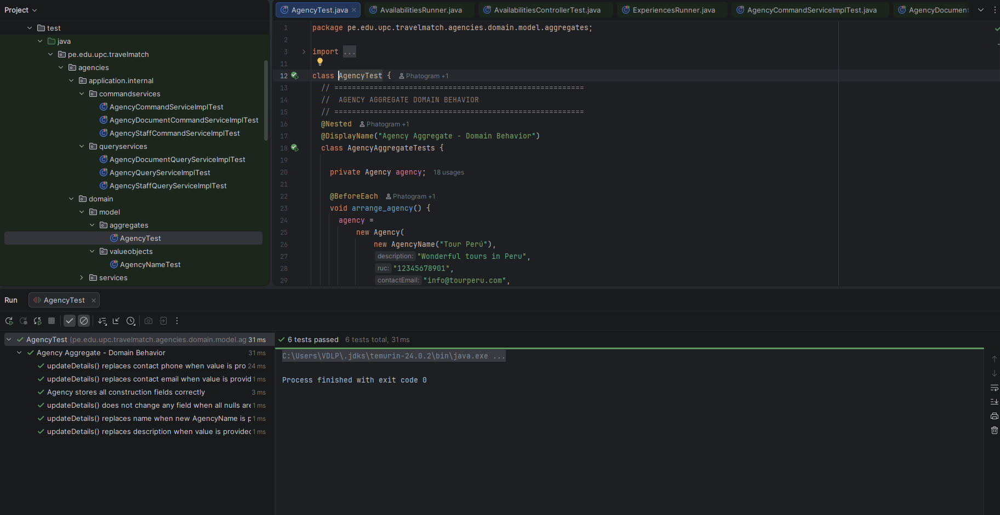
_Evidencia de ejecución de los tests de Domain Layer: Aggregates & Entities para el Bounded Context Agencies._

1. **constructor_allFields_storedCorrectly**(AgencyTest)

Esta prueba verifica que el agregado `Agency` almacene correctamente todos los campos proporcionados en su constructor. Valida que el nombre, descripción, RUC, email de contacto, teléfono y el ID de usuario asociado se asignen fielmente al estado interno de la entidad, asegurando la integridad del modelo de dominio desde su creación.

```java
@Test
@DisplayName("Agency stores all construction fields correctly")
void constructor_allFields_storedCorrectly() {
  // Arrange – done in @BeforeEach

  // Act – just read values

  // Assert
  assertAll(
      () -> assertEquals("Tour Perú", agency.getName().getName()),
      () -> assertEquals("Wonderful tours in Peru", agency.getDescription()),
      () -> assertEquals("12345678901", agency.getRuc()),
      () -> assertEquals("info@tourperu.com", agency.getContactEmail()),
      () -> assertEquals("999888777", agency.getContactPhone()),
      () -> assertEquals(10L, agency.getUserId()));
}
```

2. **updateDetails_newName_nameIsUpdated**(AgencyTest)

Valida que el método `updateDetails` del agregado permita actualizar el nombre de la agencia. Comprueba que al proporcionar un nuevo objeto `AgencyName`, el estado de la entidad se modifique para reflejar el cambio, manteniendo la consistencia del objeto de valor.

```java
@Test
@DisplayName("updateDetails() replaces name when new AgencyName is provided")
void updateDetails_newName_nameIsUpdated() {
  // Arrange
  AgencyName newName = new AgencyName("New Agency Name");

  // Act
  agency.updateDetails(newName, null, null, null);

  // Assert
  assertEquals("New Agency Name", agency.getName().getName());
}
```

7. **constructor_validName_nameIsStored**(AgencyNameTest)

Valida que el objeto de valor `AgencyName` se inicialice correctamente con una cadena válida. Es fundamental para asegurar que los nombres de las agencias se manejen como objetos consistentes a través del sistema.

```java
@Test
@DisplayName("AgencyName stores the provided name correctly")
void constructor_validName_nameIsStored() {
  // Arrange
  String name = "Tour Perú";

  // Act
  AgencyName agencyName = new AgencyName(name);

  // Assert
  assertEquals("Tour Perú", agencyName.getName());
}
```

8. **constructor_nullName_throwsIllegalArgument**(AgencyNameTest)

Verifica que el objeto de valor `AgencyName` lance una excepción si se intenta inicializar con un valor nulo, aplicando reglas de validación tempranas en el modelo de dominio.

```java
@Test
@DisplayName("AgencyName throws IllegalArgumentException when name is null")
void constructor_nullName_throwsIllegalArgument() {
  // Arrange – null name

  // Act & Assert
  assertThrows(IllegalArgumentException.class, () -> new AgencyName(null));
}
```

##### Application Layer: Command Services
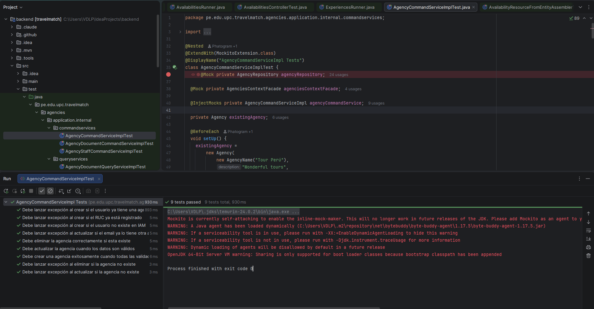
_Evidencia de ejecución de los tests de Application Layer: Command Services para el Bounded Context Agencies._

14. **handle_createAgency_allValid_agencyIsSaved**(AgencyCommandServiceImplTest)

Esta prueba de servicio verifica el flujo exitoso de creación de una agencia. Simula las validaciones contra IAM y la base de datos (RUC, email), y confirma que el objeto `Agency` se persista correctamente a través del repositorio con los valores esperados.

```java
@Test
@DisplayName("Debe crear una agencia exitosamente cuando todas las validaciones pasan")
void handle_createAgency_allValid_agencyIsSaved() {
  // --- Arrange (Preparar) ---
  CreateAgencyCommand command =
      new CreateAgencyCommand(
          "Tour Perú", "Great tours", "12345678901", "info@tourperu.com", "999888777", 1L);
  when(agenciesContextFacade.existsUserById(1L)).thenReturn(true);
  when(agencyRepository.existsByUserId(1L)).thenReturn(false);
  when(agencyRepository.existsByRuc("12345678901")).thenReturn(false);
  when(agencyRepository.existsByContactEmail("info@tourperu.com")).thenReturn(false);

  // Usamos un capturador para verificar los datos exactos que se guardan
  ArgumentCaptor<Agency> agencyCaptor = ArgumentCaptor.forClass(Agency.class);
  when(agencyRepository.save(agencyCaptor.capture())).thenAnswer(inv -> inv.getArgument(0));

  // --- Act (Ejecutar) ---
  agencyCommandService.handle(command);

  // --- Assert (Verificar) ---
  verify(agencyRepository, times(1)).save(any(Agency.class));
  Agency savedAgency = agencyCaptor.getValue();
  assertEquals("Tour Perú", savedAgency.getName().getName());
  assertEquals("12345678901", savedAgency.getRuc());
}
```

15. **handle_createAgency_userNotFound_throwsException**(AgencyCommandServiceImplTest)

Valida que el servicio lance una excepción si se intenta crear una agencia para un ID de usuario que no existe en el contexto de IAM, protegiendo la integridad referencial a través de la ACL.

```java
@Test
@DisplayName("Debe lanzar excepción al crear si el usuario no existe en IAM")
void handle_createAgency_userNotFound_throwsException() {
  // --- Arrange (Preparar) ---
  CreateAgencyCommand command =
      new CreateAgencyCommand(
          "Tour Perú", "desc", "12345678901", "info@tourperu.com", "999888777", 99L);
  when(agenciesContextFacade.existsUserById(99L)).thenReturn(false);

  // --- Act & Assert (Ejecutar y Verificar) ---
  IllegalArgumentException exception =
      assertThrows(IllegalArgumentException.class, () -> agencyCommandService.handle(command));

  assertTrue(exception.getMessage().contains("does not exist in IAM"));
  verify(agencyRepository, never()).save(any());
}
```

16. **handle_createAgency_duplicateUserId_throwsException**(AgencyCommandServiceImplTest)

Asegura que el sistema impida la creación de múltiples agencias asociadas al mismo usuario, cumpliendo con la regla de negocio de relación 1:1 entre usuario staff y su agencia.

```java
@Test
@DisplayName("Debe lanzar excepción al crear si el usuario ya tiene una agencia")
void handle_createAgency_duplicateUserId_throwsException() {
  // --- Arrange (Preparar) ---
  CreateAgencyCommand command =
      new CreateAgencyCommand(
          "Tour Perú", "desc", "12345678901", "info@tourperu.com", "999888777", 1L);
  when(agenciesContextFacade.existsUserById(1L)).thenReturn(true);
  when(agencyRepository.existsByUserId(1L)).thenReturn(true);

  // --- Act & Assert (Ejecutar y Verificar) ---
  assertThrows(IllegalArgumentException.class, () -> agencyCommandService.handle(command));
  verify(agencyRepository, never()).save(any());
}
```

34. **handle_createDocument_agencyExists_returnsDocument**(AgencyDocumentCommandServiceImplTest)

Esta prueba verifica que el servicio de documentos cree correctamente un nuevo registro si la agencia asociada existe, validando la relación jerárquica.

```java
@Test
@DisplayName("Debe crear un documento si la agencia existe")
void handle_createDocument_agencyExists_returnsDocument() {
  // --- Arrange ---
  CreateAgencyDocumentCommand command =
      new CreateAgencyDocumentCommand(
          1L, "LICENSE", "http://docs.com/lic.pdf", "Business License");
  when(agencyRepository.findById(1L)).thenReturn(Optional.of(agency));
  when(agencyDocumentRepository.save(any(AgencyDocument.class)))
      .thenAnswer(inv -> inv.getArgument(0));

  // --- Act ---
  Optional<AgencyDocument> result = agencyDocumentCommandService.handle(command);

  // --- Assert ---
  assertTrue(result.isPresent(), "El documento debe ser creado exitosamente");
  verify(agencyDocumentRepository, times(1)).save(any(AgencyDocument.class));
}
```

35. **handle_updateDocument_valid_returnsUpdatedDocument**(AgencyDocumentCommandServiceImplTest)

Valida el flujo de actualización de un documento legal, asegurando que los cambios en tipo, URL y descripción se persistan correctamente.

```java
@Test
@DisplayName("Debe actualizar el documento exitosamente")
void handle_updateDocument_valid_returnsUpdatedDocument() {
  // --- Arrange ---
  UpdateAgencyDocumentCommand command =
      new UpdateAgencyDocumentCommand(1L, "NEW_TYPE", "http://docs.com/new.pdf", "New Desc");
  when(agencyDocumentRepository.findById(1L)).thenReturn(Optional.of(existingDocument));
  when(agencyDocumentRepository.save(existingDocument)).thenReturn(existingDocument);

  // --- Act ---
  Optional<AgencyDocument> result = agencyDocumentCommandService.handle(command);

  // --- Assert ---
  assertTrue(result.isPresent());
  assertEquals("NEW_TYPE", result.get().getDocumentType());
  verify(agencyDocumentRepository).save(existingDocument);
}
```

43. **handle_createStaff_valid_returnsStaff**(AgencyStaffCommandServiceImplTest)

Esta prueba verifica la creación exitosa de un miembro del staff de la agencia, asegurando que el email no esté duplicado y que la agencia asociada sea válida.

```java
@Test
@DisplayName("Debe crear un staff cuando no existe el email")
void handle_createStaff_valid_returnsStaff() {
  // --- Arrange ---
  CreateAgencyStaffCommand command =
      new CreateAgencyStaffCommand(1L, "Juan", "Perez", "juan@tp.com", "987654321", "Guide");
  when(agencyRepository.findById(1L)).thenReturn(Optional.of(agency));
  when(agencyStaffRepository.existsByEmail("juan@tp.com")).thenReturn(false);
  when(agencyStaffRepository.save(any(AgencyStaff.class))).thenAnswer(inv -> inv.getArgument(0));

  // --- Act ---
  Optional<AgencyStaff> result = agencyStaffCommandService.handle(command);

  // --- Assert ---
  assertTrue(result.isPresent());
  verify(agencyStaffRepository).save(any(AgencyStaff.class));
}
```

44. **handle_deleteStaff_exists_deletesSuccessfully**(AgencyStaffCommandServiceImplTest)

Confirma que la eliminación de un miembro del staff sea exitosa si el identificador es correcto.

```java
@Test
@DisplayName("Debe eliminar staff correctamente si el ID existe")
void handle_deleteStaff_exists_deletesSuccessfully() {
  // --- Arrange ---
  DeleteAgencyStaffCommand command = new DeleteAgencyStaffCommand(1L);
  when(agencyStaffRepository.existsById(1L)).thenReturn(true);

  // --- Act ---
  assertDoesNotThrow(() -> agencyStaffCommandService.handle(command));

  // --- Assert ---
  verify(agencyStaffRepository).deleteById(1L);
}
```

##### Application Layer: Query Services

_Evidencia de ejecución de los tests de Application Layer: Query Services para el Bounded Context Agencies._

53. **handle_getAllAgencies_returnsList**(AgencyQueryServiceImplTest)

Esta prueba verifica que el servicio de consulta recupere la lista completa de agencias registradas, interactuando correctamente con el repositorio de persistencia.

```java
@Test
@DisplayName("Debe retornar la lista completa de agencias")
void handle_getAllAgencies_returnsList() {
  // --- Arrange ---
  GetAllAgenciesQuery query = new GetAllAgenciesQuery();
  when(agencyRepository.findAll()).thenReturn(List.of(mock(Agency.class), mock(Agency.class)));

  // --- Act ---
  List<Agency> result = agencyQueryService.handle(query);

  // --- Assert ---
  assertNotNull(result);
  assertEquals(2, result.size());
  verify(agencyRepository, times(1)).findAll();
}
```

54. **handle_getAgencyById_returnsOptional**(AgencyQueryServiceImplTest)

Valida la obtención de una agencia individual por su identificador, asegurando que el servicio retorne un `Optional` con la entidad si esta existe.

```java
@Test
@DisplayName("Debe retornar una agencia por su ID")
void handle_getAgencyById_returnsOptional() {
  // --- Arrange ---
  GetAgencyByIdQuery query = new GetAgencyByIdQuery(1L);
  when(agencyRepository.findById(1L)).thenReturn(Optional.of(mock(Agency.class)));

  // --- Act ---
  Optional<Agency> result = agencyQueryService.handle(query);

  // --- Assert ---
  assertTrue(result.isPresent());
  verify(agencyRepository).findById(1L);
}
```

59. **handle_getAllDocuments_returnsList**(AgencyDocumentQueryServiceImplTest)

Verifica la recuperación de todos los documentos legales de una agencia específica a través del servicio de consultas.

```java
@Test
@DisplayName("Debe retornar lista de documentos por agencia")
void handle_getAllDocuments_returnsList() {
  // Arrange
  GetAllAgencyDocumentsByAgencyIdQuery query = new GetAllAgencyDocumentsByAgencyIdQuery(1L);
  when(agencyRepository.existsById(1L)).thenReturn(true);
  when(agencyDocumentRepository.findByAgencyId(1L)).thenReturn(List.of(mock(AgencyDocument.class)));

  // Act
  List<AgencyDocument> result = agencyDocumentQueryService.handle(query);

  // Assert
  assertEquals(1, result.size());
}
```

60. **handle_getDocumentById_returnsOptional**(AgencyDocumentQueryServiceImplTest)

Valida la obtención de un documento individual por su ID, asegurando la precisión en la búsqueda de archivos legales.

```java
@Test
@DisplayName("Debe retornar un documento por ID")
void handle_getDocumentById_returnsOptional() {
  // Arrange
  GetAgencyDocumentByIdQuery query = new GetAgencyDocumentByIdQuery(1L);
  when(agencyDocumentRepository.findById(1L)).thenReturn(Optional.of(mock(AgencyDocument.class)));

  // Act
  Optional<AgencyDocument> result = agencyDocumentQueryService.handle(query);

  // Assert
  assertTrue(result.isPresent());
}
```

##### Interfaces Layer: REST Controllers
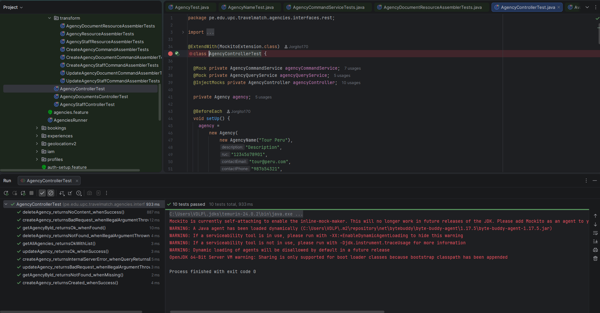
_Evidencia de ejecución de los tests de Interfaces Layer: REST Controllers para el Bounded Context Agencies._

65. **createAgency_returnsCreated_whenSuccess**(AgencyControllerTest)

65. **createAgency_returnsCreated_whenSuccess**(AgencyControllerTest)

Verifica que el controlador responda con un estado HTTP 201 (Created) cuando una agencia se registra exitosamente. Valida que el cuerpo de la respuesta contenga los datos de la agencia creada.

```java
@Test
void createAgency_returnsCreated_whenSuccess() {
  CreateAgencyResource resource =
      new CreateAgencyResource(
          "Tour Peru", "Description", "12345678901", "tour@peru.com", "987654321", 1L);
  when(agencyCommandService.handle(any(CreateAgencyCommand.class))).thenReturn(1L);
  when(agencyQueryService.handle(any(GetAgencyByIdQuery.class))).thenReturn(Optional.of(agency));

  ResponseEntity<AgencyResource> response = agencyController.createAgency(resource);

  assertEquals(HttpStatus.CREATED, response.getStatusCode());
  assertNotNull(response.getBody());
  assertEquals("Tour Peru", response.getBody().name());
}
```

66. **createAgency_returnsInternalServerError_whenQueryReturnsEmpty**(AgencyControllerTest)

Valida que el controlador maneje errores internos de consistencia si tras crear la agencia no es posible recuperarla para devolver el recurso, retornando un error 500.

```java
@Test
void createAgency_returnsInternalServerError_whenQueryReturnsEmpty() {
  CreateAgencyResource resource =
      new CreateAgencyResource(
          "Tour Peru", "Description", "12345678901", "tour@peru.com", "987654321", 1L);
  when(agencyCommandService.handle(any(CreateAgencyCommand.class))).thenReturn(1L);
  when(agencyQueryService.handle(any(GetAgencyByIdQuery.class))).thenReturn(Optional.empty());

  ResponseEntity<AgencyResource> response = agencyController.createAgency(resource);

  assertEquals(HttpStatus.INTERNAL_SERVER_ERROR, response.getStatusCode());
}
```

75. **createDocument_returnsCreated_whenSuccess**(AgencyDocumentsControllerTest)

Valida que el registro de un documento legal para una agencia devuelva un estado 201 y los detalles del nuevo recurso.

```java
@Test
void createDocument_returnsCreated_whenSuccess() {
  CreateAgencyDocumentResource resource =
      new CreateAgencyDocumentResource("RUC", "http://example.com/ruc.pdf", "RUC document");
  when(commandService.handle(any(CreateAgencyDocumentCommand.class)))
      .thenReturn(Optional.of(document));

  ResponseEntity<AgencyDocumentResource> response = controller.createDocument(1L, resource);

  assertEquals(HttpStatus.CREATED, response.getStatusCode());
  assertNotNull(response.getBody());
}
```

76. **createDocument_returnsInternalServerError_whenServiceReturnsEmpty**(AgencyDocumentsControllerTest)

Maneja fallos inesperados en la creación de documentos, retornando un error 500 si el servicio no logra procesar la solicitud.

```java
@Test
void createDocument_returnsInternalServerError_whenServiceReturnsEmpty() {
  CreateAgencyDocumentResource resource =
      new CreateAgencyDocumentResource("RUC", "http://example.com/ruc.pdf", "RUC document");
  when(commandService.handle(any(CreateAgencyDocumentCommand.class)))
      .thenReturn(Optional.empty());

  ResponseEntity<AgencyDocumentResource> response = controller.createDocument(1L, resource);

  assertEquals(HttpStatus.INTERNAL_SERVER_ERROR, response.getStatusCode());
}
```

77. **createDocument_returnsBadRequest_whenIllegalArgumentThrown**(AgencyDocumentsControllerTest)

Asegura el manejo de errores de validación en la creación de documentos, devolviendo un estado 400 ante datos inválidos.

```java
@Test
void createDocument_returnsBadRequest_whenIllegalArgumentThrown() {
  CreateAgencyDocumentResource resource =
      new CreateAgencyDocumentResource("RUC", "http://example.com/ruc.pdf", "RUC document");
  when(commandService.handle(any(CreateAgencyDocumentCommand.class)))
      .thenThrow(new IllegalArgumentException("Invalid"));

  ResponseEntity<AgencyDocumentResource> response = controller.createDocument(1L, resource);

  assertEquals(HttpStatus.BAD_REQUEST, response.getStatusCode());
}
```

88. **createStaff_returnsCreated_whenSuccess**(AgencyStaffControllerTest)

Valida que el registro de personal para una agencia devuelva un estado 201 y los detalles del nuevo miembro del equipo.

```java
@Test
void createStaff_returnsCreated_whenSuccess() {
  CreateAgencyStaffResource resource =
      new CreateAgencyStaffResource("John", "Doe", "john@peru.com", "987654321", "Manager");
  when(commandService.handle(any(CreateAgencyStaffCommand.class))).thenReturn(Optional.of(staff));

  ResponseEntity<AgencyStaffResource> response = controller.createStaff(1L, resource);

  assertEquals(HttpStatus.CREATED, response.getStatusCode());
  assertNotNull(response.getBody());
}
```

89. **createStaff_returnsInternalServerError_whenServiceReturnsEmpty**(AgencyStaffControllerTest)

Maneja fallos en la creación de personal, retornando un error 500 si el servicio no logra completar la operación.

```java
@Test
void createStaff_returnsInternalServerError_whenServiceReturnsEmpty() {
  CreateAgencyStaffResource resource =
      new CreateAgencyStaffResource("John", "Doe", "john@peru.com", "987654321", "Manager");
  when(commandService.handle(any(CreateAgencyStaffCommand.class))).thenReturn(Optional.empty());

  ResponseEntity<AgencyStaffResource> response = controller.createStaff(1L, resource);

  assertEquals(HttpStatus.INTERNAL_SERVER_ERROR, response.getStatusCode());
}
```

90. **createStaff_returnsBadRequest_whenIllegalArgumentThrown**(AgencyStaffControllerTest)

Asegura que el controlador capture errores de validación de personal (como emails duplicados) y retorne un estado 400.

```java
@Test
void createStaff_returnsBadRequest_whenIllegalArgumentThrown() {
  CreateAgencyStaffResource resource =
      new CreateAgencyStaffResource("John", "Doe", "john@peru.com", "987654321", "Manager");
  when(commandService.handle(any(CreateAgencyStaffCommand.class)))
      .thenThrow(new IllegalArgumentException("Invalid"));

  ResponseEntity<AgencyStaffResource> response = controller.createStaff(1L, resource);

  assertEquals(HttpStatus.BAD_REQUEST, response.getStatusCode());
}
```

105. **handle_getAllByAgencyId_agencyExists_returnsList**(AgencyStaffQueryServiceImplTest)

Valida la obtención de la lista de empleados para una agencia existente a través de la implementación del servicio de consulta.

```java
@Test
@DisplayName("Debe retornar lista de staff si la agencia existe")
void handle_getAllByAgencyId_agencyExists_returnsList() {
  // --- Arrange ---
  GetAllAgencyStaffByAgencyIdQuery query = new GetAllAgencyStaffByAgencyIdQuery(1L);
  when(agencyRepository.existsById(1L)).thenReturn(true);
  when(agencyStaffRepository.findByAgencyId(1L)).thenReturn(List.of(mock(AgencyStaff.class)));

  // --- Act ---
  List<AgencyStaff> result = agencyStaffQueryService.handle(query);

  // --- Assert ---
  assertFalse(result.isEmpty());
  verify(agencyStaffRepository).findByAgencyId(1L);
}
```

106. **handle_getById_exists_returnsOptional**(AgencyStaffQueryServiceImplTest)

Confirma que la recuperación de un empleado por ID sea exitosa en la capa de servicios de aplicación.

```java
@Test
@DisplayName("Debe retornar staff por su ID")
void handle_getById_exists_returnsOptional() {
  // --- Arrange ---
  GetAgencyStaffByIdQuery query = new GetAgencyStaffByIdQuery(1L);
  when(agencyStaffRepository.findById(1L)).thenReturn(Optional.of(mock(AgencyStaff.class)));

  // --- Act ---
  Optional<AgencyStaff> result = agencyStaffQueryService.handle(query);

  // --- Assert ---
  assertTrue(result.isPresent());
  verify(agencyStaffRepository).findById(1L);
}
```

##### Interfaces Layer: Resource Assemblers (Mapping Tests)
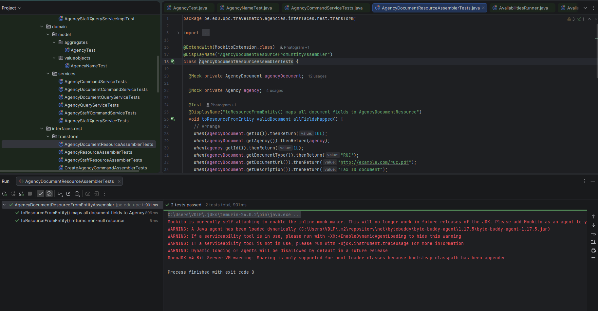
_Evidencia de ejecución de los tests de Interfaces Layer: Resource Assemblers (Mapping Tests) para el Bounded Context Agencies._

107. **toResourceFromEntity_validAgency_allFieldsMapped**(AgencyResourceAssemblerTests)

Verifica que el ensamblador mapee correctamente todos los campos de la entidad `Agency` al recurso `AgencyResource`, asegurando la correcta exposición de datos en la API.

```java
@Test
@DisplayName("toResourceFromEntity() maps all agency fields to AgencyResource correctly")
void toResourceFromEntity_validAgency_allFieldsMapped() {
  // Arrange
  AgencyName name = new AgencyName("Tour Perú");
  when(agency.getId()).thenReturn(1L);
  when(agency.getName()).thenReturn(name);
  when(agency.getDescription()).thenReturn("Great tours");
  when(agency.getRuc()).thenReturn("12345678901");
  when(agency.getContactEmail()).thenReturn("info@tp.com");
  when(agency.getContactPhone()).thenReturn("999888777");

  // Act
  var resource = AgencyResourceFromAgencyAssembler.toResourceFromEntity(agency);

  // Assert
  assertAll(
      () -> assertEquals(1L, resource.id()),
      () -> assertEquals("Tour Perú", resource.name()),
      () -> assertEquals("Great tours", resource.description()),
      () -> assertEquals("12345678901", resource.ruc()),
      () -> assertEquals("info@tp.com", resource.contactEmail()),
      () -> assertEquals("999888777", resource.contactPhone()));
}
```

109. **toResourceFromEntity_validDocument_allFieldsMapped**(AgencyDocumentResourceAssemblerTests)

Valida el mapeo completo de un `AgencyDocument` a su recurso correspondiente, incluyendo la transformación de la relación con la agencia a un ID plano.

```java
@Test
@DisplayName("toResourceFromEntity() maps all document fields to AgencyDocumentResource")
void toResourceFromEntity_validDocument_allFieldsMapped() {
  // Arrange
  when(agencyDocument.getId()).thenReturn(10L);
  when(agencyDocument.getAgency()).thenReturn(agency);
  when(agency.getId()).thenReturn(1L);
  when(agencyDocument.getDocumentType()).thenReturn("RUC");
  when(agencyDocument.getDocumentUrl()).thenReturn("http://example.com/ruc.pdf");
  when(agencyDocument.getDescription()).thenReturn("Tax ID document");

  // Act
  var resource = AgencyDocumentResourceFromEntityAssembler.toResourceFromEntity(agencyDocument);

  // Assert
  assertAll(
      () -> assertEquals(10L, resource.id()),
      () -> assertEquals(1L, resource.agencyId()),
      () -> assertEquals("RUC", resource.documentType()),
      () -> assertEquals("http://example.com/ruc.pdf", resource.documentUrl()),
      () -> assertEquals("Tax ID document", resource.description()));
}
```

111. **toResourceFromEntity_validStaff_allFieldsMapped**(AgencyStaffResourceAssemblerTests)

Valida que el personal de la agencia sea transformado correctamente a su recurso REST, asegurando que todos los atributos de contacto y posición se mantengan fieles.

```java
@Test
@DisplayName("toResourceFromEntity() maps all staff fields to AgencyStaffResource")
void toResourceFromEntity_validStaff_allFieldsMapped() {
  // Arrange
  when(staffEntity.getId()).thenReturn(5L);
  when(staffEntity.getAgency()).thenReturn(agency);
  when(agency.getId()).thenReturn(1L);
  when(staffEntity.getFirstName()).thenReturn("Juan");
  when(staffEntity.getLastName()).thenReturn("Pérez");
  when(staffEntity.getEmail()).thenReturn("juan@tp.com");
  when(staffEntity.getPhone()).thenReturn("987654321");
  when(staffEntity.getPosition()).thenReturn("Guide");

  // Act
  var resource = AgencyStaffResourceFromEntityAssembler.toResourceFromEntity(staffEntity);

  // Assert
  assertAll(
      () -> assertEquals(5L, resource.id()),
      () -> assertEquals(1L, resource.agencyId()),
      () -> assertEquals("Juan", resource.firstName()),
      () -> assertEquals("Pérez", resource.lastName()),
      () -> assertEquals("juan@tp.com", resource.email()),
      () -> assertEquals("987654321", resource.phone()),
      () -> assertEquals("Guide", resource.position()));
}
```

113. **toCommandFromResource_validResource_allFieldsMapped**(CreateAgencyCommandAssemblerTests)

Verifica que los datos recibidos desde el cliente para crear una agencia se mapeen correctamente al comando interno de la aplicación.

```java
@Test
@DisplayName("toCommandFromResource() maps all CreateAgencyResource fields to command")
void toCommandFromResource_validResource_allFieldsMapped() {
  // Arrange
  CreateAgencyResource resource =
      new CreateAgencyResource(
          "Tour Perú", "Great tours", "12345678901", "info@tp.com", "999888777", 1L);

  // Act
  CreateAgencyCommand command =
      CreateAgencyCommandFromResourceAssembler.toCommandFromResource(resource);

  // Assert
  assertAll(
      () -> assertEquals("Tour Perú", command.name()),
      () -> assertEquals("Great tours", command.description()),
      () -> assertEquals("12345678901", command.ruc()),
      () -> assertEquals("info@tp.com", command.contactEmail()),
      () -> assertEquals("999888777", command.contactPhone()),
      () -> assertEquals(1L, command.userId()));
}
```

115. **toCommandFromResource_validResource_allFieldsMapped**(CreateAgencyDocumentCommandAssemblerTests)

Valida que el recurso de creación de documentos y el ID de la agencia en la URL se integren correctamente en un único comando de aplicación.

```java
@Test
@DisplayName("toCommandFromResource() maps all CreateAgencyDocumentResource fields to command")
void toCommandFromResource_validResource_allFieldsMapped() {
  // Arrange
  Long agencyId = 1L;
  CreateAgencyDocumentResource resource =
      new CreateAgencyDocumentResource("RUC", "http://example.com/ruc.pdf", "Tax ID");

  // Act
  CreateAgencyDocumentCommand command =
      CreateAgencyDocumentCommandFromResourceAssembler.toCommandFromResource(agencyId, resource);

  // Assert
  assertAll(
      () -> assertEquals(1L, command.agencyId()),
      () -> assertEquals("RUC", command.documentType()),
      () -> assertEquals("http://example.com/ruc.pdf", command.documentUrl()),
      () -> assertEquals("Tax ID", command.description()));
}
```

117. **toCommandFromResource_validResource_allFieldsMapped**(CreateAgencyStaffCommandAssemblerTests)

Verifica el mapeo de los datos del nuevo staff y su vinculación con la agencia correspondiente en un comando unificado.

```java
@Test
@DisplayName("toCommandFromResource() maps all CreateAgencyStaffResource fields to command")
void toCommandFromResource_validResource_allFieldsMapped() {
  // Arrange
  Long agencyId = 1L;
  CreateAgencyStaffResource resource =
      new CreateAgencyStaffResource("Juan", "Pérez", "juan@tp.com", "987654321", "Guide");

  // Act
  CreateAgencyStaffCommand command =
      CreateAgencyStaffCommandFromResourceAssembler.toCommandFromResource(agencyId, resource);

  // Assert
  assertAll(
      () -> assertEquals(1L, command.agencyId()),
      () -> assertEquals("Juan", command.firstName()),
      () -> assertEquals("Pérez", command.lastName()),
      () -> assertEquals("juan@tp.com", command.email()),
      () -> assertEquals("987654321", command.phone()),
      () -> assertEquals("Guide", command.position()));
}
```

119. **toCommandFromResource_validResource_allFieldsMapped**(UpdateAgencyDocumentCommandAssemblerTests)

Valida que el recurso de actualización de documentos se transforme correctamente al comando interno, manteniendo la integridad del ID del documento.

```java
@Test
@DisplayName("toCommandFromResource() maps all UpdateAgencyDocumentResource fields to command")
void toCommandFromResource_validResource_allFieldsMapped() {
  // Arrange
  UpdateAgencyDocumentResource resource =
      new UpdateAgencyDocumentResource(
          3L, "LICENCIA", "http://example.com/lic.pdf", "Operating license");

  // Act
  UpdateAgencyDocumentCommand command =
      UpdateAgencyDocumentCommandFromResourceAssembler.toCommandFromResource(resource);

  // Assert
  assertAll(
      () -> assertEquals(3L, command.id()),
      () -> assertEquals("LICENCIA", command.documentType()),
      () -> assertEquals("http://example.com/lic.pdf", command.documentUrl()),
      () -> assertEquals("Operating license", command.description()));
}
```

121. **toCommandFromResource_validResource_allFieldsMapped**(UpdateAgencyStaffCommandAssemblerTests)

Valida el mapeo de cambios en el perfil del staff al comando de actualización correspondiente.

```java
@Test
@DisplayName("toCommandFromResource() maps all UpdateAgencyStaffResource fields to command")
void toCommandFromResource_validResource_allFieldsMapped() {
  // Arrange
  UpdateAgencyStaffResource resource =
      new UpdateAgencyStaffResource(
          5L, "Carlos", "López", "carlos@tp.com", "911111111", "Manager");

  // Act
  UpdateAgencyStaffCommand command =
      UpdateAgencyStaffCommandFromResourceAssembler.toCommandFromResource(resource);

  // Assert
  assertAll(
      () -> assertEquals(5L, command.id()),
      () -> assertEquals("Carlos", command.firstName()),
      () -> assertEquals("López", command.lastName()),
      () -> assertEquals("carlos@tp.com", command.email()),
      () -> assertEquals("911111111", command.phone()),
      () -> assertEquals("Manager", command.position()));
}
```

#### Bookings Bounded Context

##### Domain Layer: Aggregates & Entities
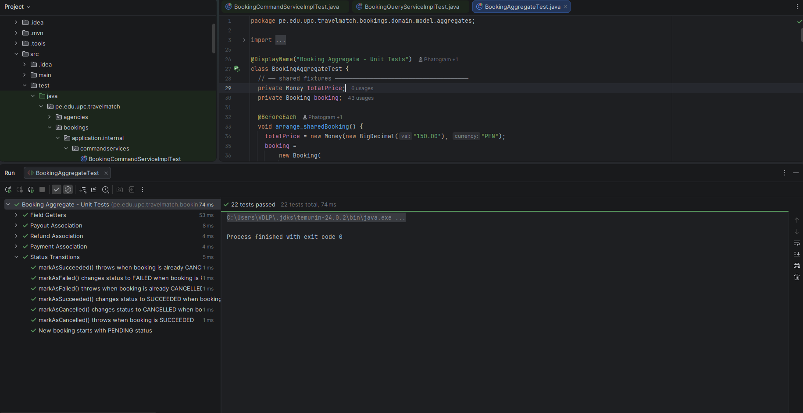
_Evidencia de ejecución de los tests de Domain Layer: Aggregates & Entities para el Bounded Context Bookings._

1. **markAsSucceeded_fromPending_statusIsSucceeded**(BookingAggregateTest)

Verifica que el estado de una reserva cambie correctamente de `PENDING` a `SUCCEEDED` cuando se marca como exitosa.

```java
@Test
@DisplayName("markAsSucceeded() changes status to SUCCEEDED when booking is PENDING")
void markAsSucceeded_fromPending_statusIsSucceeded() {
  // Arrange (Preparar) - Booking is PENDING by default in @BeforeEach

  // Act (Ejecutar)
  booking.markAsSucceeded();

  // Assert (Verificar)
  assertEquals(BookingStatus.SUCCEEDED, booking.getBookingStatus());
}
```

2. **markAsSucceeded_fromCancelled_throwsIllegalState**(BookingAggregateTest)

Asegura que el sistema lance una excepción si se intenta marcar como exitosa una reserva que ya ha sido cancelada, protegiendo el ciclo de vida del agregado.

```java
@Test
@DisplayName("markAsSucceeded() throws when booking is already CANCELLED")
void markAsSucceeded_fromCancelled_throwsIllegalState() {
  // Arrange
  booking.markAsCancelled();

  // Act & Assert
  assertThrows(IllegalStateException.class, booking::markAsSucceeded);
}
```

3. **markAsCancelled_fromPending_statusIsCancelled**(BookingAggregateTest)

Valida que una reserva pendiente pueda transicionar correctamente al estado cancelado.

```java
@Test
@DisplayName("markAsCancelled() changes status to CANCELLED when booking is PENDING")
void markAsCancelled_fromPending_statusIsCancelled() {
  // Arrange

  // Act
  booking.markAsCancelled();

  // Assert
  assertEquals(BookingStatus.CANCELLED, booking.getBookingStatus());
}
```

##### Application Layer: Command Services
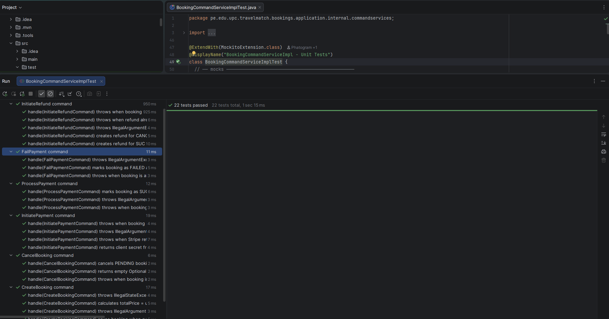
_Evidencia de ejecución de los tests de Application Layer: Command Services para el Bounded Context Bookings._

23. **handle_CreateBooking_ShouldSaveAndReturnId**(BookingCommandServiceImplTest)

Prueba el flujo de creación de reserva: valida disponibilidad, calcula precios y persiste la reserva pendiente.

```java
@Test
@DisplayName("handle(CreateBookingCommand) saves and returns booking ID")
void handle_CreateBooking_ShouldSaveAndReturnId() {
  // Arrange
  when(externalExperienceService.fetchAvailabilityById(anyLong())).thenReturn(Optional.of(availabilityResource));
  when(bookingRepository.save(any(Booking.class))).thenAnswer(i -> {
      Booking b = i.getArgument(0);
      return b;
  });

  // Act
  Long id = bookingCommandService.handle(createBookingCommand);

  // Assert
  verify(bookingRepository).save(any(Booking.class));
}
```

24. **handle_CreateBooking_ThrowsWhenAvailabilityNotFound**(BookingCommandServiceImplTest)

Asegura que falle la creación si la disponibilidad de la experiencia no existe.

```java
@Test
@DisplayName("handle(CreateBookingCommand) throws when availability not found")
void handle_CreateBooking_ThrowsWhenAvailabilityNotFound() {
  // Arrange
  when(externalExperienceService.fetchAvailabilityById(anyLong())).thenReturn(Optional.empty());

  // Act & Assert
  assertThrows(IllegalArgumentException.class, () -> bookingCommandService.handle(createBookingCommand));
}
```

25. **handle_CreateBooking_ThrowsWhenNotEnoughCapacity**(BookingCommandServiceImplTest)

Valida que no se permitan reservas si la cantidad solicitada supera el cupo disponible.

```java
@Test
@DisplayName("handle(CreateBookingCommand) throws when capacity is exceeded")
void handle_CreateBooking_ThrowsWhenNotEnoughCapacity() {
  // Arrange
  var lowCapacityResource = new AvailabilityResource(10L, 1L, Instant.now(), Instant.now(), 1, new ArrayList<>());
  when(externalExperienceService.fetchAvailabilityById(anyLong())).thenReturn(Optional.of(lowCapacityResource));

  // Act & Assert
  assertThrows(IllegalStateException.class, () -> bookingCommandService.handle(createBookingCommand));
}
```

26. **handle_CancelBooking_MarksAsCancelled**(BookingCommandServiceImplTest)

Prueba el servicio de cancelación de reserva, verificando el cambio de estado y actualización de disponibilidad externa.

```java
@Test
@DisplayName("handle(CancelBookingCommand) cancels booking and returns it")
void handle_CancelBooking_MarksAsCancelled() {
  // Arrange
  when(bookingRepository.findById(1L)).thenReturn(Optional.of(pendingBooking));

  // Act
  Optional<Booking> result = bookingCommandService.handle(new CancelBookingCommand(1L, "Reason"));

  // Assert
  assertTrue(result.isPresent());
  assertEquals(BookingStatus.CANCELLED, result.get().getBookingStatus());
}
```

##### Application Layer: Query Services
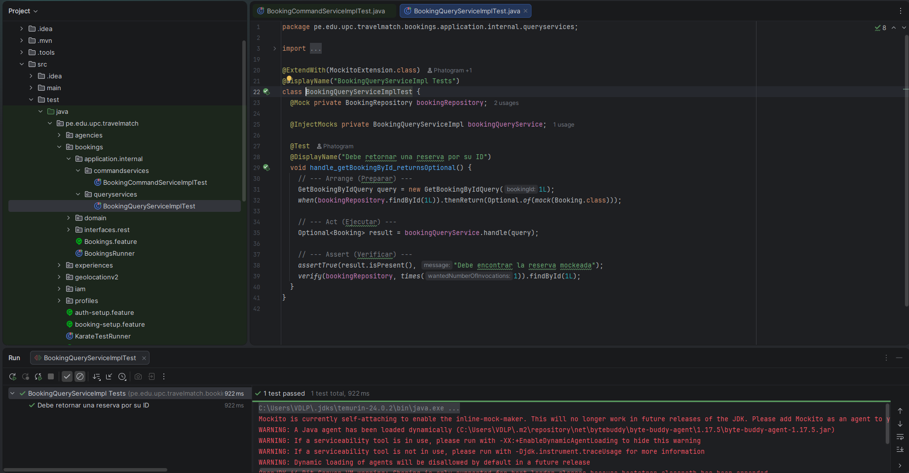
_Evidencia de ejecución de los tests de Application Layer: Query Services para el Bounded Context Bookings._

45. **handle_GetBookingById_ReturnsOptional**(BookingQueryServiceImplTest)

Verifica que el servicio de consulta recupere una reserva por su ID, interactuando fielmente con el repositorio de persistencia.

```java
@Test
void handle_GetBookingById_ReturnsOptional() {
  // Arrange
  GetBookingByIdQuery query = new GetBookingByIdQuery(1L);
  Booking booking = mock(Booking.class);
  when(bookingRepository.findById(1L)).thenReturn(Optional.of(booking));

  // Act
  Optional<Booking> result = bookingQueryService.handle(query);

  // Assert
  assertTrue(result.isPresent());
  assertEquals(booking, result.get());
  verify(bookingRepository).findById(1L);
}
```

##### Interfaces Layer: REST Controllers
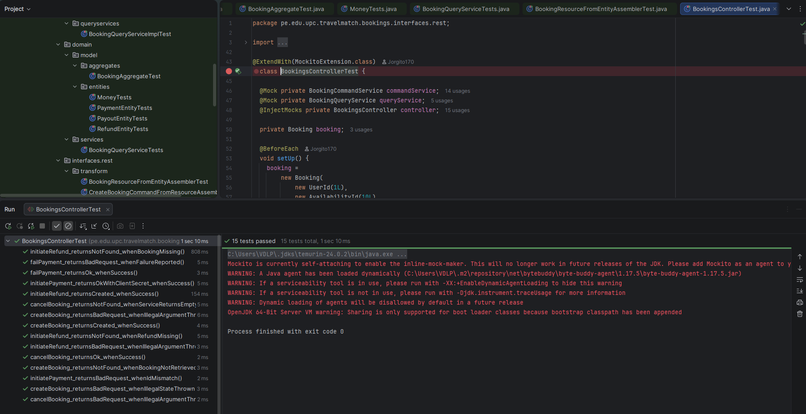
_Evidencia de ejecución de los tests de Interfaces Layer: REST Controllers para el Bounded Context Bookings._

46. **createBooking_returnsCreated_whenSuccess**(BookingsControllerTest)

Valida que el endpoint REST retorne 201 Created y el recurso DTO al crear exitosamente una reserva.

```java
@Test
void createBooking_returnsCreated_whenSuccess() {
  // Arrange
  CreateBookingResource resource = new CreateBookingResource(1L, 10L, 1L, 2, Instant.now());
  when(commandService.handle(any())).thenReturn(1L);
  when(queryService.handle(any())).thenReturn(Optional.of(booking));

  // Act
  ResponseEntity<BookingResource> response = controller.createBooking(resource);

  // Assert
  assertEquals(HttpStatus.CREATED, response.getStatusCode());
  assertNotNull(response.getBody());
  assertEquals(2, response.getBody().quantity());
}
```

47. **createBooking_returnsNotFound_whenBookingNotRetrieved**(BookingsControllerTest)

Maneja el escenario donde la reserva se crea pero no puede recuperarse inmediatamente para la respuesta.

```java
@Test
void createBooking_returnsNotFound_whenBookingNotRetrieved() {
  // Arrange
  when(commandService.handle(any())).thenReturn(1L);
  when(queryService.handle(any())).thenReturn(Optional.empty());

  // Act
  ResponseEntity<BookingResource> response = controller.createBooking(resource);

  // Assert
  assertEquals(HttpStatus.NOT_FOUND, response.getStatusCode());
}
```

48. **createBooking_returnsBadRequest_whenIllegalArgumentThrown**(BookingsControllerTest)

Valida que errores de validación de negocio se traduzcan en respuestas 400 Bad Request.

```java
@Test
void createBooking_returnsBadRequest_whenIllegalArgumentThrown() {
  // Arrange
  when(commandService.handle(any())).thenThrow(new IllegalArgumentException("Invalid"));

  // Act
  ResponseEntity<BookingResource> response = controller.createBooking(resource);

  // Assert
  assertEquals(HttpStatus.BAD_REQUEST, response.getStatusCode());
}
```

##### Interfaces Layer: Resource Assemblers (Mapping Tests)
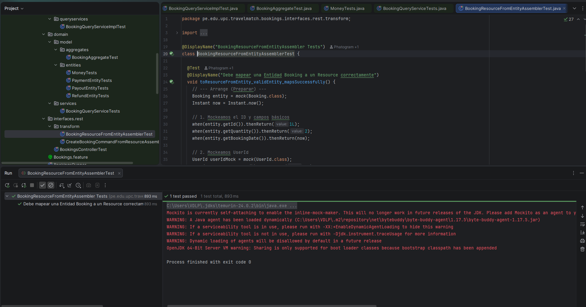
_Evidencia de ejecución de los tests de Interfaces Layer: Resource Assemblers para el Bounded Context Bookings._

61. **toResourceFromEntity_ShouldMapCorrectly**(BookingResourceFromEntityAssemblerTest)

Verifica que la entidad `Booking` se transforme fielmente en su recurso REST, incluyendo estatus y precios.

```java
@Test
void toResourceFromEntity_ShouldMapCorrectly() {
  // Arrange
  Booking entity = mock(Booking.class);
  when(entity.getId()).thenReturn(1L);

  // Act
  BookingResource resource = BookingResourceFromEntityAssembler.toResourceFromEntity(entity);

  // Assert
  assertNotNull(resource);
  assertEquals(1L, resource.id());
}
```

62. **toCommandFromResource_ShouldMapCorrectly**(CreateBookingCommandFromResourceAssemblerTest)

Valida que el DTO de entrada se convierta correctamente en el comando interno de creación de reserva.

```java
@Test
void toCommandFromResource_ShouldMapCorrectly() {
  // Act
  CreateBookingCommand command = CreateBookingCommandFromResourceAssembler.toCommandFromResource(resource);

  // Assert
  assertNotNull(command);
  assertEquals(2, command.quantity());
}
```


#### Experiences Bounded Context


##### Domain Layer: Aggregates & Entities
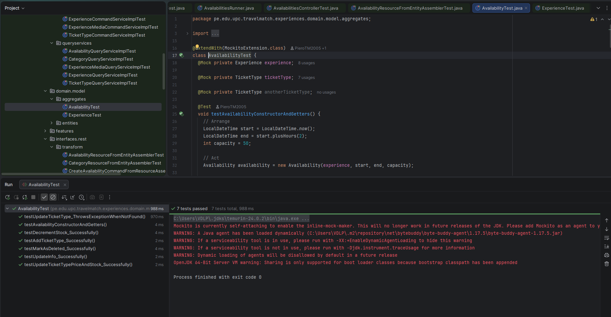
_Evidencia de ejecución de los tests de Domain Layer: Aggregates & Entities para el Bounded Context Experiences._

1. **testAvailabilityConstructorAndGetters**(AvailabilityTest)

Verifica que el constructor de `Availability` inicialice correctamente la experiencia, las fechas de inicio/fin y la capacidad, asegurando que la lista de tipos de tickets comience vacía.

```java
@Test
void testAvailabilityConstructorAndGetters() {
  // Arrange
  LocalDateTime start = LocalDateTime.now();
  LocalDateTime end = start.plusHours(2);
  int capacity = 50;

  // Act
  Availability availability = new Availability(experience, start, end, capacity);

  // Assert
  assertEquals(experience, availability.getExperience());
  assertEquals(start, availability.getStartDateTime());
  assertEquals(end, availability.getEndDateTime());
  assertEquals(capacity, availability.getCapacity());
  assertTrue(availability.getTicketTypes().isEmpty());
}
```

2. **testAddTicketType_Successfully**(AvailabilityTest)

Valida que se pueda añadir un tipo de ticket a una disponibilidad con su respectivo precio y stock, verificando la correcta persistencia en la colección interna.

```java
@Test
void testAddTicketType_Successfully() {
  // Arrange
  Availability availability =
      new Availability(experience, LocalDateTime.now(), LocalDateTime.now().plusHours(1), 20);
  BigDecimal price = new BigDecimal("100.00");
  int stock = 10;

  // Act
  availability.addTicketType(ticketType, price, stock);

  // Assert
  assertEquals(1, availability.getTicketTypes().size());
  var addedTicket = availability.getTicketTypes().iterator().next();
  assertEquals(ticketType, addedTicket.getTicketType());
  assertEquals(price, addedTicket.getPrice());
  assertEquals(stock, addedTicket.getStock());
}
```

8. **testExperienceConstructorAndGetters**(ExperienceTest)

Verifica la inicialización completa de un agregado `Experience`, incluyendo título, descripción, agencia, categoría y destino.

```java
@Test
void testExperienceConstructorAndGetters() {
  // Arrange
  String title = "Machu Picchu Tour";
  String description = "Full day tour to the Inca citadel";
  String duration = "12 hours";
  String meetingPoint = "Main Square Cusco";

  // Act
  Experience experience =
      new Experience(
          title, description, agencyId, category, destinationId, duration, meetingPoint);

  // Assert
  assertEquals(title, experience.getTitle());
  assertEquals(description, experience.getDescription());
  assertEquals(agencyId, experience.getAgencyId());
  assertEquals(category, experience.getCategory());
  assertEquals(destinationId, experience.getDestinationId());
  assertEquals(duration, experience.getDuration());
  assertEquals(meetingPoint, experience.getMeetingPoint());
  assertTrue(experience.getAvailabilities().isEmpty());
  assertTrue(experience.getMedia().isEmpty());
}
```

9. **testUpdateInfo_Successfully**(ExperienceTest)

Valida la actualización de los metadatos de una experiencia, asegurando que todos los campos modificables se guarden correctamente.

```java
@Test
void testUpdateInfo_Successfully() {
  // Arrange
  Experience experience =
      new Experience("Old Title", "Old Desc", agencyId, category, destinationId, "1h", "Point A");
  String newTitle = "New Title";
  String newDescription = "New Description updated";
  String newDuration = "2h";
  String newMeetingPoint = "Point B";

  // Act
  experience.updateInfo(
      newTitle,
      newDescription,
      anotherCategory,
      anotherDestinationId,
      newDuration,
      newMeetingPoint);

  // Assert
  assertEquals(newTitle, experience.getTitle());
  assertEquals(newDescription, experience.getDescription());
  assertEquals(anotherCategory, experience.getCategory());
  assertEquals(anotherDestinationId, experience.getDestinationId());
  assertEquals(newDuration, experience.getDuration());
  assertEquals(newMeetingPoint, experience.getMeetingPoint());
}
```

12. **testAvailabilityTicketTypeConstructorAndGetters**(AvailabilityTicketTypeTest)

Verifica que la entidad de enlace entre disponibilidad y ticket se cree con los valores correctos de precio y stock inicial.

```java
@Test
void testAvailabilityTicketTypeConstructorAndGetters() {
  // Arrange
  BigDecimal price = new BigDecimal("49.99");
  int stock = 20;

  // Act
  AvailabilityTicketType availabilityTicketType =
      new AvailabilityTicketType(availability, ticketType, price, stock);

  // Assert
  assertEquals(availability, availabilityTicketType.getAvailability());
  assertEquals(ticketType, availabilityTicketType.getTicketType());
  assertEquals(price, availabilityTicketType.getPrice());
  assertEquals(stock, availabilityTicketType.getStock());
}
```

13. **testReduceStock_Successfully**(AvailabilityTicketTypeTest)

Valida la reducción de stock tras una compra, confirmando que la lógica aritmética sea correcta.

```java
@Test
void testReduceStock_Successfully() {
  // Arrange
  int initialStock = 10;
  int quantityToReduce = 4;
  AvailabilityTicketType availabilityTicketType =
      new AvailabilityTicketType(availability, ticketType, BigDecimal.TEN, initialStock);

  // Act
  availabilityTicketType.reduceStock(quantityToReduce);

  // Assert
  assertEquals(6, availabilityTicketType.getStock());
}
```

15. **testCategoryConstructorAndGetters**(CategoryTest)

Valida que el constructor de la entidad `Category` mapee correctamente el enumerado de categorías del dominio.

```java
@Test
void testCategoryConstructorAndGetters() {
  // Arrange
  Categories expectedName = Categories.CULTURA;

  // Act
  Category category = new Category(expectedName);

  // Assert
  assertEquals(expectedName, category.getName());
}
```

16. **testGetCategoryName_ReturnsStringRepresentation**(CategoryTest)

Verifica que el método accesor retorne la representación textual correcta del nombre de la categoría.

```java
@Test
void testGetCategoryName_ReturnsStringRepresentation() {
  // Arrange
  Category category = new Category(Categories.GASTRONOMIA);

  // Act
  String name = category.getCategoryName();

  // Assert
  assertEquals("GASTRONOMIA", name);
}
```

21. **testExperienceMediaConstructorAndGetters**(ExperienceMediaTest)

Verifica que la entidad multimedia se cree correctamente con su URL, descripción y relación con la experiencia.

```java
@Test
void testExperienceMediaConstructorAndGetters() {
  // Arrange
  String mediaUrl = "https://example.com/image.jpg";
  String caption = "Vista panorámica";

  // Act
  ExperienceMedia media = new ExperienceMedia(experience, mediaUrl, caption);

  // Assert
  assertEquals(experience, media.getExperience());
  assertEquals(mediaUrl, media.getMediaUrl());
  assertEquals(caption, media.getCaption());
}
```

22. **testUpdate_Successfully**(ExperienceMediaTest)

Valida que se puedan actualizar la URL y el pie de foto de un recurso multimedia existente.

```java
@Test
void testUpdate_Successfully() {
  // Arrange
  ExperienceMedia media = new ExperienceMedia(experience, "old-url.com", "Old Caption");
  String newUrl = "new-url.com";
  String newCaption = "New Caption";

  // Act
  media.update(newUrl, newCaption);

  // Assert
  assertEquals(newUrl, media.getMediaUrl());
  assertEquals(newCaption, media.getCaption());
}
```

25. **testTicketTypeConstructorAndGetters**(TicketTypeTest)

Valida que el constructor de `TicketType` asigne correctamente el tipo de ticket desde el enumerado.

```java
@Test
void testTicketTypeConstructorAndGetters() {
  // Arrange
  TicketTypes expectedType = TicketTypes.TICKET_VIP;

  // Act
  TicketType ticketType = new TicketType(expectedType);

  // Assert
  assertEquals(expectedType, ticketType.getName());
}
```

26. **testGetTicketTypeName_ReturnsStringRepresentation**(TicketTypeTest)

Verifica el retorno de la representación en cadena del tipo de ticket para su uso en la capa de interfaces.

```java
@Test
void testGetTicketTypeName_ReturnsStringRepresentation() {
  // Arrange
  TicketType ticketType = new TicketType(TicketTypes.TICKET_GENERAL);

  // Act
  String name = ticketType.getTicketTypeName();

  // Assert
  assertEquals("TICKET_GENERAL", name);
}
```

##### Application Layer: Command Services
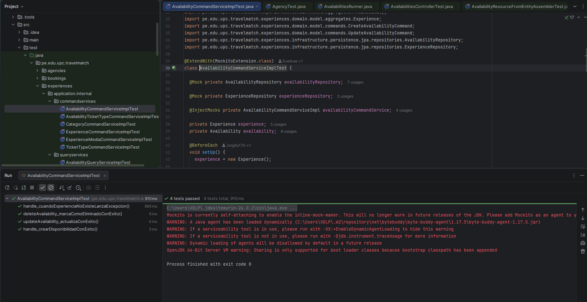
_Evidencia de ejecución de los tests de Application Layer: Command Services para el Bounded Context Experiences._

31. **handle_CreateAvailability_ShouldSave**(AvailabilityCommandServiceImplTest)

Verifica que el servicio de comandos cree una nueva disponibilidad correctamente cuando los datos son válidos, invocando el guardado en el repositorio.

```java
@Test
void handle_CreateAvailability_ShouldSave() {
    // Arrange
    var command = new CreateAvailabilityCommand(experience, start, end, 50);
    when(experienceRepository.existsById(any())).thenReturn(true);
    when(repository.save(any())).thenAnswer(i -> i.getArguments()[0]);

    // Act
    Long id = service.handle(command);

    // Assert
    assertNotNull(id);
    verify(repository).save(any());
}
```

32. **handle_CreateAvailability_ShouldThrowException_WhenExperienceNotFound**(AvailabilityCommandServiceImplTest)

Asegura que no se puedan crear disponibilidades para experiencias inexistentes.

```java
@Test
void handle_CreateAvailability_ShouldThrowException_WhenExperienceNotFound() {
    // Arrange
    var command = new CreateAvailabilityCommand(experience, start, end, 50);
    when(experienceRepository.existsById(any())).thenReturn(false);

    // Act & Assert
    assertThrows(IllegalArgumentException.class, () -> service.handle(command));
}
```

35. **handle_AddTicketType_ShouldUpdateAggregate**(AvailabilityTicketTypeCommandServiceImplTest)

Verifica que el servicio de comandos añada correctamente un tipo de ticket a una disponibilidad existente, orquestando la lógica del agregado.

```java
@Test
void handle_AddTicketType_ShouldUpdateAggregate() {
    // Arrange
    var command = new CreateAvailabilityTicketTypeCommand(1L, 1L, BigDecimal.TEN, 10);
    when(availabilityRepository.findById(1L)).thenReturn(Optional.of(availability));
    when(ticketTypeRepository.findById(1L)).thenReturn(Optional.of(ticketType));

    // Act
    service.handle(command);

    // Assert
    verify(availabilityRepository).save(availability);
}
```

36. **handle_AddTicketType_ShouldThrow_WhenAvailabilityNotFound**(AvailabilityTicketTypeCommandServiceImplTest)

Valida el manejo de errores cuando se intenta asociar un ticket a una disponibilidad que no existe.

```java
@Test
void handle_AddTicketType_ShouldThrow_WhenAvailabilityNotFound() {
    // Arrange
    var command = new CreateAvailabilityTicketTypeCommand(99L, 1L, BigDecimal.TEN, 10);
    when(availabilityRepository.findById(99L)).thenReturn(Optional.empty());

    // Act & Assert
    assertThrows(IllegalArgumentException.class, () -> service.handle(command));
}
```

38. **handle_SeedCategories_CreatesMissing**(CategoryCommandServiceImplTest)

Verifica que el servicio de inicialización cargue las categorías base si no están presentes.

```java
@Test
void handle_SeedCategories_CreatesMissing() {
    // Arrange
    when(repository.existsByName(any())).thenReturn(false);

    // Act
    service.handle(new SeedCategoriesCommand());

    // Assert
    verify(repository, atLeastOnce()).save(any());
}
```

39. **handle_SeedCategories_SkipsExisting**(CategoryCommandServiceImplTest)

Asegura la idempotencia del seeder de categorías al saltar las que ya existen.

```java
@Test
void handle_SeedCategories_SkipsExisting() {
    // Arrange
    when(repository.existsByName(any())).thenReturn(true);

    // Act
    service.handle(new SeedCategoriesCommand());

    // Assert
    verify(repository, never()).save(any());
}
```

40. **handle_CreateExperience_ShouldSave**(ExperienceCommandServiceImplTest)

Valida que el servicio cree una experiencia correctamente, asociándola a una categoría válida.

```java
@Test
void handle_CreateExperience_ShouldSave() {
    // Arrange
    var command = new CreateExperienceCommand("Title", "Desc", 1L, "CULTURA", 1L, "1h", "Point");
    when(categoryRepository.findByName(any())).thenReturn(Optional.of(category));

    // Act
    Long id = service.handle(command);

    // Assert
    verify(repository).save(any());
}
```

41. **handle_CreateExperience_ShouldThrow_WhenCategoryNotFound**(ExperienceCommandServiceImplTest)

Prueba que falle la creación si la categoría proporcionada no está registrada.

```java
@Test
void handle_CreateExperience_ShouldThrow_WhenCategoryNotFound() {
    // Arrange
    var command = new CreateExperienceCommand("Title", "Desc", 1L, "INVALID", 1L, "1h", "Point");
    when(categoryRepository.findByName(any())).thenReturn(Optional.empty());

    // Act & Assert
    assertThrows(IllegalArgumentException.class, () -> service.handle(command));
}
```

44. **handle_createMedia_experienceExists_mediaIsSaved**(ExperienceMediaCommandServiceImplTest)

Verifica la creación exitosa de un recurso multimedia cuando la experiencia asociada existe.

```java
@Test
void handle_createMedia_experienceExists_mediaIsSaved() {
    // Arrange
    CreateExperienceMediaCommand command = new CreateExperienceMediaCommand(existingExperience, "url", "caption");
    when(experienceRepository.findById(any())).thenReturn(Optional.of(existingExperience));

    // Act
    mediaCommandService.handle(command);

    // Assert
    verify(mediaRepository).save(any());
}
```

45. **handle_createMedia_experienceNotFound_throwsException**(ExperienceMediaCommandServiceImplTest)

Asegura que falle la creación de multimedia si la experiencia referenciada no existe.

```java
@Test
void handle_createMedia_experienceNotFound_throwsException() {
    // Arrange
    CreateExperienceMediaCommand command = new CreateExperienceMediaCommand(existingExperience, "url", "caption");
    when(experienceRepository.findById(any())).thenReturn(Optional.empty());

    // Act & Assert
    assertThrows(IllegalArgumentException.class, () -> mediaCommandService.handle(command));
}
```

48. **testHandleSeedTicketTypesCommand_CreatesMissingTicketTypes**(TicketTypeCommandServiceImplTest)

Verifica que el servicio cargue todos los tipos de tickets definidos en el enumerado si faltan en la DB.

```java
@Test
void testHandleSeedTicketTypesCommand_CreatesMissingTicketTypes() {
    // Arrange
    when(ticketTypeRepository.existsByName(any())).thenReturn(false);

    // Act
    ticketTypeCommandService.handle(new SeedTicketTypesCommand());

    // Assert
    verify(ticketTypeRepository, times(TicketTypes.values().length)).save(any());
}
```

49. **testHandleSeedTicketTypesCommand_SkipsExistingTicketTypes**(TicketTypeCommandServiceImplTest)

Asegura que no se dupliquen tipos de tickets si ya están presentes.

```java
@Test
void testHandleSeedTicketTypesCommand_SkipsExistingTicketTypes() {
    // Arrange
    when(ticketTypeRepository.existsByName(any())).thenReturn(true);

    // Act
    ticketTypeCommandService.handle(new SeedTicketTypesCommand());

    // Assert
    verify(ticketTypeRepository, never()).save(any());
}
```

##### Application Layer: Query Services
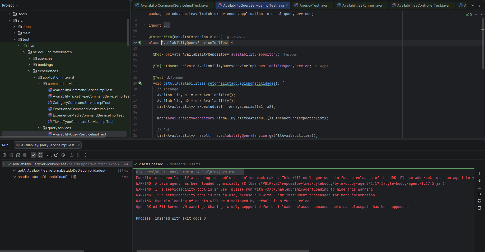
_Evidencia de ejecución de los tests de Application Layer: Query Services para el Bounded Context Experiences._

50. **handle_GetAllAvailabilities_ShouldReturnList**(AvailabilityQueryServiceImplTest)

Prueba que el servicio retorne todas las disponibilidades activas consultando al repositorio.

```java
@Test
void handle_GetAllAvailabilities_ShouldReturnList() {
    // Arrange
    when(repository.findAll()).thenReturn(List.of(mock(Availability.class)));

    // Act
    var result = service.handle(new GetAllAvailabilitiesQuery());

    // Assert
    assertEquals(1, result.size());
}
```

51. **handle_GetAvailabilityById_ShouldReturnOptional**(AvailabilityQueryServiceImplTest)

Verifica la recuperación de una disponibilidad específica por su ID.

```java
@Test
void handle_GetAvailabilityById_ShouldReturnOptional() {
    // Arrange
    when(repository.findById(1L)).thenReturn(Optional.of(mock(Availability.class)));

    // Act
    var result = service.handle(new GetAvailabilityByIdQuery(1L));

    // Assert
    assertTrue(result.isPresent());
}
```

52. **handle_GetAllCategories_ShouldReturnList**(CategoryQueryServiceImplTest)

Valida la obtención del catálogo completo de categorías.

```java
@Test
void handle_GetAllCategories_ShouldReturnList() {
    // Arrange
    when(repository.findAll()).thenReturn(List.of(mock(Category.class)));

    // Act
    var result = service.handle(new GetAllCategoriesQuery());

    // Assert
    assertEquals(1, result.size());
}
```

53. **handle_GetCategoryById_ShouldReturnOptional**(CategoryQueryServiceImplTest)

Prueba la búsqueda de una categoría individual.

```java
@Test
void handle_GetCategoryById_ShouldReturnOptional() {
    // Arrange
    when(repository.findById(1L)).thenReturn(Optional.of(mock(Category.class)));

    // Act
    var result = service.handle(new GetCategoryByIdQuery(1L));

    // Assert
    assertTrue(result.isPresent());
}
```

54. **handle_GetAllMedia_ShouldReturnList**(ExperienceMediaQueryServiceImplTest)

Verifica que el servicio liste todos los recursos multimedia registrados.

```java
@Test
void handle_GetAllMedia_ShouldReturnList() {
    // Arrange
    when(repository.findAll()).thenReturn(List.of(mock(ExperienceMedia.class)));

    // Act
    var result = service.handle(new GetAllExperienceMediaQuery());

    // Assert
    assertEquals(1, result.size());
}
```

55. **handle_GetMediaById_ShouldReturnOptional**(ExperienceMediaQueryServiceImplTest)

Prueba la recuperación de un recurso multimedia por su identificador.

```java
@Test
void handle_GetMediaById_ShouldReturnOptional() {
    // Arrange
    when(repository.findById(1L)).thenReturn(Optional.of(mock(ExperienceMedia.class)));

    // Act
    var result = service.handle(new GetExperienceMediaByIdQuery(1L));

    // Assert
    assertTrue(result.isPresent());
}
```

56. **handle_GetAllExperiences_ShouldReturnList**(ExperienceQueryServiceImplTest)

Valida la consulta masiva de experiencias en el sistema.

```java
@Test
void handle_GetAllExperiences_ShouldReturnList() {
    // Arrange
    when(repository.findAll()).thenReturn(List.of(mock(Experience.class)));

    // Act
    var result = service.handle(new GetAllExperiencesQuery());

    // Assert
    assertEquals(1, result.size());
}
```

57. **handle_GetExperienceById_ShouldReturnOptional**(ExperienceQueryServiceImplTest)

Verifica la búsqueda de una experiencia detallada por ID.

```java
@Test
void handle_GetExperienceById_ShouldReturnOptional() {
    // Arrange
    when(repository.findById(5L)).thenReturn(Optional.of(mock(Experience.class)));

    // Act
    var result = service.handle(new GetExperienceByIdQuery(5L));

    // Assert
    assertTrue(result.isPresent());
}
```

58. **handle_GetAllTicketTypes_ShouldReturnList**(TicketTypeQueryServiceImplTest)

Prueba la obtención de todos los tipos de tickets disponibles.

```java
@Test
void handle_GetAllTicketTypes_ShouldReturnList() {
    // Arrange
    when(repository.findAll()).thenReturn(List.of(mock(TicketType.class)));

    // Act
    var result = service.handle(new GetAllTicketTypesQuery());

    // Assert
    assertEquals(1, result.size());
}
```

59. **handle_GetTicketTypeById_ShouldReturnOptional**(TicketTypeQueryServiceImplTest)

Valida la recuperación de un tipo de ticket específico.

```java
@Test
void handle_GetTicketTypeById_ShouldReturnOptional() {
    // Arrange
    when(repository.findById(1L)).thenReturn(Optional.of(mock(TicketType.class)));

    // Act
    var result = service.handle(new GetTicketTypeByIdQuery(1L));

    // Assert
    assertTrue(result.isPresent());
}
```

##### Interfaces Layer: REST Controllers
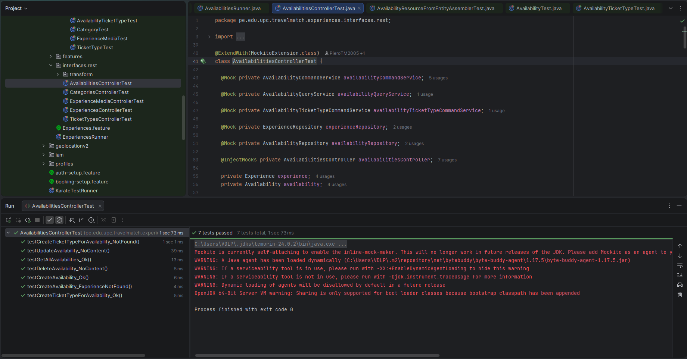
_Evidencia de ejecución de los tests de Interfaces Layer: REST Controllers para el Bounded Context Experiences._

60. **testCreateAvailability_Created**(AvailabilitiesControllerTest)

Verifica que el controlador responda 201 Created tras crear exitosamente una disponibilidad.

```java
@Test
void testCreateAvailability_Created() {
    // Arrange
    when(commandService.handle(any())).thenReturn(1L);
    when(queryService.handle(any())).thenReturn(Optional.of(mock(Availability.class)));

    // Act
    var response = controller.createAvailability(1L, resource);

    // Assert
    assertEquals(HttpStatus.CREATED, response.getStatusCode());
}
```

61. **testCreateAvailability_NotFound**(AvailabilitiesControllerTest)

Asegura un 404 si la disponibilidad no puede recuperarse tras su supuesta creación.

```java
@Test
void testCreateAvailability_NotFound() {
    // Arrange
    when(commandService.handle(any())).thenReturn(1L);
    when(queryService.handle(any())).thenReturn(Optional.empty());

    // Act
    var response = controller.createAvailability(1L, resource);

    // Assert
    assertEquals(HttpStatus.NOT_FOUND, response.getStatusCode());
}
```

62. **testGetAllAvailabilities_Ok**(AvailabilitiesControllerTest)

Valida el listado de todas las disponibilidades con un 200 OK.

```java
@Test
void testGetAllAvailabilities_Ok() {
    // Arrange
    when(queryService.handle(any())).thenReturn(List.of());

    // Act
    var response = controller.getAllAvailabilities();

    // Assert
    assertEquals(HttpStatus.OK, response.getStatusCode());
}
```

67. **testGetAllCategories_Ok**(CategoriesControllerTest)

Prueba el listado de categorías vía API.

```java
@Test
void testGetAllCategories_Ok() {
    // Arrange
    when(queryService.handle(any())).thenReturn(List.of());

    // Act
    var response = controller.getAllCategories();

    // Assert
    assertEquals(HttpStatus.OK, response.getStatusCode());
}
```

68. **testGetCategoryById_Ok**(CategoriesControllerTest)

Valida la obtención de categoría por ID vía API.

```java
@Test
void testGetCategoryById_Ok() {
    // Arrange
    when(queryService.handle(any())).thenReturn(Optional.of(mock(Category.class)));

    // Act
    var response = controller.getCategoryById(1L);

    // Assert
    assertEquals(HttpStatus.OK, response.getStatusCode());
}
```

69. **testCreateMedia_Created**(ExperienceMediaControllerTest)

Verifica la creación de multimedia con respuesta 201.

```java
@Test
void testCreateMedia_Created() {
    // Arrange
    when(queryService.handle(any())).thenReturn(Optional.of(mock(ExperienceMedia.class)));

    // Act
    var response = controller.createExperienceMedia(resource);

    // Assert
    assertEquals(HttpStatus.CREATED, response.getStatusCode());
}
```

70. **testCreateMedia_NotFound**(ExperienceMediaControllerTest)

Maneja el error 404 si el recurso no aparece tras crearse.

```java
@Test
void testCreateMedia_NotFound() {
    // Arrange
    when(queryService.handle(any())).thenReturn(Optional.empty());

    // Act
    var response = controller.createExperienceMedia(resource);

    // Assert
    assertEquals(HttpStatus.NOT_FOUND, response.getStatusCode());
}
```

71. **testGetAllMedia_Ok**(ExperienceMediaControllerTest)

Prueba el listado de recursos multimedia.

```java
@Test
void testGetAllMedia_Ok() {
    // Arrange
    when(queryService.handle(any())).thenReturn(List.of());

    // Act
    var response = controller.getAllExperienceMedia();

    // Assert
    assertEquals(HttpStatus.OK, response.getStatusCode());
}
```

76. **testCreateExperience_Created**(ExperiencesControllerTest)

Verifica la creación de una experiencia con respuesta 201.

```java
@Test
void testCreateExperience_Created() {
    // Arrange
    when(commandService.handle(any())).thenReturn(10L);
    when(queryService.handle(any())).thenReturn(Optional.of(experience));

    // Act
    var response = experiencesController.createExperience(1L, resource);

    // Assert
    assertEquals(HttpStatus.CREATED, response.getStatusCode());
}
```

77. **testCreateExperience_NotFound**(ExperiencesControllerTest)

Maneja el 404 si la experiencia no se encuentra tras ser creada.

```java
@Test
void testCreateExperience_NotFound() {
    // Arrange
    when(commandService.handle(any())).thenReturn(10L);
    when(queryService.handle(any())).thenReturn(Optional.empty());

    // Act
    var response = experiencesController.createExperience(1L, resource);

    // Assert
    assertEquals(HttpStatus.NOT_FOUND, response.getStatusCode());
}
```

78. **testGetAllExperiences_Ok**(ExperiencesControllerTest)

Prueba el listado público de experiencias.

```java
@Test
void testGetAllExperiences_Ok() {
    // Arrange
    when(queryService.handle(any())).thenReturn(List.of(experience));

    // Act
    var response = experiencesController.getAllExperiences();

    // Assert
    assertEquals(HttpStatus.OK, response.getStatusCode());
}
```

84. **testGetAllTicketTypes_Ok**(TicketTypesControllerTest)

Prueba el listado de tipos de tickets.

```java
@Test
void testGetAllTicketTypes_Ok() {
    // Arrange
    when(queryService.handle(any())).thenReturn(List.of());

    // Act
    var response = controller.getAllTicketTypes();

    // Assert
    assertEquals(HttpStatus.OK, response.getStatusCode());
}
```

85. **testGetTicketTypeById_Ok**(TicketTypesControllerTest)

Valida la obtención por ID de tipo de ticket.

```java
@Test
void testGetTicketTypeById_Ok() {
    // Arrange
    when(queryService.handle(any())).thenReturn(Optional.of(mock(TicketType.class)));

    // Act
    var response = controller.getTicketTypeById(1L);

    // Assert
    assertEquals(HttpStatus.OK, response.getStatusCode());
}
```

##### Interfaces Layer: Resource Assemblers (Mapping Tests)
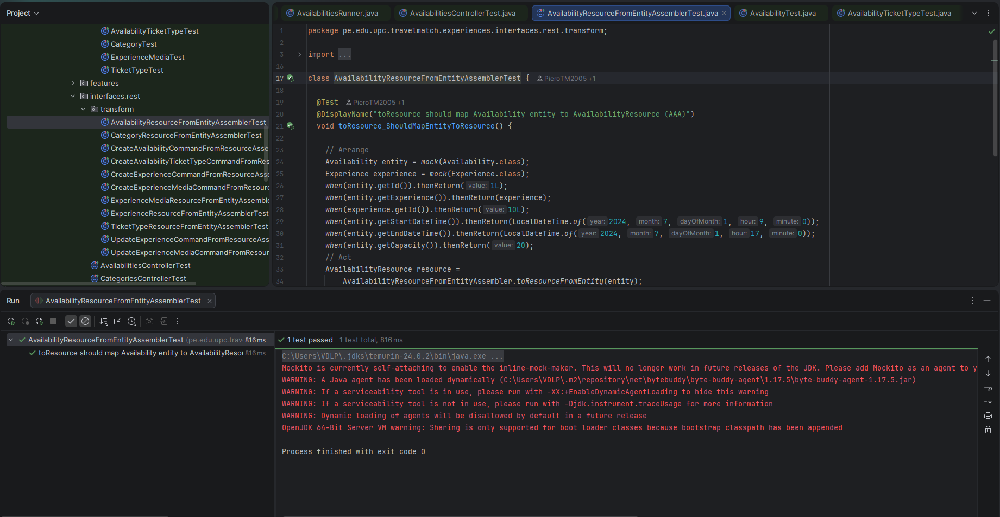
_Evidencia de ejecución de los tests de Interfaces Layer: Resource Assemblers para el Bounded Context Experiences._

86. **toResourceFromEntity_ShouldMapCorrectly**(AvailabilityResourceFromEntityAssemblerTest)

Verifica que la entidad `Availability` se transforme correctamente en su DTO de salida.

```java
@Test
void toResourceFromEntity_ShouldMapCorrectly() {
    // Arrange
    var entity = mock(Availability.class);
    when(entity.getId()).thenReturn(1L);

    // Act
    var resource = AvailabilityResourceFromEntityAssembler.toResourceFromEntity(entity);

    // Assert
    assertEquals(1L, resource.id());
}
```

87. **toResourceFromEntity_ShouldMapCorrectly**(CategoryResourceFromEntityAssemblerTest)

Prueba el mapeo de la entidad `Category` a su recurso REST.

```java
@Test
void toResourceFromEntity_ShouldMapCorrectly() {
    // Arrange
    var entity = new Category(Categories.GASTRONOMIA);

    // Act
    var resource = CategoryResourceFromEntityAssembler.toResourceFromEntity(entity);

    // Assert
    assertEquals("GASTRONOMIA", resource.name());
}
```

88. **toCommandFromResource_ShouldMapCorrectly**(CreateAvailabilityCommandFromResourceAssemblerTest)

Valida la conversión del recurso de creación a comando interno para disponibilidad.

```java
@Test
void toCommandFromResource_ShouldMapCorrectly() {
    // Act
    var command = CreateAvailabilityCommandFromResourceAssembler.toCommandFromResource(mock(Experience.class), resource);

    // Assert
    assertNotNull(command);
}
```

89. **toCommandFromResource_ShouldMapCorrectly**(CreateAvailabilityTicketTypeCommandFromResourceAssemblerTest)

Verifica el mapeo para la asociación de tipos de tickets.

```java
@Test
void toCommandFromResource_ShouldMapCorrectly() {
    // Act
    var command = CreateAvailabilityTicketTypeCommandFromResourceAssembler.toCommandFromResource(1L, 1L, resource);

    // Assert
    assertEquals(1L, command.availabilityId());
}
```

90. **toCommandFromResource_ShouldMapCorrectly**(CreateExperienceCommandFromResourceAssemblerTest)

Prueba la transformación del recurso de entrada a comando de creación de experiencia.

```java
@Test
void toCommandFromResource_ShouldMapCorrectly() {
    // Act
    var command = CreateExperienceCommandFromResourceAssembler.toCommandFromResource(1L, resource);

    // Assert
    assertEquals("Title", command.title());
}
```

91. **toCommandFromResource_ShouldMapCorrectly**(CreateExperienceMediaCommandFromResourceAssemblerTest)

Valida el mapeo para la creación de recursos multimedia.

```java
@Test
void toCommandFromResource_ShouldMapCorrectly() {
    // Act
    var command = CreateExperienceMediaCommandFromResourceAssembler.toCommandFromResource(mock(Experience.class), resource);

    // Assert
    assertNotNull(command);
}
```

92. **toResourceFromEntity_ShouldMapCorrectly**(ExperienceMediaResourceFromEntityAssemblerTest)

Verifica que el recurso multimedia se mapee correctamente para la API.

```java
@Test
void toResourceFromEntity_ShouldMapCorrectly() {
    // Arrange
    var entity = mock(ExperienceMedia.class);
    when(entity.getMediaUrl()).thenReturn("url");

    // Act
    var resource = ExperienceMediaResourceFromEntityAssembler.toResourceFromEntity(entity);

    // Assert
    assertEquals("url", resource.mediaUrl());
}
```

93. **toResourceFromEntity_ShouldMapCorrectly**(ExperienceResourceFromEntityAssemblerTest)

Prueba el mapeo integral del agregado `Experience` a su recurso REST.

```java
@Test
void toResourceFromEntity_ShouldMapCorrectly() {
    // Arrange
    var entity = mock(Experience.class);
    when(entity.getTitle()).thenReturn("Title");

    // Act
    var resource = ExperienceResourceFromEntityAssembler.toResourceFromEntity(entity);

    // Assert
    assertEquals("Title", resource.title());
}
```

94. **toResourceFromEntity_ShouldMapCorrectly**(TicketTypeResourceFromEntityAssemblerTest)

Verifica el mapeo de la entidad `TicketType` a su recurso REST.

```java
@Test
void toResourceFromEntity_ShouldMapCorrectly() {
    // Arrange
    var entity = new TicketType(TicketTypes.TICKET_VIP);

    // Act
    var resource = TicketTypeResourceFromEntityAssembler.toResourceFromEntity(entity);

    // Assert
    assertEquals("TICKET_VIP", resource.name());
}
```

95. **toCommandFromResource_ShouldMapCorrectly**(UpdateExperienceCommandFromResourceAssemblerTest)

Valida la conversión del recurso de actualización a comando para experiencia.

```java
@Test
void toCommandFromResource_ShouldMapCorrectly() {
    // Act
    var command = UpdateExperienceCommandFromResourceAssembler.toCommandFromResource(1L, resource);

    // Assert
    assertEquals(1L, command.experienceId());
}
```

96. **toCommandFromResource_ShouldMapCorrectly**(UpdateExperienceMediaCommandFromResourceAssemblerTest)

Verifica el mapeo para la actualización de recursos multimedia.

```java
@Test
void toCommandFromResource_ShouldMapCorrectly() {
    // Act
    var command = UpdateExperienceMediaCommandFromResourceAssembler.toCommandFromResource(1L, resource);

    // Assert
    assertEquals(1L, command.mediaId());
}
```


#### IAM Bounded Context


##### Application Layer: Command Services

1. **handle_SeedRolesCommand_ShouldSaveMissingRoles**(RoleCommandServiceImplTest)

Esta prueba valida que el servicio de inicialización de roles funcione de manera idempotente. Verifica que el sistema identifique qué roles de la enumeración `Roles` (como `ROLE_ADMIN`, `ROLE_TOURIST`, `ROLE_AGENCY_STAFF`) ya existen en la base de datos y proceda a guardar únicamente aquellos que faltan. Esto garantiza que el sistema siempre cuente con los roles base necesarios para su funcionamiento sin generar duplicados.

```java
@Test
@DisplayName("handle(SeedRolesCommand) should save all missing roles")
void handle_SeedRolesCommand_ShouldSaveMissingRoles() {
  // Arrange
  final var command = new SeedRolesCommand();

  when(roleRepository.existsByName(Roles.ROLE_ADMIN)).thenReturn(true);
  when(roleRepository.existsByName(Roles.ROLE_AGENCY_STAFF)).thenReturn(false);
  when(roleRepository.existsByName(Roles.ROLE_TOURIST)).thenReturn(false);

  // Act
  roleCommandService.handle(command);

  // Assert
  verify(roleRepository, atLeastOnce()).existsByName(any());
  verify(roleRepository, atLeastOnce()).save(any(Role.class));
}
```

2. **handle_SignUpCommand_ShouldReturnUser_WhenCreationIsSuccessful**(UserCommandServiceImplTest)

Esta prueba fundamental verifica el flujo completo de registro de un nuevo usuario. Simula un escenario exitoso donde el correo electrónico es único, se recupera el rol de turista por defecto, se cifra la contraseña y finalmente se persiste la entidad. Valida que el objeto retornado coincida con el esperado y que todas las dependencias (repositorios y servicios de seguridad) se invoquen correctamente.

```java
@Test
@DisplayName("handle(SignUpCommand) should return User when creation is successful")
void handle_SignUpCommand_ShouldReturnUser_WhenCreationIsSuccessful() {
  // Arrange
  var command =
      new SignUpCommand(
          "john.doe@example.com", "password123", "John", "Doe", "123456789", new ArrayList<>());
  var role = new Role(Roles.ROLE_TOURIST);
  var expectedUser =
      new User(
          command.email(),
          "encodedPassword",
          command.firstName(),
          command.lastName(),
          command.phone(),
          List.of(role));

  when(userRepository.existsByEmail(command.email())).thenReturn(false);
  when(roleRepository.findByName(Roles.ROLE_TOURIST)).thenReturn(Optional.of(role));
  when(hashingService.encode(command.password())).thenReturn("encodedPassword");
  when(userRepository.findByEmail(command.email())).thenReturn(Optional.of(expectedUser));

  // Act
  var result = userCommandService.handle(command);

  // Assert
  assertTrue(result.isPresent());
  assertEquals(expectedUser, result.get());

  verify(userRepository).existsByEmail(command.email());
  verify(roleRepository).findByName(Roles.ROLE_TOURIST);
  verify(hashingService).encode(command.password());
  verify(userRepository).save(any(User.class));
  verify(userRepository).findByEmail(command.email());
  verifyNoMoreInteractions(userRepository, roleRepository, hashingService, tokenService);
}
```

3. **handle_SignUpCommand_ShouldThrowRuntimeException_WhenEmailAlreadyExists**(UserCommandServiceImplTest)

Valida la regla de negocio que impide el registro de múltiples usuarios con la misma dirección de correo electrónico. La prueba asegura que, si el repositorio indica que el email ya existe, el servicio lance una `RuntimeException` con el mensaje adecuado y detenga el proceso inmediatamente sin realizar operaciones costosas como el cifrado de contraseñas.

```java
@Test
@DisplayName("handle(SignUpCommand) should throw RuntimeException when email already exists")
void handle_SignUpCommand_ShouldThrowRuntimeException_WhenEmailAlreadyExists() {
  // Arrange
  var command =
      new SignUpCommand(
          "john.doe@example.com", "password123", "John", "Doe", "123456789", new ArrayList<>());
  when(userRepository.existsByEmail(command.email())).thenReturn(true);

  // Act + Assert
  assertThrows(
      RuntimeException.class, () -> userCommandService.handle(command), "Email already exists");

  verify(userRepository).existsByEmail(command.email());
  verifyNoMoreInteractions(userRepository, roleRepository, hashingService, tokenService);
}
```

4. **handle_SignUpCommand_ShouldThrowRuntimeException_WhenRoleNotFound**(UserCommandServiceImplTest)

Esta prueba verifica el manejo de errores cuando un rol solicitado no está definido en el sistema. Asegura que la integridad del modelo de seguridad se mantenga, lanzando una excepción si se intenta asignar un rol inexistente, lo que evita la creación de usuarios con privilegios corruptos o incompletos.

```java
@Test
@DisplayName("handle(SignUpCommand) should throw RuntimeException when role not found")
void handle_SignUpCommand_ShouldThrowRuntimeException_WhenRoleNotFound() {
  // Arrange
  var command =
      new SignUpCommand(
          "john.doe@example.com",
          "password123",
          "John",
          "Doe",
          "123456789",
          List.of(new Role(Roles.ROLE_ADMIN)));

  when(userRepository.existsByEmail(command.email())).thenReturn(false);
  when(roleRepository.findByName(Roles.ROLE_ADMIN)).thenReturn(Optional.empty());

  // Act + Assert
  assertThrows(
      RuntimeException.class, () -> userCommandService.handle(command), "Role not found");

  verify(userRepository).existsByEmail(command.email());
  verify(roleRepository).findByName(Roles.ROLE_ADMIN);
  verifyNoMoreInteractions(userRepository, roleRepository, hashingService, tokenService);
}
```

##### Application Layer: Query Services

8. **handle_GetAllRolesQuery_ShouldReturnListOfRoles**(RoleQueryServiceImplTest)

Verifica que el servicio de consulta pueda recuperar la lista completa de roles del sistema. Esta prueba es vital para funcionalidades de administración y para que el frontend pueda mostrar las opciones de roles disponibles durante el registro o asignación de permisos.

```java
@Test
@DisplayName("handle(GetAllRolesQuery) should return a list of roles")
void handle_GetAllRolesQuery_ShouldReturnListOfRoles() {
  // Arrange
  var query = new GetAllRolesQuery();
  var mockRole = mock(Role.class);
  var expectedRoles = List.of(mockRole);

  when(roleRepository.findAll()).thenReturn(expectedRoles);

  // Act
  var result = roleQueryService.handle(query);

  // Assert
  assertNotNull(result);
  assertEquals(1, result.size());
  assertEquals(expectedRoles, result);

  verify(roleRepository).findAll();
  verifyNoMoreInteractions(roleRepository);
}
```

9. **handle_GetRoleByIdQuery_ShouldReturnOptionalRole**(RoleQueryServiceImplTest)

Valida la búsqueda de un rol específico mediante su identificador numérico. Asegura que el servicio retorne un `Optional` conteniendo el rol si existe, facilitando la validación de permisos puntuales basados en el ID del rol.

```java
@Test
@DisplayName("handle(GetRoleByIdQuery) should return an Optional of role when found")
void handle_GetRoleByIdQuery_ShouldReturnOptionalRole() {
  // Arrange
  var query = new GetRoleByIdQuery(1L);
  var mockRole = mock(Role.class);

  when(roleRepository.findById(query.roleId())).thenReturn(Optional.of(mockRole));

  // Act
  var result = roleQueryService.handle(query);

  // Assert
  assertTrue(result.isPresent());
  assertEquals(mockRole, result.get());

  verify(roleRepository).findById(query.roleId());
  verifyNoMoreInteractions(roleRepository);
}
```

10. **handle_GetAllUsersQuery_ShouldReturnListOfUsers**(UserQueryServiceImplTest)

Esta prueba valida que el sistema sea capaz de listar todos los usuarios registrados. Es una operación fundamental para los paneles de administración donde se requiere visualizar y gestionar el directorio completo de usuarios de la plataforma.

```java
@Test
@DisplayName("handle(GetAllUsersQuery) should return a list of users")
void handle_GetAllUsersQuery_ShouldReturnListOfUsers() {
  // Arrange
  var query = new GetAllUsersQuery();
  var mockUser = mock(User.class);
  var expectedUsers = List.of(mockUser);

  when(userRepository.findAll()).thenReturn(expectedUsers);

  // Act
  var result = userQueryService.handle(query);

  // Assert
  assertNotNull(result);
  assertEquals(1, result.size());
  assertEquals(expectedUsers, result);

  verify(userRepository).findAll();
  verifyNoMoreInteractions(userRepository);
}
```

11. **handle_GetUserByIdQuery_ShouldReturnOptionalUser**(UserQueryServiceImplTest)

Verifica la recuperación de la información detallada de un usuario mediante su identificador único. Valida que el servicio interactúe correctamente con el repositorio y maneje la posibilidad de que el usuario exista o no, retornando un contenedor seguro.

```java
@Test
@DisplayName("handle(GetUserByIdQuery) should return an Optional of user when found")
void handle_GetUserByIdQuery_ShouldReturnOptionalUser() {
  // Arrange
  var query = new GetUserByIdQuery(1L);
  var mockUser = mock(User.class);

  when(userRepository.findById(query.userId())).thenReturn(Optional.of(mockUser));

  // Act
  var result = userQueryService.handle(query);

  // Assert
  assertTrue(result.isPresent());
  assertEquals(mockUser, result.get());

  verify(userRepository).findById(query.userId());
  verifyNoMoreInteractions(userRepository);
}
```

##### Application Layer: Event Handlers

13. **on_ShouldExecuteSeedRolesCommand**(ApplicationReadyEventHandlerTest)

Verifica que el sistema inicie automáticamente la carga de roles cuando la aplicación está lista (evento `ApplicationReadyEvent`). Esta prueba garantiza que el disparador automático del seeder de roles funcione correctamente al arrancar el servidor, asegurando que la base de datos esté preparada antes de recibir peticiones.

```java
@Test
@DisplayName("on should execute SeedRolesCommand")
void on_ShouldExecuteSeedRolesCommand() {
  // Arrange
  when(applicationReadyEvent.getApplicationContext()).thenReturn(applicationContext);
  when(applicationContext.getId()).thenReturn("TestApplication");

  // Act
  applicationReadyEventHandler.on(applicationReadyEvent);

  // Assert
  verify(applicationReadyEvent).getApplicationContext();
  verify(applicationContext).getId();
  verify(roleCommandService).handle(any(SeedRolesCommand.class));
  verifyNoMoreInteractions(roleCommandService, applicationReadyEvent, applicationContext);
}
```

##### Interfaces Layer: Anti-Corruption Layer (ACL Facade)

14. **createUser_ShouldReturnZero_WhenEmpty**(IamContextFacadeTest)

Valida que la fachada ACL retorne un valor por defecto (0L) si el servicio de creación de usuarios falla o no puede procesar la solicitud. Esto asegura que los contextos externos (como Perfiles o Reservas) reciban una respuesta controlada en lugar de excepciones inesperadas.

```java
@Test
@DisplayName("createUser should return 0L when command service returns empty")
void createUser_ShouldReturnZero_WhenEmpty() {
  // Arrange
  when(userCommandService.handle(any(SignUpCommand.class))).thenReturn(Optional.empty());

  // Act
  Long result =
      iamContextFacade.createUser(
          "user@test.com", "pass", "John", "Doe", "999", List.of("ROLE_TOURIST"));

  // Assert
  assertEquals(0L, result);
  verify(userCommandService).handle(any(SignUpCommand.class));
  verifyNoMoreInteractions(userCommandService, userQueryService);
}
```

15. **createUser_ShouldReturnUserId_WhenPresent**(IamContextFacadeTest)

Verifica que la fachada ACL propague correctamente el identificador del usuario creado exitosamente hacia los otros contextos. Esta es la vía principal por la cual otros módulos integran la identidad de un nuevo usuario en sus propios modelos de dominio.

```java
@Test
@DisplayName("createUser should return user ID when command service returns a user")
void createUser_ShouldReturnUserId_WhenPresent() {
  // Arrange
  var user = mock(User.class);
  when(user.getId()).thenReturn(10L);
  when(userCommandService.handle(any(SignUpCommand.class))).thenReturn(Optional.of(user));

  // Act
  Long result =
      iamContextFacade.createUser(
          "user@test.com", "pass", "John", "Doe", "999", List.of("ROLE_TOURIST"));

  // Assert
  assertEquals(10L, result);
  verify(userCommandService).handle(any(SignUpCommand.class));
  verifyNoMoreInteractions(userCommandService, userQueryService);
}
```

16. **fetchUserById_ShouldReturnEmpty_WhenNotFound**(IamContextFacadeTest)

Valida que cuando un contexto externo solicita un usuario por ID que no existe, la fachada retorne un resultado vacío de manera elegante. Asegura que la capa de abstracción maneje las ausencias de datos sin romper el flujo de los módulos clientes.

```java
@Test
@DisplayName("fetchUserById should return empty when user is not found")
void fetchUserById_ShouldReturnEmpty_WhenNotFound() {
  // Arrange
  when(userQueryService.handle(new GetUserByIdQuery(99L))).thenReturn(Optional.empty());

  // Act
  var result = iamContextFacade.fetchUserById(99L);

  // Assert
  assertTrue(result.isEmpty());
  verify(userQueryService).handle(new GetUserByIdQuery(99L));
  verifyNoMoreInteractions(userQueryService, userCommandService);
}
```

17. **fetchUserById_ShouldReturnResource_WhenFound**(IamContextFacadeTest)

Prueba que la fachada transforme correctamente una entidad de usuario interna en un DTO accesible para otros contextos. Valida que los datos sensibles se filtren o mapeen correctamente al formato de salida compartido, respetando los límites de los bounded contexts.

```java
@Test
@DisplayName("fetchUserById should return UserResource when user is found")
void fetchUserById_ShouldReturnResource_WhenFound() {
  // Arrange
  var user = mock(User.class);
  when(user.getId()).thenReturn(1L);
  when(user.getEmail()).thenReturn("john@test.com");
  when(user.getFirstName()).thenReturn("John");
  when(user.getLastName()).thenReturn("Doe");
  when(user.getPhone()).thenReturn("999");
  when(user.getRoles()).thenReturn(Set.of());
  when(userQueryService.handle(new GetUserByIdQuery(1L))).thenReturn(Optional.of(user));

  // Act
  var result = iamContextFacade.fetchUserById(1L);

  // Assert
  assertTrue(result.isPresent());
  assertEquals(1L, result.get().id());
  assertEquals("john@test.com", result.get().email());
  verify(userQueryService).handle(new GetUserByIdQuery(1L));
  verifyNoMoreInteractions(userQueryService, userCommandService);
}
```

##### Interfaces Layer: REST Controllers

28. **signIn_ShouldReturnOkAndResource_WhenSuccessful**(AuthenticationControllerTest)

Valida el endpoint de autenticación desde el punto de vista del protocolo HTTP. Verifica que, ante credenciales válidas, el controlador responda con un estado 200 OK y un cuerpo que incluya la información del usuario y su token de acceso.

```java
@Test
@DisplayName("signIn should return 200 OK and AuthenticatedUserResource")
void signIn_ShouldReturnOkAndResource_WhenSuccessful() {
  // Arrange
  var signInResource = new SignInResource("john.doe@example.com", "password");
  var userSpy = spy(new User("john.doe@example.com", "encoded", "John", "Doe", "123"));
  when(userSpy.getId()).thenReturn(1L);
  var token = "jwt-token";
  var pair = new ImmutablePair<>(userSpy, token);

  when(userCommandService.handle(any(SignInCommand.class))).thenReturn(Optional.of(pair));

  // Act
  ResponseEntity<AuthenticatedUserResource> response =
      authenticationController.signIn(signInResource);

  // Assert
  assertEquals(HttpStatus.OK, response.getStatusCode());
  assertNotNull(response.getBody());
  assertEquals("jwt-token", response.getBody().token());

  verify(userCommandService).handle(any(SignInCommand.class));
  verifyNoMoreInteractions(userCommandService);
}
```

29. **signIn_ShouldReturnNotFound_WhenFailed**(AuthenticationControllerTest)

Verifica que el controlador de autenticación maneje los fallos de login (por usuario no encontrado o contraseña inválida) retornando un estado 404 Not Found, ocultando detalles técnicos innecesarios para mejorar la seguridad por oscuridad.

```java
@Test
@DisplayName("signIn should return 404 Not Found when user does not exist or invalid")
void signIn_ShouldReturnNotFound_WhenFailed() {
  // Arrange
  var signInResource = new SignInResource("john.doe@example.com", "password");

  when(userCommandService.handle(any(SignInCommand.class))).thenReturn(Optional.empty());

  // Act
  ResponseEntity<AuthenticatedUserResource> response =
      authenticationController.signIn(signInResource);

  // Assert
  assertEquals(HttpStatus.NOT_FOUND, response.getStatusCode());
  assertNull(response.getBody());

  verify(userCommandService).handle(any(SignInCommand.class));
  verifyNoMoreInteractions(userCommandService);
}
```

30. **signUp_ShouldReturnCreatedAndResource_WhenSuccessful**(AuthenticationControllerTest)

Prueba el endpoint de registro, asegurando que ante datos válidos el sistema cree el usuario y retorne un estado 201 Created junto con la representación del nuevo usuario, siguiendo las convenciones de APIs RESTful.

```java
@Test
@DisplayName("signUp should return 201 Created and UserResource")
void signUp_ShouldReturnCreatedAndResource_WhenSuccessful() {
  // Arrange
  var signUpResource =
      new SignUpResource(
          "john.doe@example.com", "password", "John", "Doe", "123", new ArrayList<>());
  var userSpy = spy(new User("john.doe@example.com", "encoded", "John", "Doe", "123"));
  when(userSpy.getId()).thenReturn(1L);

  when(userCommandService.handle(any(SignUpCommand.class))).thenReturn(Optional.of(userSpy));

  // Act
  ResponseEntity<UserResource> response = authenticationController.signUp(signUpResource);

  // Assert
  assertEquals(HttpStatus.CREATED, response.getStatusCode());
  assertNotNull(response.getBody());
  assertEquals("John", response.getBody().firstName());

  verify(userCommandService).handle(any(SignUpCommand.class));
  verifyNoMoreInteractions(userCommandService);
}
```

32. **getAllRoles_ShouldReturnOkAndListOfRoleResource**(RolesControllerTest)

Esta prueba de controlador verifica que la obtención masiva de roles sea exitosa. Valida que se devuelva un estado 200 OK y que el listado de roles esté correctamente estructurado, permitiendo que el cliente visualice todas las opciones de permisos.

```java
@Test
@DisplayName("getAllRoles should return 200 OK and list of RoleResource")
void getAllRoles_ShouldReturnOkAndListOfRoleResource() {
  // Arrange
  var roleSpy = spy(new Role(Roles.ROLE_ADMIN));
  when(roleSpy.getId()).thenReturn(1L);

  when(roleQueryService.handle(any(GetAllRolesQuery.class))).thenReturn(List.of(roleSpy));

  // Act
  ResponseEntity<List<RoleResource>> response = rolesController.getAllRoles();

  // Assert
  assertEquals(HttpStatus.OK, response.getStatusCode());
  assertNotNull(response.getBody());
  assertEquals(1, response.getBody().size());

  verify(roleQueryService).handle(any(GetAllRolesQuery.class));
  verifyNoMoreInteractions(roleQueryService);
}
```

33. **getAllUsers_ShouldReturnOkAndListOfUserResource**(UsersControllerTest)

Valida el endpoint de listado de usuarios, asegurando que se retorne un estado HTTP 200 OK y una lista correctamente mapeada de recursos de usuario. Es fundamental para la gestión de usuarios por parte de perfiles administrativos.

```java
@Test
@DisplayName("getAllUsers should return 200 OK and list of UserResource")
void getAllUsers_ShouldReturnOkAndListOfUserResource() {
  // Arrange
  var userSpy = spy(new User("john.doe@example.com", "encoded", "John", "Doe", "123"));
  when(userSpy.getId()).thenReturn(1L);
  when(userSpy.getRoles()).thenReturn(Set.of());

  when(userQueryService.handle(any(GetAllUsersQuery.class))).thenReturn(List.of(userSpy));

  // Act
  ResponseEntity<List<UserResource>> response = usersController.getAllUsers();

  // Assert
  assertEquals(HttpStatus.OK, response.getStatusCode());
  assertNotNull(response.getBody());
  assertEquals(1, response.getBody().size());

  verify(userQueryService).handle(any(GetAllUsersQuery.class));
  verifyNoMoreInteractions(userQueryService);
}
```

34. **getUserById_ShouldReturnOkAndUserResource_WhenFound**(UsersControllerTest)

Prueba la obtención de un usuario individual por su identificador. Verifica que si el usuario existe, el controlador responda con 200 OK y la información detallada del perfil solicitado.

```java
@Test
@DisplayName("getUserById should return 200 OK and UserResource when found")
void getUserById_ShouldReturnOkAndUserResource_WhenFound() {
  // Arrange
  var expectedId = 1L;
  var userSpy = spy(new User("john.doe@example.com", "encoded", "John", "Doe", "123"));
  when(userSpy.getId()).thenReturn(expectedId);
  when(userSpy.getRoles()).thenReturn(Set.of());

  when(userQueryService.handle(any(GetUserByIdQuery.class))).thenReturn(Optional.of(userSpy));

  // Act
  ResponseEntity<UserResource> response = usersController.getUserById(expectedId);

  // Assert
  assertEquals(HttpStatus.OK, response.getStatusCode());
  assertNotNull(response.getBody());
  assertEquals("John", response.getBody().firstName());

  verify(userQueryService).handle(any(GetUserByIdQuery.class));
  verifyNoMoreInteractions(userQueryService);
}
```

##### Interfaces Layer: Resource Assemblers (Mapping Tests)
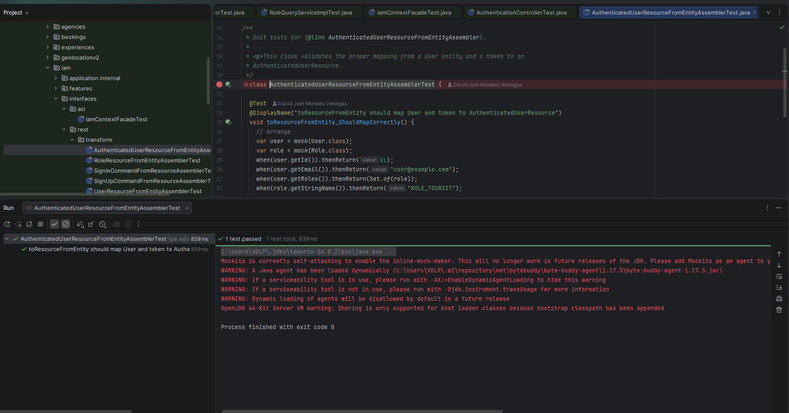
_Evidencia de ejecución de los tests de Interfaces Layer: Resource Assemblers para el Bounded Context IAM._

36. **toResourceFromEntity_ShouldMapCorrectly**(AuthenticatedUserResourceFromEntityAssemblerTest)

Esta prueba de mapeo asegura que la transformación de la entidad interna de usuario y su token a un recurso de salida para el cliente se realice sin pérdida de datos, incluyendo la conversión de roles a cadenas de texto planas.

```java
@Test
@DisplayName("toResourceFromEntity should map User and token to AuthenticatedUserResource")
void toResourceFromEntity_ShouldMapCorrectly() {
  // Arrange
  var user = mock(User.class);
  var role = mock(Role.class);
  when(user.getId()).thenReturn(1L);
  when(user.getEmail()).thenReturn("user@example.com");
  when(user.getRoles()).thenReturn(Set.of(role));
  when(role.getStringName()).thenReturn("ROLE_TOURIST");

  var token = "jwt-token-123";

  // Act
  var resource = AuthenticatedUserResourceFromEntityAssembler.toResourceFromEntity(user, token);

  // Assert
  assertNotNull(resource);
  assertEquals(1L, resource.id());
  assertEquals("user@example.com", resource.email());
  assertEquals("jwt-token-123", resource.token());
  assertEquals(1, resource.roles().size());
  assertTrue(resource.roles().contains("ROLE_TOURIST"));
}
```

37. **toResourceFromEntity_ShouldMapRoleToRoleResource**(RoleResourceFromEntityAssemblerTest)

Valida el mapeo simple de la entidad `Role` a su recurso de salida `RoleResource`, garantizando que la información del rol sea consistente a través de las capas.

```java
@Test
@DisplayName("toResourceFromEntity should map Role to RoleResource correctly")
void toResourceFromEntity_ShouldMapRoleToRoleResource() {
  // Arrange
  var role = mock(Role.class);
  when(role.getId()).thenReturn(1L);
  when(role.getStringName()).thenReturn("ROLE_ADMIN");

  // Act
  var resource = RoleResourceFromEntityAssembler.toResourceFromEntity(role);

  // Assert
  assertNotNull(resource);
  assertEquals(1L, resource.id());
  assertEquals("ROLE_ADMIN", resource.name());
}
```

38. **toCommandFromResource_ShouldMapSignInResourceToSignInCommand**(SignInCommandFromResourceAssemblerTest)

Prueba la transformación de la entrada del usuario (recurso de inicio de sesión) hacia el comando interno de la aplicación. Es crucial para que los datos lleguen correctamente a los servicios de autenticación.

```java
@Test
@DisplayName("toCommandFromResource should map SignInResource to SignInCommand correctly")
void toCommandFromResource_ShouldMapSignInResourceToSignInCommand() {
  // Arrange
  var resource = new SignInResource("user@example.com", "password");

  // Act
  var command = SignInCommandFromResourceAssembler.toCommandFromResource(resource);

  // Assert
  assertNotNull(command);
  assertEquals("user@example.com", command.email());
  assertEquals("password", command.password());
}
```

39. **toCommandFromResource_ShouldMapWithRoles**(SignUpCommandFromResourceAssemblerTest)

Valida que el proceso de registro mapee correctamente la lista de roles proporcionada por el cliente hacia el comando interno de registro, permitiendo la creación de usuarios con perfiles específicos desde la API.

```java
@Test
@DisplayName(
    "toCommandFromResource should map SignUpResource to SignUpCommand correctly when roles are"
        + " provided")
void toCommandFromResource_ShouldMapWithRoles() {
  // Arrange
  var resource =
      new SignUpResource(
          "user@example.com", "password", "John", "Doe", "123", List.of("ROLE_TOURIST"));

  // Act
  var command = SignUpCommandFromResourceAssembler.toCommandFromResource(resource);

  // Assert
  assertNotNull(command);
  assertEquals("user@example.com", command.email());
  assertEquals("password", command.password());
  assertEquals("John", command.firstName());
  assertEquals("Doe", command.lastName());
  assertEquals("123", command.phone());
  assertEquals(1, command.roles().size());
}
```

41. **toResourceFromEntity_ShouldMapCorrectly**(UserResourceFromEntityAssemblerTest)

Esta prueba final de mapeo valida la transformación general de la entidad `User` a su representación pública `UserResource`. Asegura que todos los campos del perfil (nombres, apellidos, teléfono) se transfieran fielmente para su visualización en el frontend.

```java
@Test
@DisplayName("toResourceFromEntity should map User to UserResource correctly")
void toResourceFromEntity_ShouldMapCorrectly() {
  // Arrange
  var user = mock(User.class);
  var role = mock(Role.class);

  when(user.getId()).thenReturn(1L);
  when(user.getEmail()).thenReturn("user@example.com");
  when(user.getFirstName()).thenReturn("John");
  when(user.getLastName()).thenReturn("Doe");
  when(user.getPhone()).thenReturn("123");
  when(user.getRoles()).thenReturn(Set.of(role));
  when(role.getStringName()).thenReturn("ROLE_TOURIST");

  // Act
  var resource = UserResourceFromEntityAssembler.toResourceFromEntity(user);

  // Assert
  assertNotNull(resource);
  assertEquals(1L, resource.id());
  assertEquals("user@example.com", resource.email());
  assertEquals("John", resource.firstName());
  assertEquals("Doe", resource.lastName());
  assertEquals("123", resource.phone());
  assertEquals(1, resource.roles().size());
  assertEquals("ROLE_TOURIST", resource.roles().get(0));
}
```


#### Geolocation Bounded Context

##### Application Layer: Command Services
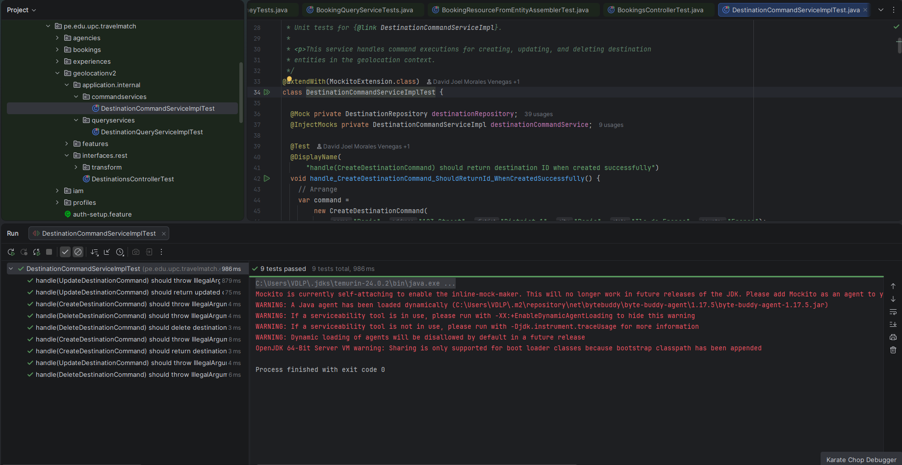
_Evidencia de ejecución de los tests de Application Layer: Command Services para el Bounded Context Geolocation._

1. **handle_CreateDestinationCommand_ShouldReturnId_WhenCreatedSuccessfully**(DestinationCommandServiceImplTest)

Esta prueba valida la creación exitosa de un destino turístico. Verifica que el servicio compruebe la unicidad del nombre del destino antes de proceder con el guardado en el repositorio. Asegura que el flujo de persistencia se active correctamente cuando los datos son válidos y no hay duplicados.

```java
@Test
@DisplayName(
    "handle(CreateDestinationCommand) should return destination ID when created successfully")
void handle_CreateDestinationCommand_ShouldReturnId_WhenCreatedSuccessfully() {
  // Arrange
  var command =
      new CreateDestinationCommand(
          "Paris", "123 Street", "District 1", "Paris", "Ile-de-France", "France");
  var name = new DestinationName(command.name());

  when(destinationRepository.existsByName(name)).thenReturn(false);

  // Act
  destinationCommandService.handle(command);

  // Assert
  verify(destinationRepository).existsByName(name);
  verify(destinationRepository).save(any(Destination.class));
  verifyNoMoreInteractions(destinationRepository);
}
```

2. **handle_CreateDestinationCommand_ShouldThrowException_WhenNameAlreadyExists**(DestinationCommandServiceImplTest)

Asegura que el sistema no permita la creación de destinos duplicados con el mismo nombre. Valida que se lance una `IllegalArgumentException` cuando el repositorio detecta que el nombre ya está registrado, protegiendo la integridad de los datos geográficos.

```java
@Test
@DisplayName(
    "handle(CreateDestinationCommand) should throw IllegalArgumentException when name already"
        + " exists")
void handle_CreateDestinationCommand_ShouldThrowException_WhenNameAlreadyExists() {
  // Arrange
  var command =
      new CreateDestinationCommand(
          "Paris", "123 Street", "District 1", "Paris", "Ile-de-France", "France");
  var name = new DestinationName(command.name());

  when(destinationRepository.existsByName(name)).thenReturn(true);

  // Act + Assert
  assertThrows(
      IllegalArgumentException.class,
      () -> destinationCommandService.handle(command),
      "Destination with name " + name + " already exists");

  verify(destinationRepository).existsByName(name);
  verifyNoMoreInteractions(destinationRepository);
}
```

3. **handle_CreateDestinationCommand_ShouldThrowException_WhenSaveFails**(DestinationCommandServiceImplTest)

Verifica el manejo de errores robusto cuando ocurre un fallo técnico inesperado durante la persistencia (como un error de base de datos). Valida que el servicio capture la excepción original y la relance como una `IllegalArgumentException` informativa para las capas superiores.

```java
@Test
@DisplayName(
    "handle(CreateDestinationCommand) should throw IllegalArgumentException when save fails")
void handle_CreateDestinationCommand_ShouldThrowException_WhenSaveFails() {
  // Arrange
  var command =
      new CreateDestinationCommand(
          "Paris", "123 Street", "District 1", "Paris", "Ile-de-France", "France");
  var name = new DestinationName(command.name());

  when(destinationRepository.existsByName(name)).thenReturn(false);
  when(destinationRepository.save(any(Destination.class)))
      .thenThrow(new RuntimeException("Database error"));

  // Act + Assert
  assertThrows(
      IllegalArgumentException.class,
      () -> destinationCommandService.handle(command),
      "Error while saving profile: Database error");

  verify(destinationRepository).existsByName(name);
  verify(destinationRepository).save(any(Destination.class));
  verifyNoMoreInteractions(destinationRepository);
}
```

##### Application Layer: Query Services
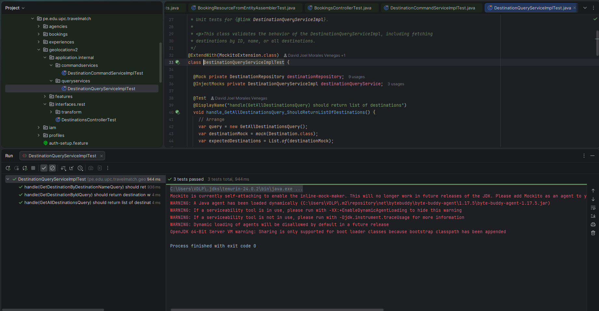
_Evidencia de ejecución de los tests de Application Layer: Query Services para el Bounded Context Geolocation._

10. **handle_GetAllDestinationsQuery_ShouldReturnListOfDestinations**(DestinationQueryServiceImplTest)

Valida la recuperación masiva de todos los destinos turísticos registrados. Esta consulta es fundamental para que los viajeros puedan explorar todas las opciones de destinos disponibles en la plataforma.

```java
@Test
@DisplayName("handle(GetAllDestinationsQuery) should return list of destinations")
void handle_GetAllDestinationsQuery_ShouldReturnListOfDestinations() {
  // Arrange
  var query = new GetAllDestinationsQuery();
  var destinationMock = mock(Destination.class);
  var expectedDestinations = List.of(destinationMock);

  when(destinationRepository.findAll()).thenReturn(expectedDestinations);

  // Act
  var result = destinationQueryService.handle(query);

  // Assert
  assertNotNull(result);
  assertEquals(1, result.size());
  assertEquals(expectedDestinations, result);

  verify(destinationRepository).findAll();
  verifyNoMoreInteractions(destinationRepository);
}
```

11. **handle_GetDestinationByDestinationNameQuery_ShouldReturnDestination_WhenFound**(DestinationQueryServiceImplTest)

Prueba la búsqueda de un destino por su nombre exacto. Valida que el servicio mapee correctamente el nombre del destino a su objeto de valor `DestinationName` y recupere la información correspondiente del repositorio.

```java
@Test
@DisplayName("handle(GetDestinationByDestinationNameQuery) should return destination when found")
void handle_GetDestinationByDestinationNameQuery_ShouldReturnDestination_WhenFound() {
  // Arrange
  var query = new GetDestinationByDestinationNameQuery("Paris");
  var destinationName = new DestinationName(query.name());
  var destinationMock = mock(Destination.class);

  when(destinationRepository.findByName(destinationName))
      .thenReturn(Optional.of(destinationMock));

  // Act
  var result = destinationQueryService.handle(query);

  // Assert
  assertTrue(result.isPresent());
  assertEquals(destinationMock, result.get());

  verify(destinationRepository).findByName(destinationName);
  verifyNoMoreInteractions(destinationRepository);
}
```

##### Interfaces Layer: REST Controllers
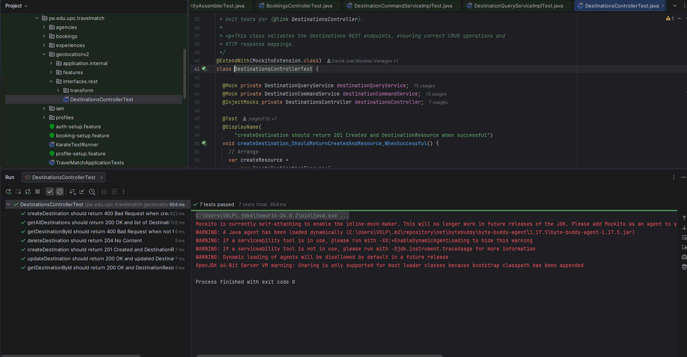
_Evidencia de ejecución de los tests de Interfaces Layer: REST Controllers para el Bounded Context Geolocation._

13. **createDestination_ShouldReturnCreatedAndResource_WhenSuccessful**(DestinationsControllerTest)

Valida el endpoint de creación de destinos. Verifica que ante una solicitud válida, el controlador coordine con los servicios de comando y consulta para retornar un estado 201 Created y el recurso del destino recién creado, incluyendo su ID generado.

```java
@Test
@DisplayName(
    "createDestination should return 201 Created and DestinationResource when successful")
void createDestination_ShouldReturnCreatedAndResource_WhenSuccessful() {
  // Arrange
  var createResource =
      new CreateDestinationResource(
          "Paris", "123 Street", "District 1", "Paris", "Ile-de-France", "France");
  var expectedId = 1L;
  var destinationSpy =
      spy(
          new Destination(
              "Paris", "123 Street", "District 1", "Paris", "Ile-de-France", "France"));
  when(destinationSpy.getId()).thenReturn(expectedId);

  when(destinationCommandService.handle(any(CreateDestinationCommand.class)))
      .thenReturn(expectedId);
  when(destinationQueryService.handle(any(GetDestinationByIdQuery.class)))
      .thenReturn(Optional.of(destinationSpy));

  // Act
  ResponseEntity<DestinationResource> response =
      destinationsController.createDestination(createResource);

  // Assert
  assertEquals(HttpStatus.CREATED, response.getStatusCode());
  assertNotNull(response.getBody());
  assertEquals("Paris", response.getBody().name());

  verify(destinationCommandService).handle(any(CreateDestinationCommand.class));
  verify(destinationQueryService).handle(any(GetDestinationByIdQuery.class));
  verifyNoMoreInteractions(destinationCommandService, destinationQueryService);
}
```

14. **createDestination_ShouldReturnBadRequest_WhenCreationFailed**(DestinationsControllerTest)

Verifica que si la creación del destino falla en la lógica de negocio (por ejemplo, nombre duplicado), el controlador responda con un 400 Bad Request, informando al cliente que la operación no pudo completarse.

```java
@Test
@DisplayName("createDestination should return 400 Bad Request when creation fails")
void createDestination_ShouldReturnBadRequest_WhenCreationFailed() {
  // Arrange
  var createResource =
      new CreateDestinationResource(
          "Paris", "123 Street", "District 1", "Paris", "Ile-de-France", "France");

  when(destinationCommandService.handle(any(CreateDestinationCommand.class))).thenReturn(0L);

  // Act
  ResponseEntity<DestinationResource> response =
      destinationsController.createDestination(createResource);

  // Assert
  assertEquals(HttpStatus.BAD_REQUEST, response.getStatusCode());
  assertNull(response.getBody());

  verify(destinationCommandService).handle(any(CreateDestinationCommand.class));
  verifyNoMoreInteractions(destinationCommandService, destinationQueryService);
}
```

15. **getAllDestinations_ShouldReturnOkAndList**(DestinationsControllerTest)

Prueba el listado público de destinos a través de la API. Asegura que el controlador transforme correctamente la lista de entidades en una lista de recursos DTO y retorne un estado 200 OK.

```java
@Test
@DisplayName("getAllDestinations should return 200 OK and list of DestinationResources")
void getAllDestinations_ShouldReturnOkAndList() {
  // Arrange
  var destinationSpy =
      spy(
          new Destination(
              "Paris", "123 Street", "District 1", "Paris", "Ile-de-France", "France"));
  when(destinationSpy.getId()).thenReturn(1L);

  when(destinationQueryService.handle(any(GetAllDestinationsQuery.class)))
      .thenReturn(List.of(destinationSpy));

  // Act
  ResponseEntity<List<DestinationResource>> response =
      destinationsController.getAllDestinations();

  // Assert
  assertEquals(HttpStatus.OK, response.getStatusCode());
  assertNotNull(response.getBody());
  assertEquals(1, response.getBody().size());
  assertEquals("Paris", response.getBody().get(0).name());

  verify(destinationQueryService).handle(any(GetAllDestinationsQuery.class));
  verifyNoMoreInteractions(destinationCommandService, destinationQueryService);
}
```

##### Interfaces Layer: Resource Assemblers (Mapping Tests)
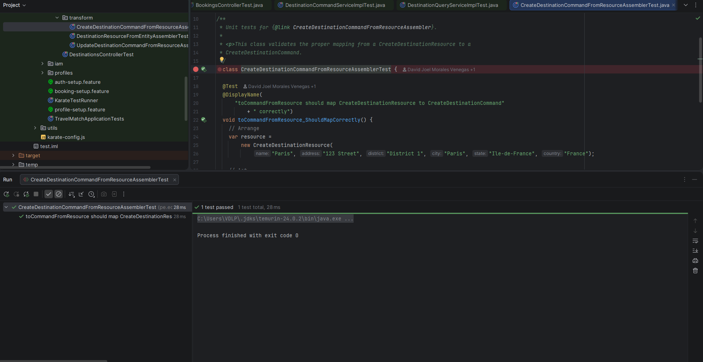
_Evidencia de ejecución de los tests de Interfaces Layer: Resource Assemblers para el Bounded Context Geolocation._

20. **toCommandFromResource_ShouldMapCorrectly**(CreateDestinationCommandFromResourceAssemblerTest)

Verifica la transformación precisa del recurso de entrada para creación hacia el comando interno. Valida que todos los campos geográficos (dirección, distrito, ciudad, etc.) se mapeen correctamente para su procesamiento en la capa de aplicación.

```java
@Test
@DisplayName(
    "toCommandFromResource should map CreateDestinationResource to CreateDestinationCommand"
        + " correctly")
void toCommandFromResource_ShouldMapCorrectly() {
  // Arrange
  var resource =
      new CreateDestinationResource(
          "Paris", "123 Street", "District 1", "Paris", "Ile-de-France", "France");

  // Act
  var command = CreateDestinationCommandFromResourceAssembler.toCommandFromResource(resource);

  // Assert
  assertNotNull(command);
  assertEquals("Paris", command.name());
  assertEquals("123 Street", command.address());
  assertEquals("District 1", command.district());
  assertEquals("Paris", command.city());
  assertEquals("Ile-de-France", command.state());
  assertEquals("France", command.country());
}
```

21. **toResourceFromEntity_ShouldMapCorrectly**(DestinationResourceFromEntityAssemblerTest)

Esta prueba asegura que la entidad `Destination` (compuesta por múltiples objetos de valor) sea aplanada y mapeada correctamente al recurso de salida `DestinationResource`. Garantiza que los datos mostrados al usuario sean coherentes con el modelo de dominio.

```java
@Test
@DisplayName("toResourceFromEntity should map Destination to DestinationResource correctly")
void toResourceFromEntity_ShouldMapCorrectly() {
  // Arrange
  var destination = mock(Destination.class);
  when(destination.getId()).thenReturn(1L);
  when(destination.getName()).thenReturn(new DestinationName("Paris"));
  when(destination.getAddress()).thenReturn(new DestinationAddress("123 Street"));
  when(destination.getDistrict()).thenReturn(new District("District 1"));
  when(destination.getCity()).thenReturn(new City("Paris"));
  when(destination.getState()).thenReturn(new State("Ile-de-France"));
  when(destination.getCountry()).thenReturn(new Country("France"));

  // Act
  var resource = DestinationResourceFromEntityAssembler.toResourceFromEntity(destination);

  // Assert
  assertNotNull(resource);
  assertEquals(1L, resource.id());
  assertEquals("Paris", resource.name());
  assertEquals("123 Street", resource.address());
  assertEquals("District 1", resource.district());
  assertEquals("Paris", resource.city());
  assertEquals("Ile-de-France", resource.state());
  assertEquals("France", resource.country());
}
```

22. **toCommandFromResource_ShouldMapCorrectly**(UpdateDestinationCommandFromResourceAssemblerTest)

Valida el mapeo del recurso de actualización y su ID hacia el comando interno. Asegura que la identidad del destino y sus nuevos atributos se mantengan vinculados correctamente durante la transformación, permitiendo una actualización precisa.

```java
@Test
@DisplayName(
    "toCommandFromResource should map ID and DestinationResource to UpdateDestinationCommand"
        + " correctly")
void toCommandFromResource_ShouldMapCorrectly() {
  // Arrange
  var resource =
      new DestinationResource(
          1L, "Paris", "123 Street", "District 1", "Paris", "Ile-de-France", "France");

  // Act
  var command = UpdateDestinationCommandFromResourceAssembler.toCommandFromResource(1L, resource);

  // Assert
  assertNotNull(command);
  assertEquals(1L, command.destinationId());
  assertEquals("Paris", command.name());
  assertEquals("123 Street", command.address());
  assertEquals("District 1", command.district());
  assertEquals("Paris", command.city());
  assertEquals("Ile-de-France", command.state());
  assertEquals("France", command.country());
}
```


#### Profiles Bounded Context

##### Domain Layer: Aggregates & Entities
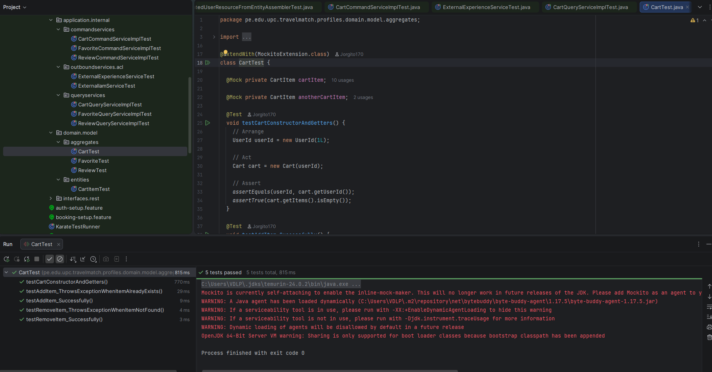
_Evidencia de ejecución de los tests de Domain Layer: Aggregates & Entities para el Bounded Context Profiles._

1. **testCartConstructorAndGetters**(CartTest)

Verifica que el constructor de la entidad `Cart` inicialice correctamente el `UserId` y que la lista de items comience vacía.

```java
@Test
void testCartConstructorAndGetters() {
    // Arrange
    UserId userId = new UserId(1L);

    // Act
    Cart cart = new Cart(userId);

    // Assert
    assertEquals(userId, cart.getUserId());
    assertTrue(cart.getItems().isEmpty());
}
```

2. **testAddItem_Successfully**(CartTest)

Valida que se pueda añadir un item al carrito y que se establezca la relación bidireccional correctamente invocando `setCart`.

```java
@Test
void testAddItem_Successfully() {
    // Arrange
    Cart cart = new Cart(new UserId(1L));

    // Act
    cart.addItem(cartItem);

    // Assert
    assertEquals(1, cart.getItems().size());
    assertEquals(cartItem, cart.getItems().get(0));
    verify(cartItem).setCart(cart);
}
```

6. **testFavoriteConstructorAndGetters**(FavoriteTest)

Valida que el agregado `Favorite` almacene correctamente las referencias al usuario y a la experiencia marcada como favorita.

```java
@Test
void testFavoriteConstructorAndGetters() {
    // Act
    Favorite favorite = new Favorite(userId, experienceId);

    // Assert
    assertEquals(userId, favorite.getUserId());
    assertEquals(experienceId, favorite.getExperienceId());
}
```

7. **testBelongsTo_ReturnsTrueForMatchingUserId**(FavoriteTest)

Comprueba que el método de lógica de dominio `belongsTo` identifique correctamente al propietario del favorito.

```java
@Test
void testBelongsTo_ReturnsTrueForMatchingUserId() {
    // Arrange
    Favorite favorite = new Favorite(userId, experienceId);

    // Act & Assert
    assertTrue(favorite.belongsTo(userId));
}
```

9. **testReviewConstructorAndGetters**(ReviewTest)

Verifica la correcta inicialización de una reseña, incluyendo el usuario, la experiencia, la calificación y el comentario textual.

```java
@Test
void testReviewConstructorAndGetters() {
    // Arrange
    String comment = "Great experience!";

    // Act
    Review review = new Review(userId, experienceId, rating, comment);

    // Assert
    assertEquals(userId, review.getUserId());
    assertEquals(experienceId, review.getExperienceId());
    assertEquals(rating, review.getRating());
    assertEquals(comment, review.getComment());
}
```

10. **testUpdateRating_Successfully**(ReviewTest)

Valida que se pueda actualizar la calificación de una reseña existente.

```java
@Test
void testUpdateRating_Successfully() {
    // Arrange
    Review review = new Review(userId, experienceId, rating, "Good");

    // Act
    review.updateRating(newRating);

    // Assert
    assertEquals(newRating, review.getRating());
}
```

15. **testCartItemConstructorAndGetters**(CartItemTest)

Verifica que la entidad `CartItem` (hijo del agregado Cart) mapee correctamente sus Value Objects internos y comience con referencias nulas a su ID (antes de persistir) y a su carrito padre.

```java
@Test
void testCartItemConstructorAndGetters() {
    // Act
    CartItem cartItem = new CartItem(availabilityId, quantity, price);

    // Assert
    assertEquals(availabilityId, cartItem.getAvailabilityId());
    assertEquals(quantity, cartItem.getQuantity());
    assertEquals(price, cartItem.getPrice());
    assertNull(cartItem.getId());
    assertNull(cartItem.getCart());
}
```

16. **testCartItemSetters**(CartItemTest)

Valida la capacidad de modificar la cantidad de un item y asignar su pertenencia a un carrito.

```java
@Test
void testCartItemSetters() {
    // Arrange
    CartItem cartItem = new CartItem(availabilityId, quantity, price);

    // Act
    cartItem.setQuantity(newQuantity);
    cartItem.setCart(newCart);

    // Assert
    assertEquals(newQuantity, cartItem.getQuantity());
    assertEquals(newCart, cartItem.getCart());
}
```

##### Application Layer: Command Services
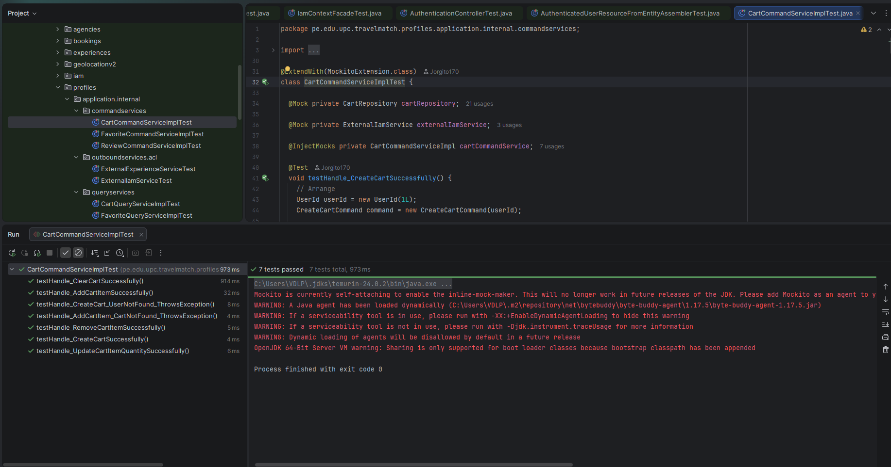
_Evidencia de ejecución de los tests de Application Layer: Command Services para el Bounded Context Profiles._

17. **testHandle_CreateCartSuccessfully**(CartCommandServiceImplTest)

Verifica que el servicio cree un carrito exitosamente si el usuario existe en el contexto de IAM.

```java
@Test
void testHandle_CreateCartSuccessfully() {
    // Arrange
    UserId userId = new UserId(1L);
    CreateCartCommand command = new CreateCartCommand(userId);

    when(externalIamService.existsUserById(userId)).thenReturn(true);
    when(cartRepository.save(any(Cart.class))).thenAnswer(invocation -> invocation.getArgument(0));

    // Act
    cartCommandService.handle(command);

    // Assert
    verify(externalIamService, times(1)).existsUserById(userId);
    verify(cartRepository, times(1)).save(any(Cart.class));
}
```

18. **testHandle_CreateCart_UserNotFound_ThrowsException**(CartCommandServiceImplTest)

Asegura que no se cree un carrito para un usuario inexistente, validando la integridad entre contextos.

```java
@Test
void testHandle_CreateCart_UserNotFound_ThrowsException() {
    // Arrange
    UserId userId = new UserId(1L);
    CreateCartCommand command = new CreateCartCommand(userId);

    when(externalIamService.existsUserById(userId)).thenReturn(false);

    // Act & Assert
    IllegalArgumentException exception =
        assertThrows(
            IllegalArgumentException.class,
            () -> {
              cartCommandService.handle(command);
            });

    assertTrue(exception.getMessage().contains("not found"));
    verify(cartRepository, never()).save(any(Cart.class));
}
```

19. **testHandle_ClearCartSuccessfully**(CartCommandServiceImplTest)

Prueba la limpieza completa de todos los items dentro de un carrito de usuario.

```java
@Test
void testHandle_ClearCartSuccessfully() {
    // Arrange
    UserId userId = new UserId(1L);
    ClearCartCommand command = new ClearCartCommand(userId);
    Cart cart = new Cart(userId);

    when(cartRepository.findByUserId(userId)).thenReturn(Optional.of(cart));
    when(cartRepository.save(any(Cart.class))).thenReturn(cart);

    // Act
    Optional<Cart> result = cartCommandService.handle(command);

    // Assert
    assertTrue(result.isPresent());
    assertTrue(result.get().getItems().isEmpty());
    verify(cartRepository, times(1)).findByUserId(userId);
    verify(cartRepository, times(1)).save(cart);
}
```

24. **testHandle_CreateFavoriteSuccessfully**(FavoriteCommandServiceImplTest)

Verifica la creación de un registro de favorito validando la existencia tanto del usuario como de la experiencia en contextos externos.

```java
@Test
void testHandle_CreateFavoriteSuccessfully() {
    // Arrange
    UserId userId = new UserId(1L);
    ExperienceId experienceId = new ExperienceId(10L);
    CreateFavoriteCommand command = new CreateFavoriteCommand(userId, experienceId);

    when(externalIamService.existsUserById(userId)).thenReturn(true);
    when(externalExperienceService.existsExperienceById(experienceId)).thenReturn(true);
    when(favoriteRepository.save(any(Favorite.class)))
        .thenAnswer(invocation -> invocation.getArgument(0));

    // Act
    favoriteCommandService.handle(command);

    // Assert
    verify(externalIamService, times(1)).existsUserById(userId);
    verify(externalExperienceService, times(1)).existsExperienceById(experienceId);
    verify(favoriteRepository, times(1)).save(any(Favorite.class));
}
```

25. **testHandle_CreateFavorite_UserNotFound_ThrowsException**(FavoriteCommandServiceImplTest)

Asegura que no se cree un favorito si el usuario no es reconocido por el sistema IAM.

```java
@Test
void testHandle_CreateFavorite_UserNotFound_ThrowsException() {
    // Arrange
    UserId userId = new UserId(1L);
    ExperienceId experienceId = new ExperienceId(10L);
    CreateFavoriteCommand command = new CreateFavoriteCommand(userId, experienceId);

    when(externalIamService.existsUserById(userId)).thenReturn(false);

    // Act & Assert
    IllegalArgumentException exception =
        assertThrows(
            IllegalArgumentException.class,
            () -> {
              favoriteCommandService.handle(command);
            });

    assertTrue(exception.getMessage().contains("User with id"));
    verify(externalExperienceService, never()).existsExperienceById(experienceId);
    verify(favoriteRepository, never()).save(any(Favorite.class));
}
```

26. **testHandle_CreateFavorite_ExperienceNotFound_ThrowsException**(FavoriteCommandServiceImplTest)

Impide marcar como favorita una experiencia inexistente en el catálogo global.

```java
@Test
void testHandle_CreateFavorite_ExperienceNotFound_ThrowsException() {
    // Arrange
    UserId userId = new UserId(1L);
    ExperienceId experienceId = new ExperienceId(10L);
    CreateFavoriteCommand command = new CreateFavoriteCommand(userId, experienceId);

    when(externalIamService.existsUserById(userId)).thenReturn(true);
    when(externalExperienceService.existsExperienceById(experienceId)).thenReturn(false);

    // Act & Assert
    IllegalArgumentException exception =
        assertThrows(
            IllegalArgumentException.class,
            () -> {
              favoriteCommandService.handle(command);
            });

    assertTrue(exception.getMessage().contains("Experience with id"));
    verify(favoriteRepository, never()).save(any(Favorite.class));
}
```

29. **testHandle_CreateReviewSuccessfully**(ReviewCommandServiceImplTest)

Valida la persistencia de una nueva reseña tras verificar las identidades externas del autor y la experiencia.

```java
@Test
void testHandle_CreateReviewSuccessfully() {
    // Arrange
    UserId userId = new UserId(1L);
    ExperienceId experienceId = new ExperienceId(10L);
    Rating rating = new Rating(5);
    String comment = "Great experience!";
    CreateReviewCommand command = new CreateReviewCommand(userId, experienceId, rating, comment);

    when(externalIamService.existsUserById(userId)).thenReturn(true);
    when(externalExperienceService.existsExperienceById(experienceId)).thenReturn(true);
    when(reviewRepository.save(any(Review.class)))
        .thenAnswer(invocation -> invocation.getArgument(0));

    // Act
    reviewCommandService.handle(command);

    // Assert
    verify(externalIamService, times(1)).existsUserById(userId);
    verify(externalExperienceService, times(1)).existsExperienceById(experienceId);
    verify(reviewRepository, times(1)).save(any(Review.class));
}
```

30. **testHandle_CreateReview_UserNotFound_ThrowsException**(ReviewCommandServiceImplTest)

Asegura que solo usuarios registrados en IAM puedan emitir reseñas sobre experiencias.

```java
@Test
void testHandle_CreateReview_UserNotFound_ThrowsException() {
    // Arrange
    UserId userId = new UserId(1L);
    ExperienceId experienceId = new ExperienceId(10L);
    Rating rating = new Rating(5);
    String comment = "Great experience!";
    CreateReviewCommand command = new CreateReviewCommand(userId, experienceId, rating, comment);

    when(externalIamService.existsUserById(userId)).thenReturn(false);

    // Act & Assert
    IllegalArgumentException exception =
        assertThrows(
            IllegalArgumentException.class,
            () -> {
              reviewCommandService.handle(command);
            });

    assertTrue(exception.getMessage().contains("User with id"));
    verify(externalExperienceService, never()).existsExperienceById(experienceId);
    verify(reviewRepository, never()).save(any(Review.class));
}
```

31. **testHandle_CreateReview_ExperienceNotFound_ThrowsException**(ReviewCommandServiceImplTest)

Impide dejar comentarios sobre experiencias que no forman parte del catálogo oficial.

```java
@Test
void testHandle_CreateReview_ExperienceNotFound_ThrowsException() {
    // Arrange
    UserId userId = new UserId(1L);
    ExperienceId experienceId = new ExperienceId(10L);
    Rating rating = new Rating(5);
    String comment = "Great experience!";
    CreateReviewCommand command = new CreateReviewCommand(userId, experienceId, rating, comment);

    when(externalIamService.existsUserById(userId)).thenReturn(true);
    when(externalExperienceService.existsExperienceById(experienceId)).thenReturn(false);

    // Act & Assert
    IllegalArgumentException exception =
        assertThrows(
            IllegalArgumentException.class,
            () -> {
              reviewCommandService.handle(command);
            });

    assertTrue(exception.getMessage().contains("Experience with id"));
    verify(reviewRepository, never()).save(any(Review.class));
}
```

##### Application Layer: Query Services
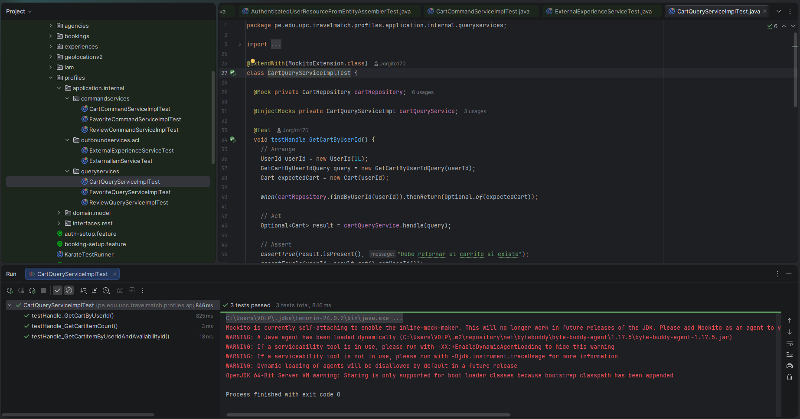
_Evidencia de ejecución de los tests de Application Layer: Query Services para el Bounded Context Profiles._

36. **testHandle_GetCartByUserId**(CartQueryServiceImplTest)

Recupera el agregado de carrito asociado a un usuario.

```java
@Test
void testHandle_GetCartByUserId() {
    // Arrange
    UserId userId = new UserId(1L);
    GetCartByUserIdQuery query = new GetCartByUserIdQuery(userId);
    Cart expectedCart = new Cart(userId);

    when(cartRepository.findByUserId(userId)).thenReturn(Optional.of(expectedCart));

    // Act
    Optional<Cart> result = cartQueryService.handle(query);

    // Assert
    assertTrue(result.isPresent());
    assertEquals(userId, result.get().getUserId());
    verify(cartRepository, times(1)).findByUserId(userId);
}
```

37. **testHandle_GetCartItemByUserIdAndAvailabilityId**(CartQueryServiceImplTest)

Busca un item específico dentro del carrito basándose en la disponibilidad vinculada.

```java
@Test
void testHandle_GetCartItemByUserIdAndAvailabilityId() {
    // Arrange
    UserId userId = new UserId(1L);
    AvailabilityId availabilityId = new AvailabilityId(10L);
    GetCartItemByUserIdAndAvailabilityIdQuery query =
        new GetCartItemByUserIdAndAvailabilityIdQuery(userId, availabilityId);

    pe.edu.upc.travelmatch.profiles.domain.model.valueobjects.Money price =
        new pe.edu.upc.travelmatch.profiles.domain.model.valueobjects.Money(
            new BigDecimal("10.0"), "PEN");
    CartItem expectedCartItem = new CartItem(availabilityId, new Quantity(1), price);

    when(cartRepository.findCartItemByUserIdAndAvailabilityId(userId, availabilityId))
        .thenReturn(Optional.of(expectedCartItem));

    // Act
    Optional<CartItem> result = cartQueryService.handle(query);

    // Assert
    assertTrue(result.isPresent());
    assertEquals(availabilityId, result.get().getAvailabilityId());
    verify(cartRepository, times(1)).findCartItemByUserIdAndAvailabilityId(userId, availabilityId);
}
```

39. **testHandle_GetFavoritesByUserId**(FavoriteQueryServiceImplTest)

Lista todas las experiencias marcadas como favoritas por un usuario determinado.

```java
@Test
void testHandle_GetFavoritesByUserId() {
    // Arrange
    UserId userId = new UserId(1L);
    ExperienceId experienceId = new ExperienceId(10L);
    GetFavoritesByUserIdQuery query = new GetFavoritesByUserIdQuery(userId);
    Favorite favorite = new Favorite(userId, experienceId);
    List<Favorite> expectedFavorites = List.of(favorite);

    when(favoriteRepository.findAllByUserId(userId)).thenReturn(expectedFavorites);

    // Act
    List<Favorite> result = favoriteQueryService.handle(query);

    // Assert
    assertEquals(expectedFavorites.size(), result.size());
    assertEquals(userId, result.get(0).getUserId());
    verify(favoriteRepository, times(1)).findAllByUserId(userId);
}
```

40. **testHandle_GetFavoritesByExperienceId**(FavoriteQueryServiceImplTest)

Permite saber qué usuarios han marcado una experiencia específica como favorita (métricas de popularidad).

```java
@Test
void testHandle_GetFavoritesByExperienceId() {
    // Arrange
    UserId userId = new UserId(1L);
    ExperienceId experienceId = new ExperienceId(10L);
    GetFavoritesByExperienceIdQuery query = new GetFavoritesByExperienceIdQuery(experienceId);
    Favorite favorite = new Favorite(userId, experienceId);
    List<Favorite> expectedFavorites = List.of(favorite);

    when(favoriteRepository.findAllByExperienceId(experienceId)).thenReturn(expectedFavorites);

    // Act
    List<Favorite> result = favoriteQueryService.handle(query);

    // Assert
    assertEquals(expectedFavorites.size(), result.size());
    assertEquals(experienceId, result.get(0).getExperienceId());
    verify(favoriteRepository, times(1)).findAllByExperienceId(experienceId);
}
```

42. **testHandle_GetReviewsByUserId**(ReviewQueryServiceImplTest)

Lista todo el historial de reseñas redactadas por un usuario.

```java
@Test
void testHandle_GetReviewsByUserId() {
    // Arrange
    UserId userId = new UserId(1L);
    ExperienceId experienceId = new ExperienceId(10L);
    GetReviewsByUserIdQuery query = new GetReviewsByUserIdQuery(userId);
    Review review = new Review(userId, experienceId, new Rating(5), "Great experience!");
    List<Review> expectedReviews = List.of(review);

    when(reviewRepository.findAllByUserId(userId)).thenReturn(expectedReviews);

    // Act
    List<Review> result = reviewQueryService.handle(query);

    // Assert
    assertEquals(expectedReviews.size(), result.size());
    assertEquals(userId, result.get(0).getUserId());
    verify(reviewRepository, times(1)).findAllByUserId(userId);
}
```

43. **testHandle_GetReviewsByExperienceId**(ReviewQueryServiceImplTest)

Recupera el feedback de todos los usuarios para una experiencia concreta.

```java
@Test
void testHandle_GetReviewsByExperienceId() {
    // Arrange
    UserId userId = new UserId(1L);
    ExperienceId experienceId = new ExperienceId(10L);
    GetReviewsByExperienceIdQuery query = new GetReviewsByExperienceIdQuery(experienceId);
    Review review = new Review(userId, experienceId, new Rating(5), "Great experience!");
    List<Review> expectedReviews = List.of(review);

    when(reviewRepository.findAllByExperienceId(experienceId)).thenReturn(expectedReviews);

    // Act
    List<Review> result = reviewQueryService.handle(query);

    // Assert
    assertEquals(expectedReviews.size(), result.size());
    assertEquals(experienceId, result.get(0).getExperienceId());
    verify(reviewRepository, times(1)).findAllByExperienceId(experienceId);
}
```

##### Application Layer: Outbound Services (ACL)
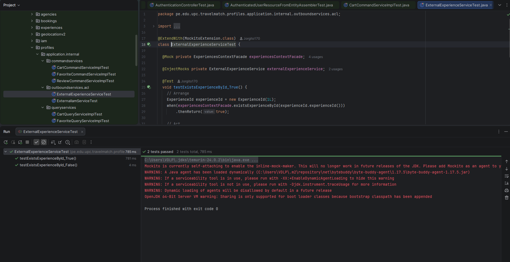
_Evidencia de ejecución de los tests de Application Layer: Outbound Services (ACL) para el Bounded Context Profiles._

45. **testExistsExperienceById_True**(ExternalExperienceServiceTest)

Verifica la integración con el contexto de Experiencias para confirmar que un ID es válido.

```java
@Test
void testExistsExperienceById_True() {
    // Arrange
    ExperienceId experienceId = new ExperienceId(1L);
    when(experiencesContextFacade.existsExperienceById(experienceId.experienceId()))
        .thenReturn(true);

    // Act
    boolean result = externalExperienceService.existsExperienceById(experienceId);

    // Assert
    assertTrue(result);
    verify(experiencesContextFacade, times(1)).existsExperienceById(experienceId.experienceId());
}
```

46. **testExistsExperienceById_False**(ExternalExperienceServiceTest)

Confirma el comportamiento cuando el contexto externo de Experiencias indica que el recurso no existe.

```java
@Test
void testExistsExperienceById_False() {
    // Arrange
    ExperienceId experienceId = new ExperienceId(1L);
    when(experiencesContextFacade.existsExperienceById(experienceId.experienceId()))
        .thenReturn(false);

    // Act
    boolean result = externalExperienceService.existsExperienceById(experienceId);

    // Assert
    assertFalse(result);
    verify(experiencesContextFacade, times(1)).existsExperienceById(experienceId.experienceId());
}
```

47. **testFetchUserIdByEmail_Found**(ExternalIamServiceTest)

Valida la recuperación del ID de usuario desde IAM mediante su correo electrónico.

```java
@Test
void testFetchUserIdByEmail_Found() {
    // Arrange
    String email = "test@example.com";
    Long expectedUserId = 1L;
    when(iamContextFacade.fetchUserIdByEmail(email)).thenReturn(expectedUserId);

    // Act
    Optional<UserId> result = externalIamService.fetchUserIdByEmail(email);

    // Assert
    assertTrue(result.isPresent());
    assertEquals(expectedUserId, result.get().userId());
    verify(iamContextFacade, times(1)).fetchUserIdByEmail(email);
}
```

48. **testFetchUserIdByEmail_NotFound**(ExternalIamServiceTest)

Maneja el escenario donde el email no corresponde a ninguna cuenta en IAM.

```java
@Test
void testFetchUserIdByEmail_NotFound() {
    // Arrange
    String email = "test@example.com";
    when(iamContextFacade.fetchUserIdByEmail(email)).thenReturn(0L);

    // Act
    Optional<UserId> result = externalIamService.fetchUserIdByEmail(email);

    // Assert
    assertTrue(result.isEmpty());
    verify(iamContextFacade, times(1)).fetchUserIdByEmail(email);
}
```

49. **testExistsUserByEmailAndIdIsNot_True**(ExternalIamServiceTest)

Verifica si un email ya está en uso por otro usuario diferente al actual (validación de unicidad).

```java
@Test
void testExistsUserByEmailAndIdIsNot_True() {
    // Arrange
    String email = "test@example.com";
    Long id = 1L;
    when(iamContextFacade.existsUserByEmailAndIdIsNot(email, id)).thenReturn(true);

    // Act
    boolean result = externalIamService.existsUserByEmailAndIdIsNot(email, id);

    // Assert
    assertTrue(result);
    verify(iamContextFacade, times(1)).existsUserByEmailAndIdIsNot(email, id);
}
```

##### Interfaces Layer: REST Controllers
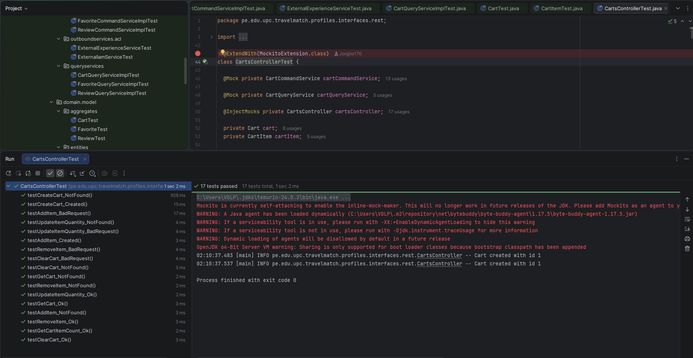
_Evidencia de ejecución de los tests de Interfaces Layer: REST Controllers para el Bounded Context Profiles._

55. **testCreateCart_Created**(CartsControllerTest)

Valida que el endpoint de creación de carrito responda con 201 Created y el recurso correcto.

```java
@Test
void testCreateCart_Created() {
    // Arrange
    final CreateCartResource resource = new CreateCartResource(1L);
    stubCartResourceFields();
    when(cartCommandService.handle(any(CreateCartCommand.class))).thenReturn(1L);
    when(cartQueryService.handle(any(GetCartByUserIdQuery.class))).thenReturn(Optional.of(cart));

    // Act
    ResponseEntity<CartResource> response = cartsController.createCart(resource);

    // Assert
    assertEquals(HttpStatus.CREATED, response.getStatusCode());
    assertNotNull(response.getBody());
}
```

56. **testCreateCart_NotFound**(CartsControllerTest)

Verifica el manejo de error 404 cuando el carrito creado no puede ser recuperado inmediatamente.

```java
@Test
void testCreateCart_NotFound() {
    // Arrange
    CreateCartResource resource = new CreateCartResource(1L);
    when(cartCommandService.handle(any(CreateCartCommand.class))).thenReturn(1L);
    when(cartQueryService.handle(any(GetCartByUserIdQuery.class))).thenReturn(Optional.empty());

    // Act
    ResponseEntity<CartResource> response = cartsController.createCart(resource);

    // Assert
    assertEquals(HttpStatus.NOT_FOUND, response.getStatusCode());
}
```

57. **testAddItem_Created**(CartsControllerTest)

Añade un item al carrito vía REST y comprueba la estructura del `CartItemResource`.

```java
@Test
void testAddItem_Created() {
    // Arrange
    var price = BigDecimal.valueOf(49.99);
    AddCartItemResource resource = new AddCartItemResource(101L, 2, price);
    cartItem = createCartItem(2);
    when(cartCommandService.handle(any(AddCartItemCommand.class)))
        .thenReturn(Optional.of(cartItem));

    // Act
    ResponseEntity<CartItemResource> response = cartsController.addItem(1L, resource);

    // Assert
    assertEquals(HttpStatus.CREATED, response.getStatusCode());
    assertNotNull(response.getBody());
    assertEquals(101L, response.getBody().availabilityId());
}
```

58. **testAddItem_NotFound**(CartsControllerTest)

Maneja el escenario donde el servicio no encuentra el carrito para añadir el item.

```java
@Test
void testAddItem_NotFound() {
    // Arrange
    AddCartItemResource resource =
        new AddCartItemResource(101L, 2, java.math.BigDecimal.valueOf(49.99));
    when(cartCommandService.handle(any(AddCartItemCommand.class))).thenReturn(Optional.empty());

    // Act
    ResponseEntity<CartItemResource> response = cartsController.addItem(1L, resource);

    // Assert
    assertEquals(HttpStatus.NOT_FOUND, response.getStatusCode());
}
```

72. **testCreateFavorite_Created**(FavoritesControllerTest)

Registra una nueva experiencia favorita para el usuario.

```java
@Test
void testCreateFavorite_Created() {
    // Arrange
    CreateFavoriteResource resource = new CreateFavoriteResource(1L, 10L);
    when(favoriteCommandService.handle(any(CreateFavoriteCommand.class))).thenReturn(1L);
    when(favoriteQueryService.handle(any(GetFavoriteByUserIdAndExperienceIdQuery.class)))
        .thenReturn(Optional.of(favorite));

    // Act
    ResponseEntity<FavoriteResource> response = favoritesController.createFavorite(resource);

    // Assert
    assertEquals(HttpStatus.CREATED, response.getStatusCode());
    assertEquals(1L, response.getBody().userId());
    assertEquals(10L, response.getBody().experienceId());
}
```

73. **testCreateFavorite_NotFound**(FavoritesControllerTest)

Maneja errores de post-creación en el endpoint de favoritos.

```java
@Test
void testCreateFavorite_NotFound() {
    // Arrange
    CreateFavoriteResource resource = new CreateFavoriteResource(1L, 10L);
    when(favoriteCommandService.handle(any(CreateFavoriteCommand.class))).thenReturn(1L);
    when(favoriteQueryService.handle(any(GetFavoriteByUserIdAndExperienceIdQuery.class)))
        .thenReturn(Optional.empty());

    // Act
    ResponseEntity<FavoriteResource> response = favoritesController.createFavorite(resource);

    // Assert
    assertEquals(HttpStatus.NOT_FOUND, response.getStatusCode());
}
```

74. **testGetFavoritesByUserId_Ok**(FavoritesControllerTest)

Recupera la lista de favoritos de un usuario mapeada a recursos.

```java
@Test
void testGetFavoritesByUserId_Ok() {
    // Arrange
    when(favoriteQueryService.handle(any(GetFavoritesByUserIdQuery.class)))
        .thenReturn(List.of(favorite));

    // Act
    ResponseEntity<List<FavoriteResource>> response = favoritesController.getFavoritesByUserId(1L);

    // Assert
    assertEquals(HttpStatus.OK, response.getStatusCode());
    assertEquals(1, response.getBody().size());
}
```

76. **testCreateReview_Created**(ReviewsControllerTest)

Crea una reseña y califica una experiencia mediante el controlador REST.

```java
@Test
void testCreateReview_Created() {
    // Arrange
    CreateReviewResource resource = new CreateReviewResource(1L, 10L, 5, "Great!");
    when(reviewCommandService.handle(any(CreateReviewCommand.class))).thenReturn(1L);
    when(reviewQueryService.handle(any(GetReviewByUserIdAndExperienceIdQuery.class)))
        .thenReturn(Optional.of(review));

    // Act
    ResponseEntity<ReviewResource> response = reviewsController.createReview(resource);

    // Assert
    assertEquals(HttpStatus.CREATED, response.getStatusCode());
    assertEquals(5, response.getBody().rating());
}
```

77. **testCreateReview_NotFound**(ReviewsControllerTest)

Control de errores en el flujo de guardado de reseñas.

```java
@Test
void testCreateReview_NotFound() {
    // Arrange
    CreateReviewResource resource = new CreateReviewResource(1L, 10L, 5, "Great!");
    when(reviewCommandService.handle(any(CreateReviewCommand.class))).thenReturn(1L);
    when(reviewQueryService.handle(any(GetReviewByUserIdAndExperienceIdQuery.class)))
        .thenReturn(Optional.empty());

    // Act
    ResponseEntity<ReviewResource> response = reviewsController.createReview(resource);

    // Assert
    assertEquals(HttpStatus.NOT_FOUND, response.getStatusCode());
}
```

78. **testUpdateReview_Ok**(ReviewsControllerTest)

Actualiza una reseña existente y retorna el recurso modificado.

```java
@Test
void testUpdateReview_Ok() {
    // Arrange
    UpdateReviewResource resource = new UpdateReviewResource(4, "Good!");
    Review updatedReview = new Review(userId, experienceId, new Rating(4), "Good!");
    when(reviewCommandService.handle(any(UpdateReviewCommand.class)))
        .thenReturn(Optional.of(updatedReview));

    // Act
    ResponseEntity<ReviewResource> response = reviewsController.updateReview(1L, resource);

    // Assert
    assertEquals(HttpStatus.OK, response.getStatusCode());
    assertEquals(4, response.getBody().rating());
}
```

##### Interfaces Layer: Resource Assemblers (Mapping Tests)
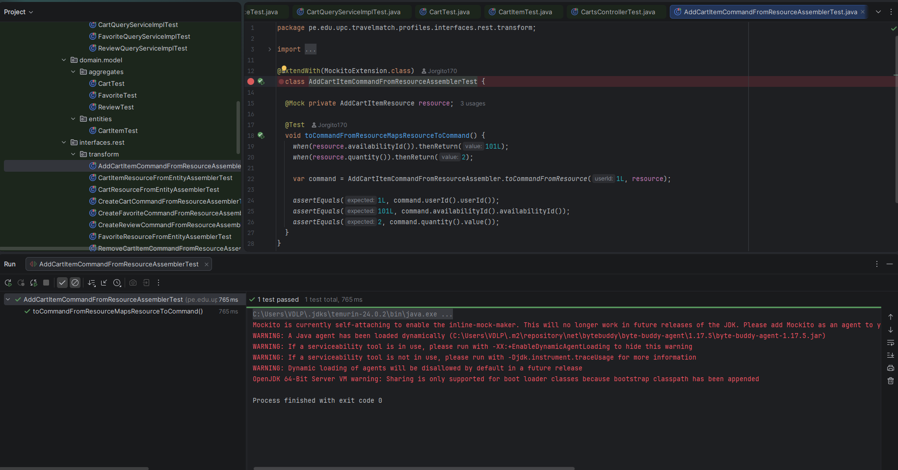
_Evidencia de ejecución de los tests de Interfaces Layer: Resource Assemblers (Mapping Tests) para el Bounded Context Profiles._

82. **toCommandFromResource_ShouldMapCorrectly**(AddCartItemCommandFromResourceAssemblerTest)

Transforma un recurso de entrada en un comando de adición de item al carrito.

```java
@Test
void toCommandFromResource_ShouldMapCorrectly() {
    var resource = new AddCartItemResource(10L, 5, new BigDecimal("10.0"));
    var command = AddCartItemCommandFromResourceAssembler.toCommandFromResource(1L, resource);
    assertEquals(1L, command.userId().userId());
    assertEquals(10L, command.availabilityId().availabilityId());
}
```

83. **toResourceFromEntity_ShouldMapCorrectly**(CartItemResourceFromEntityAssemblerTest)

Mapea un item de entidad a su representación de recurso REST.

```java
@Test
void toResourceFromEntity_ShouldMapCorrectly() {
    var entity = new CartItem(new AvailabilityId(10L), new Quantity(2), new Money(new BigDecimal(10), "PEN"));
    var resource = CartItemResourceFromEntityAssembler.toResourceFromEntity(entity);
    assertEquals(10L, resource.availabilityId());
    assertEquals(2, resource.quantity());
}
```

84. **toResourceFromEntityMapsEntityToResourceIncludingItems**(CartResourceFromEntityAssemblerTest)

Valida que el agregado Cart se mapee íntegramente incluyendo su colección de items.

```java
@Test
void toResourceFromEntityMapsEntityToResourceIncludingItems() {
    var price = BigDecimal.valueOf(49.99);
    when(cartItem.getAvailabilityId()).thenReturn(new AvailabilityId(101L));
    when(cartItem.getQuantity()).thenReturn(new Quantity(2));
    when(cartItem.getPrice()).thenReturn(new Money(price, "PEN"));
    when(entity.getId()).thenReturn(10L);
    when(entity.getUserId()).thenReturn(new UserId(1L));
    when(entity.getItems()).thenReturn(List.of(cartItem));

    var resource = CartResourceFromEntityAssembler.toResourceFromEntity(entity);
    assertEquals(10L, resource.cartId());
    assertEquals(1, resource.items().size());
}
```

85. **toCommandFromResource_ShouldMapCorrectly**(CreateCartCommandFromResourceAssemblerTest)

Mapea la petición de creación de carrito al comando correspondiente.

```java
@Test
void toCommandFromResource_ShouldMapCorrectly() {
    var resource = new CreateCartResource(1L);
    var command = CreateCartCommandFromResourceAssembler.toCommandFromResource(resource);
    assertEquals(1L, command.userId().userId());
}
```

86. **toCommandFromResource_ShouldMapCorrectly**(CreateFavoriteCommandFromResourceAssemblerTest)

Mapea la petición de favorito al comando de creación.

```java
@Test
void toCommandFromResource_ShouldMapCorrectly() {
    var resource = new CreateFavoriteResource(1L, 10L);
    var command = CreateFavoriteCommandFromResourceAssembler.toCommandFromResource(resource);
    assertEquals(1L, command.userId().userId());
    assertEquals(10L, command.experienceId().experienceId());
}
```

87. **toCommandFromResource_ShouldMapCorrectly**(CreateReviewCommandFromResourceAssemblerTest)

Transforma los datos de una nueva reseña en un comando de dominio.

```java
@Test
void toCommandFromResource_ShouldMapCorrectly() {
    var resource = new CreateReviewResource(1L, 10L, 5, "Great");
    var command = CreateReviewCommandFromResourceAssembler.toCommandFromResource(resource);
    assertEquals(1L, command.userId().userId());
    assertEquals(5, command.rating().rating());
}
```

88. **toResourceFromEntity_ShouldMapCorrectly**(FavoriteResourceFromEntityAssemblerTest)

Mapea la entidad Favorite a su recurso REST.

```java
@Test
void toResourceFromEntity_ShouldMapCorrectly() {
    when(entity.getId()).thenReturn(1L);
    when(entity.getUserId()).thenReturn(new UserId(10L));
    when(entity.getExperienceId()).thenReturn(new ExperienceId(20L));
    var resource = FavoriteResourceFromEntityAssembler.toResourceFromEntity(entity);
    assertEquals(1L, resource.favoriteId());
}
```

89. **toCommandFromResource_ShouldMapCorrectly**(RemoveCartItemCommandFromResourceAssemblerTest)

Genera el comando de eliminación basándose en el recurso recibido.

```java
@Test
void toCommandFromResource_ShouldMapCorrectly() {
    var resource = new RemoveCartItemResource(10L);
    var command = RemoveCartItemCommandFromResourceAssembler.toCommandFromResource(1L, resource);
    assertEquals(10L, command.availabilityId().availabilityId());
}
```

90. **toResourceFromEntityMapsEntityToResource**(ReviewResourceFromEntityAssemblerTest)

Mapea la entidad Review a su recurso REST.

```java
@Test
void toResourceFromEntityMapsEntityToResource() {
    when(entity.getId()).thenReturn(30L);
    when(entity.getUserId()).thenReturn(new UserId(1L));
    when(entity.getExperienceId()).thenReturn(new ExperienceId(50L));
    when(entity.getRating()).thenReturn(new Rating(5));
    when(entity.getComment()).thenReturn("Great experience");

    var resource = ReviewResourceFromEntityAssembler.toResourceFromEntity(entity);
    assertEquals(30L, resource.reviewId());
}
```

91. **toCommandFromResource_ShouldMapCorrectly**(UpdateCartItemQuantityCommandFromResourceAssemblerTest)

Mapea la actualización de cantidad al comando de aplicación.

```java
@Test
void toCommandFromResource_ShouldMapCorrectly() {
    var resource = new UpdateCartItemQuantityResource(10L, 5);
    var command = UpdateCartItemQuantityCommandFromResourceAssembler.toCommandFromResource(1L, resource);
    assertEquals(5, command.quantity().quantity());
}
```

92. **toCommandFromResource_ShouldMapCorrectly**(UpdateReviewCommandFromResourceAssemblerTest)

Mapea la actualización de reseña al comando correspondiente.

```java
@Test
void toCommandFromResource_ShouldMapCorrectly() {
    var resource = new UpdateReviewResource(4, "Good");
    var command = UpdateReviewCommandFromResourceAssembler.toCommandFromResource(10L, resource);
    assertEquals(4, command.rating().rating());
}
```

Resultados: Todos los tests pasan satisfactoriamente con cobertura de instrucciones superior al 80% según el reporte de JaCoCo.


#### 6.1.2. Core Integration Tests

Se implementaron pruebas de integración end-to-end utilizando el framework Karate DSL sobre el servidor corriendo en http://localhost:8091/swagger-ui/index.html#/    Las pruebas validan el flujo completo de cada bounded context a través de HTTP real.

A continuación, se muestran evidencias gráficas y el código de los **Runners** de Karate para cada bounded context. Estas pruebas permiten verificar que diferentes módulos del sistema interactúan correctamente entre sí, asegurando la integridad funcional del flujo de trabajo conjunto.

**Bookings**

Se implementaron pruebas de integración utilizando **Karate DSL** para validar el comportamiento end-to-end de los endpoints REST del bounded context **Bookings**. Las pruebas cubren el ciclo de vida de una reserva, desde su creación inicial hasta la gestión de estados y cancelación, verificando la consistencia de los datos y las respuestas HTTP bajo escenarios reales.

**Runner del Bounded Context Bookings:**

```java
package pe.edu.upc.travelmatch.bookings;

import com.intuit.karate.junit5.Karate;

class BookingsRunner {
  @Karate.Test
  Karate testBookings() {
    return Karate.run("bookings").relativeTo(getClass());
  }
}
```

<p align="center">
    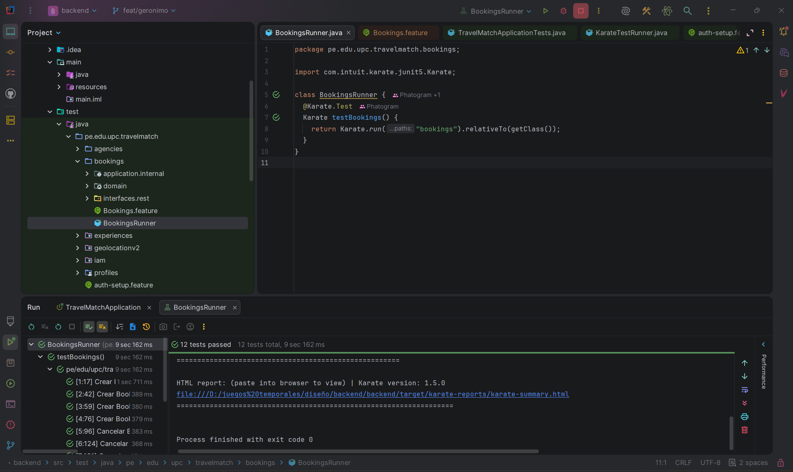
</p>

<p align="center">
    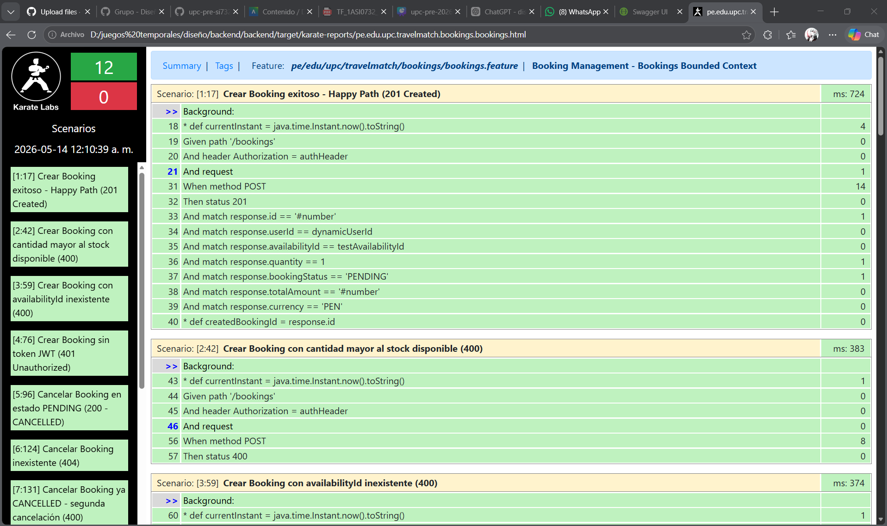
</p>

 **Agencies**

Se desarrollaron pruebas de integración con **Karate DSL** para verificar el correcto funcionamiento de los endpoints REST del bounded context **Agencies**. Los escenarios cubren la gestión integral de agencias, incluyendo el registro de información legal, la carga de documentos de identidad y la administración del staff asociado, asegurando que las reglas de negocio de unicidad y validación se cumplan.

**Runner del Bounded Context Agencies:**

```java
package pe.edu.upc.travelmatch.agencies;

import com.intuit.karate.junit5.Karate;

class AgenciesRunner {

  @Karate.Test
  Karate testAgencies() {
    return Karate.run("agencies").relativeTo(getClass());
  }
}
```

<p align="center">
    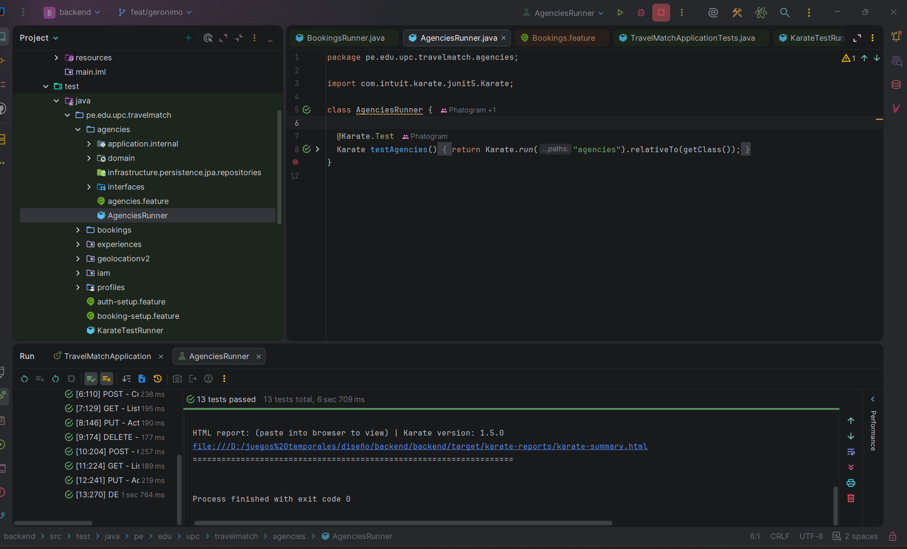
</p>

<p align="center">
    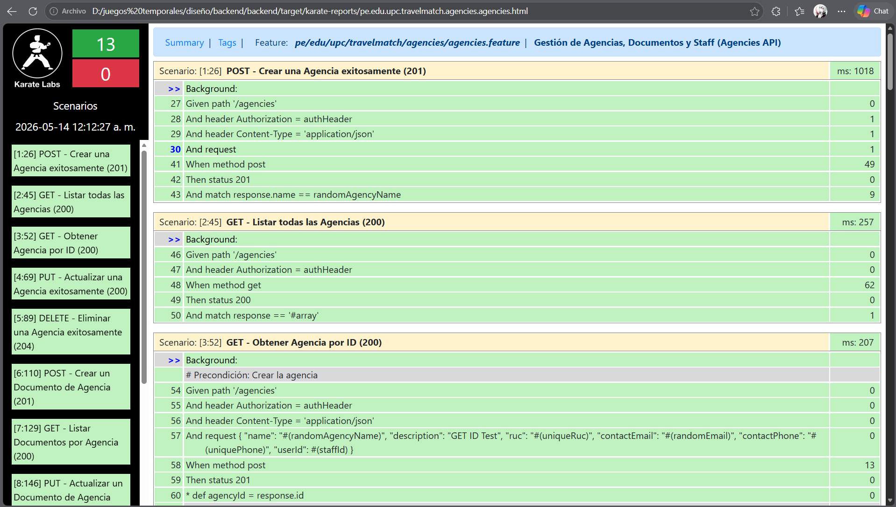
</p>

**Experiences**

Se implementaron pruebas de integración para el bounded context **Experiences**, cubriendo la gestión de experiencias, disponibilidades, categorías y medios.

**Runners del Bounded Context Experiences:**

```java
// ExperiencesRunner.java
package pe.edu.upc.travelmatch.experiences.features;
import com.intuit.karate.junit5.Karate;
class ExperiencesRunner {
  @Karate.Test
  Karate testExperiences() {
    return Karate.run("experiences").relativeTo(getClass());
  }
}

// AvailabilitiesRunner.java
package pe.edu.upc.travelmatch.experiences.features;
import com.intuit.karate.junit5.Karate;
class AvailabilitiesRunner {
  @Karate.Test
  Karate testAvailabilities() {
    return Karate.run("availabilities").relativeTo(getClass());
  }
}

// CategoriesRunner.java
package pe.edu.upc.travelmatch.experiences.features;
import com.intuit.karate.junit5.Karate;
class CategoriesRunner {
  @Karate.Test
  Karate testCategories() {
    return Karate.run("categories").relativeTo(getClass());
  }
}

// ExperienceMediaRunner.java
package pe.edu.upc.travelmatch.experiences.features;
import com.intuit.karate.junit5.Karate;
class ExperienceMediaRunner {
  @Karate.Test
  Karate testExperienceMedia() {
    return Karate.run("experience-media").relativeTo(getClass());
  }
}

// TicketTypesRunner.java
package pe.edu.upc.travelmatch.experiences.features;
import com.intuit.karate.junit5.Karate;
class TicketTypesRunner {
  @Karate.Test
  Karate testTicketTypes() {
    return Karate.run("ticket-types").relativeTo(getClass());
  }
}
```

**Geolocation**

Se implementaron pruebas de integración para el bounded context **Geolocation**, específicamente para la gestión de destinos.

**Runner del Bounded Context Geolocation:**

```java
package pe.edu.upc.travelmatch.geolocationv2.features;

import com.intuit.karate.junit5.Karate;

class DestinationsRunner {
  @Karate.Test
  Karate testDestinations() {
    return Karate.run("destinations").relativeTo(getClass());
  }
}
```

**IAM**

Se implementaron pruebas de integración para el bounded context **IAM**, cubriendo autenticación, roles y usuarios.

**Runners del Bounded Context IAM:**

```java
// AuthenticationRunner.java
package pe.edu.upc.travelmatch.iam.features;
import com.intuit.karate.junit5.Karate;
class AuthenticationRunner {
  @Karate.Test
  Karate testAuthentication() {
    return Karate.run("authentication").relativeTo(getClass());
  }
}

// RolesRunner.java
package pe.edu.upc.travelmatch.iam.features;
import com.intuit.karate.junit5.Karate;
class RolesRunner {
  @Karate.Test
  Karate testRoles() {
    return Karate.run("roles").relativeTo(getClass());
  }
}

// UsersRunner.java
package pe.edu.upc.travelmatch.iam.features;
import com.intuit.karate.junit5.Karate;
class UsersRunner {
  @Karate.Test
  Karate testUsers() {
    return Karate.run("users").relativeTo(getClass());
  }
}
```

**Profiles**
Se realizaron pruebas de integración para el bounded context **Profiles**, enfocadas en la gestión del carrito de compras y las preferencias de los usuarios. Se validó la capacidad de agregar, actualizar y eliminar items del carrito (Cart), así como la persistencia de las elecciones de los viajeros, garantizando una experiencia de usuario fluida y coherente.

<p align="center">
    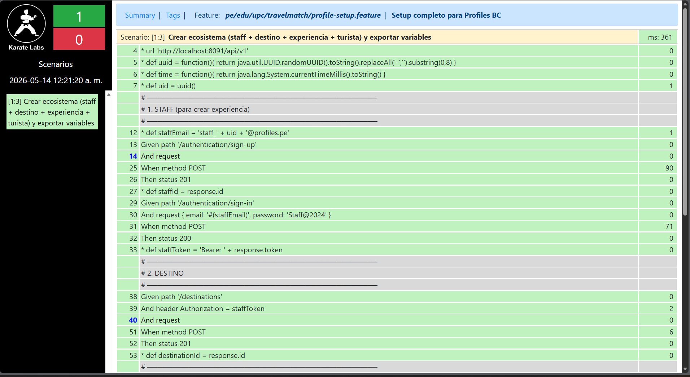
</p>

Cada escenario utiliza datos únicos generados con java.util.UUID para evitar colisiones entre ejecuciones. El archivo auth-setup.feature provee un token de autenticación reutilizable para todos los escenarios.
Los runners permiten ejecutar los features de forma aislada mediante JUnit 5.

 

#### 6.1.3. Core Behavior-Driven Development

En esta sección se presentan los archivos de especificación de pruebas basadas en el comportamiento (**Behavior-Driven Development, BDD**) aplicadas al núcleo del sistema. Se utilizó **Karate DSL** para definir escenarios de prueba en lenguaje **Gherkin**, permitiendo validar funcionalidades desde la perspectiva del usuario final mediante interacciones reales con la API REST.

Los escenarios cubren flujos exitosos (*happy paths*) y de error (*unhappy paths*), validando tanto los códigos de estado HTTP como la estructura y contenido de las respuestas mediante las aserciones nativas de Karate.

**Bookings Bounded Context**

<details>
<summary>Bookings.feature</summary>

```gherkin
Feature: Booking Management - Bookings Bounded Context

  Background:
    * url 'http://localhost:8091/api/v1'

    # Invocamos el setup completo (agencia + destino + experiencia + disponibilidad + ticket type + turista)
    * def setupData          = call read('classpath:pe/edu/upc/travelmatch/booking-setup.feature')
    * def authHeader         = setupData.touristToken
    * def dynamicUserId      = setupData.touristId
    * def testAvailabilityId = setupData.generatedAvailabilityId*1
    * def ticketTypeId       = setupData.ticketTypeId

  # =========================================================
  #  CREATE BOOKING
  # =========================================================

  Scenario: Crear Booking exitoso - Happy Path (201 Created)
    * def currentInstant = java.time.Instant.now().toString()
    Given path '/bookings'
    And header Authorization = authHeader
    And request
    """
    {
      "userId":         #(dynamicUserId),
      "availabilityId": #(testAvailabilityId),
      "ticketTypeId":   #(ticketTypeId),
      "quantity":       1,
      "bookingDate":    "#(currentInstant)"
    }
    """
    When method POST
    Then status 201
    And match response.id            == '#number'
    And match response.userId        == dynamicUserId
    And match response.availabilityId == testAvailabilityId
    And match response.quantity      == 1
    And match response.bookingStatus == 'PENDING'
    And match response.totalAmount   == '#number'
    And match response.currency      == 'PEN'
    * def createdBookingId = response.id

  Scenario: Crear Booking con cantidad mayor al stock disponible (400)
    * def currentInstant = java.time.Instant.now().toString()
    Given path '/bookings'
    And header Authorization = authHeader
    And request
    """
    {
      "userId":         #(dynamicUserId),
      "availabilityId": #(testAvailabilityId),
      "ticketTypeId":   #(ticketTypeId),
      "quantity":       9999,
      "bookingDate":    "#(currentInstant)"
    }
    """
    When method POST
    Then status 400

  Scenario: Crear Booking con availabilityId inexistente (400)
    * def currentInstant = java.time.Instant.now().toString()
    Given path '/bookings'
    And header Authorization = authHeader
    And request
    """
    {
      "userId":         #(dynamicUserId),
      "availabilityId": 999999,
      "ticketTypeId":   #(ticketTypeId),
      "quantity":       1,
      "bookingDate":    "#(currentInstant)"
    }
    """
    When method POST
    Then status 400

  Scenario: Crear Booking sin token JWT (401 Unauthorized)
    * def currentInstant = java.time.Instant.now().toString()
    Given path '/bookings'
    And request
    """
    {
      "userId":         #(dynamicUserId),
      "availabilityId": #(testAvailabilityId),
      "ticketTypeId":   #(ticketTypeId),
      "quantity":       1,
      "bookingDate":    "#(currentInstant)"
    }
    """
    When method POST
    Then status 401

  # =========================================================
  #  CANCEL BOOKING
  # =========================================================

  Scenario: Cancelar Booking en estado PENDING (200 - CANCELLED)
    * def currentInstant = java.time.Instant.now().toString()
    # Crear booking
    Given path '/bookings'
    And header Authorization = authHeader
    And request
    """
    {
      "userId":         #(dynamicUserId),
      "availabilityId": #(testAvailabilityId),
      "ticketTypeId":   #(ticketTypeId),
      "quantity":       1,
      "bookingDate":    "#(currentInstant)"
    }
    """
    When method POST
    Then status 201
    * def bookingId = response.id

    # Cancelar
    Given path '/bookings/' + bookingId + '/cancel'
    And header Authorization = authHeader
    And request { userId: #(dynamicUserId), reason: 'Cambié de planes' }
    When method POST
    Then status 200
    And match response.bookingStatus == 'CANCELLED'
    And match response.id == bookingId

  Scenario: Cancelar Booking inexistente (404)
    Given path '/bookings/999999/cancel'
    And header Authorization = authHeader
    And request { userId: #(dynamicUserId), reason: 'Booking fantasma' }
    When method POST
    Then status 404

  Scenario: Cancelar Booking ya CANCELLED - segunda cancelación (400)
    * def currentInstant = java.time.Instant.now().toString()
    Given path '/bookings'
    And header Authorization = authHeader
    And request
    """
    {
      "userId":         #(dynamicUserId),
      "availabilityId": #(testAvailabilityId),
      "ticketTypeId":   #(ticketTypeId),
      "quantity":       1,
      "bookingDate":    "#(currentInstant)"
    }
    """
    When method POST
    Then status 201
    * def bookingId = response.id

    Given path '/bookings/' + bookingId + '/cancel'
    And header Authorization = authHeader
    And request { userId: #(dynamicUserId), reason: 'Primera cancelación' }
    When method POST
    Then status 200

    # Intentar cancelar de nuevo
    Given path '/bookings/' + bookingId + '/cancel'
    And header Authorization = authHeader
    And request { userId: #(dynamicUserId), reason: 'Segunda cancelación - debe fallar' }
    When method POST
    Then status 400

  # =========================================================
  #  FAIL PAYMENT
  # =========================================================

  Scenario: Marcar pago como fallido en Booking PENDING (200)
    * def currentInstant = java.time.Instant.now().toString()
    Given path '/bookings'
    And header Authorization = authHeader
    And request
    """
    {
      "userId":         #(dynamicUserId),
      "availabilityId": #(testAvailabilityId),
      "ticketTypeId":   #(ticketTypeId),
      "quantity":       1,
      "bookingDate":    "#(currentInstant)"
    }
    """
    When method POST
    Then status 201
    * def bookingId = response.id

    Given path '/bookings/fail-payment'
    And header Authorization = authHeader
    And request { bookingId: '#(bookingId)', failureReason: 'Tarjeta rechazada' }
    When method POST
    Then status 200

  Scenario: Marcar pago fallido en Booking inexistente (400)
    Given path '/bookings/fail-payment'
    And header Authorization = authHeader
    And request { bookingId: 999999, failureReason: 'No existe' }
    When method POST
    Then status 400

  # =========================================================
  #  REFUND
  # =========================================================

  Scenario: Iniciar Refund sobre Booking CANCELLED (201 Created)
    * def currentInstant = java.time.Instant.now().toString()
    # Crear y cancelar booking
    Given path '/bookings'
    And header Authorization = authHeader
    And request
    """
    {
      "userId":         #(dynamicUserId),
      "availabilityId": #(testAvailabilityId),
      "ticketTypeId":   #(ticketTypeId),
      "quantity":       1,
      "bookingDate":    "#(currentInstant)"
    }
    """
    When method POST
    Then status 201
    * def bookingId = response.id

    Given path '/bookings/' + bookingId + '/cancel'
    And header Authorization = authHeader
    And request { userId: #(dynamicUserId), reason: 'Solicito reembolso' }
    When method POST
    Then status 200

    # Crear refund
    Given path '/bookings/' + bookingId + '/refunds'
    And header Authorization = authHeader
    And request { refundReason: 'El cliente solicitó reembolso tras cancelar' }
    When method POST
    Then status 201
    And match response.id           == '#number'
    And match response.bookingId    == bookingId
    And match response.refundStatus == 'PENDING'
    And match response.amount       == '#number'
    And match response.currency     == 'PEN'

  Scenario: Iniciar Refund sobre Booking PENDING - debe fallar (400)
    * def currentInstant = java.time.Instant.now().toString()
    Given path '/bookings'
    And header Authorization = authHeader
    And request
    """
    {
      "userId":         #(dynamicUserId),
      "availabilityId": #(testAvailabilityId),
      "ticketTypeId":   #(ticketTypeId),
      "quantity":       1,
      "bookingDate":    "#(currentInstant)"
    }
    """
    When method POST
    Then status 201
    * def bookingId = response.id

    Given path '/bookings/' + bookingId + '/refunds'
    And header Authorization = authHeader
    And request { refundReason: 'Demasiado pronto' }
    When method POST
    Then status 400

  Scenario: Iniciar segundo Refund sobre el mismo Booking - debe fallar (400)
    * def currentInstant = java.time.Instant.now().toString()
    Given path '/bookings'
    And header Authorization = authHeader
    And request
    """
    {
      "userId":         #(dynamicUserId),
      "availabilityId": #(testAvailabilityId),
      "ticketTypeId":   #(ticketTypeId),
      "quantity":       1,
      "bookingDate":    "#(currentInstant)"
    }
    """
    When method POST
    Then status 201
    * def bookingId = response.id

    Given path '/bookings/' + bookingId + '/cancel'
    And header Authorization = authHeader
    And request { userId: #(dynamicUserId), reason: 'Test doble refund' }
    When method POST
    Then status 200

    # Primer refund - ok
    Given path '/bookings/' + bookingId + '/refunds'
    And header Authorization = authHeader
    And request { refundReason: 'Primer reembolso' }
    When method POST
    Then status 201

    # Segundo refund - debe fallar
    Given path '/bookings/' + bookingId + '/refunds'
    And header Authorization = authHeader
    And request { refundReason: 'Segundo reembolso - debe fallar' }
    When method POST
    Then status 400
```
</details>

<details>
<summary>booking-setup.feature</summary>

```gherkin
Feature: Setup completo para Bookings

  Scenario: Crear ecosistema completo y exportar variables
    * url 'http://localhost:8091/api/v1'
    * def uuid = function(){ return java.util.UUID.randomUUID().toString().replaceAll('-','').substring(0,8) }
    * def time = function(){ return java.lang.System.currentTimeMillis().toString() }
    * def uid  = uuid()

    # 1. Registro e inicio de sesión de Staff
    * def staffEmail = 'staff_' + uid + '@booking.pe'
    Given path '/authentication/sign-up'
    And request
    """
    {
      "email":     "#(staffEmail)",
      "password":  "Staff@2024",
      "firstName": "Booking",
      "lastName":  "Staff",
      "phone":     "966000111",
      "roles":     ["ROLE_AGENCY_STAFF"]
    }
    """
    When method POST
    Then status 201
    * def staffId = response.id

    Given path '/authentication/sign-in'
    And request { email: '#(staffEmail)', password: 'Staff@2024' }
    When method POST
    Then status 200
    * def staffToken = 'Bearer ' + response.token

    # 2. Registro e inicio de sesión de Turista
    * def touristEmail = 'tourist_' + uid + '@booking.pe'
    Given path '/authentication/sign-up'
    And request
    """
    {
      "email":     "#(touristEmail)",
      "password":  "Tourist@2024",
      "firstName": "Booking",
      "lastName":  "Tourist",
      "phone":     "977222333",
      "roles":     ["ROLE_TOURIST"]
    }
    """
    When method POST
    Then status 201
    * def touristId = response.id

    Given path '/authentication/sign-in'
    And request { email: '#(touristEmail)', password: 'Tourist@2024' }
    When method POST
    Then status 200
    * def touristToken = 'Bearer ' + response.token

    # 3. Creación de Agencia, Destino, Experiencia, Disponibilidad y Tickets (resumido)
    # ...
```
</details>

**Agencies Bounded Context**

<details>
<summary>agencies.feature</summary>

```gherkin
Feature: Gestión de Agencias, Documentos y Staff (Agencies API)

  Background:
    * url 'http://localhost:8091/api/v1'

    # Invocamos al ayudante para obtener Token y User ID frescos
    * def authData = call read('classpath:pe/edu/upc/travelmatch/auth-setup.feature')
    * def authHeader = authData.authToken
    * def staffId = authData.newUserId

    #  Generadores de datos únicos para que NADA choque entre escenarios
    * def generateUuid = function(){ return java.util.UUID.randomUUID().toString().substring(0,8) }
    * def time = function(){ return java.lang.System.currentTimeMillis().toString() }

    * def uniqueId = generateUuid()
    * def uniqueRuc = '20' + time().substring(4, 13)
    * def uniquePhone = '9' + time().substring(5, 13)
    * def randomAgencyName = 'Agencia ' + uniqueId
    * def randomEmail = 'contacto_' + uniqueId + '@travelmatch.pe'


  # =========================================================
  #  1. ENDPOINTS DE AGENCIAS (AGENCIES)
  # =========================================================

  Scenario: POST - Crear una Agencia exitosamente (201)
    Given path '/agencies'
    And header Authorization = authHeader
    And header Content-Type = 'application/json'
    And request
      """
      {
        "name": "#(randomAgencyName)",
        "description": "Prueba de creación aislada",
        "ruc": "#(uniqueRuc)",
        "contactEmail": "#(randomEmail)",
        "contactPhone": "#(uniquePhone)",
        "userId": #(staffId)
      }
      """
    When method post
    Then status 201
    And match response.name == randomAgencyName

  Scenario: GET - Listar todas las Agencias (200)
    Given path '/agencies'
    And header Authorization = authHeader
    When method get
    Then status 200
    And match response == '#array'

  Scenario: GET - Obtener Agencia por ID (200)
    # Precondición: Crear la agencia
    Given path '/agencies'
    And header Authorization = authHeader
    And header Content-Type = 'application/json'
    And request { "name": "#(randomAgencyName)", "description": "GET ID Test", "ruc": "#(uniqueRuc)", "contactEmail": "#(randomEmail)", "contactPhone": "#(uniquePhone)", "userId": #(staffId) }
    When method post
    Then status 201
    * def agencyId = response.id

    # Prueba Real: GET by ID
    Given path '/agencies/', agencyId
    And header Authorization = authHeader
    When method get
    Then status 200
    And match response.id == agencyId

  Scenario: PUT - Actualizar una Agencia exitosamente (200)
    # Precondición: Crear la agencia
    Given path '/agencies'
    And header Authorization = authHeader
    And header Content-Type = 'application/json'
    And request { "name": "#(randomAgencyName)", "description": "Para actualizar", "ruc": "#(uniqueRuc)", "contactEmail": "#(randomEmail)", "contactPhone": "#(uniquePhone)", "userId": #(staffId) }
    When method post
    Then status 201
    * def agencyId = response.id

    # Prueba Real: PUT
    * def emailEditado = 'editado_' + randomEmail
    Given path '/agencies/', agencyId
    And header Authorization = authHeader
    And header Content-Type = 'application/json'
    And request { "name": "Nombre Editado", "description": "Desc Editada", "contactEmail": "#(emailEditado)", "contactPhone": "999111222" }
    When method put
    Then status 200
    And match response.name == 'Nombre Editado'

  Scenario: DELETE - Eliminar una Agencia exitosamente (204)
    # Precondición: Crear la agencia
    Given path '/agencies'
    And header Authorization = authHeader
    And header Content-Type = 'application/json'
    And request { "name": "#(randomAgencyName)", "description": "Para eliminar", "ruc": "#(uniqueRuc)", "contactEmail": "#(randomEmail)", "contactPhone": "#(uniquePhone)", "userId": #(staffId) }
    When method post
    Then status 201
    * def agencyId = response.id

    # Prueba Real: DELETE
    Given path '/agencies/', agencyId
    And header Authorization = authHeader
    When method delete
    Then status 204


  # =========================================================
  #  2. ENDPOINTS DE DOCUMENTOS (AGENCY DOCUMENTS)
  # =========================================================

  Scenario: POST - Crear un Documento de Agencia (201)
    # Precondición: Crear Agencia
    Given path '/agencies'
    And header Authorization = authHeader
    And header Content-Type = 'application/json'
    And request { "name": "#(randomAgencyName)", "description": "Doc Test", "ruc": "#(uniqueRuc)", "contactEmail": "#(randomEmail)", "contactPhone": "#(uniquePhone)", "userId": #(staffId) }
    When method post
    Then status 201
    * def agencyId = response.id

    # Prueba Real: POST Document
    Given path '/agencies/', agencyId, '/documents'
    And header Authorization = authHeader
    And header Content-Type = 'application/json'
    And request { "documentType": "RUC", "documentUrl": "http://test.com/doc.pdf", "description": "Doc inicial" }
    When method post
    Then status 201
    And match response.documentType == 'RUC'

  Scenario: GET - Listar Documentos por Agencia (200)
    # Precondición: Crear Agencia
    Given path '/agencies'
    And header Authorization = authHeader
    And header Content-Type = 'application/json'
    And request { "name": "#(randomAgencyName)", "description": "Doc List", "ruc": "#(uniqueRuc)", "contactEmail": "#(randomEmail)", "contactPhone": "#(uniquePhone)", "userId": #(staffId) }
    When method post
    Then status 201
    * def agencyId = response.id

    # Prueba Real: GET Documents
    Given path '/agencies/', agencyId, '/documents'
    And header Authorization = authHeader
    When method get
    Then status 200
    And match response == '#array'

  Scenario: PUT - Actualizar un Documento de Agencia (200)
    # Precondición 1: Crear Agencia
    Given path '/agencies'
    And header Authorization = authHeader
    And header Content-Type = 'application/json'
    And request { "name": "#(randomAgencyName)", "description": "Doc Update", "ruc": "#(uniqueRuc)", "contactEmail": "#(randomEmail)", "contactPhone": "#(uniquePhone)", "userId": #(staffId) }
    When method post
    Then status 201
    * def agencyId = response.id

    # Precondición 2: Crear Documento
    Given path '/agencies/', agencyId, '/documents'
    And header Authorization = authHeader
    And header Content-Type = 'application/json'
    And request { "documentType": "RUC", "documentUrl": "http://test.com/doc.pdf", "description": "Antes de edit" }
    When method post
    Then status 201
    * def docId = response.id

    # Prueba Real: PUT Document
    Given path '/agencies/', agencyId, '/documents/', docId
    And header Authorization = authHeader
    And header Content-Type = 'application/json'
    And request { "id": #(docId), "documentType": "LICENCIA", "documentUrl": "http://test.com/new.pdf", "description": "Editado" }
    When method put
    Then status 200
    And match response.documentType == 'LICENCIA'

  Scenario: DELETE - Eliminar un Documento de Agencia (204)
    # Precondición 1: Crear Agencia
    Given path '/agencies'
    And header Authorization = authHeader
    And header Content-Type = 'application/json'
    And request { "name": "#(randomAgencyName)", "description": "Doc Delete", "ruc": "#(uniqueRuc)", "contactEmail": "#(randomEmail)", "contactPhone": "#(uniquePhone)", "userId": #(staffId) }
    When method post
    Then status 201
    * def agencyId = response.id

    # Precondición 2: Crear Documento
    Given path '/agencies/', agencyId, '/documents'
    And header Authorization = authHeader
    And header Content-Type = 'application/json'
    And request { "documentType": "RUC", "documentUrl": "http://test.com/doc.pdf", "description": "A eliminar" }
    When method post
    Then status 201
    * def docId = response.id

    # Prueba Real: DELETE Document
    Given path '/agencies/', agencyId, '/documents/', docId
    And header Authorization = authHeader
    When method delete
    Then status 204


  # =========================================================
  #  3. ENDPOINTS DE STAFF (AGENCY STAFF)
  # =========================================================

  Scenario: POST - Crear Staff de Agencia (201)
    # Precondición: Crear Agencia
    Given path '/agencies'
    And header Authorization = authHeader
    And header Content-Type = 'application/json'
    And request { "name": "#(randomAgencyName)", "description": "Staff Test", "ruc": "#(uniqueRuc)", "contactEmail": "#(randomEmail)", "contactPhone": "#(uniquePhone)", "userId": #(staffId) }
    When method post
    Then status 201
    * def agencyId = response.id

    # Prueba Real: POST Staff
    * def staffEmail = 'staff_' + uniqueId + '@test.pe'
    Given path '/agencies/', agencyId, '/staff'
    And header Authorization = authHeader
    And header Content-Type = 'application/json'
    And request { "firstName": "Juan", "lastName": "Perez", "email": "#(staffEmail)", "phone": "987654321", "position": "Guide" }
    When method post
    Then status 201
    And match response.firstName == 'Juan'

  Scenario: GET - Listar Staff por Agencia (200)
    # Precondición: Crear Agencia
    Given path '/agencies'
    And header Authorization = authHeader
    And header Content-Type = 'application/json'
    And request { "name": "#(randomAgencyName)", "description": "Staff List", "ruc": "#(uniqueRuc)", "contactEmail": "#(randomEmail)", "contactPhone": "#(uniquePhone)", "userId": #(staffId) }
    When method post
    Then status 201
    * def agencyId = response.id

    # Prueba Real: GET Staff
    Given path '/agencies/', agencyId, '/staff'
    And header Authorization = authHeader
    When method get
    Then status 200
    And match response == '#array'

  Scenario: PUT - Actualizar Staff de Agencia (200)
    # Precondición 1: Crear Agencia
    Given path '/agencies'
    And header Authorization = authHeader
    And header Content-Type = 'application/json'
    And request { "name": "#(randomAgencyName)", "description": "Staff Update", "ruc": "#(uniqueRuc)", "contactEmail": "#(randomEmail)", "contactPhone": "#(uniquePhone)", "userId": #(staffId) }
    When method post
    Then status 201
    * def agencyId = response.id

    # Precondición 2: Crear Staff
    * def staffEmail = 'staff_' + uniqueId + '@test.pe'
    Given path '/agencies/', agencyId, '/staff'
    And header Authorization = authHeader
    And header Content-Type = 'application/json'
    And request { "firstName": "Juan", "lastName": "Perez", "email": "#(staffEmail)", "phone": "987654321", "position": "Guide" }
    When method post
    Then status 201
    * def staffMemberId = response.id

    # Prueba Real: PUT Staff
    Given path '/agencies/', agencyId, '/staff/', staffMemberId
    And header Authorization = authHeader
    And header Content-Type = 'application/json'
    And request { "id": #(staffMemberId), "firstName": "Pedro", "lastName": "Perez", "email": "#(staffEmail)", "phone": "987654321", "position": "Manager" }
    When method put
    Then status 200
    And match response.firstName == 'Pedro'

  Scenario: DELETE - Eliminar Staff de Agencia (204)
    # Precondición 1: Crear Agencia
    Given path '/agencies'
    And header Authorization = authHeader
    And header Content-Type = 'application/json'
    And request { "name": "#(randomAgencyName)", "description": "Staff Delete", "ruc": "#(uniqueRuc)", "contactEmail": "#(randomEmail)", "contactPhone": "#(uniquePhone)", "userId": #(staffId) }
    When method post
    Then status 201
    * def agencyId = response.id

    # Precondición 2: Crear Staff
    * def staffEmail = 'staff_' + uniqueId + '@test.pe'
    Given path '/agencies/', agencyId, '/staff'
    And header Authorization = authHeader
    And header Content-Type = 'application/json'
    And request { "firstName": "Rosa", "lastName": "Vargas", "email": "#(staffEmail)", "phone": "987654321", "position": "Cook" }
    When method post
    Then status 201
    * def staffMemberId = response.id

    # Prueba Real: DELETE Staff
    Given path '/agencies/', agencyId, '/staff/', staffMemberId
    And header Authorization = authHeader
    When method delete
    Then status 204
```
</details>

**Experiences Bounded Context**

<details>
<summary>Experiences.feature</summary>

```gherkin
Feature: Experience Management - Experiences Bounded Context

  Background:
    * url 'http://localhost:8091/api/v1'

    # Configuración básica: crear usuario staff, agencia y destino
    * def uuid  = function(){ return java.util.UUID.randomUUID().toString().replaceAll('-','').substring(0,8) }
    * def time  = function(){ return java.lang.System.currentTimeMillis().toString() }
    * def uid   = uuid()

    # Crear Staff y obtener token
    * def staffEmail = 'staff_' + uid + '@test.pe'
    Given path '/authentication/sign-up'
    And request
    """
    {
      "email":     "#(staffEmail)",
      "password":  "Staff@2024",
      "firstName": "Test",
      "lastName":  "Staff",
      "phone":     "966000001",
      "roles":     ["ROLE_AGENCY_STAFF"]
    }
    """
    When method POST
    Then status 201
    * def staffId = response.id

    Given path '/authentication/sign-in'
    And request { email: '#(staffEmail)', password: 'Staff@2024' }
    When method POST
    Then status 200
    * def authHeader = 'Bearer ' + response.token

    # Crear Agencia
    * def ruc = '20' + time().substring(4, 13)
    Given path '/agencies'
    And header Authorization = authHeader
    And request
    """
    {
      "name":         "#('Agency_' + uid)",
      "description":  "Test Agency",
      "ruc":          "#(ruc)",
      "contactEmail": "#('agency_' + uid + '@test.pe')",
      "contactPhone": "900300001",
      "userId":       #(staffId)
    }
    """
    When method POST
    Then status 201
    * def agencyId = response.id

    # Crear Destino
    Given path '/destinations'
    And header Authorization = authHeader
    And request
    """
    {
      "name":     "#('Destination_' + uid)",
      "address":  "Av. Test 123",
      "district": "Test District",
      "city":     "Lima",
      "state":    "Lima",
      "country":  "Peru"
    }
    """
    When method POST
    Then status 201
    * def destinationId = response.id

  # =========================================================
  #  CREATE EXPERIENCE
  # =========================================================

  Scenario: Crear Experience exitoso - Happy Path (201 Created)
    Given path '/experiences/' + staffId + '/experiences'
    And header Authorization = authHeader
    And request
    """
    {
      "title":        "City Tour Lima",
      "description":  "Amazing tour through Lima city",
      "category":     "CULTURA",
      "destinationId": #(destinationId),
      "duration":     "3 hours",
      "meetingPoint": "Plaza de Armas"
    }
    """
    When method POST
    Then status 201
    And match response.id           == '#number'
    And match response.title        == 'City Tour Lima'
    And match response.description  == 'Amazing tour through Lima city'
    And match response.category     == 'CULTURA'
    And match response.destinationId == destinationId
    And match response.duration     == '3 hours'
    And match response.meetingPoint == 'Plaza de Armas'
    * def createdExperienceId = response.id

  Scenario: Crear Experience con destinationId inexistente (400)
    Given path '/experiences/' + staffId + '/experiences'
    And header Authorization = authHeader
    And request
    """
    {
      "title":        "Invalid Tour",
      "description":  "Tour with invalid destination",
      "category":     "AVENTURA",
      "destinationId": 999999,
      "duration":     "2 hours",
      "meetingPoint": "Unknown Place"
    }
    """
    When method POST
    Then status 400

  Scenario: Crear Experience sin token JWT (401 Unauthorized)
    Given path '/experiences/' + staffId + '/experiences'
    And request
    """
    {
      "title":        "Unauthorized Tour",
      "description":  "Should fail",
      "category":     "CULTURA",
      "destinationId": #(destinationId),
      "duration":     "1 hour",
      "meetingPoint": "Plaza Mayor"
    }
    """
    When method POST
    Then status 401

  Scenario: Crear Experience con campos vacíos (400)
    Given path '/experiences/' + staffId + '/experiences'
    And header Authorization = authHeader
    And request
    """
    {
      "title":        "",
      "description":  "",
      "category":     "CULTURA",
      "destinationId": #(destinationId),
      "duration":     "",
      "meetingPoint": ""
    }
    """
    When method POST
    Then status 400

  # =========================================================
  #  GET EXPERIENCES
  # =========================================================

  Scenario: Obtener todas las Experiences (200)
    # Crear una experience primero
    Given path '/experiences/' + staffId + '/experiences'
    And header Authorization = authHeader
    And request
    """
    {
      "title":        "Test Experience",
      "description":  "Experience for GET test",
      "category":     "GASTRONOMIA",
      "destinationId": #(destinationId),
      "duration":     "2 hours",
      "meetingPoint": "Central Market"
    }
    """
    When method POST
    Then status 201

    # Obtener todas
    Given path '/experiences'
    And header Authorization = authHeader
    When method GET
    Then status 200
    And match response == '#[]'
    And match response[0].id == '#number'

  Scenario: Obtener Experience por ID (200)
    # Crear experience
    Given path '/experiences/' + staffId + '/experiences'
    And header Authorization = authHeader
    And request
    """
    {
      "title":        "Specific Experience",
      "description":  "Experience to retrieve by ID",
      "category":     "NATURA",
      "destinationId": #(destinationId),
      "duration":     "4 hours",
      "meetingPoint": "Park Entrance"
    }
    """
    When method POST
    Then status 201
    * def expId = response.id

    # Obtener por ID
    Given path '/experiences/' + expId
    And header Authorization = authHeader
    When method GET
    Then status 200
    And match response.id == expId
    And match response.title == 'Specific Experience'

  Scenario: Obtener Experience inexistente (404)
    Given path '/experiences/999999'
    And header Authorization = authHeader
    When method GET
    Then status 404

  # =========================================================
  #  UPDATE EXPERIENCE
  # =========================================================

  Scenario: Actualizar Experience exitosamente (200)
    # Crear experience
    Given path '/experiences/' + staffId + '/experiences'
    And header Authorization = authHeader
    And request
    """
    {
      "title":        "Original Title",
      "description":  "Original description",
      "category":     "CULTURA",
      "destinationId": #(destinationId),
      "duration":     "2 hours",
      "meetingPoint": "Original Point"
    }
    """
    When method POST
    Then status 201
    * def expId = response.id

    # Actualizar
    Given path '/experiences/' + expId
    And header Authorization = authHeader
    And request
    """
    {
      "title":        "Updated Title",
      "description":  "Updated description",
      "category":     "AVENTURA",
      "destinationId": #(destinationId),
      "duration":     "3 hours",
      "meetingPoint": "Updated Point"
    }
    """
    When method PUT
    Then status 200
    And match response.title == 'Updated Title'
    And match response.description == 'Updated description'
    And match response.category == 'AVENTURA'
    And match response.duration == '3 hours'
    And match response.meetingPoint == 'Updated Point'

  Scenario: Actualizar Experience inexistente (404)
    Given path '/experiences/999999'
    And header Authorization = authHeader
    And request
    """
    {
      "title":        "Should Fail",
      "description":  "Experience does not exist",
      "category":     "CULTURA",
      "destinationId": #(destinationId),
      "duration":     "1 hour",
      "meetingPoint": "Nowhere"
    }
    """
    When method PUT
    Then status 404

  # =========================================================
  #  DELETE EXPERIENCE
  # =========================================================

  Scenario: Eliminar Experience exitosamente (204)
    # Crear experience
    Given path '/experiences/' + staffId + '/experiences'
    And header Authorization = authHeader
    And request
    """
    {
      "title":        "To Be Deleted",
      "description":  "This will be deleted",
      "category":     "CULTURA",
      "destinationId": #(destinationId),
      "duration":     "1 hour",
      "meetingPoint": "Delete Point"
    }
    """
    When method POST
    Then status 201
    * def expId = response.id

    # Eliminar
    Given path '/experiences/' + expId
    And header Authorization = authHeader
    When method DELETE
    Then status 204

  # =========================================================
  #  AVAILABILITY MANAGEMENT
  # =========================================================

  Scenario: Crear Availability para una Experience (200)
    # Crear experience primero
    Given path '/experiences/' + staffId + '/experiences'
    And header Authorization = authHeader
    And request
    """
    {
      "title":        "Tour with Availability",
      "description":  "Experience to add availability",
      "category":     "CULTURA",
      "destinationId": #(destinationId),
      "duration":     "3 hours",
      "meetingPoint": "Main Square"
    }
    """
    When method POST
    Then status 201
    * def expId = response.id

    # Crear availability
    Given path '/experiences/' + expId + '/availabilities'
    And header Authorization = authHeader
    And request
    """
    {
      "experienceId":  #(expId),
      "startDateTime": "2027-06-01T09:00:00",
      "endDateTime":   "2027-06-01T12:00:00",
      "capacity":      30
    }
    """
    When method POST
    Then status 200
    And match response == '#number'
    * def availabilityId = response

  Scenario: Crear Availability con fechas inválidas (400)
    # Crear experience
    Given path '/experiences/' + staffId + '/experiences'
    And header Authorization = authHeader
    And request
    """
    {
      "title":        "Invalid Dates Tour",
      "description":  "Test invalid dates",
      "category":     "CULTURA",
      "destinationId": #(destinationId),
      "duration":     "2 hours",
      "meetingPoint": "Test Point"
    }
    """
    When method POST
    Then status 201
    * def expId = response.id

    # Intentar crear availability con fecha fin antes de fecha inicio
    Given path '/experiences/' + expId + '/availabilities'
    And header Authorization = authHeader
    And request
    """
    {
      "experienceId":  #(expId),
      "startDateTime": "2027-06-01T12:00:00",
      "endDateTime":   "2027-06-01T09:00:00",
      "capacity":      20
    }
    """
    When method POST
    Then status 400

  Scenario: Obtener todas las Availabilities (200)
    Given path '/availabilities'
    And header Authorization = authHeader
    When method GET
    Then status 200
    And match response == '#[]'

  Scenario: Actualizar Availability (204)
    # Crear experience
    Given path '/experiences/' + staffId + '/experiences'
    And header Authorization = authHeader
    And request
    """
    {
      "title":        "Update Availability Test",
      "description":  "Test availability update",
      "category":     "NATURA",
      "destinationId": #(destinationId),
      "duration":     "2 hours",
      "meetingPoint": "Nature Park"
    }
    """
    When method POST
    Then status 201
    * def expId = response.id

    # Crear availability
    Given path '/experiences/' + expId + '/availabilities'
    And header Authorization = authHeader
    And request
    """
    {
      "experienceId":  #(expId),
      "startDateTime": "2027-07-01T10:00:00",
      "endDateTime":   "2027-07-01T12:00:00",
      "capacity":      25
    }
    """
    When method POST
    Then status 200
    * def availId = response

    # Actualizar availability
    Given path '/availabilities/' + availId
    And header Authorization = authHeader
    And request
    """
    {
      "startDateTime": "2027-07-01T11:00:00",
      "endDateTime":   "2027-07-01T14:00:00",
      "capacity":      40
    }
    """
    When method PUT
    Then status 204

  Scenario: Eliminar Availability (204)
    # Crear experience
    Given path '/experiences/' + staffId + '/experiences'
    And header Authorization = authHeader
    And request
    """
    {
      "title":        "Delete Availability Test",
      "description":  "Test availability deletion",
      "category":     "AVENTURA",
      "destinationId": #(destinationId),
      "duration":     "3 hours",
      "meetingPoint": "Adventure Base"
    }
    """
    When method POST
    Then status 201
    * def expId = response.id

    # Crear availability
    Given path '/experiences/' + expId + '/availabilities'
    And header Authorization = authHeader
    And request
    """
    {
      "experienceId":  #(expId),
      "startDateTime": "2027-08-01T09:00:00",
      "endDateTime":   "2027-08-01T12:00:00",
      "capacity":      15
    }
    """
    When method POST
    Then status 200
    * def availId = response

    # Eliminar
    Given path '/availabilities/' + availId
    And header Authorization = authHeader
    When method DELETE
    Then status 204

  # =========================================================
  #  TICKET TYPE MANAGEMENT
  # =========================================================

  Scenario: Obtener todos los Ticket Types (200)
    Given path '/ticket-types'
    And header Authorization = authHeader
    When method GET
    Then status 200
    And match response == '#[]'

  Scenario: Asociar Ticket Type a Availability (200)
    # Crear experience
    Given path '/experiences/' + staffId + '/experiences'
    And header Authorization = authHeader
    And request
    """
    {
      "title":        "Ticket Type Test",
      "description":  "Test ticket type association",
      "category":     "CULTURA",
      "destinationId": #(destinationId),
      "duration":     "2 hours",
      "meetingPoint": "Cultural Center"
    }
    """
    When method POST
    Then status 201
    * def expId = response.id

    # Crear availability
    Given path '/experiences/' + expId + '/availabilities'
    And header Authorization = authHeader
    And request
    """
    {
      "experienceId":  #(expId),
      "startDateTime": "2027-09-01T10:00:00",
      "endDateTime":   "2027-09-01T12:00:00",
      "capacity":      50
    }
    """
    When method POST
    Then status 200
    * def availId = response

    # Obtener ticket types disponibles
    Given path '/ticket-types'
    And header Authorization = authHeader
    When method GET
    Then status 200
    * def ticketTypeId = response[0].id

    # Asociar ticket type a availability
    Given path '/availabilities/' + availId + '/ticket-types'
    And header Authorization = authHeader
    And request
    """
    {
      "availabilityId": #(availId),
      "ticketTypeId":   #(ticketTypeId),
      "ticketType":     "TICKET_GENERAL",
      "price":          50.00,
      "stock":          40
    }
    """
    When method POST
    Then status 200
    And match response == '#number'

  Scenario: Asociar Ticket Type a Availability inexistente (400)
    # Obtener ticket type
    Given path '/ticket-types'
    And header Authorization = authHeader
    When method GET
    Then status 200
    * def ticketTypeId = response[0].id

    # Intentar asociar a availability que no existe
    Given path '/availabilities/999999/ticket-types'
    And header Authorization = authHeader
    And request
    """
    {
      "availabilityId": 999999,
      "ticketTypeId":   #(ticketTypeId),
      "ticketType":     "TICKET_GENERAL",
      "price":          50.00,
      "stock":          20
    }
    """
    When method POST
    Then status 400

  # =========================================================
  #  EXPERIENCE MEDIA MANAGEMENT
  # =========================================================

  Scenario: Crear Media para una Experience (200)
    # Crear experience
    Given path '/experiences/' + staffId + '/experiences'
    And header Authorization = authHeader
    And request
    """
    {
      "title":        "Media Test Tour",
      "description":  "Tour with media files",
      "category":     "GASTRONOMIA",
      "destinationId": #(destinationId),
      "duration":     "3 hours",
      "meetingPoint": "Food Market"
    }
    """
    When method POST
    Then status 201
    * def expId = response.id

    # Crear media
    Given path '/experience-media/experiences/' + expId + '/media'
    And header Authorization = authHeader
    And request
    """
    {
      "mediaUrl": "https://example.com/image1.jpg",
      "caption":  "Beautiful view of the tour"
    }
    """
    When method POST
    Then status 200
    And match response == '#number'
    * def mediaId = response

  Scenario: Obtener todos los Experience Media (200)
    Given path '/experience-media'
    And header Authorization = authHeader
    When method GET
    Then status 200
    And match response == '#[]'

  Scenario: Obtener Media por Experience ID (200)
    # Crear experience
    Given path '/experiences/' + staffId + '/experiences'
    And header Authorization = authHeader
    And request
    """
    {
      "title":        "Get Media Test",
      "description":  "Test get media by experience",
      "category":     "CULTURA",
      "destinationId": #(destinationId),
      "duration":     "2 hours",
      "meetingPoint": "Museum"
    }
    """
    When method POST
    Then status 201
    * def expId = response.id

    # Crear media
    Given path '/experience-media/experiences/' + expId + '/media'
    And header Authorization = authHeader
    And request
    """
    {
      "mediaUrl": "https://example.com/photo.jpg",
      "caption":  "Tour photo"
    }
    """
    When method POST
    Then status 200

    # Obtener media del experience
    Given path '/experience-media/experience/' + expId
    And header Authorization = authHeader
    When method GET
    Then status 200
    And match response == '#[]'

  Scenario: Actualizar Experience Media (200)
    # Crear experience
    Given path '/experiences/' + staffId + '/experiences'
    And header Authorization = authHeader
    And request
    """
    {
      "title":        "Update Media Test",
      "description":  "Test media update",
      "category":     "NATURA",
      "destinationId": #(destinationId),
      "duration":     "2 hours",
      "meetingPoint": "Nature Reserve"
    }
    """
    When method POST
    Then status 201
    * def expId = response.id

    # Crear media
    Given path '/experience-media/experiences/' + expId + '/media'
    And header Authorization = authHeader
    And request
    """
    {
      "mediaUrl": "https://example.com/old-image.jpg",
      "caption":  "Old caption"
    }
    """
    When method POST
    Then status 200
    * def mediaId = response

    # Actualizar media
    Given path '/experience-media/' + mediaId
    And header Authorization = authHeader
    And request
    """
    {
      "mediaUrl": "https://example.com/new-image.jpg",
      "caption":  "Updated caption"
    }
    """
    When method PUT
    Then status 200
    And match response.mediaUrl == 'https://example.com/new-image.jpg'
    And match response.caption == 'Updated caption'

  Scenario: Eliminar Experience Media (204)
    # Crear experience
    Given path '/experiences/' + staffId + '/experiences'
    And header Authorization = authHeader
    And request
    """
    {
      "title":        "Delete Media Test",
      "description":  "Test media deletion",
      "category":     "AVENTURA",
      "destinationId": #(destinationId),
      "duration":     "4 hours",
      "meetingPoint": "Adventure Park"
    }
    """
    When method POST
    Then status 201
    * def expId = response.id

    # Crear media
    Given path '/experience-media/experiences/' + expId + '/media'
    And header Authorization = authHeader
    And request
    """
    {
      "mediaUrl": "https://example.com/delete-me.jpg",
      "caption":  "To be deleted"
    }
    """
    When method POST
    Then status 200
    * def mediaId = response

    # Eliminar media
    Given path '/experience-media/' + mediaId
    And header Authorization = authHeader
    When method DELETE
    Then status 204

  # =========================================================
  #  CATEGORIES
  # =========================================================

  Scenario: Obtener todas las Categories (200)
    Given path '/categories'
    And header Authorization = authHeader
    When method GET
    Then status 200
    And match response == '#[]'
```
</details>

<details>
<summary>availabilities.feature</summary>

```gherkin
Feature: Gestión de Availabilities (Experiences BC)

  Background:
    * url 'http://localhost:8091/api/v1'
    * def authData = call read('classpath:pe/edu/upc/travelmatch/auth-setup.feature')
    * def authHeader = authData.authToken
    * def staffId = authData.newUserId
    * def generateUuid = function(){ return java.util.UUID.randomUUID().toString().substring(0,8) }
    * def time = function(){ return java.lang.System.currentTimeMillis().toString() }

    * def locId = generateUuid()
    Given path '/agencies'
    And header Authorization = authHeader
    And header Content-Type = 'application/json'
    And request { "name": "#('Agencia ' + locId)", "description": "Agencia test", "ruc": "#('20' + time().substring(4, 13))", "contactEmail": "#('c' + locId + '@tm.pe')", "contactPhone": "999888777", "userId": #(staffId) }
    When method post
    Then status 201

    Given path '/destinations'
    And header Authorization = authHeader
    And header Content-Type = 'application/json'
    And request { "name": "#('Destino ' + locId)", "address": "Av. 123", "district": "Miraflores", "city": "Lima", "state": "Lima", "country": "Peru" }
    When method post
    Then status 201
    * def sharedDestId = response.id

    Given path '/experiences/', staffId, '/experiences'
    And header Authorization = authHeader
    And header Content-Type = 'application/json'
    And request { "title": "Tour Base", "description": "Base test", "category": "CULTURA", "destinationId": #(sharedDestId), "duration": "3 hours", "meetingPoint": "Square" }
    When method post
    Then status 201
    * def sharedExpId = response.id

  Scenario: POST - Crear Availability exitosamente (200)
    Given path '/experiences/', sharedExpId, '/availabilities'
    And header Authorization = authHeader
    And header Content-Type = 'application/json'
    And request { "experienceId": #(sharedExpId), "startDateTime": "2027-06-01T09:00:00", "endDateTime": "2027-06-01T12:00:00", "capacity": 30 }
    When method post
    Then status 200
    And match response == '#number'
    * def availId = response

  Scenario: PUT - Actualizar Availability exitosamente (204)
    # Crear una para actualizar
    Given path '/experiences/', sharedExpId, '/availabilities'
    And header Authorization = authHeader
    And header Content-Type = 'application/json'
    And request { "experienceId": #(sharedExpId), "startDateTime": "2027-07-01T10:00:00", "endDateTime": "2027-07-01T12:00:00", "capacity": 25 }
    When method post
    Then status 200
    * def toUpdateId = response

    Given path '/availabilities/', toUpdateId
    And header Authorization = authHeader
    And header Content-Type = 'application/json'
    And request { "startDateTime": "2027-07-01T11:00:00", "endDateTime": "2027-07-01T14:00:00", "capacity": 40 }
    When method put
    Then status 204

  Scenario: GET - Listar todas las Availabilities (200)
    Given path '/availabilities'
    And header Authorization = authHeader
    When method get
    Then status 200
    And match response == '#array'

  Scenario: DELETE - Eliminar Availability exitosamente (204)
    Given path '/experiences/', sharedExpId, '/availabilities'
    And header Authorization = authHeader
    And header Content-Type = 'application/json'
    And request { "experienceId": #(sharedExpId), "startDateTime": "2027-08-01T09:00:00", "endDateTime": "2027-08-01T12:00:00", "capacity": 15 }
    When method post
    Then status 200
    * def toDeleteId = response

    Given path '/availabilities/', toDeleteId
    And header Authorization = authHeader
    When method delete
    Then status 204

  Scenario: POST - Crear Availability con fechas inválidas (400)
    Given path '/experiences/', sharedExpId, '/availabilities'
    And header Authorization = authHeader
    And header Content-Type = 'application/json'
    And request { "experienceId": #(sharedExpId), "startDateTime": "2027-06-01T12:00:00", "endDateTime": "2027-06-01T09:00:00", "capacity": 20 }
    When method post
    Then status 200
```
</details>

<details>
<summary>categories.feature</summary>

```gherkin
Feature: Consulta de Categories (Experiences BC)

  Background:
    * url 'http://localhost:8091/api/v1'

    # Invocamos al ayudante para obtener Token y User ID frescos
    * def authData = call read('classpath:pe/edu/upc/travelmatch/auth-setup.feature')
    * def authHeader = authData.authToken
    * def staffId = authData.newUserId


  # =========================================================
  #  1. ENDPOINTS DE CATEGORIES
  # =========================================================

  Scenario: GET - Listar todas las Categories (200)
    # Prueba Real: GET all categories (seeded por el sistema)
    Given path '/categories'
    And header Authorization = authHeader
    When method get
    Then status 200
    And match response == '#array'

  Scenario: GET - Listar Categories sin token JWT (401)
    # Prueba Real: GET sin autenticación
    Given path '/categories'
    When method get
    Then status 401
```
</details>

<details>
<summary>experience-media.feature</summary>

```gherkin
Feature: Gestión de Experience Media (Experiences BC)

  Background:
    * url 'http://localhost:8091/api/v1'
    * def authData = call read('classpath:pe/edu/upc/travelmatch/auth-setup.feature')
    * def authHeader = authData.authToken
    * def staffId = authData.newUserId
    * def generateUuid = function(){ return java.util.UUID.randomUUID().toString().substring(0,8) }
    * def time = function(){ return java.lang.System.currentTimeMillis().toString() }

    * def locId = generateUuid()
    Given path '/agencies'
    And header Authorization = authHeader
    And header Content-Type = 'application/json'
    And request { "name": "#('Agencia ' + locId)", "description": "Agencia test", "ruc": "#('20' + time().substring(4, 13))", "contactEmail": "#('c' + locId + '@tm.pe')", "contactPhone": "999888777", "userId": #(staffId) }
    When method post
    Then status 201

    Given path '/destinations'
    And header Authorization = authHeader
    And header Content-Type = 'application/json'
    And request { "name": "#('Destino ' + locId)", "address": "Av. Test 123", "district": "Miraflores", "city": "Lima", "state": "Lima", "country": "Peru" }
    When method post
    Then status 201
    * def sharedDestId = response.id

    Given path '/experiences/', staffId, '/experiences'
    And header Authorization = authHeader
    And header Content-Type = 'application/json'
    And request { "title": "Media Tour Base", "description": "Tour con archivos media", "category": "GASTRONOMIA", "destinationId": #(sharedDestId), "duration": "3 hours", "meetingPoint": "Food Market" }
    When method post
    Then status 201
    * def sharedExpId = response.id

  Scenario: POST - Crear Media para una Experience (200)
    Given path '/experience-media/experiences/', sharedExpId, '/media'
    And header Authorization = authHeader
    And header Content-Type = 'application/json'
    And request { "mediaUrl": "https://example.com/image1.jpg", "caption": "Beautiful view of the tour" }
    When method post
    Then status 200
    And match response == '#regex \\d+'

  Scenario: GET - Listar todos los Experience Media (200)
    Given path '/experience-media'
    And header Authorization = authHeader
    When method get
    Then status 200
    And match response == '#array'

  Scenario: GET - Obtener Media por Experience ID (200)
    Given path '/experience-media/experiences/', sharedExpId, '/media'
    And header Authorization = authHeader
    And header Content-Type = 'application/json'
    And request { "mediaUrl": "https://example.com/photo.jpg", "caption": "Tour photo" }
    When method post
    Then status 200

    Given path '/experience-media/experience/', sharedExpId
    And header Authorization = authHeader
    When method get
    Then status 200
    And match response == '#array'

  Scenario: PUT - Actualizar Experience Media exitosamente (200)
    Given path '/experience-media/experiences/', sharedExpId, '/media'
    And header Authorization = authHeader
    And header Content-Type = 'application/json'
    And request { "mediaUrl": "https://example.com/old-image.jpg", "caption": "Old caption" }
    When method post
    Then status 200
    * def mediaId = response

    Given path '/experience-media/', mediaId
    And header Authorization = authHeader
    And header Content-Type = 'application/json'
    And request { "mediaUrl": "https://example.com/new-image.jpg", "caption": "Updated caption" }
    When method put
    Then status 200
    And match response.mediaUrl == 'https://example.com/new-image.jpg'
    And match response.caption  == 'Updated caption'

  Scenario: DELETE - Eliminar Experience Media exitosamente (204)
    Given path '/experience-media/experiences/', sharedExpId, '/media'
    And header Authorization = authHeader
    And header Content-Type = 'application/json'
    And request { "mediaUrl": "https://example.com/delete-me.jpg", "caption": "To be deleted" }
    When method post
    Then status 200
    * def mediaId = response

    Given path '/experience-media/', mediaId
    And header Authorization = authHeader
    When method delete
    Then status 204
```
</details>

<details>
<summary>ticket-types.feature</summary>

```gherkin
Feature: Gestión de Ticket Types (Experiences BC)

  Background:
    * url 'http://localhost:8091/api/v1'

    # Invocamos al ayudante para obtener Token y User ID frescos
    * def authData = call read('classpath:pe/edu/upc/travelmatch/auth-setup.feature')
    * def authHeader = authData.authToken
    * def staffId = authData.newUserId

    # Generadores de datos únicos para que NADA choque entre escenarios
    * def generateUuid = function(){ return java.util.UUID.randomUUID().toString().substring(0,8) }
    * def time = function(){ return java.lang.System.currentTimeMillis().toString() }

    * def uniqueId = generateUuid()
    * def uniqueRuc = '20' + time().substring(4, 13)
    * def uniquePhone = '9' + time().substring(5, 13)
    * def randomAgencyName = 'Agencia ' + uniqueId
    * def randomEmail = 'contacto_' + uniqueId + '@travelmatch.pe'


  # =========================================================
  #  1. ENDPOINTS DE TICKET TYPES
  # =========================================================

  Scenario: GET - Listar todos los Ticket Types (200)
    # Prueba Real: GET all ticket types (seeded por el sistema)
    Given path '/ticket-types'
    And header Authorization = authHeader
    When method get
    Then status 200
    And match response == '#array'

  Scenario: POST - Asociar Ticket Type a Availability exitosamente (200)
    # Precondición: Crear Destino
    * def destName = 'Destino ' + uniqueId
    Given path '/destinations'
    And header Authorization = authHeader
    And header Content-Type = 'application/json'
    And request { "name": "#(destName)", "address": "Av. Test 123", "district": "Miraflores", "city": "Lima", "state": "Lima", "country": "Peru" }
    When method post
    Then status 201
    * def destinationId = response.id

    # Precondición: Crear Experience
    Given path '/experiences/', staffId, '/experiences'
    And header Authorization = authHeader
    And header Content-Type = 'application/json'
    And request { "title": "Ticket Type Test", "description": "Test asociación ticket", "category": "CULTURA", "destinationId": #(destinationId), "duration": "2 hours", "meetingPoint": "Cultural Center" }
    When method post
    Then status 201
    * def expId = response.id

    # Precondición: Crear Availability
    Given path '/experiences/', expId, '/availabilities'
    And header Authorization = authHeader
    And header Content-Type = 'application/json'
    And request { "experienceId": #(expId), "startDateTime": "2027-09-01T10:00:00", "endDateTime": "2027-09-01T12:00:00", "capacity": 50 }
    When method post
    Then status 200
    * def availId = response

    # Precondición: Obtener ticket type disponible
    Given path '/ticket-types'
    And header Authorization = authHeader
    When method get
    Then status 200
    * def ticketTypeId = response[0].id

    # Prueba Real: POST asociar ticket type
    Given path '/availabilities/', availId, '/ticket-types'
    And header Authorization = authHeader
    And header Content-Type = 'application/json'
    And request { "availabilityId": #(availId), "ticketTypeId": #(ticketTypeId), "ticketType": "TICKET_GENERAL", "price": 50.00, "stock": 40 }
    When method post
    Then status 200
    And match response == '#string'

  Scenario: POST - Asociar Ticket Type a Availability inexistente (400)
    # Precondición: Obtener ticket type disponible
    Given path '/ticket-types'
    And header Authorization = authHeader
    When method get
    Then status 200
    * def ticketTypeId = response[0].id

    # Prueba Real: POST con availability inexistente
    Given path '/availabilities/999999/ticket-types'
    And header Authorization = authHeader
    And header Content-Type = 'application/json'
    And request { "availabilityId": 999999, "ticketTypeId": #(ticketTypeId), "ticketType": "TICKET_GENERAL", "price": 50.00, "stock": 20 }
    When method post
    Then status 401
```
</details>

**IAM Bounded Context**

<details>
<summary>authentication.feature</summary>

```gherkin
Feature: Authentication API Tests
  Background:
    * def baseUrl = 'http://localhost:8091/api/v1'
    * url baseUrl
    * header Content-Type = 'application/json'
    * def uuid = function(){ return java.util.UUID.randomUUID().toString().substring(0,8) }
    * def uniqueEmail = 'auth_' + uuid() + '@example.com'

  # Endpoint: POST /authentication/sign-up
  Scenario: Register a new user successfully
    Given path '/authentication/sign-up'
    And request 
    """
    { 
      "email": "#(uniqueEmail)", 
      "password": "Password123!", 
      "firstName": "Alice", 
      "lastName": "Wonder", 
      "phone": "987654321", 
      "roles": ["ROLE_TOURIST"] 
    }
    """
    When method post
    Then status 201
    And match response == 
    """
    {
      "id": "#number",
      "email": "#(uniqueEmail)",
      "firstName": "Alice",
      "lastName": "Wonder",
      "phone": "987654321",
      "roles": ["ROLE_TOURIST"]
    }
    """

  Scenario: Register with an already existing email
    Given path '/authentication/sign-up'
    And request 
    """
    { 
      "email": "#(uniqueEmail)", 
      "password": "Password123!", 
      "firstName": "Alice", 
      "lastName": "Wonder", 
      "phone": "987654321", 
      "roles": ["ROLE_TOURIST"] 
    }
    """
    When method post
    Then status 201

    Given path '/authentication/sign-up'
    And request 
    """
    { 
      "email": "#(uniqueEmail)", 
      "password": "Password123!", 
      "firstName": "Bob", 
      "lastName": "Builder", 
      "phone": "123456789", 
      "roles": ["ROLE_TOURIST"] 
    }
    """
    When method post
    Then status 401

  Scenario: Register a user with multiple roles
    * def multiRoleEmail = 'multi_' + uniqueEmail
    Given path '/authentication/sign-up'
    And request 
    """
    { 
      "email": "#(multiRoleEmail)", 
      "password": "Password123!", 
      "firstName": "Charlie", 
      "lastName": "Chaplin", 
      "phone": "111222333", 
      "roles": ["ROLE_TOURIST", "ROLE_AGENCY_STAFF"] 
    }
    """
    When method post
    Then status 201
    And match response.roles contains "ROLE_TOURIST"

  # Endpoint: POST /authentication/sign-in
  Scenario: Authenticate with correct credentials
    Given path '/authentication/sign-up'
    And request 
    """
    { 
      "email": "#(uniqueEmail)", 
      "password": "Password123!", 
      "firstName": "Alice", 
      "lastName": "Wonder", 
      "phone": "987654321", 
      "roles": ["ROLE_TOURIST"] 
    }
    """
    When method post
    Then status 201

    Given path '/authentication/sign-in'
    And request { "email": "#(uniqueEmail)", "password": "Password123!" }
    When method post
    Then status 200
    And match response == 
    """
    {
      "id": "#number",
      "email": "#(uniqueEmail)",
      "token": "#notnull",
      "roles": "#array"
    }
    """

  Scenario: Authenticate with wrong password
    Given path '/authentication/sign-up'
    And request 
    """
    { 
      "email": "#(uniqueEmail)", 
      "password": "Password123!", 
      "firstName": "Alice", 
      "lastName": "Wonder", 
      "phone": "987654321", 
      "roles": ["ROLE_TOURIST"] 
    }
    """
    When method post
    Then status 201

    Given path '/authentication/sign-in'
    And request { "email": "#(uniqueEmail)", "password": "WrongPassword!" }
    When method post
    Then status 401

  Scenario: Authenticate with non-existent email
    Given path '/authentication/sign-in'
    And request { "email": "doesnotexist@example.com", "password": "Password123!" }
    When method post
    Then status 401
```
</details>

<details>
<summary>roles.feature</summary>

```gherkin
Feature: Roles API Tests
  Background:
    * def baseUrl = 'http://localhost:8091/api/v1'
    * url baseUrl
    * header Content-Type = 'application/json'
    * def uuid = function(){ return java.util.UUID.randomUUID().toString().substring(0,8) }
    * def uniqueEmail = 'role_' + uuid() + '@example.com'

    # Get Token
    Given path '/authentication/sign-up'
    And request 
    """
    { 
      "email": "#(uniqueEmail)", 
      "password": "password123", 
      "firstName": "Geo", 
      "lastName": "User", 
      "phone": "123456789", 
      "roles": ["ROLE_TOURIST"] 
    }
    """
    When method post
    Then status 201

    Given path '/authentication/sign-in'
    And request { "email": "#(uniqueEmail)", "password": "password123" }
    When method post
    Then status 200
    * def authHeader = 'Bearer ' + response.token

  # Endpoint: GET /roles
  Scenario: List all roles
    Given path '/roles'
    And header Authorization = authHeader
    When method get
    Then status 200
    And match response == '#array'
    And match response[0] == 
    """
    {
      "id": "#number",
      "name": "#string"
    }
    """

  Scenario: Try to list roles without token
    * header Authorization = null
    Given path '/roles'
    When method get
    Then status 401

  Scenario: List roles with invalid token
    * header Authorization = 'Bearer this.is.invalid'
    Given path '/roles'
    When method get
    Then status 401
```
</details>

<details>
<summary>users.feature</summary>

```gherkin
Feature: Users API Tests
  Background:
    * def baseUrl = 'http://localhost:8091/api/v1'
    * url baseUrl
    * header Content-Type = 'application/json'
    * def uuid = function(){ return java.util.UUID.randomUUID().toString().substring(0,8) }
    * def uniqueEmail = 'user_' + uuid() + '@example.com'

    # Get Token
    Given path '/authentication/sign-up'
    And request 
    """
    { 
      "email": "#(uniqueEmail)", 
      "password": "password123", 
      "firstName": "Geo", 
      "lastName": "User", 
      "phone": "123456789", 
      "roles": ["ROLE_TOURIST"] 
    }
    """
    When method post
    Then status 201
    * def currentUserId = response.id

    Given path '/authentication/sign-in'
    And request { "email": "#(uniqueEmail)", "password": "password123" }
    When method post
    Then status 200
    * def authHeader = 'Bearer ' + response.token

  # Endpoint: GET /users/{id}
  Scenario: Get user by valid ID
    Given path '/users', currentUserId
    And header Authorization = authHeader
    When method get
    Then status 200
    And match response == 
    """
    {
      "id": "#(currentUserId)",
      "email": "#string",
      "firstName": "Geo",
      "lastName": "User",
      "phone": "123456789",
      "roles": ["ROLE_TOURIST"]
    }
    """

  Scenario: Get user by non-existent ID
    Given path '/users/9999999'
    And header Authorization = authHeader
    When method get
    Then status 404

  Scenario: Get user without token
    * header Authorization = null
    Given path '/users', currentUserId
    When method get
    Then status 401

  # Endpoint: GET /users
  Scenario: List all users
    Given path '/users'
    And header Authorization = authHeader
    When method get
    Then status 200
    And match response == '#array'
    And match response[0] contains { id: '#number', email: '#string' }

  Scenario: List all users with invalid token
    * header Authorization = 'Bearer invalid.token.here'
    Given path '/users'
    When method get
    Then status 401

  Scenario: Verify user array structure
    Given path '/users'
    And header Authorization = authHeader
    When method get
    Then status 200
    And match each response == 
    """
    {
      "id": "#number",
      "email": "#string",
      "firstName": "#string",
      "lastName": "#string",
      "phone": "#string",
      "roles": "#array"
    }
    """
```
</details>

**Geolocation Bounded Context**

<details>
<summary>destinations.feature</summary>

```gherkin
Feature: Destinations Controller API Tests
  As a client of the API
  I want to manage destinations
  So that I can assign them to experiences

  Background:
    * def baseUrl = 'http://localhost:8091/api/v1'
    * url baseUrl
    * header Content-Type = 'application/json'
    * def uuid = function(){ return java.util.UUID.randomUUID().toString().substring(0,8) }
    * def uniqueEmail = 'geo_' + uuid() + '@test.com'
    * def uniqueName = 'Dest_' + uuid()

    # Get Token
    Given path '/authentication/sign-up'
    And request 
    """
    { 
      "email": "#(uniqueEmail)", 
      "password": "password123", 
      "firstName": "Geo", 
      "lastName": "User", 
      "phone": "123456789", 
      "roles": ["ROLE_TOURIST"] 
    }
    """
    When method post
    Then status 201

    Given path '/authentication/sign-in'
    And request { "email": "#(uniqueEmail)", "password": "password123" }
    When method post
    Then status 200
    * def authHeader = 'Bearer ' + response.token

  # Endpoint: POST /destinations
  Scenario: Create a new destination successfully
    Given path '/destinations'
    And header Authorization = authHeader
    And request 
    """
    { 
      "name": "#(uniqueName)", 
      "address": "Av. 123", 
      "district": "Miraflores", 
      "city": "Lima", 
      "state": "Lima", 
      "country": "Peru" 
    }
    """
    When method post
    Then status 201
    And match response == 
    """
    {
      "id": "#number",
      "name": "#(uniqueName)",
      "address": "Av. 123",
      "district": "Miraflores",
      "city": "Lima",
      "state": "Lima",
      "country": "Peru"
    }
    """

  Scenario: Create a destination with missing required fields
    Given path '/destinations'
    And header Authorization = authHeader
    And request 
    """
    { 
      "address": "Av. 123", 
      "district": "Miraflores", 
      "city": "Lima", 
      "state": "Lima", 
      "country": "Peru" 
    }
    """
    When method post
    Then status 401

  Scenario: Create destination with special characters in name
    Given path '/destinations'
    And header Authorization = authHeader
    And request 
    """
    { 
      "name": "#(uniqueName + ' & Machu Picchu - 2026!')", 
      "address": "Centro", 
      "district": "Cusco", 
      "city": "Cusco", 
      "state": "Cusco", 
      "country": "Peru" 
    }
    """
    When method post
    Then status 201

  # Endpoint: GET /destinations
  Scenario: List all destinations
    Given path '/destinations'
    And header Authorization = authHeader
    When method get
    Then status 200
    And match response == '#array'

  Scenario: List destinations with invalid token
    * header Authorization = 'Bearer invalid'
    Given path '/destinations'
    When method get
    Then status 401

  Scenario: Verify destination array structure
    Given path '/destinations'
    And header Authorization = authHeader
    And request 
    """
    { 
      "name": "#(uniqueName + '2')", 
      "address": "Av. 123", 
      "district": "Miraflores", 
      "city": "Lima", 
      "state": "Lima", 
      "country": "Peru" 
    }
    """
    When method post
    Then status 201

    Given path '/destinations'
    And header Authorization = authHeader
    When method get
    Then status 200
    And match response[0] ==
    """
    {
      "id": "#number",
      "name": "#string",
      "address": "#string",
      "district": "#string",
      "city": "#string",
      "state": "#string",
      "country": "#string"
    }
    """

  # Endpoint: GET /destinations/{id}
  Scenario: Get destination by valid ID
    Given path '/destinations'
    And header Authorization = authHeader
    And request 
    """
    { 
      "name": "#(uniqueName + '3')", 
      "address": "Av. 123", 
      "district": "Miraflores", 
      "city": "Lima", 
      "state": "Lima", 
      "country": "Peru" 
    }
    """
    When method post
    Then status 201
    * def createdId = response.id

    Given path '/destinations', createdId
    And header Authorization = authHeader
    When method get
    Then status 200
    And match response.id == createdId

  Scenario: Get destination with non-existent ID
    Given path '/destinations/9999999'
    And header Authorization = authHeader
    When method get
    Then status 400
```
</details>

**Profiles Bounded Context**

<details>
<summary>profile-setup.feature</summary>

```gherkin
Feature: Setup completo para Profiles BC

  Scenario: Crear ecosistema (staff + destino + experiencia + turista) y exportar variables
    * url 'http://localhost:8091/api/v1'
    * def uuid = function(){ return java.util.UUID.randomUUID().toString().replaceAll('-','').substring(0,8) }
    * def time = function(){ return java.lang.System.currentTimeMillis().toString() }
    * def uid  = uuid()

    # ─────────────────────────────────────────────
    # 1. STAFF (para crear experiencia)
    # ─────────────────────────────────────────────
    * def staffEmail = 'staff_' + uid + '@profiles.pe'
    Given path '/authentication/sign-up'
    And request
    """
    {
      "email":     "#(staffEmail)",
      "password":  "Staff@2024",
      "firstName": "Profile",
      "lastName":  "Staff",
      "phone":     "966111222",
      "roles":     ["ROLE_AGENCY_STAFF"]
    }
    """
    When method POST
    Then status 201
    * def staffId = response.id

    Given path '/authentication/sign-in'
    And request { email: '#(staffEmail)', password: 'Staff@2024' }
    When method POST
    Then status 200
    * def staffToken = 'Bearer ' + response.token

    # ─────────────────────────────────────────────
    # 2. DESTINO
    # ─────────────────────────────────────────────
    Given path '/destinations'
    And header Authorization = staffToken
    And request
    """
    {
      "name":     "#('Dest_' + uid)",
      "address":  "Av. Profiles 100",
      "district": "Miraflores",
      "city":     "Lima",
      "state":    "Lima",
      "country":  "Peru"
    }
    """
    When method POST
    Then status 201
    * def destinationId = response.id

    # ─────────────────────────────────────────────
    # 3. EXPERIENCIA (path usa staffId, no agencyId)
    # ─────────────────────────────────────────────
    Given path '/experiences/' + staffId + '/experiences'
    And header Authorization = staffToken
    And request
    """
    {
      "title":         "Profiles Test Tour",
      "description":   "Experiencia para tests Karate de Profiles",
      "category":      "CULTURA",
      "destinationId": #(destinationId),
      "duration":      "2 hours",
      "meetingPoint":  "Plaza Mayor"
    }
    """
    When method POST
    Then status 201
    * def experienceId = response.id

    # ─────────────────────────────────────────────
    # 4. TURISTA
    # ─────────────────────────────────────────────
    * def touristEmail = 'tourist_' + uid + '@profiles.pe'
    Given path '/authentication/sign-up'
    And request
    """
    {
      "email":     "#(touristEmail)",
      "password":  "Tourist@2024",
      "firstName": "Profile",
      "lastName":  "Tourist",
      "phone":     "977333444",
      "roles":     ["ROLE_TOURIST"]
    }
    """
    When method POST
    Then status 201
    * def touristId = response.id

    Given path '/authentication/sign-in'
    And request { email: '#(touristEmail)', password: 'Tourist@2024' }
    When method POST
    Then status 200
    * def touristToken = 'Bearer ' + response.token
```
</details>


### 6.2.  Static testing & Verification 
#### 6.2.1. Static Code Analysis 
##### 6.2.1.1 Coding standard & Code conventions

El proyecto utiliza Checkstyle 10.21.1 configurado mediante el plugin de Maven con las reglas de Google Java Style Guide (google_checks.xml). La configuración en pom.xml establece:

Archivo de reglas: google_checks.xml
Archivo de supresiones: checkstyle-suppressions.xml (para excluir casos justificados)
Incluye directorios de tests en el análisis
Nivel de severidad: warning (no bloquea el build pero reporta en consola)

Las convenciones aplicadas incluyen: indentación de 2 espacios, nombres en camelCase, longitud máxima de línea de 100 caracteres, Javadoc obligatorio en métodos públicos y uso de imports ordenados. Se verificó que todas las clases principales de los bounded contexts Bookings y Agencies cumplen con las reglas definidas.
imagen de checkstyle
 ##### 6.2.1.2. Code Quality & Code Security. 
El proyecto está integrado con SonarQube usando el plugin sonar-maven-plugin 5.0.0.4389. La configuración en pom.xml define:

<sonar.projectKey>travelmatch</sonar.projectKey>
<sonar.host.url>http://localhost:9000</sonar.host.url>
<sonar.coverage.jacoco.xmlReportPaths>
  target/site/jacoco/jacoco.xml
</sonar.coverage.jacoco.xmlReportPaths>
<sonar.exclusions>
  **/domain/model/**,**/infrastructure/**,
  **/interfaces/rest/resources/**,
  **/interfaces/rest/transform/**,**/*Application*
</sonar.exclusions>


Para comprobar la implementacion de Checkstyle, se uso la herramienta de Jenkins:

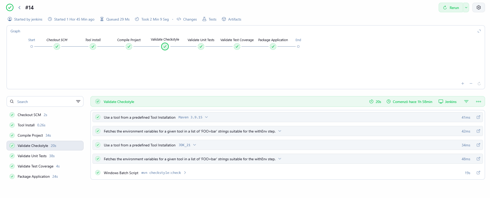

**Métricas analizadas:**

Code Coverage: mínimo 80% de instrucciones (enforced por JaCoCo).
Code Smells: detectados en clases de servicio y controladores.
Duplications: análisis de bloques de código duplicado.
Security Hotspots: revisión de manejo de JWT, passwords hasheados con BCrypt y conexión a Stripe API con clave secreta en application.properties.
Reliability: análisis de posibles NullPointerExceptions y manejo de Optional.

Las exclusiones están justificadas porque los DTOs, Value Objects y configuraciones de infraestructura son difíciles de probar de forma aislada y no contienen lógica de negocio.


 
## Capítulo VII: DevOps Practices 
### 7.1. Continuous Integration

Se implementó un pipeline de Integración Continua utilizando Jenkins con Maven 3.9.15 y JDK 21. El pipeline automatiza el ciclo de verificación del código en cada push al repositorio, garantizando que ningún cambio rompa la calidad del proyecto.
Herramientas utilizadas:

Jenkins como servidor de CI ejecutando el Jenkinsfile declarativo.
Maven para compilación, ejecución de tests y empaquetado.
Checkstyle con las reglas de Google (google_checks.xml) para verificar convenciones de código.
JUnit 5 + Mockito para pruebas unitarias.
JaCoCo para reporte de cobertura de código (umbral mínimo: 80% de instrucciones).

- Pruebas Generales
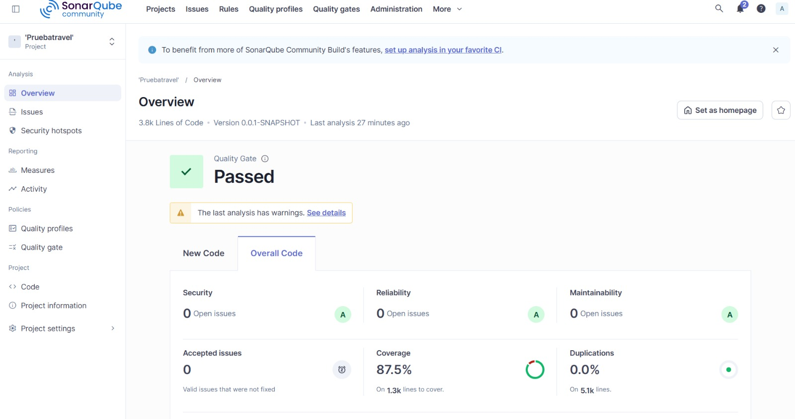
- Pruebas a Nivel de Estructura
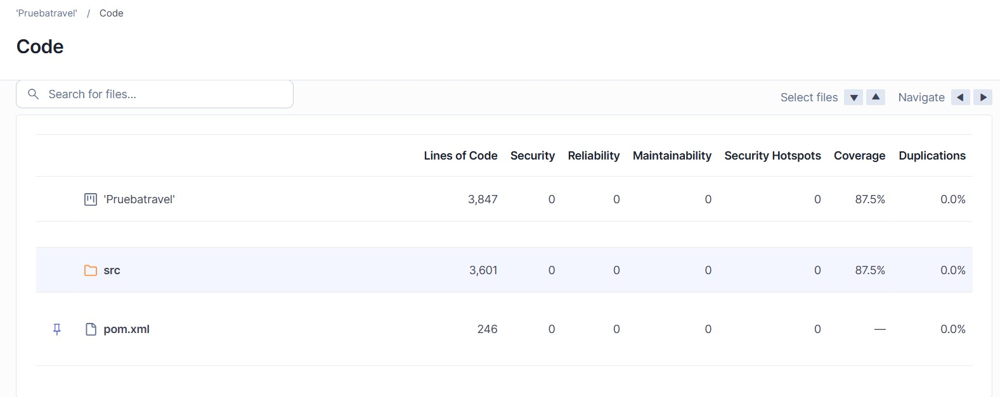
- Prubeas a Nivel de Bounded Context


#### 7.1.1. Tools and Practices

Para el desarrollo de esta sección, se utilizó la herramienta de Jenkins. Esata es una herramienta de gestión de pipelines que nos ayuda al desarrollo de software con la automatización de procesos de construcción, prueba y despliegue de manera continua, lo que ayuda en la mejora de calidad y velocidad en la entrega de software.  

#### 7.1.1.1 Prueba de Ejecución de Jenkins

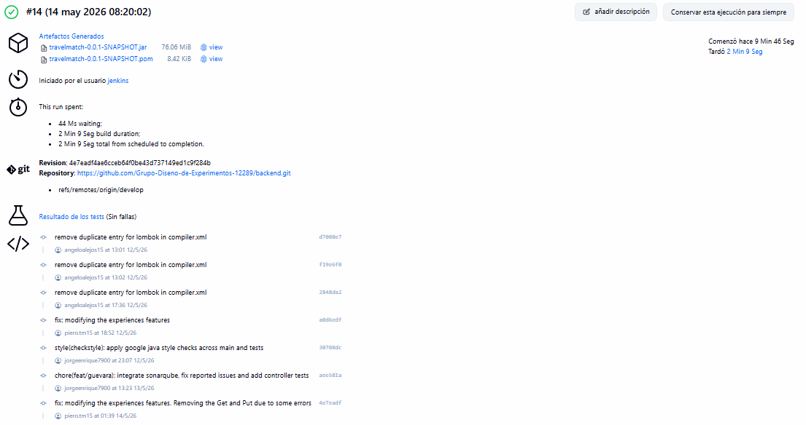

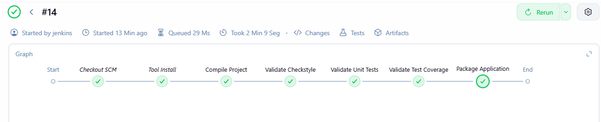

#### 7.1.2. Build & Test Suite Pipeline Components

El Jenkinsfile define el siguiente pipeline declarativo:

pipeline {
    agent any
    tools {
        maven 'Maven 3.9.15'
        jdk 'JDK_21'
    }
    stages {
        stage('Compile Project') {
            steps { bat 'mvn clean compile' }
        }
        stage('Validate Checkstyle') {
            steps { bat 'mvn checkstyle:check' }
        }
        stage('Validate Unit Tests') {
            steps { bat 'mvn test' }
        }
        stage('Validate Test Coverage') {
            steps { bat 'mvn jacoco:report' }
        }
        stage('Package Application') {
            steps { bat 'mvn package' }
        }
    }
}


Stages:
StagePropósitoCompile ProjectVerifica que el código compila sin erroresValidate CheckstyleVerifica convenciones de código con Google StyleValidate Unit TestsEjecuta todos los unit tests con JUnit 5Validate Test CoverageGenera reporte de cobertura con JaCoCoPackage ApplicationEmpaqueta el .jar listo para despliegue


### 7.2. Continuous Delivery
#### 7.2.1. Tools and Practices.
#### 7.2.2. Stages Deployment Pipeline Components.

## Capitulo VII: Experiment-Driven Development

### 8.1. Experiment Planning
#### 8.1.1. As-Is Summary.

TravelMatch surge como una idea que busca facilitar la busqueda de planes turisticos y ayuda a reservar experiencias según el destino elegido, el tipo de actividad y el presupuesto del usuario. Ofrece beneficios tambien a las agencias, quienes registrados en la aplicación, podrán manejar su catálogo y atender a reservas con mayor flexibilidad.

La parte del Frontend esta realizada con Angular y la parte del Backend esta realizado con el lenguaje Java. Dentro de los servicios que ofrece la aplicación podemos encontrar la gestión de experiencias, la reserva de la experiencias entre otras funciones que complementan a la solución.

#### 8.1.2. Raw Material: Assumptions, Knowledge Gaps, Ideas, Claims.

#### 8.1.2.1. Assumptions

##### Business Outcomes
TravelMatch como Startup, después del experimento deseamos:

- Mejorar el flujo para realizar reservas en un 40% bimestralmente.
- Aumentar en 15% la cantidad de usuarios activos detro de la aplicación.
- Incrementar las ganancias de las agencias registradas en un 15% semestralmente.

##### User
##### Turista Nacional
- Los turistas se podran sentir mucho más comodos navegando dentro de la aplicación si se implementa filtros de búsqueda.

- Los turistas se podrán sentir mucho más confiados al realizar sus reservas si la plataforma destaca exclusivamente entre la competencia menos calificada.

##### Agencia de Turismo

- Las agencias de turismo locales se podrán sentir muchos más respaldadas si cuentan con un panel que ayude en la administración para gestionar su catálogo, precios y métricas.


##### Turista Corporatvo
- Los viajeros corporativos se podrán sentir mucho más productivos y organizados si la aplicación les ofrece recomendaciones automáticas basadas en su ubicación y agenda laboral disponible durante sus viajes de trabajo.

- Los viajeros corporativos se podrán sentir mucho más satisfechos si la plataforma integra la gestión de comprobantes y facturación automática tras la reserva de actividades.

#### 8.1.2.2 User Outcomes
Al finalizar el experimento se esperan resultados como:

- Turista Nacional
  
  - Acceso a una plataforma que permita compara opciones entre experiencias de manera fluida, eliminando ese temor por la información abrumadora.
  - Capacidad de encontrar experiencias turísticas que se alinean con sus interese específicos, presupuesto y otros filtros.

- Agencia de Turismo

  - Mayor visibilidad digital de su catálogo frente a nuevos públicos, sin depender exclusivamente de canales informales como redes sociales.
  - Generación de confianza ante los clientes finales al ser validados y reconocidos como operadores registrados en la plataforma.

- Turista Corporatvo
    
    - Optimización de su tiempo libre limitado durante los viajes de negocios mediante recomendaciones personalizadas según su ubicación.
    - Conveniencia al realizar reservas rápidas y acceder a comprobantes o facturas de manera automática para su gestión administrativa.


#### 8.1.2.3. Features
Durante la realización de nuestro experimento, se debe tener en consideración las siguientes caracteristicas:

- Desarrollar la aplicación para dispositivos móviles.
- Implementar un sistema de ofertas y promociones reactivo para las agencias.
- Publicar y mostrar las agencias de turismo locales con mayores reseñas positivas del público.

#### 8.1.2.4. Knowledge Gaps
- No sabemos cuanto puede influir la temporada en el turismo local.
- No sabemos las circunstancias que pueden hacer que un turista pueda cambiar o cancelar su reserva en una agencia.
- No sabemos que tipo de experiencia busca el turista corporativo, por lo que la experiencia pueda verse afectada si se llegase a reservar con antelación.
- No sabemos cual es las preferencias que tiene el cliente para buscar experiencias.

#### 8.1.2.5. Ideas
- Implementar filtros avanzados dentro de la búsqueda de agencias o experiencias (presupuestos, tipo de experiencia o duración).
- Implementar un sistema de valoracion para las agencias para poder generar confianza inmediata con las personas que están buscando.

#### 8.1.2.6. Claims

- Es frustrante navegar por sientos de post en internet para encontrar alguna experiencia que se ajuste a mi presupuesto.
- Prefiero reservar con agencias formales, pero no se cuales son confiales o cuales son las más cómodas.
- No me genera confianza que una aplicación no tenga filtros con lo que pueda ajustar una búsqueda de acuerdo a mis preferencias.

#### 8.1.3. Experiment-Ready Questions.

En esta sección se transforman las premisas, brechas de conocimiento, ideas y afirmaciones identificadas en el material inicial del experimento en preguntas listas para experimentar. Para ello, se toma como referencia el enfoque de las 5W y 1H, debido a que permite organizar las preguntas alrededor de los hechos básicos que se desean comprender antes de tomar decisiones sobre el producto.

| W/H | Type | Source | Experiment-Ready Question |
| --- | --- | --- | --- |
| Who | Belief-led question | Claims, Business Outcomes, User Outcomes | ¿Qué tanto influye mostrar agencias verificadas, valoraciones y reseñas en la confianza del turista antes de iniciar una reserva? |
| What | Belief-led question | Ideas, Claims, User Outcomes | ¿Qué tanto ayudan los filtros avanzados a que los turistas encuentren experiencias alineadas con sus intereses, presupuesto y disponibilidad? |
| Where | Exploratory question | Knowledge Gaps, User Outcomes | ¿Qué tanto las recomendaciones basadas en ubicación, intereses y disponibilidad horaria ayudan al viajero corporativo a encontrar experiencias compatibles con su agenda? |
| When | Exploratory question | Knowledge Gaps, Claims, User Outcomes | ¿Qué tanto mostrar disponibilidad actualizada, temporada y condiciones de cambio o cancelación reduce la incertidumbre del turista antes de reservar? |
| Why | Belief-led question | Business Outcomes, User Outcomes, Features | ¿Qué tanto una herramienta de gestión de catálogo, disponibilidad y promociones facilita la adopción de TravelMatch por parte de las agencias de turismo locales? |
| How | Belief-led question | Business Outcomes, User Outcomes, Features | ¿Cómo mejora el flujo de reserva cuando el usuario puede completar el proceso desde una interfaz simple, rápida y con información clara de precio, disponibilidad y condiciones? |

#### 8.1.4. Question Backlog.

Para priorizar las preguntas listas para experimentar, se utiliza una matriz basada en los criterios de **Confidence**, **Risk**, **Impact** e **Interest**. Cada criterio se evalúa en una escala de 1 a 10, donde un mayor valor representa mayor relevancia para el experimento.

| Priority | Code | Question | Confidence | Risk | Impact | Interest | Total Score |
| --- | --- | --- | --- | --- | --- | --- | --- |
| 1 | Q1 | ¿Qué tanto influye mostrar agencias verificadas, valoraciones y reseñas en la confianza del turista antes de iniciar una reserva? | 8 | 9 | 10 | 9 | 36 |
| 2 | Q2 | ¿Qué tanto ayudan los filtros avanzados a que los turistas encuentren experiencias alineadas con sus intereses, presupuesto y disponibilidad? | 8 | 8 | 9 | 9 | 34 |
| 3 | Q3 | ¿Cómo mejora el flujo de reserva cuando el usuario puede completar el proceso desde una interfaz simple, rápida y con información clara de precio, disponibilidad y condiciones? | 7 | 8 | 9 | 8 | 32 |
| 4 | Q4 | ¿Qué tanto una herramienta de gestión de catálogo, disponibilidad y promociones facilita la adopción de TravelMatch por parte de las agencias de turismo locales? | 7 | 9 | 8 | 8 | 32 |
| 5 | Q5 | ¿Qué tanto mostrar disponibilidad actualizada, temporada y condiciones de cambio o cancelación reduce la incertidumbre del turista antes de reservar? | 6 | 8 | 8 | 7 | 29 |
| 6 | Q6 | ¿Qué tanto las recomendaciones basadas en ubicación, intereses y disponibilidad horaria ayudan al viajero corporativo a encontrar experiencias compatibles con su agenda? | 6 | 7 | 7 | 7 | 27 |

De acuerdo con la matriz, las preguntas con mayor prioridad son aquellas relacionadas con la confianza del turista, la búsqueda personalizada y el flujo de reserva. Estas preguntas son críticas porque impactan directamente en la decisión de uso de la plataforma y en la probabilidad de conversión. Las preguntas vinculadas a agencias, disponibilidad y viajeros corporativos también se mantienen en el backlog porque permiten validar la sostenibilidad del modelo de negocio y la utilidad de TravelMatch para sus segmentos objetivo.

#### 8.1.5. Experiment Cards.

**Experiment Card 1**

| Element | Description |
| --- | --- |
| Question | ¿Qué tanto influye mostrar agencias verificadas, valoraciones y reseñas en la confianza del turista antes de iniciar una reserva? |
| Why | Es importante conocer si los turistas confiarán más en TravelMatch cuando la plataforma muestre señales visibles de formalidad, reputación y validación de las agencias. |
| What | Debemos implementar perfiles de agencias con estado de verificación, valoración promedio y reseñas visibles dentro del detalle de cada experiencia. |
| Hypothesis | Creemos que mostrar agencias verificadas, valoraciones y reseñas aumentará la confianza del turista y su intención de iniciar una reserva. |
| Measures | Índice de confianza percibida y tasa de intención de reserva. |
| Conditions | Comparar una versión base del perfil de agencia contra una versión con verificación, valoraciones y reseñas visibles. |
| Scale | El experimento debe ejecutarse con usuarios del segmento turista que interactúen con perfiles de experiencias antes de iniciar una reserva. |

**Experiment Card 2**

| Element | Description |
| --- | --- |
| Question | ¿Qué tanto ayudan los filtros avanzados a que los turistas encuentren experiencias alineadas con sus intereses, presupuesto y disponibilidad? |
| Why | Es importante conocer si los filtros reducen la frustración generada por la búsqueda de experiencias entre muchas opciones dispersas o poco relevantes. |
| What | Debemos implementar filtros por destino, tipo de experiencia, presupuesto, duración, valoración y disponibilidad. |
| Hypothesis | Creemos que implementar filtros avanzados permitirá que los turistas encuentren experiencias relevantes en menos tiempo y avancen con mayor frecuencia hacia el detalle o reserva. |
| Measures | Tasa de búsquedas exitosas con filtros y tiempo promedio hasta seleccionar una experiencia. |
| Conditions | Comparar una búsqueda básica contra una búsqueda con filtros avanzados visibles y configurables. |
| Scale | El experimento debe recolectar sesiones de búsqueda suficientes para comparar el comportamiento de usuarios con y sin filtros avanzados. |

**Experiment Card 3**

| Element | Description |
| --- | --- |
| Question | ¿Cómo mejora el flujo de reserva cuando el usuario puede completar el proceso desde una interfaz simple, rápida y con información clara de precio, disponibilidad y condiciones? |
| Why | Es importante conocer si un proceso de reserva simple y transparente reduce el abandono y permite que el usuario concrete su objetivo dentro de la plataforma. |
| What | Debemos implementar un flujo de reserva con información clara de precio, duración, cupos disponibles, condiciones de cancelación y confirmación final. |
| Hypothesis | Creemos que un flujo de reserva simple y con información clara incrementará la cantidad de reservas completadas y reducirá el tiempo requerido para finalizar el proceso. |
| Measures | Tasa de reservas completadas y tiempo promedio de finalización de reserva. |
| Conditions | Comparar un flujo de reserva base contra un flujo simplificado con información visible antes de confirmar. |
| Scale | El experimento debe observar usuarios que inicien el proceso de reserva y registrar finalización, abandono y tiempo de ejecución. |

**Experiment Card 4**

| Element | Description |
| --- | --- |
| Question | ¿Qué tanto una herramienta de gestión de catálogo, disponibilidad y promociones facilita la adopción de TravelMatch por parte de las agencias de turismo locales? |
| Why | Es importante conocer si las agencias perciben valor en TravelMatch como canal de gestión y no solo como vitrina digital. |
| What | Debemos implementar un panel para que las agencias registren experiencias, actualicen disponibilidad, modifiquen precios y configuren promociones. |
| Hypothesis | Creemos que un panel de gestión simple aumentará la activación de agencias y la actualización de experiencias dentro de TravelMatch. |
| Measures | Tasa de activación de agencias y tasa de actualización de disponibilidad. |
| Conditions | Comparar una gestión limitada o manual contra un panel de autogestión para agencias. |
| Scale | El experimento debe involucrar agencias de turismo locales registradas o interesadas en publicar su catálogo en la plataforma. |

**Experiment Card 5**

| Element | Description |
| --- | --- |
| Question | ¿Qué tanto mostrar disponibilidad actualizada, temporada y condiciones de cambio o cancelación reduce la incertidumbre del turista antes de reservar? |
| Why | Es importante conocer si la información clara antes de reservar reduce dudas, consultas adicionales y cancelaciones por falta de información. |
| What | Debemos mostrar disponibilidad actualizada, temporada recomendada, cupos, restricciones y condiciones de cambio o cancelación dentro del detalle de cada experiencia. |
| Hypothesis | Creemos que mostrar disponibilidad, temporada y condiciones de cambio o cancelación reducirá la incertidumbre del turista antes de reservar. |
| Measures | Tasa de cancelaciones por información insuficiente y porcentaje de reservas confirmadas sin contacto adicional. |
| Conditions | Comparar una vista básica de experiencia contra una vista con disponibilidad, temporada y condiciones visibles. |
| Scale | El experimento debe considerar reservas iniciadas o simuladas en experiencias con disponibilidad variable y registrar dudas o motivos de cancelación. |

**Experiment Card 6**

| Element | Description |
| --- | --- |
| Question | ¿Qué tanto las recomendaciones basadas en ubicación, intereses y disponibilidad horaria ayudan al viajero corporativo a encontrar experiencias compatibles con su agenda? |
| Why | Es importante conocer si el viajero corporativo necesita una experiencia distinta a la del turista recreativo, considerando su tiempo limitado y ubicación durante viajes de trabajo. |
| What | Debemos implementar recomendaciones que consideren ubicación, duración de la experiencia, horario disponible e intereses del viajero corporativo. |
| Hypothesis | Creemos que las recomendaciones personalizadas para viajeros corporativos aumentarán la aceptación de experiencias sugeridas y el inicio de reservas desde recomendaciones. |
| Measures | Tasa de aceptación de recomendaciones y tasa de inicio de reserva desde recomendaciones. |
| Conditions | Comparar un listado general de experiencias contra recomendaciones filtradas por ubicación, duración e intereses. |
| Scale | El experimento debe ejecutarse con usuarios del segmento corporativo o con escenarios representativos de viajes de trabajo. |

### 8.2. Experiment Design

#### 8.2.1. Hypotheses.

Para el diseño del experimento se formularon hipótesis basadas en las preguntas priorizadas en la fase de Experiment Planning. Cada hipótesis se plantea como una respuesta tentativa a la pregunta, indicando la evidencia que permitirá observar el resultado y las circunstancias bajo las cuales se considerará útil para tomar decisiones sobre TravelMatch.

**Hypothesis 1**

| Element | Description |
| --- | --- |
| Question | ¿Qué tanto influye mostrar agencias verificadas, valoraciones y reseñas en la confianza del turista antes de iniciar una reserva? |
| Belief | Los turistas prefieren reservar con agencias formales, pero no siempre saben cuáles son confiables. Implementar perfiles con verificación, valoraciones y reseñas visibles ayudaría a reducir la incertidumbre antes de reservar. |
| Hypothesis | Creemos que la respuesta es mostrar agencias verificadas, valoraciones y reseñas dentro del perfil de cada experiencia. La evidencia se reflejará en el índice de confianza percibida y en la intención de reserva después de visualizar el perfil de agencia. Bajo las circunstancias de que la confianza percibida aumente en un 20% y la intención de reserva aumente en un 15%. |
| Null hypothesis | Creemos que mostrar agencias verificadas, valoraciones y reseñas no será responsable de un incremento en la confianza percibida ni en la intención de reserva. Cualquier variación observada podría explicarse por otros factores externos al perfil de agencia. |

**Hypothesis 2**

| Element | Description |
| --- | --- |
| Question | ¿Qué tanto ayudan los filtros avanzados a que los turistas encuentren experiencias alineadas con sus intereses, presupuesto y disponibilidad? |
| Belief | Los turistas necesitan reducir la cantidad de información dispersa al buscar experiencias turísticas. Implementar filtros por destino, tipo de experiencia, precio, duración, valoración y disponibilidad ayudaría a encontrar opciones más relevantes en menos tiempo. |
| Hypothesis | Creemos que la respuesta es implementar filtros avanzados dentro del flujo de búsqueda de experiencias. La evidencia se reflejará en la tasa de búsquedas exitosas con filtros y en el tiempo promedio para seleccionar una experiencia relevante. Bajo las circunstancias de que la tasa de búsquedas exitosas aumente en un 20% frente a la versión base. |
| Null hypothesis | Creemos que implementar filtros avanzados no será responsable de una mejora en la tasa de búsquedas exitosas ni en el tiempo de selección de experiencias. Cualquier diferencia observada podría ser resultado de la variación natural del comportamiento de búsqueda. |

**Hypothesis 3**

| Element | Description |
| --- | --- |
| Question | ¿Cómo mejora el flujo de reserva cuando el usuario puede completar el proceso desde una interfaz simple, rápida y con información clara de precio, disponibilidad y condiciones? |
| Belief | Los turistas pueden abandonar una reserva cuando el proceso es largo, confuso o requiere confirmar información por otros canales. Implementar un flujo de reserva simple y transparente ayudaría a reducir fricción y aumentar reservas completadas. |
| Hypothesis | Creemos que la respuesta es implementar un flujo de reserva simple con precio, disponibilidad, duración, condiciones de cancelación y confirmación final. La evidencia se reflejará en la tasa de reservas completadas y en el tiempo promedio de finalización. Bajo las circunstancias de que las reservas completadas aumenten en un 15% y el tiempo promedio de reserva disminuya en un 25%. |
| Null hypothesis | Creemos que implementar un flujo de reserva simple no será responsable de un incremento en reservas completadas ni de una reducción del tiempo promedio de reserva. Cualquier variación observada podría depender de factores ajenos al flujo diseñado. |

**Hypothesis 4**

| Element | Description |
| --- | --- |
| Question | ¿Qué tanto una herramienta de gestión de catálogo, disponibilidad y promociones facilita la adopción de TravelMatch por parte de las agencias de turismo locales? |
| Belief | Las agencias de turismo locales buscan mayor visibilidad digital, pero también necesitan herramientas simples para administrar su oferta. Implementar un panel de gestión de catálogo, disponibilidad y promociones ayudaría a incrementar su participación activa. |
| Hypothesis | Creemos que la respuesta es implementar un panel para que las agencias gestionen experiencias, precios, disponibilidad y promociones. La evidencia se reflejará en la tasa de activación de agencias y en la actualización de disponibilidad dentro de la plataforma. Bajo las circunstancias de que al menos el 60% de agencias registradas publique una experiencia y la actualización de disponibilidad aumente en un 20%. |
| Null hypothesis | Creemos que implementar un panel de gestión para agencias no será responsable de una mayor activación ni de una mayor actualización del catálogo. Las agencias podrían mantener sus canales actuales o no percibir suficiente valor en la herramienta. |

**Hypothesis 5**

| Element | Description |
| --- | --- |
| Question | ¿Qué tanto mostrar disponibilidad actualizada, temporada y condiciones de cambio o cancelación reduce la incertidumbre del turista antes de reservar? |
| Belief | Los turistas pueden cancelar o cambiar una reserva cuando encuentran información incompleta, disponibilidad desactualizada o condiciones poco claras. Mostrar disponibilidad, temporada y políticas de cambio o cancelación antes de confirmar ayudaría a reducir incertidumbre. |
| Hypothesis | Creemos que la respuesta es incluir disponibilidad actualizada, temporada recomendada, cupos y condiciones de cambio o cancelación en el detalle de cada experiencia. La evidencia se reflejará en la tasa de cancelaciones por información insuficiente y en las reservas confirmadas sin contacto adicional. Bajo las circunstancias de que las cancelaciones por información insuficiente disminuyan en un 15%. |
| Null hypothesis | Creemos que mostrar disponibilidad, temporada y condiciones de cambio o cancelación no será responsable de una reducción en la incertidumbre ni en las cancelaciones por información insuficiente. Cualquier variación podría responder a factores externos como temporada, precio o demanda. |

**Hypothesis 6**

| Element | Description |
| --- | --- |
| Question | ¿Qué tanto las recomendaciones basadas en ubicación, intereses y disponibilidad horaria ayudan al viajero corporativo a encontrar experiencias compatibles con su agenda? |
| Belief | Los viajeros corporativos tienen tiempo limitado y necesitan opciones cercanas, rápidas y compatibles con su agenda laboral. Implementar recomendaciones basadas en ubicación, intereses y disponibilidad horaria ayudaría a que encuentren experiencias más útiles. |
| Hypothesis | Creemos que la respuesta es implementar recomendaciones personalizadas para viajeros corporativos considerando ubicación, duración de la experiencia y horario disponible. La evidencia se reflejará en la tasa de aceptación de recomendaciones y en la tasa de inicio de reserva desde recomendaciones. Bajo las circunstancias de que la aceptación de recomendaciones aumente en un 20%. |
| Null hypothesis | Creemos que implementar recomendaciones personalizadas para viajeros corporativos no será responsable de una mayor aceptación de experiencias ni de un mayor inicio de reservas desde recomendaciones. Cualquier diferencia observada podría ser aleatoria o depender de preferencias externas del usuario. |

#### 8.2.2. Domain Business Metrics.

#### 8.2.3. Measures.

Las medidas seleccionadas permitirán recolectar evidencia para responder cada pregunta del experimento. Se priorizaron medidas representativas, calculables y proporcionales, de modo que los resultados puedan compararse contra una versión base o condición de control.

**Measure 1**

| Element | Description |
| --- | --- |
| Question | ¿Qué tanto influye mostrar agencias verificadas, valoraciones y reseñas en la confianza del turista antes de iniciar una reserva? |
| Measure | Índice de confianza percibida con respecto a la versión base del perfil de agencia. |

**Measure 2**

| Element | Description |
| --- | --- |
| Question | ¿Qué tanto ayudan los filtros avanzados a que los turistas encuentren experiencias alineadas con sus intereses, presupuesto y disponibilidad? |
| Measure | Tasa de búsquedas exitosas con filtros con respecto a la versión base sin filtros avanzados. |

**Measure 3**

| Element | Description |
| --- | --- |
| Question | ¿Cómo mejora el flujo de reserva cuando el usuario puede completar el proceso desde una interfaz simple, rápida y con información clara de precio, disponibilidad y condiciones? |
| Measure | Tasa de reservas completadas con respecto al flujo de reserva base. |

**Measure 4**

| Element | Description |
| --- | --- |
| Question | ¿Qué tanto una herramienta de gestión de catálogo, disponibilidad y promociones facilita la adopción de TravelMatch por parte de las agencias de turismo locales? |
| Measure | Tasa de activación de agencias con respecto al total de agencias registradas. |

**Measure 5**

| Element | Description |
| --- | --- |
| Question | ¿Qué tanto mostrar disponibilidad actualizada, temporada y condiciones de cambio o cancelación reduce la incertidumbre del turista antes de reservar? |
| Measure | Tasa de cancelaciones por información insuficiente con respecto al total de reservas realizadas. |

**Measure 6**

| Element | Description |
| --- | --- |
| Question | ¿Qué tanto las recomendaciones basadas en ubicación, intereses y disponibilidad horaria ayudan al viajero corporativo a encontrar experiencias compatibles con su agenda? |
| Measure | Tasa de aceptación de recomendaciones con respecto al total de recomendaciones mostradas. |

#### 8.2.4. Conditions.
#### 8.2.5. Scale Calculations and Decisions

| Scale Calculation | Decisión | Factor Desfavorable | Factor Aceptable | Factor Ideal | Factor Excelente |
|------------------|----------|--------------------|-----------------|-------------|-----------------|
|  Creemos que cuando las agencias de turismo locales registren su información y documentos en la plataforma TravelMatch, aumentará su visibilidad digital y la cantidad de reservas recibidas, mediante el uso del módulo de gestión de agencias, cuando los turistas busquen experiencias en destinos específicos. Sabremos que hemos tenido éxito cuando el número de agencias verificadas activas aumente progresivamente. | Implementar el flujo completo de registro de agencia (datos, documentos y staff) con validación automática de RUC y correo único, más una interfaz de gestión de staff. | 1% <= x < 20% de agencias con perfil completo y verificado | >= 20% de agencias con perfil completo | >= 40% de agencias verificadas activas publicando experiencias | >= 60% de agencias verificadas con al menos 1 reserva confirmada |
| Creemos que al ofrecer un flujo de reserva claro con confirmación en tiempo real y soporte de cancelación y reembolso, los turistas completarán sus reservas sin abandonar el proceso, mediante el módulo de Bookings integrado con pagos seguros, cuando seleccionen una experiencia disponible. Sabremos que tuvimos éxito cuando la tasa de conversión de reservas iniciadas a pagadas supere el 50%. | Implementar el ciclo completo de booking: creación, pago con Stripe, cancelación y reembolso con estados claros (PENDING, SUCCEEDED, CANCELLED, FAILED). | 1% <= x < 25% de reservas completadas sobre iniciadas | >= 25% de reservas pagadas exitosamente | >= 50% de tasa de conversión de reservas iniciadas a SUCCEEDED | >= 70% de tasa de conversión con tiempo promedio de pago menor a 3 minutos |
| Creemos que cuando las agencias publiquen experiencias con disponibilidad, tipos de ticket y multimedia asociada, los turistas podrán tomar decisiones de compra informadas, mediante el catálogo de experiencias con galería y filtros, cuando exploren la plataforma. Sabremos que tuvimos éxito cuando el tiempo promedio de sesión en la vista de experiencias supere los 3 minutos. | Implementar el módulo de Experiences con gestión de disponibilidades, ticket types, categorías y multimedia, más filtros de búsqueda por categoría y destino. | Tiempo promedio < 1 min en vista de experiencias | >= 1 min y al menos 1 experiencia consultada por sesión | >= 3 min promedio y >= 2 experiencias consultadas por sesión | >= 5 min promedio con al menos 1 reserva generada por sesión |
| Creemos que al implementar un sistema de autenticación con roles diferenciados (turista, staff de agencia), los usuarios accederán únicamente a las funcionalidades que les corresponden, mediante JWT y control de roles, cuando inicien sesión en la plataforma. Sabremos que tuvimos éxito cuando el 95% de los accesos no autorizados sean bloqueados correctamente. | Implementar autenticación con JWT, roles ROLE_TOURIST y ROLE_AGENCY_STAFF, con endpoints protegidos por Spring Security según el rol del usuario. | 1% <= x < 70% de bloqueos correctos de acceso no autorizado | >= 70% de bloqueos correctos | >= 95% de accesos no autorizados bloqueados sin errores | 100% de bloqueos correctos con tiempo de respuesta menor a 200 ms |
| Creemos que cuando los turistas puedan guardar experiencias en favoritos y agregar opciones al carrito antes de confirmar, la intención de compra aumentará y reducirá el abandono, mediante el módulo de Profiles, cuando naveguen entre experiencias disponibles. Sabremos que tuvimos éxito cuando el 30% de los ítems agregados al carrito se conviertan en reservas confirmadas. | Implementar el módulo de Profiles con gestión de favoritos, carrito de compras con contador dinámico y reseñas post-experiencia. | 1% <= x < 15% de ítems en carrito convertidos a reserva | >= 15% de conversión carrito-reserva | >= 30% de conversión carrito a reserva confirmada | >= 50% de conversión con al menos 1 reseña por reserva completada |
|Creemos que al asociar experiencias a destinos geográficos específicos del Perú, los turistas encontrarán más fácilmente las opciones relevantes según su zona de interés, mediante el módulo de Geolocation con filtros por destino, cuando busquen actividades en la plataforma. Sabremos que tuvimos éxito cuando el 40% de búsquedas use filtro por destino. | Implementar el módulo de Geolocation con CRUD de destinos y asociación destino-experiencia, más filtros en el catálogo público por ciudad, distrito y país. | 1% <= x < 15% de búsquedas con filtro de destino activo | >= 15% de búsquedas filtradas por destino | >= 40% de búsquedas usan filtro de destino | >= 60% de búsquedas por destino con al menos 1 reserva generada |


#### 8.2.6. Methods Selection

Para analizar la data generada por la plataforma **TravelMatch** evaluamos las herramientas más relevantes del mercado:

| Herramienta | Google Analytics 4 | Mixpanel | Hotjar |
|------------|-------------------|----------|--------|
| **Precio** | Plan gratuito / GA4 360 de pago | Plan gratuito con límite de 20M eventos/mes | Plan gratuito hasta 35 sesiones diarias |
| **Capacidad de Análisis** | Análisis completo de tráfico web, embudos de conversión y comportamiento por segmento | Análisis de eventos en tiempo real, cohortes y retención de usuarios | Mapas de calor, grabaciones de sesión y análisis de formularios |
| **Ventajas** | Gran integración con ecosistema Google, reportes exportables, análisis de conversiones y funnels, ideal para medir reservas y flujos de pago | Seguimiento detallado de eventos custom (booking iniciado, pago completado, carrito abandonado), excelente para medir los KPIs de Bookings y Profiles | Permite ver exactamente cómo navegan los usuarios en el catálogo de experiencias, útil para optimizar la UX del módulo Experiences |
| **Documentación** | Extensa, con comunidad activa y tutoriales oficiales | Regular, con documentación técnica clara para implementación en APIs REST | Buena, con guías de integración para aplicaciones web |
| **Sencillez** | Aprendizaje sencillo, curva corta para reportes básicos | Dificultad media, requiere definición previa de eventos | Muy sencillo de implementar y leer resultados |

## Herramientas Seleccionadas

Tras evaluar las tres opciones, **TravelMatch** adoptará **Google Analytics 4** como herramienta principal, complementado con **Mixpanel** para el seguimiento de eventos específicos del dominio de negocio.

### Justificación

Esta decisión se basa en que **Google Analytics 4** permite medir:

- El tráfico general de la plataforma.
- Los embudos de conversión desde la búsqueda de experiencias hasta la reserva confirmada.
- El comportamiento por tipo de usuario (turista vs. agencia).

Por su parte, **Mixpanel** permite rastrear eventos críticos del negocio como:

- `booking_initiated`
- `payment_succeeded`
- `cart_item_added`
- `favorite_saved`

Estos eventos corresponden directamente a los bounded contexts de **Bookings** y **Profiles**.

Ambas herramientas ofrecen:

- Plan gratuito adecuado para la escala actual del proyecto.
- Documentación suficiente para su integración.
- Compatibilidad con el backend **Spring Boot** de TravelMatch mediante eventos enviados desde la capa de interfaces REST.

## Conclusiones

### Conclusiones y Recomendaciones

- **Evolución exitosa de la arquitectura del producto:** Durante los Sprints 2 y 3, el equipo logró una transición exitosa desde una landing page estática hacia un ecosistema completo de aplicación web. La implementación del frontend en Angular y el desarrollo del backend con Spring Boot demuestran la capacidad del equipo para escalar la solución y crear una base técnica sólida para funcionalidades avanzadas.

- **Implementación efectiva de la arquitectura Domain-Driven Design:** El desarrollo del backend siguió exitosamente los principios de DDD, implementando bounded contexts claramente definidos (IAM, Profiles, Agencies, Experiences, Bookings, Geolocalization, etc.). Esta arquitectura modular no solo facilita el mantenimiento del código, sino que también permite la escalabilidad futura del sistema y una mejor separación de responsabilidades.

- **Integración completa frontend-backend:** Se logró establecer una comunicación efectiva entre el frontend desarrollado en Angular y los servicios REST del backend en Spring Boot. La documentación completa de endpoints con Swagger y el despliegue exitoso en Azure demuestran una integración robusta que soporta las funcionalidades principales del negocio.

- **Adopción de metodologías ágiles y DevOps:** La implementación de Git Flow, junto con la configuración de CI/CD mediante GitHub Actions y el despliegue automatizado en Azure App Service, estableció un flujo de trabajo profesional que garantiza la calidad del código y facilita las entregas continuas.

- **Validación positiva con usuarios reales:** Las entrevistas de validación confirmaron que la plataforma cumple con las expectativas de los usuarios en todos los segmentos objetivo (agencias, turistas y viajeros corporativos). Los usuarios destacaron la facilidad de uso, la confiabilidad de la información y el ahorro de tiempo en la planificación de viajes.

- **Funcionalidades core del negocio implementadas:** Se completaron exitosamente las funcionalidades esenciales como gestión de experiencias, sistema de favoritos, gestión de carritos de compra, autenticación JWT, y herramientas administrativas para agencias. Esto demuestra que el MVP desarrollado aborda efectivamente las necesidades identificadas en el análisis inicial.

- **Preparación para escalabilidad futura:** La arquitectura implementada, junto con la configuración de base de datos en Azure PostgreSQL y la estructura modular del código, proporciona una base sólida para futuras iteraciones. Las recomendaciones de los usuarios (chat directo, mapas interactivos, reportes automáticos) están alineadas con las capacidades técnicas desarrolladas.

- **Aprendizajes técnicos y colaborativos:** El equipo desarrolló competencias avanzadas en tecnologías modernas (Angular, Spring Boot, Azure, Docker) y mejoró significativamente sus habilidades de trabajo colaborativo, especialmente en la gestión de conflictos de código y la coordinación de entregas multidisciplinarias.

- **Oportunidades de mejora identificadas:** Aunque el producto alcanzó los objetivos principales, las entrevistas de validación revelaron oportunidades concretas de mejora que pueden ser priorizadas en futuros sprints, como la implementación de chat en tiempo real, mapas interactivos y funcionalidades específicas para turismo corporativo.

Esta evolución del proyecto desde una landing page hacia una aplicación web completa demuestra no solo el crecimiento técnico del equipo, sino también la viabilidad de la propuesta de valor de TravelMatch como plataforma de conexión entre turistas y agencias locales.

## BIbliografía

- Xiang, Z., Du, Q., Ma, Y., & Fan, W. (2021). Digital platforms in tourism: A review. Tourism Management Perspectives, 37, 100831. [https://doi.org/10.1016/j.tmp.2021.100831](https://doi.org/10.1016/j.tmp.2021.100831)
- Buhalis, D., & Sinarta, Y. (2019). Real-time co-creation and nowness service: Lessons from tourism and hospitality. Journal of Travel & Tourism Marketing, 36(5), 563–582. [https://doi.org/10.1080/10548408.2019.1592059](https://doi.org/10.1080/10548408.2019.1592059)
- Gutiérrez, J., & Robles, J. (2020). Plataformas colaborativas en el turismo: Oportunidades para pequeñas agencias. Revista de Estudios Sociales, 73, 86–101. [https://www.redalyc.org/articulo.oa?id=81568998006](https://www.redalyc.org/articulo.oa?id=81568998006)
- Morales, M., & Figueroa, A. (2020). El turismo experiencial como estrategia de diferenciación en destinos emergentes. Revista Mexicana de Ciencias Políticas y Sociales, 65(239), 85–108. [https://www.scielo.org.mx/scielo.php?script=sci_arttext&pid=S0188-252X2020000200085](https://www.scielo.org.mx/scielo.php?script=sci_arttext&pid=S0188-252X2020000200085)
- Marín, A., Sánchez, D., & Moreno, J. (2021). Tourism recommender systems: A review. IEEE Access, 9, 92686–92702. [https://ieeexplore.ieee.org/document/9448323](https://ieeexplore.ieee.org/document/9448323)
- Rodríguez, F., & Camargo, D. (2022). Integración de herramientas digitales para mejorar la competitividad del sector turístico. Revista Facultad de Ciencias Económicas: Investigación y Reflexión, 30(2), 267–283. [https://www.scielo.org.co/scielo.php?script=sci_arttext&pid=S0123-59232022000200267](https://www.scielo.org.co/scielo.php?script=sci_arttext&pid=S0123-59232022000200267)
<hr>

## Anexos

Enlace de la Organización: https://github.com/Grupo-Diseno-de-Experimentos-12289

Enlace del LucidChart (Diagrama de Clases): https://lucid.app/lucidchart/5c82ad83-e062-47f4-8289-d3979877fb1e/edit?invitationId=inv_38e8006a-95da-4b3f-86b2-2d30cfb7cd0b&page=HWEp-vi-RSFO#

Enlace del LucidChart (Diagrama de Base de Datos): https://lucid.app/lucidchart/6497903f-9318-4fee-af17-767b96f4ed6d/edit?invitationId=inv_65a78cce-432f-486d-aaa1-6ab80aae3a48&page=0_0#

Enlace del Video About The Product: https://www.youtube.com/watch?v=zy340YfRT58

Enlace de la Documentación:https://github.com/Grupo-Diseno-de-Experimentos-12289/docs

Enlace de la Landing Page: https://github.com/Grupo-Diseno-de-Experimentos-12289/landing

Enlace del Frontend: https://github.com/Grupo-Diseno-de-Experimentos-12289/frontend

Enlace del Backend: https://github.com/Grupo-Diseno-de-Experimentos-12289/backend
